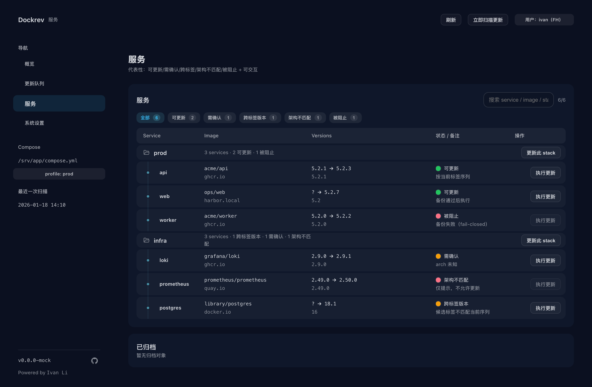
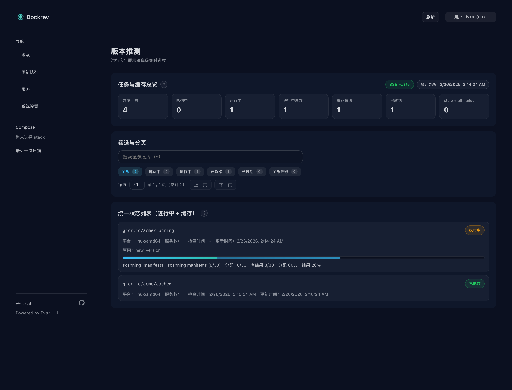

# 用户使用手册

## 页面地图

- `Overview`：全局状态、批量动作入口
- `Services`：服务维度查看与筛选
- `Service Detail`：单服务检查/更新/版本推断
- `Queue`：任务队列与执行进度
- `Settings`：通知、GHCR webhook、系统设置
- GHCR webhook 设置详解见：[集成指南 -> GitHub Packages (GHCR) Webhook](/integrations#github-packages-ghcr-webhook)

## 日常操作流程

### 1) 扫描（Discovery）

- 入口：Overview / Services 的“立即扫描”
- 作用：发现 Compose 项目与服务，刷新运行状态

### 2) 检查（Check）

- 入口：服务级或范围级 Check
- 作用：拉取候选版本、更新状态备注

### 3) 预览（Dry-run）

- 入口：Service Detail 的“预览更新”
- 作用：在不实际改动容器的前提下验证目标版本

### 4) 执行更新（Apply）

- 入口：Overview/Services/Service Detail
- 作用：提交更新任务，按 scope 执行

### 5) 自动更新策略

- 入口：Service Detail 的“自动更新策略”和 Services/Operations 里 Stack 分组的“策略”
- Stack 可配置默认策略；Service 可选择继承、覆盖或禁用
- 规则支持 semver、regex、glob 匹配候选版本或 tag
- 延迟规则同时满足“候选首次发现后的时间门槛”和“当前版本落后 N 个匹配版本”后才会自动执行
- 自动执行只由定时检查和 GHCR webhook 检查触发；UI 手动扫描不会自动部署

### 6) 任务追踪（Queue）

- 查看状态：`running/success/failed`
- 查看日志：按 job 维度逐步定位问题

## 版本推断视图

当 tag 非严格 semver 时，系统会显示 digest 对应的推断版本信息。

## 自升级

- 对 Dockrev 自身服务会显示“升级 Dockrev”入口
- 入口可用性依赖 `GET /supervisor/self-upgrade` 的可达性与鉴权
