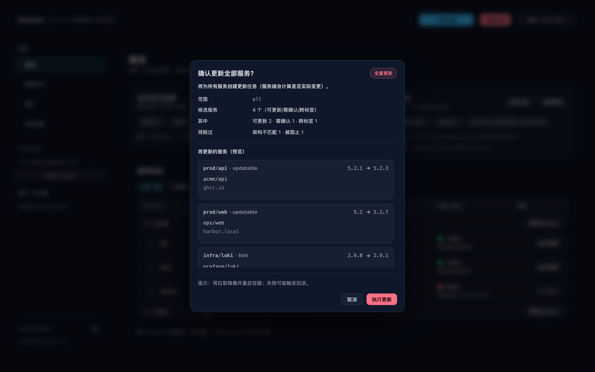

# Dockrev 文档（简体中文）

Dockrev 是一个自托管的 Docker/Compose 更新管理器，提供自动发现、镜像检查、更新执行、通知集成与自升级能力。

## 文档导航

- [快速开始](./quick-start)
- [部署指南](./deploy)
- [配置参考](./config)
- [用户使用手册](./user-guide)
- [运维手册](./operations)
- [集成指南](./integrations)
- [API 参考（全量接口）](./api-reference)
- [故障排查](./troubleshooting)
- [常见问题](./faq)
- [术语表](./glossary)

## 典型使用路径

1. 初次接入：先看 [快速开始](./quick-start) 与 [部署指南](./deploy)。
2. 准备上线：按 [配置参考](./config) 与 [运维手册](./operations) 完成生产设置。
3. 功能使用：按 [用户使用手册](./user-guide) 执行扫描、检查、更新、回滚。
4. 系统集成：按 [集成指南](./integrations) 打通 GHCR webhook 和通知通道。
5. 问题处理：先看 [故障排查](./troubleshooting)，再看 [常见问题](./faq)。

## 界面预览

