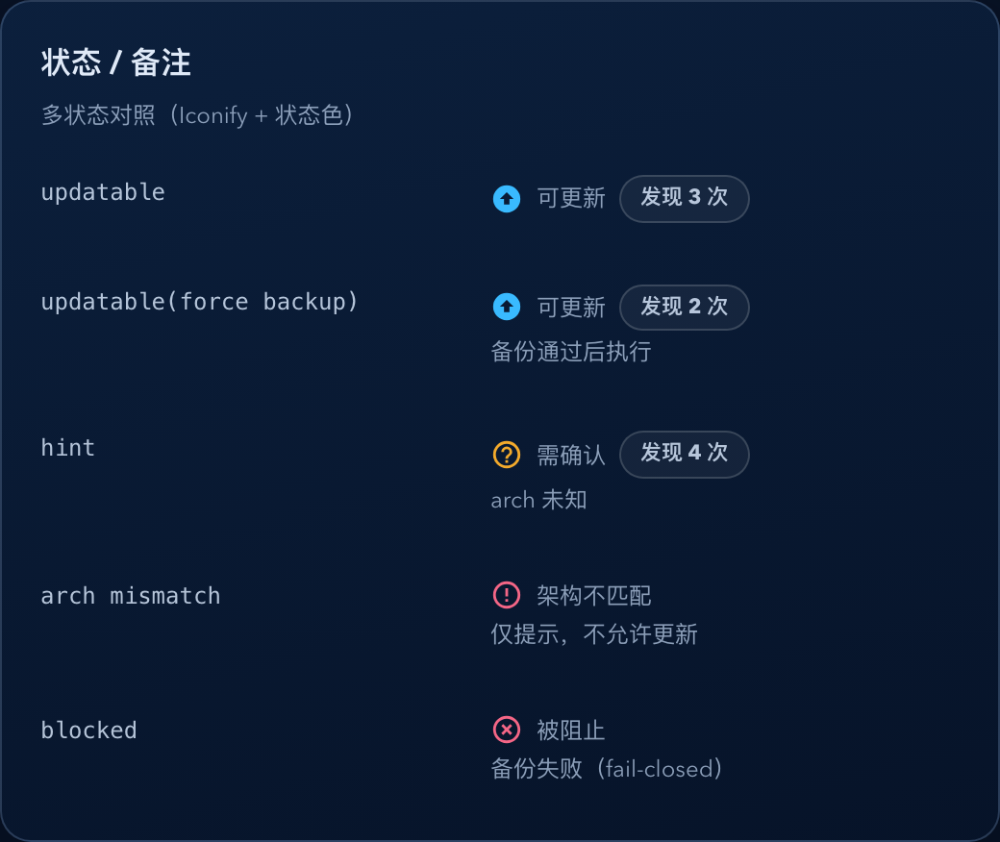
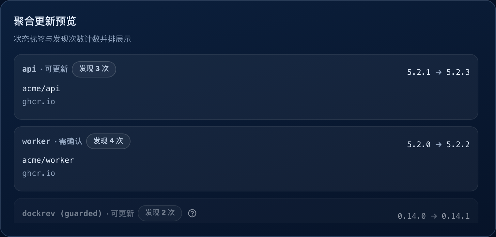

# Dockrev：更新候选跨版本发现次数标记（#2hnkx）

## 状态

- Status: 已完成
- Created: 2026-03-19
- Last: 2026-03-24

## 背景 / 问题陈述

- 更新候选列表原本只显示“当前版本 -> 最新候选”，无法告诉操作者这次候选期间其实已经跨过了多少次不同的新版本发现。
- 现有 `new_version_notifications` 只覆盖通知链路，不是完整发现历史，直接拿它计数会漏掉通知关闭或未触发通知的发现事件。
- 线上 follow-up 暴露出第二层问题：部分历史成功 `check` 在写入 discovery 时，`candidateDisplayTag` 仍然是 `latest` 这类未 settle 值；若时间线 `currentCandidate`、历史候选归一和列表候选各走各的 resolved-tag 来源，就会出现列表已经是稳定版本、时间线仍显示 `latest`，以及旧 unresolved 历史残留在时间线中间的分叉。
- 用户要求在列表行与聚合预览中明确标记“我们程序发现了几次版本更新”，并且计数必须来自线性的成功 `check` 历史。

## 目标 / 非目标

### Goals

- 为服务持久化“新版本发现历史”，来源仅限成功完成的 `check` 任务。
- 基于当前版本基线，按“稳定可见版本优先；未 settle 时先按可见 alias 折叠，只有完全没有可见值才回退 `candidateDigest`”统计发现次数，并包含当前最新候选。
- 对历史里尚未 settle 的候选 digest，在读时按 provenance-aware 顺序归一：同一 discovery 行自带的稳定 `candidateDisplayTag` > 同 `(image_ref, candidate_digest)` 的 ready snapshot 稳定版本 > 同 `(service_id, image_ref, current_tag, candidate_digest)` 的稳定通知记录。
- 在更新候选列表 `StatusRemark` 和 `AggregateUpdatePreviewList` 中显示中性计数 pill：`发现 N 次`。
- 对外通过 `GET /api/stacks` 与 `GET /api/stacks/{id}` 返回 `newVersionDiscoveryCount`。
- 同一份 stack 数据无论走 DB 聚合还是 API enrich，都必须对 unresolved 历史应用一致的 provenance-aware 归一规则，避免不同调用路径给出不同的发现次数。
- 版本发现时间线里的 `当前运行` 版本必须与列表行当前版本共享同一套当前 digest 解析语义，不能因为持久化 `current_resolved_tag` 过时而分叉。
- 版本发现时间线里的 `当前候选` 版本必须与列表行候选版本共享同一套 digest 解析语义，不能因为持久化 `candidate_resolved_tag` 过时而分叉。

### Non-goals

- 不把 `new_version_notifications` 当作计数真相源。
- 不为服务详情页单独新增发现次数 banner。
- 不回放失败或中断的 `check` 任务。

## 范围（Scope）

### In scope

- `crates/dockrev-api/src/db/new_version_discoveries.rs`
- `crates/dockrev-api/src/discovery.rs`
- `crates/dockrev-api/src/db/jobs.rs`
- `crates/dockrev-api/src/db/stacks.rs`
- `crates/dockrev-api/src/db/new_version_notifications.rs`
- `crates/dockrev-api/src/api/stacks.rs`
- `crates/dockrev-api/src/api/types/core.rs`
- `web/src/api.ts`
- `web/src/ui.tsx`
- `web/src/components/AggregateUpdatePreviewList.tsx`
- `web/src/stories/components/StatusRemark.stories.tsx`
- `web/src/stories/components/AggregateUpdatePreviewList.stories.tsx`
- `web/scripts/capture-storybook-screenshots.mjs`
- `docs/specs/README.md`

### Out of scope

- 服务详情页新增独立视觉提示。
- 对 discovery 次数做通知级别重放或追溯修正。

## 接口契约（Interfaces & Contracts）

- `Service` 响应新增可选字段：`newVersionDiscoveryCount?: number | null`。
- 计数规则固定为“同一当前版本基线下，按稳定 `candidateDisplayTag` 去重；若候选仍是未 settle 的原始 tag（例如 `latest`、`15-alpine`），则先按该可见 alias 去重；只有连可见 alias 都不存在时，才回退按 `candidateDigest` 去重”。
- 对历史 discovery 行里仍未 settle 的候选 digest，归一顺序固定为：
  - discovery 行自带的稳定 `candidateDisplayTag`
  - `image_digest_tags_snapshots` 中同 `(image_ref, candidate_digest, host_platform)` 的 ready 稳定版本
  - `new_version_notifications` 中同 `(service_id, image_ref, current_tag, candidate_digest)` 的稳定 `candidate_display_tag`
  - 若仍不可得，则先按 discovery 行上的可见 alias（`candidateDisplayTag` / `candidateTag`）折叠；只有连 alias 都不存在时，再回退按 `candidateDigest`
- 当原始候选 tag 本身是浮动 alias 时，允许把 `3.2.14` 与 `3.2.14-r0-ls73` 这类仅 semver core 相同的 settled 版本折叠为同一候选；显式 pinned suffix tag 不参与这种折叠。
- DB 层 `get_stack()` 与 API 层 `GET /api/stacks` / `GET /api/stacks/{id}` 都必须使用同一套 unresolved-history 归一输入，不能让某一路径退回旧的 digest-only 计数。
- `GET /api/stacks` / `GET /api/stacks/{id}` 的列表候选版本与 `GET /api/services/{serviceId}/new-version-discovery-timeline` 的 `currentCandidate.version` 必须共享同一套候选 resolved-tag 解析顺序：
  - 当前候选 digest 的 ready snapshot 推断结果；
  - 持久化 `candidate_resolved_tag`；
  - 同 `(service_id, image_ref, current_tag, candidate_digest)` 的稳定通知记录；
  - 最后才回退原始 `candidateTag` / `candidateDigest`。
- 上述 snapshot / notification settled fallback 只适用于仍 unresolved 的原始候选 tag（例如 `latest`、`stable`、`main`、`15-alpine` 或空 tag）；显式 pinned / strict-semver 候选必须保留自己的原始候选身份，不得被 fallback 改写成另一个 plain semver 标签。
- notification fallback 的 provenance 匹配继续使用原始 `image_ref` 精确值；只允许 snapshot lookup 为了 digest tags 缓存命中做 repo-key 规范化，不能把 notification 的 `(service_id, image_ref, current_tag, candidate_digest)` 读写两端改成不同 key。
- `GET /api/services/{serviceId}/new-version-discovery-timeline` 中 `items[].kind === "currentRunning"` 的 `version` 必须与列表当前版本显示共享同一套当前 digest 归一逻辑：
  - 优先使用当前 digest 对应 snapshot 推断出的稳定版本；
  - 若 snapshot 不可用或无法给出稳定版本，则回退到持久化 `current_resolved_tag`；
  - 若仍缺失，则回退到原始 `currentTag`，最后才回退 digest。
- 当前版本基线匹配优先级：
  - `currentDigest`
  - `currentDisplayTag`
  - `currentTag`

## 验收标准（Acceptance Criteria）

- Given 同一当前版本基线下先后发现 `v1.16.1(digest A)`、`v1.16.1(digest B)`、`v1.16.2(digest C)`，When 当前候选为 `v1.16.2`，Then `newVersionDiscoveryCount=2`。
- Given 同一 `candidateDisplayTag` 被多次成功 `check` 重复发现，When 统计当前基线次数，Then 只计一次。
- Given 历史上同一稳定版本先后以 `v1.16.1` 和 `1.16.1` 形式出现，When 统计当前基线次数，Then 视为同一个可见版本。
- Given 历史上同一稳定版本先后以 `5.2` 和 `5.2.0` 形式出现，When 统计当前基线次数，Then 视为同一个可见版本。
- Given 候选仍是 `latest` 或 `15-alpine` 这类未 settle 的原始 tag，When 不同历史 discovery 只暴露出同一个可见 alias，Then 这些历史只计作同一个候选版本。
- Given 候选没有稳定 `candidateDisplayTag`，且连可见 alias 都为空，When 统计当前基线次数，Then 才回退按不同 `candidateDigest` 计数。
- Given 历史 discovery 全都只记录了 `candidateDisplayTag=latest`，When 稳定通知记录后来已经能把这些 digest 归一到 `v1.16.2 / v1.17.0`，Then `newVersionDiscoveryCount` 仍按最终可见版本折叠，而不是继续按 digest 膨胀。
- Given 服务后续仍沿用原 `service_id` 但已切到别的镜像仓库或 tag 轨道，When 新 repo 的通知记录与旧 unresolved discovery 恰好共享 digest，Then 新 repo 通知不会重写旧 discovery 的可见版本。
- Given 两条匹配当前基线的 discovery 历史来自不同 `image_ref` 或 `current_tag` provenance，但恰好共享同一个 `candidateDigest`，When 其中一条已有稳定可见版本而另一条仍 unresolved，Then 稳定版本不会跨 provenance 重写另一条历史，计数仍保持分离。
- Given 服务后续已经切到别的镜像仓库，When 旧 discovery 仍是 unresolved 历史，Then 当前服务 repo 的 snapshot 不会被拿来重写旧历史。
- Given 同一服务的 stack 数据同时被 DB 聚合路径和 API enrich 路径消费，When 旧 discovery 仍依赖稳定通知记录做 provenance-aware 归一，Then 两条路径返回的 `newVersionDiscoveryCount` 必须一致。
- Given 某个 digest 的 snapshot 同时暴露多个稳定版本 tag，When 旧 discovery 仍 unresolved 且没有稳定通知记录，Then 该 digest 保持按 `candidateDigest` 计数，不会被强行折叠成其中任一版本。
- Given 通知事件关闭或通知渠道全部关闭，When 成功 `check` 仍发现新版本，Then 计数仍可正确显示。
- Given 服务当前版本已经从基线 `X` 升级到 `Y`，When 查询 `Y` 的候选计数，Then `X` 基线历史不会混入。
- Given 历史上同一 `candidateDigest` 先以浮动 alias 出现、后又解析出稳定 `candidateDisplayTag`，When 统计当前基线次数，Then 不会因为这两条历史记录重复累计。
- Given 更新候选列表与聚合预览同时展示同一服务，When `newVersionDiscoveryCount` 存在，Then 两处都显示 `发现 N 次` 且不覆盖原备注。
- Given 当前服务的 DB 持久化 `current_resolved_tag` 已过时，但当前 digest 的 snapshot 已经解析出新的稳定版本，When 同时请求 stack 详情和版本发现时间线，Then 列表当前版本与时间线 `currentRunning.version` 必须显示为同一个版本。
- Given 当前服务的 DB 持久化 `candidate_resolved_tag` 仍是 `latest` 或为空，但当前候选 digest 的 snapshot 已经解析出稳定版本，When 同时请求 stack 详情和版本发现时间线，Then 列表候选版本与时间线 `currentCandidate.version` 必须显示为同一个稳定版本。
- Given 当前候选只依赖 notification fallback 且通知记录里的 `image_ref` 保留为完整原始镜像引用（例如 `ghcr.io/acme/web:latest`），When 请求列表或时间线候选版本，Then fallback 仍必须命中同一条 notification provenance，而不是因为读取端把 `image_ref` 先裁成 repo key 而失效。
- Given 当前服务已经有稳定基线（例如 `currentDigest=sha256:*` 且 `currentDisplayTag=v1.20.6`），When 历史 discovery 里存在更早的 unresolved 行（`currentDigest=''` 且 `currentDisplayTag=latest`），Then 这些更早的浮动 alias 基线不得再并入当前稳定基线的 count 或 timeline。
- Given 当前服务自己仍处于 unresolved alias 基线（例如 `currentTag=latest` 且没有稳定 `currentDigest/currentDisplayTag`），When 历史 discovery 也都属于同一个 alias 基线，Then timeline 仍保留这些 alias 历史，不做过度过滤。
- Given 历史 discovery 在 raw candidate tag 为 `latest` 时先后解析出 `3.2.14-r0-ls73` 与 `3.2.14`，When 统计 count 或构造 timeline，Then 这些记录按同一个候选版本折叠；但若 raw candidate tag 本身就是显式 pinned suffix tag，则仍保持为不同候选。

## 非功能性验收 / 质量门槛（Quality Gates）

- `cargo test -p dockrev-api`
- `bun test --cwd web tests/updateStatus.test.ts tests/statusRemark.test.tsx`
- `bun run --cwd web lint`
- `bun run --cwd web build`
- `bun run --cwd web storybook:screenshots`

## Visual Evidence (PR)

- source_type: storybook_canvas
- target_program: mock-only
- capture_scope: element
- sensitive_exclusion: N/A
- submission_gate: pending-owner-approval
- story_id_or_title: Components/StatusRemark/AllStatuses
- state: multi-status matrix
- evidence_note: 验证更新候选列表状态标签右侧新增 `发现 N 次` 计数，并且第二行备注仍然保留。

- source_type: storybook_canvas
- target_program: mock-only
- capture_scope: element
- sensitive_exclusion: N/A
- submission_gate: pending-owner-approval
- story_id_or_title: Components/AggregateUpdatePreviewList/AllStates
- state: aggregate preview modal list
- evidence_note: 验证聚合更新预览条目使用本地化状态标签，并在其后追加同款 `发现 N 次` 计数。

## 变更记录（Change log）

- 2026-03-19: 新建规格，冻结“发现次数”来自成功 `check` 历史的持久化与 UI 展示范围。
- 2026-03-19: 完成后端 discovery 历史表、历史回填、API 字段透出与前端状态/聚合预览展示。
- 2026-03-19: 补充 Storybook 证据故事与截图，作为 PR 可视完工证据来源。
- 2026-03-20: 修正计数口径为“稳定可见版本优先；未 settle 时先按可见 alias 折叠，只有完全没有可见值才回退 `candidateDigest`”，并通过 migration 自动重建历史 discovery 数据。
- 2026-03-20: 补齐 unresolved 历史的读时归一；对旧 discovery 里的 `latest`/未 settle 值，使用稳定通知记录把 digest 折叠回最终可见版本，不改变“成功 `check` 历史才是计数事件源”的前提。
- 2026-03-20: 修复大批量 unresolved 历史下的 SQLite 参数上限问题；稳定通知记录辅助查询改为分批执行，避免把 `GET /api/stacks/{id}` 放大成 500。
- 2026-03-20: 根据 fresh review proof 移除“用当前服务 snapshot 归一旧 unresolved 历史”的做法，避免在服务改仓库或 snapshot 同 digest 多 stable tags 时误改写历史计数。
- 2026-03-20: 根据后续 review fix，把 DB 层 `get_stack()` 的 discovery 次数计算也切到同一套 provenance-aware 通知归一逻辑，确保 stack consumer 不会回退成 digest-only 计数。
- 2026-03-22: 修正 unresolved alias 历史的最终口径：重复暴露同一可见 alias（如 `latest`、`15-alpine`）时先按 alias 折叠，不再因为不同 digest 把发现次数和时间线一起膨胀。
- 2026-03-22: 根据 fresh review fix，补齐 live candidate 与历史候选的同口径 alias identity，确保 `newVersionDiscoveryCount` 的 alias 折叠结果能被时间线正确复用。
- 2026-03-23: 修复版本发现时间线 `currentRunning.version` 与列表当前版本不一致的问题；时间线当前运行版本改为复用列表的当前 digest snapshot 解析语义，并在 snapshot 缺失时继续回退到持久化 `current_resolved_tag`。
- 2026-03-24: 修复 discovery 基线匹配把更早 unresolved `latest` 历史误并入当前稳定基线的问题；当前已稳定的 `currentDisplayTag/currentDigest` 不再接受浮动 alias 作为跨基线 fallback，但当前自身仍 unresolved 时继续保留 alias 历史。
- 2026-03-24: 修复列表候选、时间线 `currentCandidate` 与历史候选归一的事实源分叉；候选显示与 discovery 历史统一改为 `snapshot-first, notification-fallback`，并允许浮动 alias 场景按同一 semver core 折叠 vendor/package suffix 版本。
