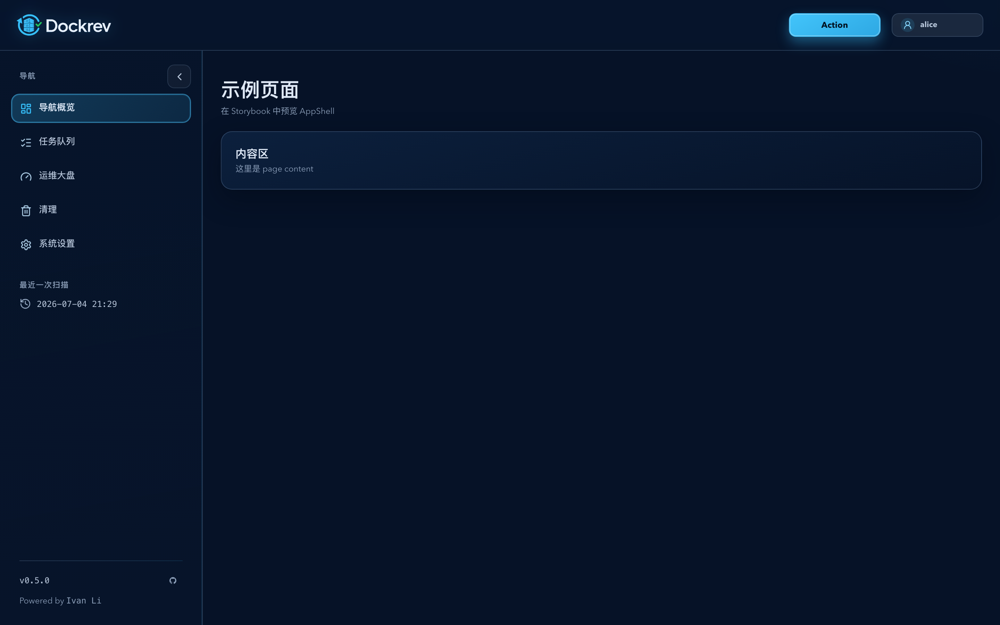
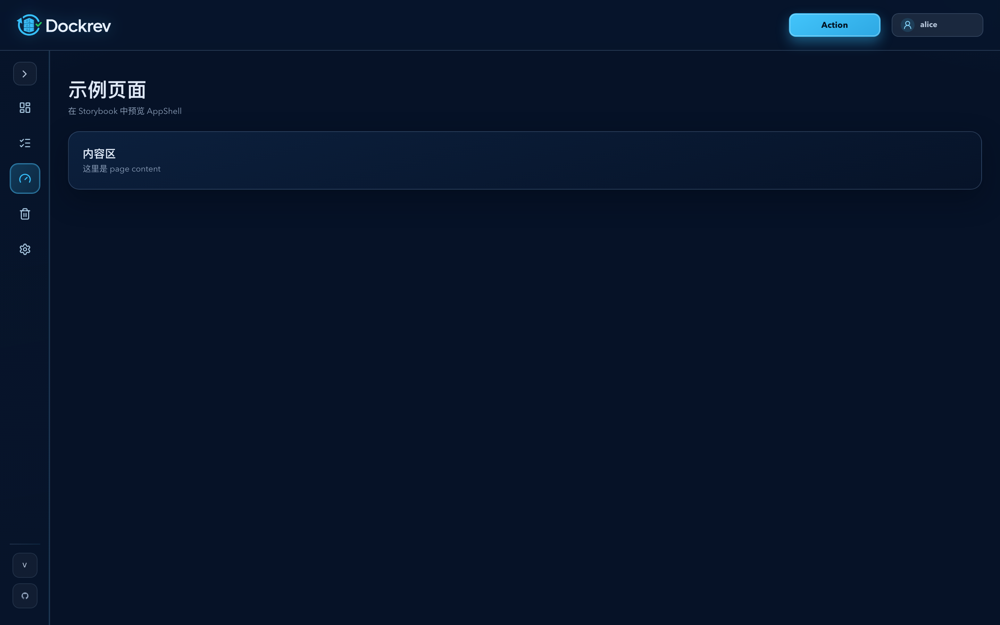
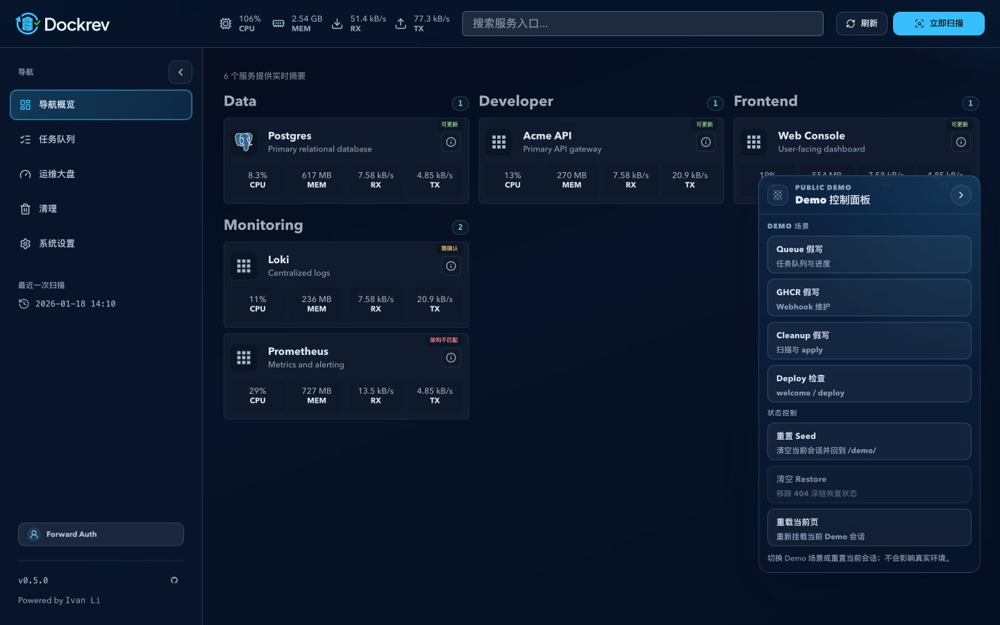
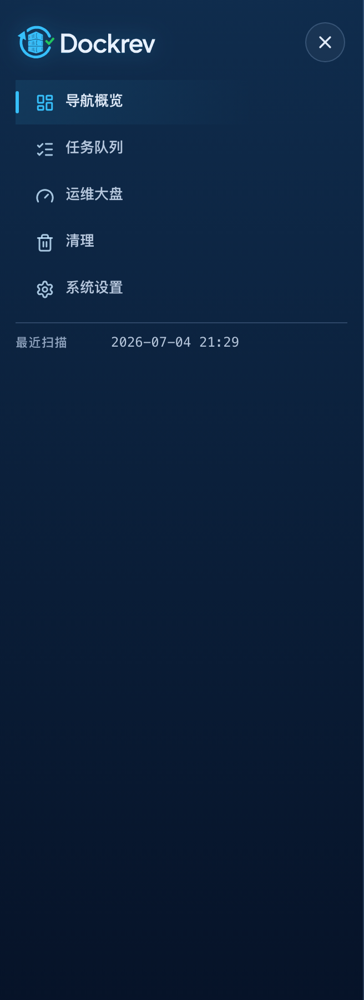

# Dockrev：AppShell 左侧导航折叠与图标化（#2jhm2）

## 状态

- Status: 已实现
- Last: 2026-07-04

## 背景 / 问题陈述

- AppShell 左侧主导航只能展开显示，桌面宽屏下会长期占用内容区宽度。
- 主导航项使用圆点伪元素作为视觉标记，无法表达各入口语义，也不符合“工具按钮优先图标”的界面约束。
- 移动端 drawer 与桌面 sidebar 应共享同一导航语义，避免响应式状态下图标/标签漂移。

## 目标 / 非目标

### Goals

- 桌面 sidebar 支持展开/折叠，折叠态收窄为仅图标的主导航栏。
- 主导航项使用真实图标：导航概览、任务队列、运维大盘、清理、系统设置分别映射到明确的 `lucide-react` 图标。
- 折叠状态作为本地个人偏好保存，刷新后保持上次选择。
- 折叠态保留 `aria-label` / `title`，当前页高亮、键盘焦点与移动端 drawer 不回退。

### Non-goals

- 不修改后端 API、路由语义、业务页面内容或移动端 drawer 打开方式。
- 不整体迁移 AppShell 到 shadcn Sidebar / Sheet。
- 不重做 Dockrev 主题、颜色系统或 topbar 品牌区。
- 不新增图标库或手写装饰 SVG。

## 范围（Scope）

### In scope

- `web/src/Shell.tsx`
- `web/src/App.css`
- `web/src/stories/layouts/AppShell.stories.tsx`
- `web/src/stories/layouts/AppShell.mdx`

### Out of scope

- Rust 服务端与数据模型变更。
- 业务页面内部信息架构调整。

## 需求 / 行为合同

- `AppShell` 的主导航配置是桌面 sidebar 与移动 drawer 的单一图标/标签来源。
- 桌面折叠状态使用 `dockrev:shell:sidebarCollapsed:v1` 写入 `localStorage`；存储失败不阻断导航。
- 折叠态隐藏导航文字、section label、最近扫描文本和 Powered 文案；主导航链接通过 `aria-label` 继续暴露可访问名称。
- 桌面侧栏底部的身份入口位于元信息区首位；展开时显示头像与身份标签，折叠时保留可访问的头像图标入口。
- 普通桌面路由的页头品牌区与主导航宽度共用 AppShell 列变量；该对齐不额外绘制可见竖分隔线。
- 移动端仍由 topbar hamburger 打开 drawer；drawer 内导航项显示图标 + 文本。

## 验收标准（Acceptance Criteria）

- Given 桌面宽度下点击 sidebar 控制按钮，When 切换展开/折叠，Then sidebar 在完整文本导航与图标导航之间切换。
- Given sidebar 处于折叠态，When 刷新或重新挂载 AppShell，Then 保留折叠状态。
- Given 任一主导航项，When 查看桌面与移动 drawer，Then 都显示真实图标且不再使用圆点作为桌面导航标识。
- Given 使用键盘聚焦导航和折叠按钮，Then 焦点环可见且不会丢失当前页高亮。
- Given 桌面 sidebar 处于展开或折叠态，When 使用身份入口，Then 都可打开完整身份信息，且折叠态仍有可访问名称。
- Given 执行前端门禁，Then `lint`、`build`、`build-storybook`、`test-storybook` 通过。

## Visual Evidence

视觉证据由本 spec 的 `assets/` 目录保存，并使用 Storybook mock-only AppShell 场景捕获。

### Desktop Expanded

- source_type: storybook_canvas
- target_program: mock-only
- capture_scope: `.appShell`
- requested_viewport: 1440x900
- viewport_strategy: devtools-emulate
- PR: include

### Desktop Collapsed

- source_type: storybook_canvas
- target_program: mock-only
- capture_scope: `.appShell`
- requested_viewport: 1440x900
- viewport_strategy: devtools-emulate
- PR: include

### Desktop Header Alignment

- source_type: ui_demo
- target_program: mock-only
- capture_scope: browser viewport
- requested_viewport: 1440x900
- viewport_strategy: controlled browser viewport
- state: normal desktop route with sidebar identity at footer top
- PR: include

### Mobile Drawer

- source_type: storybook_canvas
- target_program: mock-only
- capture_scope: `#mobileDockrevMenu`
- requested_viewport: 390x900
- viewport_strategy: devtools-emulate
- PR: include
