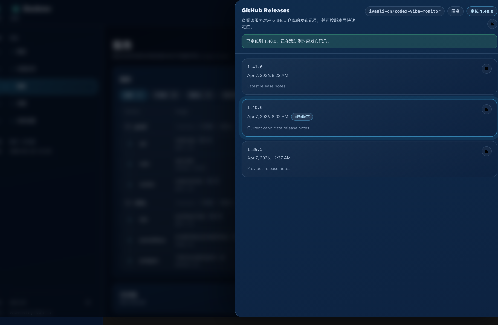
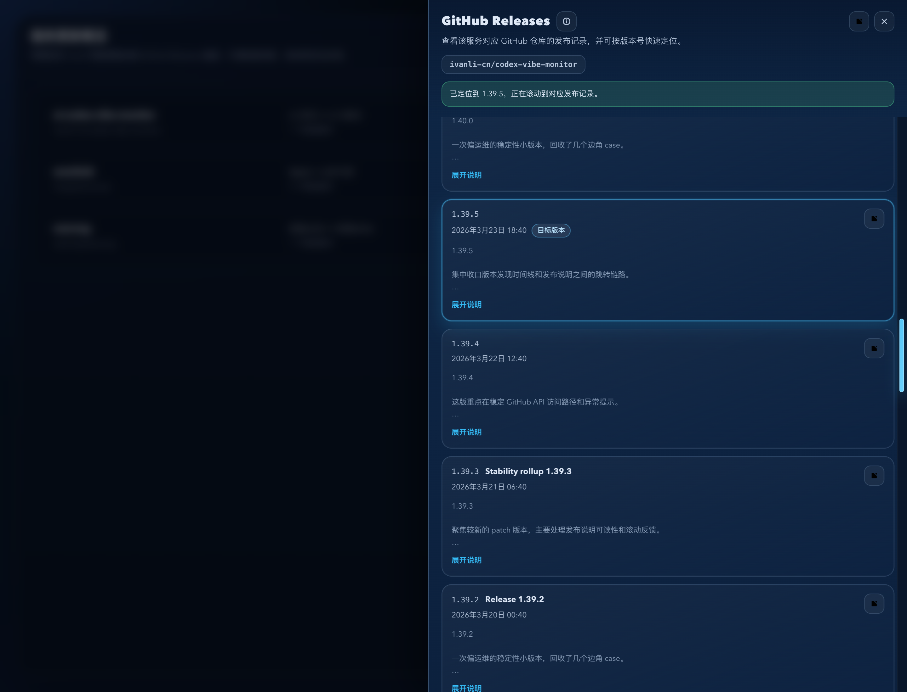
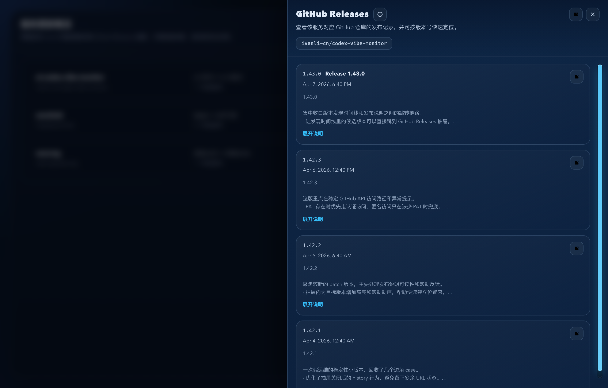
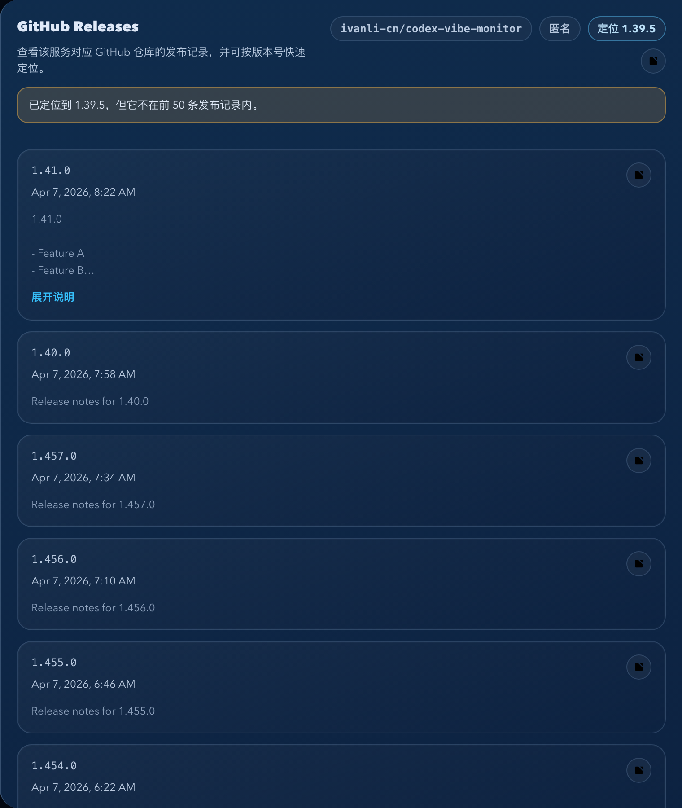
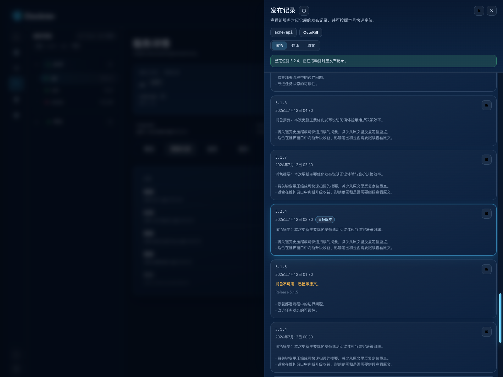

# Dockrev：版本发现时间线联动 GitHub Releases 抽屉（#4fhgd）

## 状态

- Status: 已完成（5/5）
- Created: 2026-04-07
- Last: 2026-04-10

## 背景 / 问题陈述

- 现有 `DiscoveryHistoryPopover` 已能展示“发现次数 -> 版本时间线”，但用户在确认某个候选版本时，仍然无法顺着该版本继续查看真实的 GitHub 发布说明。
- 当前时间线只回答“什么时候发现过这个版本”，不能回答“这个版本到底发布了什么、它在近期 release 序列中的位置在哪里、为什么匿名/私有仓库拿不到数据”。
- 用户需要从 discovery timeline 里的具体版本继续查看 GitHub Releases，但最新 UI 回归把发现次数入口拆成了双标记，破坏了原先单一时间线入口的紧凑性。

## 目标 / 非目标

### Goals

- 保持 `DiscoveryHistoryPopover` 的 badge/pill 继续作为单一时间线入口；点击时间线里的某个版本或服务更新记录中带可靠目标 tag 的更新日志入口时，打开同一个 GitHub Releases 抽屉并尝试定位到对应 GitHub Release。
- 新增 service-scoped GitHub Releases 代理，优先使用系统设置里已保存的 GitHub PAT；缺失 PAT 时匿名访问；权限不足、私有仓库不可见、匿名限流等失败都要在抽屉内明确提示。
- 抽屉使用 URL query 驱动：`releaseDrawer=github`、`releaseServiceId`、`releaseVersion?`，并且不得覆盖现有页面 query（例如 Overview 的筛选状态）。
- 抽屉列表按 GitHub Releases 从新到旧分页加载，支持无限滚动与虚拟滚动；当带有目标版本时，先做 locate，最多扫描前 50 条记录，并给出“找到 / 存在但不在前 50 条 / 前 50 条未找到”的明确反馈。
- 抽屉记录项至少展示 tag、名称、发布时间、draft/prerelease 标记、release body 预览与 GitHub 外链；命中目标版本时需带平滑滚动动画和短暂高亮。

### Non-goals

- 不扩展到 GitLab Releases、Docker Registry changelog 或其他 release source。
- 不修改 `CurrentVersionPopover`、`VersionTagsPopover` 的既有职责。
- 不做 `repoUrl` 自动回写或 release body Markdown 富文本渲染；仅在 `repoUrl` 缺失时复用既有仓库链接推断链路做只读兜底。
- 不支持 release 资产下载、编辑、删除或发布操作。

## 范围（Scope）

### In scope

- `docs/specs/README.md`
- `docs/specs/4fhgd-github-release-drawer/**`
- `crates/dockrev-api/src/github.rs`
- `crates/dockrev-api/src/api/mod.rs`
- `crates/dockrev-api/src/api/services.rs`
- `crates/dockrev-api/src/api/types/services.rs`
- `web/src/api.ts`
- `web/src/releaseDrawer.ts`
- `web/src/App.tsx`
- `web/src/App.css`
- `web/src/components/DiscoveryHistoryPopover.tsx`
- `web/src/components/RecentUpdateRecords.tsx`
- `web/src/pages/ServiceDetailPage.tsx`
- `web/src/components/ui/drawer.tsx`
- `web/src/stories/**`
- `web/package.json`
- `bun.lock`

### Out of scope

- release source 扩展、外部鉴权模型调整、GitHub Packages 设置页大改。
- 服务详情页 `repoUrl` 编辑行为变更。
- 非 discovery timeline 入口的新 release viewer 入口。

## 接口契约（Interfaces & Contracts）

### HTTP API

- 新增 `GET /api/services/{service_id}/github-releases?page=&perPage=`
  - 返回：`status`、`authMode`、`repo?`、`page`、`perPage`、`hasMore`、`items[]`、`message?`
  - `status` 取值固定为：`ready | unsupportedRepo | permissionDenied | rateLimited | upstreamError`
- 新增 `GET /api/services/{service_id}/github-releases/locate?version=&perPage=&limit=50`
  - 返回：`status`、`authMode`、`repo?`、`version`、`searchedCount`、`matchedTag?`、`page?`、`indexWithinPage?`、`absoluteIndex?`、`message?`
  - `status` 取值固定为：`found | outsideWindow | notFound | unsupportedRepo | permissionDenied | rateLimited | upstreamError`
- 后端优先使用服务当前已保存的 `repoUrl`，且仅支持解析 GitHub repo URL；若 `repoUrl` 缺失，则复用既有仓库链接推断链路寻找 GitHub repo；显式非 GitHub `repoUrl` 仍返回 `unsupportedRepo`。

### URL 状态

- 抽屉状态固定由以下 query 表达：
  - `releaseDrawer=github`
  - `releaseServiceId=<service_id>`
  - `releaseVersion=<version>`（可选）
- 必须保留当前页面已有 query key；关闭抽屉时只删除以上 3 个 key。
- 页面刷新、前进/后退、复制链接后重新打开，都必须恢复相同的抽屉状态。

## 功能与行为规格（Functional/Behavior Spec）

### 打开入口

- 点击 `发现 N 次` badge：
  - 只打开 / 固定版本时间线 popover。
  - 不直接打开抽屉，也不写入 `releaseDrawer=github` URL 状态。
- 在时间线气泡里点击具体版本：
  - 关闭气泡。
  - 打开抽屉。
  - URL 追加 `releaseVersion=<version>`。
- 在服务更新记录中点击可见的更新日志图标：
  - 仅当记录能可靠解析当前服务的目标 tag 时显示入口。
  - 打开同一抽屉，并追加 `releaseVersion=<targetTag>`。

### Releases 列表

- 抽屉默认按 GitHub Releases 逆序（最新 -> 更旧）分页拉取，每页使用前端固定 `perPage`。
- 页面滚动到底部附近时自动请求下一页。
- 列表必须使用虚拟滚动，避免 release body 较多时造成长列表卡顿。
- release body 默认只显示预览，支持行内展开全文；全文按纯文本保留换行，不引入 Markdown 渲染。

### 定位逻辑

- 当 URL 带 `releaseVersion` 时，抽屉打开后先调用 locate 接口。
- locate 顺序固定为：
  - 先按 `version` / `v<version>` / 去掉前缀 `v` 的变体调用 `Get release by tag name`
  - 再扫描 releases 分页列表，最多前 `50` 条
- 若 locate 命中并给出 `page/indexWithinPage/absoluteIndex`：
  - 抽屉必须预加载到目标所在页。
  - 完成后平滑滚动到目标项，并给该项短暂高亮。
- 若 direct tag lookup 命中但前 50 条列表里未出现该条目：
  - 抽屉顶部显示“该版本存在，但不在前 50 条发布记录内”。
- 若 direct lookup 与前 50 条扫描都未命中：
  - 抽屉顶部显示“在前 xx 条发布记录中未找到该版本”。

### 错误态与权限态

- 有 PAT 时使用 PAT 访问；无 PAT 时匿名访问。
- 对私有仓库、权限不足、匿名限流等情形：
  - 抽屉保留 repo 信息（如果可确定）。
  - 顶部展示明确错误原因。
  - 提供“打开设置”操作，引导到“设置 -> GitHub Packages”。
- unsupported repo 场景不发起非 GitHub 请求，也不显示误导性的 loading skeleton。

## 验收标准（Acceptance Criteria）

- Given 服务行展示 `发现 N 次`，When 点击 badge，Then 打开该服务的版本时间线 popover，且不会直接写入 `releaseDrawer=github` URL 状态。
- Given 时间线气泡里的某个版本项可见，When 点击该版本，Then URL 额外带上 `releaseVersion=...`，抽屉打开并尝试定位该版本。
- Given 服务更新记录带当前服务的目标 tag，When 点击更新日志图标，Then URL 额外带上 `releaseVersion=...`，同一抽屉打开、预加载并高亮该版本；目标 tag 缺失时不显示入口。
- Given locate 结果为 `found`，When 抽屉完成预加载，Then 目标 release 出现在可视区附近，滚动带平滑动画，且目标项有可见高亮反馈。
- Given locate direct tag 命中但扫描前 50 条未出现，When 抽屉渲染完成，Then 顶部显示“存在但不在前 50 条内”的 banner。
- Given 匿名请求对私有仓库失败或命中 GitHub rate limit，When 抽屉展示错误态，Then 文案明确提示权限/限流原因，并提供跳转到 GitHub Packages 设置的入口。
- Given 服务未配置 GitHub `repoUrl` 且既有推断链路也无法得到 GitHub repo，When 打开抽屉，Then 返回 `unsupportedRepo` 且前端直接展示不支持提示，而不是无限 loading。
- Given 用户刷新、复制分享链接、或浏览器前进/后退，When 页面恢复，Then 抽屉开关状态与目标版本定位状态保持一致，且不丢失原页面其他 query。

## 质量门槛（Quality Gates）

- `cargo test -p dockrev-api`
- `bun run --cwd web lint`
- `bun run --cwd web build`
- `bun run --cwd web test-storybook`
- `bun run --cwd web storybook:screenshots`

## Visual Evidence

- source_type=storybook_canvas · story_id_or_title=`Pages/ServicesPage/Git Hub Release Drawer Target Version From Timeline` · state=`timeline version -> drawer` · evidence_note=`验证 badge 仍先进入版本时间线，而点击时间线里的具体版本后仍会联动打开 GitHub Releases 抽屉，并保留 releaseDrawer/releaseServiceId/releaseVersion 状态。`
  

- source_type=storybook_canvas · story_id_or_title=`Components/GitHubReleaseDrawer/Anonymous Located` · state=`anonymous locate hit · scrollable` · evidence_note=`验证匿名模式下带目标版本时，抽屉将访问身份与定位版本收进信息 icon 的悬浮气泡，同时保留右侧外边距与可见滚动条。`
  

- source_type=storybook_canvas · story_id_or_title=`Components/GitHubReleaseDrawer/Pat Authenticated Short List` · state=`pat authenticated · short list` · evidence_note=`验证已保存 GitHub PAT 时，抽屉在较少 release 数据下仍保持正确的右侧 Drawer 形态；若内容略超出高度，则只允许抽屉内容区自身滚动，并通过信息 icon 的悬浮气泡承载 PAT 身份。`
  

- source_type=storybook_canvas · story_id_or_title=`Components/GitHubReleaseDrawer/Permission Denied` · state=`permission denied` · evidence_note=`验证匿名访问私有仓库失败时，抽屉内给出权限提示并提供跳转到设置页的入口。`
  

- source_type=storybook_canvas · story_id_or_title=`Components/GitHubReleaseDrawer/Outside Window` · state=`outside window` · evidence_note=`验证目标版本存在但不在前 50 条记录内时，抽屉顶部显示 outside-window banner。`
  

- source_type=storybook_canvas · story_id_or_title=`Pages/ServiceDetailPage/UpdateHistoryReleaseNotes` · state=`history record target version -> drawer` · evidence_note=`验证更新记录的目标版本入口打开同一右侧抽屉，保留 URL target，并在虚拟列表中高亮定位版本。`
  

## 里程碑（Milestones / checklist）

- [x] M1: 冻结 spec、URL query 契约、后端接口字段与 locate 50 条窗口口径。
- [x] M2: 后端 GitHub client 与 service-scoped releases/list/locate API 落地，并补齐 Rust 测试。
- [x] M3: 前端 App 级 GitHub Releases 抽屉、URL 状态同步与时间线入口联动完成。
- [x] M4: Storybook mock / stories / interaction coverage 完成，并补齐 owner-facing 视觉证据。
- [x] M5: 全量回归 + review-loop 收敛到 merge-ready PR。

## 风险 / 假设

- 假设：服务优先消费已保存的 `repoUrl`；若缺失，则只读复用既有仓库链接推断结果，不新增新的保存/回写入口。
- 风险：release body 长短差异较大，因此虚拟滚动必须支持动态高度测量，否则滚动定位会失真。
- 风险：GitHub `Get release by tag` 与 `List releases` 结果可能因 draft / latest 排序产生不完全一致的窗口位置，因此 locate 必须把“存在但不在前 50 条内”作为显式状态处理。

## 变更记录（Change log）

- 2026-04-07: 创建规格，冻结 discovery timeline -> GitHub Releases drawer 的范围、接口契约、URL 状态与 locate window 规则。
- 2026-04-07: 将前端承载容器切换为 shadcn/ui `Drawer`（Vaul, `direction=\"right\"`），保持 URL 状态、定位逻辑与错误态契约不变。
- 2026-04-09: 补齐 locate 目标页预加载失败时的错误降级，完成全量回归与本地 review-loop 收敛。
- 2026-04-10: 根据 owner 回归反馈，撤销“badge 直接打开 Releases 抽屉”的前端交互；恢复单一时间线入口，并把 GitHub Releases 打开职责收窄为时间线版本项跳转。
- 2026-04-10: 刷新 Services 时间线联动抽屉的视觉证据，并将资产引用统一收口到 repo 内相对路径。
- 2026-07-12: 扩展同一抽屉的入口到服务更新记录中带可靠目标 tag 的操作；不恢复 badge 直开，也不新增并行 viewer。
