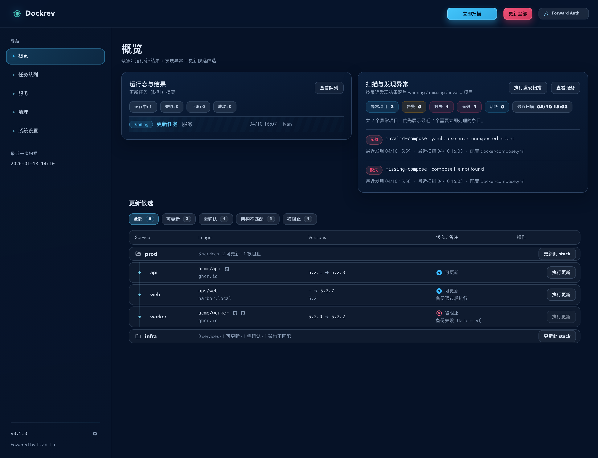
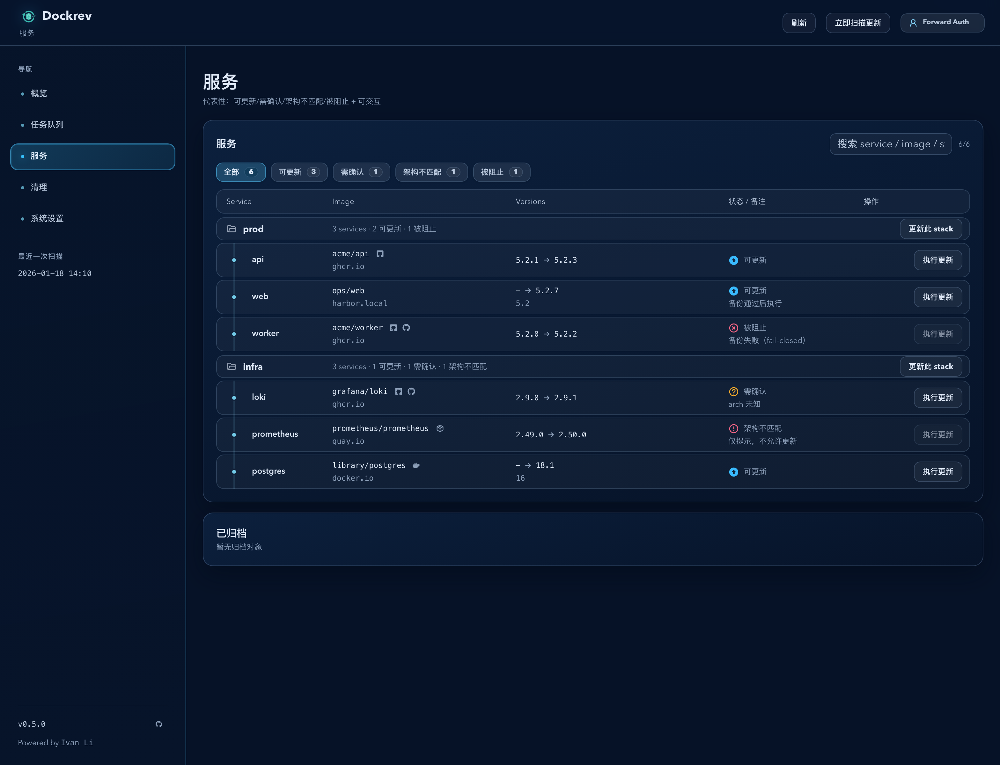
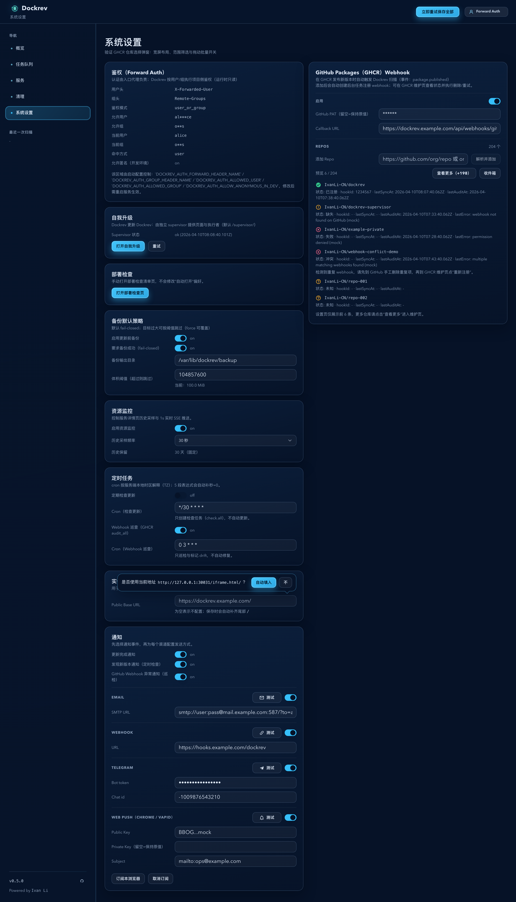
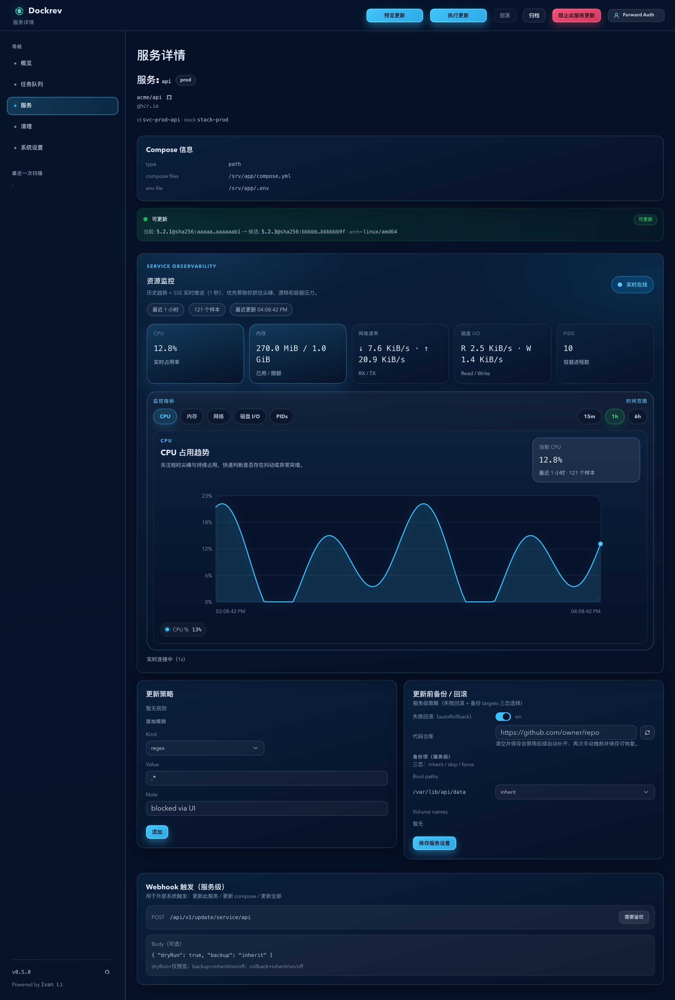

# Dockrev：全仓大文件治理与预算守门（#57jzh）

## 状态

- Status: 已完成
- Created: 2026-04-10
- Last: 2026-04-10

## 背景 / 问题陈述

- 当前仓库存在多处超大单文件，后端运行时、路由/DB、前端页面、Storybook mock 与测试都已出现 monolith 倾向。
- 这些文件已经降低 review 可读性、提高回归成本，并使“局部修复只改一个职责”的原则越来越难执行。
- 仓库当前缺少 repo 级大文件预算守门；即使本轮手工拆分完成，后续 PR 仍可能把问题重新引入。

## 目标 / 非目标

### Goals

- 一次性消除当前治理范围内全部超阈值 tracked 文件。
- 保持现有 HTTP contract、前端导出 contract、页面 URL、Storybook 场景入口与主要行为不变。
- 为仓库补上可在本地与 CI 复用的大文件预算检查，阻止回潮。

### Non-goals

- 不新增产品能力。
- 不借机调整数据库语义、部署策略或发布流程。
- 不重设计 UI/文案；若必须改动，只允许为拆分所需的最小内部整理。

## 范围（Scope）

### In scope

- `/crates/**` 下 Rust 源文件按 `<=1500 LOC` 预算治理。
- `/web/src/**` 下 TS/TSX 文件按 `<=1200 LOC` 预算治理。
- `/web/tests/**` 下测试文件按 `<=1000 LOC` 预算治理。
- 治理对象包括：Dockrev API runtime、route/db、Supervisor UI/test、web 页面、web API client、Storybook mock API、巨型 API test file。
- 新增 repo 级 budget script，并接入 PR/main CI。

### Out of scope

- 任何需要修改外部契约或新增交互行为的设计变更。
- 治理范围外文件（例如 `web/scripts/**`）的预算收敛。

## 需求（Requirements）

### MUST

- 当前基线 19 个超阈值 tracked 文件全部收敛到预算以内。
- 原有公开契约保持兼容。
- budget check 在本地与 CI 都可执行，并对超阈值结果失败。
- 产出 before/after inventory 证据。

### SHOULD

- 拆分后的顶层 façade 只保留编排，职责函数/类型/渲染/fixture/test helpers 下沉到子模块。
- 测试 helper 与 Storybook fixture builder 应形成可复用分层，而不是继续堆进单文件。

### COULD

- 在不改变行为的前提下，顺带把明显重复 helper 收敛为共享内部模块。

## 功能与行为规格（Functional/Behavior Spec）

### Core flows

- 后端超大文件拆分后，现有 `main.rs`、`api::router()`、supervisor `App::router()` 与数据库 façade 的调用方式保持一致，调用方无需感知文件层级变化。
- 前端页面拆分后，`OverviewPage`、`ServicesPage`、`ServiceDetailPage`、`SettingsPage` 仍从原路径导出相同页面组件。
- `web/src/api.ts` 与 `web/src/stories/mocks/dockrevMockApi.ts` 继续作为稳定入口文件，对现有 import 方保持兼容。
- CI 在现有 quality gates 基础上新增“大文件预算”失败条件。

### Edge cases / errors

- 若某个超大文件必须暂时保留 top-level entry，则 entry file 本身仍需满足预算，不允许用注释/空转包装规避检查。
- budget check 仅统计 git tracked 文件，避免把构建产物或本地缓存误判进治理范围。
- 对多模块拆分后的 tests/stories/import path，必须保持现有引用路径可用；必要时用 façade re-export，而不是要求调用方批量改路径。

## 接口契约（Interfaces & Contracts）

### 接口清单（Inventory）

| 接口（Name） | 类型（Kind） | 范围（Scope） | 变更（Change） | 契约文档（Contract Doc） | 负责人（Owner） | 使用方（Consumers） | 备注（Notes） |
| --- | --- | --- | --- | --- | --- | --- | --- |
| Existing HTTP routes / JSON payloads | HTTP API | external | Modify | None | Dockrev API | Web UI / tests / docs | 仅允许内部实现拆分，不改 contract |
| Existing page exports (`web/src/pages/*`) | TS module export | internal | Modify | None | Web UI | Router / stories / tests | 原导出路径保持不变 |
| Existing API client entry (`web/src/api.ts`) | TS module export | internal | Modify | None | Web UI | 全部页面 / tests / stories | 保持 façade 路径稳定 |
| Existing Storybook mock API entry (`web/src/stories/mocks/dockrevMockApi.ts`) | TS module export | internal | Modify | None | Web UI | stories / harness | 保持 façade 路径稳定 |
| Large-file budget check | CLI/script + CI gate | internal | New | None | Repo infra | local dev / CI | 新增失败门禁 |

### 契约文档（按 Kind 拆分）

None

## 验收标准（Acceptance Criteria）

- Given 当前基线 inventory 中有 19 个超阈值文件
  When 本次治理完成
  Then 治理范围内不存在任何超过预算的 tracked 文件。
- Given 现有 API/UI/Storybook 使用方
  When 拆分后的代码通过编译与测试
  Then 所有既有公开 contract 保持兼容，无调用方需要因重构改产品语义。
- Given 本地与 GitHub Actions
  When 运行大文件预算检查
  Then 任一超阈值 tracked 文件都会让检查失败。
- Given before/after inventory 文档
  When 检查 spec 与 PR 证据
  Then 能直接看到从 19 个超阈值文件降到 0 的结果。

## 实现前置条件（Definition of Ready / Preconditions）

- 目标预算、治理范围、非目标与兼容性边界已冻结。
- 基线 inventory 已产出并作为本 spec 证据附件。
- 快车道终点明确为 merge + cleanup。

## 非功能性验收 / 质量门槛（Quality Gates）

### Testing

- Unit tests: `cargo test --workspace --all-targets`、受影响前端/后端 targeted tests。
- Integration tests: 现有后端 API / DB / supervisor 集成测试保持通过。
- E2E tests (if applicable): 现有 Storybook/test-storybook 与 smoke/proof 路径保持通过。

### UI / Storybook (if applicable)

- 现有 stories/harness 保持可运行；不得因 façade 拆分破坏 stories import。
- 若 PR 期间产生新的 `PR.head.sha` 并涉及 UI 编排层改动，需重新确认 Storybook build/test 通过。

### Quality checks

- `cargo check --workspace --all-targets`
- `cargo clippy --workspace --all-targets --all-features -- -D warnings`
- `bun run --cwd web lint`
- `bun run --cwd web build`
- `bun run --cwd web build-storybook -- --quiet`
- `bun run --cwd web test-storybook`
- repo large-file budget check

## 文档更新（Docs to Update）

- `docs/specs/README.md`: 新增 spec index 行并在推进时更新状态。
- `docs/specs/57jzh-large-file-governance/SPEC.md`: 维护里程碑、before/after inventory 与最终结果。
- 若新增预算脚本对开发流程有直接影响，更新相关 README/CI 说明到最小必要程度。

## 计划资产（Plan assets）

- Directory: `docs/specs/57jzh-large-file-governance/assets/`
- In-plan references: ``
- Visual evidence source: baseline / after inventory + Storybook page screenshots（owner-facing local review evidence）

## Visual Evidence

- `证据绑定 sha`: `0ef7fee5c6b9`
- `Storybook覆盖=通过`
- `视觉证据目标源=storybook_canvas`
- `视觉证据=存在`
- `空白裁剪=无需裁剪`
- `聊天回图=已展示`
- `证据落盘=已落盘`

- `source_type=storybook_canvas` · `target_program=mock-only` · `capture_scope=element` · `story_id_or_title=Pages/OverviewPage / Default`
  - `state`: default
  - `evidence_note`: 验证 OverviewPage 拆分后概览卡片、扫描异常卡片与服务列表的整体布局维持稳定。
  

- `source_type=storybook_canvas` · `target_program=mock-only` · `capture_scope=element` · `story_id_or_title=Pages/ServicesPage / DashboardDemo`
  - `state`: dashboard demo
  - `evidence_note`: 验证 ServicesPage 拆分后分组表格、状态列与操作列的组合布局保持稳定。
  

- `source_type=storybook_canvas` · `target_program=mock-only` · `capture_scope=element` · `story_id_or_title=Pages/SettingsPage / RepoPickerUx`
  - `state`: repo picker ux
  - `evidence_note`: 验证 SettingsPage 拆分后 Forward Auth、GHCR Webhook、更新策略与通知卡片仍保持既有可见布局。
  

- `source_type=storybook_canvas` · `target_program=mock-only` · `capture_scope=element` · `story_id_or_title=Pages/ServiceDetailPage / Updatable`
  - `state`: updatable
  - `evidence_note`: 验证 ServiceDetailPage 拆分后详情区块、更新候选与操作按钮布局保持稳定。
  

## 资产晋升（Asset promotion）

None

## 实现里程碑（Milestones / Delivery checklist）

- [x] M1: 冻结 spec、预算阈值与 19 个超阈值文件基线 inventory。
- [x] M2: 拆分后端 runtime / route / db / supervisor 超大文件并保持 contract 不变。
- [x] M3: 拆分 API/supervisor 巨型测试与前端 API/mock/page monolith。
- [x] M4: 新增大文件预算脚本并接入 CI / 本地校验链路。
- [x] M5: 完成全量验证、before/after inventory 与 PR 收敛证据。

## 方案概述（Approach, high-level）

- Rust 侧采用“保留原模块入口 + 子模块下沉”的薄 façade 模式，优先按 runtime、route/db、test helper 三条线切分。
- Web 侧采用“稳定入口文件 + domain 子目录”的方式拆 page/API/mock，避免批量改 import path。
- 预算守门脚本仅统计 tracked 文件并按路径前缀套用固定阈值，确保规则稳定且可解释。

## 风险 / 开放问题 / 假设（Risks, Open Questions, Assumptions）

- 风险：大规模文件迁移容易引入遗漏 import / visibility / module path 错误，需要高频编译校验。
- 风险：巨型测试文件拆分后若共享 helper 设计不当，可能放大重复或造成 test fixture 依赖循环。
- 需要决策的问题：None。
- 假设（需主人确认）：None；按当前明确授权执行纯重构快车道。

## 变更记录（Change log）

- 2026-04-10: 创建 spec，冻结治理范围、预算阈值与 19 文件基线 inventory。
- 2026-04-10: 完成超大文件拆分、repo budget gate、全量验证与 Storybook owner-facing 视觉证据。
- 2026-04-10: 补充 after inventory，确认治理范围内超阈值 tracked 文件从 19 降到 0。
- 2026-04-10: 完成 PR 收敛前的最终验证与 review proof，规格状态切换为已完成。

## 参考（References）

- [Oversized file inventory (baseline)](./assets/oversized-file-inventory-baseline.md)
- [Oversized file inventory (after)](./assets/oversized-file-inventory-after.md)
