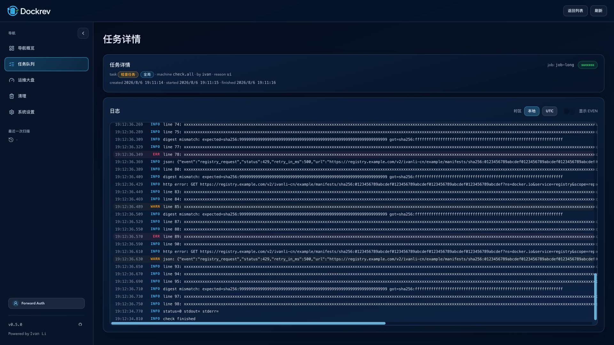
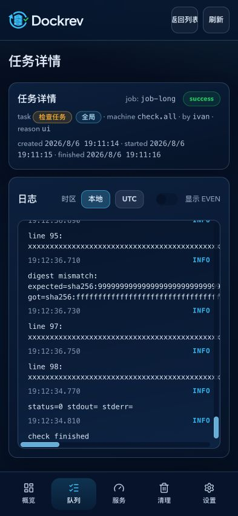

# Dockrev: 任务日志实时输出与事件可见性

## 背景

任务详情页当前通过数据库日志 SSE 展示 `job_logs`。Docker/Compose 的 stdout/stderr 含有 `\r`、ANSI/CSI 和跨块控制序列；若把它们当作普通文本行追加，layer 进度会堆叠并误标为 WARN。

## 目标

- 为更新、回滚、启动、停止、重启等服务操作增加无持久化的 `job_live_terminal` SSE 输出。后端将原始 stdout/stderr 字节块按到达顺序合并到 VT100 模拟器，实时发送完整可见屏幕快照。
- 保持 `job_logs` REST 结构、断线恢复和 Last-Event-ID 不变；成功的 Compose pull 摘要只保留退出状态，不持久化 transient stdout/stderr 进度帧，失败输出继续保留用于诊断。
- 增加短暂的 `job_live_command_complete` 事件和 transient `commandSeq`，使前端在同一连接内冻结终端块并抑制已实时展示过输出的后续命令摘要。
- 在任务日志工具栏增加 `显示 EVEN` 开关。`level=event` 的持久化记录默认隐藏，偏好通过当前浏览器 `localStorage` 记忆。

## 范围与非目标

实时输出覆盖所有经过服务操作执行器的 lifecycle/update/rollback 命令。原始输出不逐行写入数据库，不断线缓存、不补播；连接断开或刷新后只恢复数据库中的命令与结果摘要，成功 Compose pull 的 transient progress 不随摘要补播。数据库日志 REST 结构不增加 `commandId`，进度计算与任务执行语义不变。

## 行为契约

### SSE 与终端语义

- `CommandRunner::run_stream` 以 `Vec<u8>` 原始块回调，不在 runner 层按换行切分；更新器和 service-log collector 自己维护跨块 line buffer。
- `job_live_terminal` 是仅内存广播的 per-job SSE 事件，不设置 SSE `id`，不会写入数据库或参与 Last-Event-ID。payload 包含 `jobId`、`ts`、transient `commandSeq` 和 `lines`；每行由带 `text`、可选 `fg/bg`、`bold`、`dim`、`underline` 的安全 segments 组成。
- parser 尺寸固定为 240 列、200 屏幕行、2000 行滚屏；尾部空行裁剪。50ms 窗口内只发送最后快照，命令完成时强制发送最终快照。
- 进入 VT100 parser 前应用有状态的终端行规整：裸 `LF` 转为 `CRLF`，已有 `CRLF`、独立 `CR`、ANSI/CSI 和跨 chunk 边界保持不变，使管道输出符合终端换行语义。
- stdout/stderr 按原始块到达顺序合并，保留常见 ANSI 颜色、粗体、暗淡、下划线以及 `\r`、退格、擦行、光标移动等 VT100/CSI 语义。
- Docker Compose 的流式 pull 无论以 `docker compose` plugin 还是 `docker-compose` standalone 调用，均使用 `COMPOSE_PROGRESS=tty` 与 `COMPOSE_ANSI=always` 保留 layer 原地更新控制序列；进度摘要解析只消费清理控制序列后的副本，实时终端仍消费原始字节。
- `job_live_command_complete` 是仅内存广播的短暂完成标记，包含 `commandSeq`、`hadOutput` 和 `summaryPersisted`。它不设置 SSE `id`，不会影响 Last-Event-ID；只有 `summaryPersisted=true` 时前端才会抑制后续摘要。
- 成功的 `docker compose pull` 与 `docker-compose pull` 持久化 `status=0 stdout= stderr=`，不把已通过临时终端展示的下载进度嵌入聚合摘要；失败 pull 仍保留截断后的 stdout/stderr。
- hub 在任务终态释放；没有断线补播或历史缓存。
- 旧客户端忽略未知的 `job_live_terminal`，仍能看到带 SSE id 的持久化命令与结果摘要。
- 既有带数据库 id 的 `job_log`、命名事件和断线恢复保持兼容。

### 前端日志

- 当前 EventSource 连接中，同一 `commandSeq` 的终端快照替换同一临时终端块，命令完成后冻结；下一条匹配的 `status=... stdout=... stderr=...` 持久化摘要只渲染一次。刷新或重连恢复数据库摘要时不做推断去重，但成功 pull 只恢复精简结果，不恢复 transient progress。
- 实时终端输出没有日志等级：等级列保留固定宽度但为空，不把 stderr 映射为 WARN；ANSI 样式通过受限 React/CSS spans 渲染。
- `level=event` 记录只有在“显示 EVEN”打开时渲染；开关默认关闭，读取或写入 `localStorage` 失败时安全回退为关闭。
- 开关跨任务详情复用同一浏览器偏好。

## 验收标准

- 运行服务操作时，原始 stdout/stderr 经 VT100 终端模拟按屏幕快照即时到达任务详情，Docker layer 的回车进度不重复堆叠，结束后不在数据库生成额外逐行记录。
- 同一未刷新连接不重复显示实时输出和命令摘要；刷新/重连后命令与结果摘要完整可见，成功 pull 的下载进度不重复出现。
- EVEN 默认不可见，开关立即生效并跨任务、刷新保留；存储不可用时不影响日志页面。
- Rust runner/hub 生命周期、跨块控制序列、无持久化、Web 快照替换/冻结/筛选、Storybook play 和 ui_demo 逐行增长/开关/跟随行为均有验证。

## 参考

- Legacy plan: `docs/plan/0001:dockrev-compose-updater/PLAN.md`
- Legacy event contract: `docs/plan/0001:dockrev-compose-updater/contracts/events.md`
- Legacy HTTP contract: `docs/plan/0001:dockrev-compose-updater/contracts/http-apis.md`
- Legacy DB contract: `docs/plan/0001:dockrev-compose-updater/contracts/db.md`

## Visual Evidence

- 来源：现有 mock-only `ui_demo`（`queue-long-logs`），未使用真实后端或登录态。
- 桌面证据覆盖成功 pull 的历史摘要：末尾仅保留 `status=0 stdout= stderr=` 与后续结果，不出现 `Downloading ...` progress 帧；“显示 EVEN”默认关闭。
  PR: include
  
- `393x852` 证据覆盖同一精简历史摘要、默认关闭的开关和移动底部导航。
  PR: include
  
- 图片经 `trim_whitespace.py --margin-policy trim_only` 处理，结果为 `unchanged`；Storybook 交互场景为 `Pages/JobDetailPage/CompactSuccessfulPullHistory`，覆盖成功 pull 精简摘要的历史呈现。
- 主人验收使用的不可变快照：`/Users/ivan/.codex/user-inline-assets/dockrev__f83adb76/2026/08/06/20260806T111641Z-dockrev-compact-pull-desktop-final-73cb7a9a.png`、`/Users/ivan/.codex/user-inline-assets/dockrev__f83adb76/2026/08/06/20260806T111641Z-dockrev-compact-pull-mobile-trimmed-afd927a4.png`。
