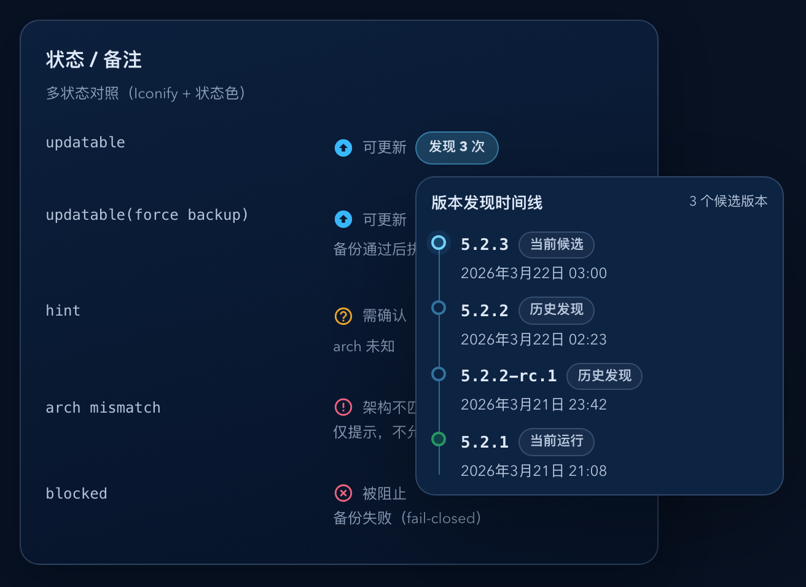
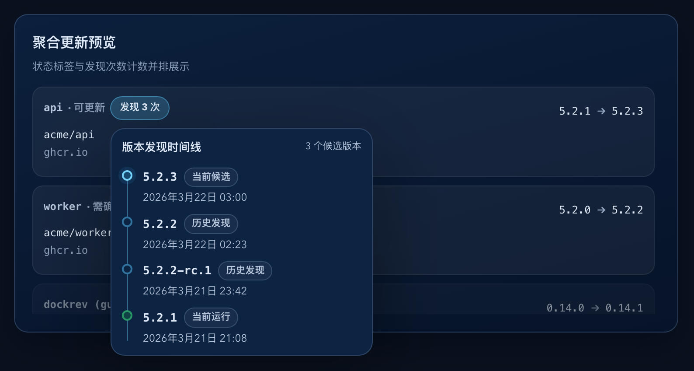

# Dockrev：发现次数气泡改为版本时间线（#5umc8）

## 状态

- Status: 已完成
- Created: 2026-03-21
- Last: 2026-03-22

## 背景 / 问题陈述

- 更新候选列表里的 `发现 N 次` 目前只提供计数，操作者看不到这 N 次分别对应哪些版本。
- 用户要求把该计数升级为可交互气泡，展示从新到旧的纵向时间线，并明确每条记录的版本号和时间。
- 现有 discovery 历史已经持久化了候选发现时间，但服务表没有“当前运行版本从何时开始运行”的可靠真相源，尾节点时间仍需补齐。

## 目标 / 非目标

### Goals

- 将 `发现 N 次` 升级为支持 hover-open / click-pin 的共享 popover，覆盖 Services、Overview 与聚合更新预览。
- 气泡内容改为纵向时间线：首项固定为当前候选版本，末项固定为当前运行版本，中间项是同一当前基线下已发现过的历史候选版本。
- 候选版本时间口径固定为“首次发现时间”；当前运行版本时间取 Docker runtime 的真实 `StartedAt`，无真相源时明确展示 `时间未知`。
- 新增 service-scoped 懒加载 API 提供时间线数据，不扩充 `GET /api/stacks` 主载荷。
- 时间线候选项与 `newVersionDiscoveryCount` 复用同一套 provenance-aware 归一和去重规则，保证数量一致。

### Non-goals

- 不重做现有当前/候选版本 popover。
- 不为 Service Detail 单独新增发现次数 banner。
- 不把完整 discovery 历史并入 `GET /api/stacks` / `GET /api/stacks/{id}`。
- 不为旧服务伪造回填当前运行版本时间。

## 范围（Scope）

### In scope

- `crates/dockrev-api/src/db/mod.rs`
- `crates/dockrev-api/src/db/stacks.rs`
- `crates/dockrev-api/src/db/snapshots.rs`
- `crates/dockrev-api/src/db/new_version_discoveries.rs`
- `crates/dockrev-api/src/api/mod.rs`
- `crates/dockrev-api/src/api/services.rs`
- `crates/dockrev-api/src/api/types/services.rs`
- `crates/dockrev-api/src/api/operations.rs`
- `crates/dockrev-api/src/runtime_scan.rs`
- `crates/dockrev-api/src/service_check.rs`
- `web/src/api.ts`
- `web/src/components/DiscoveryHistoryPopover.tsx`
- `web/src/ui.tsx`
- `web/src/components/AggregateUpdatePreviewList.tsx`
- `web/src/App.css`
- `web/src/stories/components/StatusRemark.stories.tsx`
- `web/src/stories/components/AggregateUpdatePreviewList.stories.tsx`
- `web/src/stories/mocks/dockrevMockApi.ts`
- `web/tests/statusRemark.test.tsx`
- `docs/specs/README.md`

### Out of scope

- `web/src/components/CurrentVersionPopover.tsx`
- `web/src/components/VersionTagsPopover.tsx`
- 其它非 discovery timeline 的更新候选交互

## 接口契约（Interfaces & Contracts）

- 新增 `GET /api/services/{service_id}/new-version-discovery-timeline`。
- 响应结构：
  - `items[]`
  - 每项字段：`kind`（`currentCandidate` / `historicalCandidate` / `currentRunning`）、`version`、`occurredAt`
  - `occurredAt` 对当前运行版本允许为 `null`，前端按 `时间未知` 渲染。
- `services` 表新增 nullable `current_runtime_started_at`。
- 候选项 identity 与去重规则必须和 `newVersionDiscoveryCount` 完全一致：
  - 稳定 `candidateDisplayTag` 优先；
  - unresolved 历史复用 notification 辅助归一；
  - 无稳定展示值时回退到 `candidateDigest`。

## 需求（Requirements）

### MUST

- `发现 N 次` 的 trigger 在 hover 时可打开气泡，在 click 后进入 pinned 状态，并支持外部点击 / `Esc` 关闭。
- 当前候选项固定排第一，历史候选项按首次发现时间从新到旧，当前运行项固定排最后。
- 当前候选项与历史候选项都显示版本号 + 首次发现时间。
- 当前运行项显示当前版本号 + `current_runtime_started_at`；若该字段为空，显示 `时间未知` 而不是伪造时间。
- `current_runtime_started_at` 仅由 authoritative runtime 观测路径写入：
  - 常规 check 的 runtime inspect
  - runtime scan
  - update 成功后的 settle
- 当服务 compose image ref 或 image tag 被同步变更时，必须清空 `current_runtime_started_at`。

### SHOULD

- 共享 popover 视觉与项目现有 version popover 基座保持一致，但内容区域使用更紧凑的纵向时间线布局。
- 时间展示采用浏览器本地化 `toLocaleString()`，保持与现有页面时间展示习惯一致。
- Storybook 应覆盖 Services/Overview 风格的 status remark 和聚合预览里的交互效果。

## 验收标准（Acceptance Criteria）

- Given 某服务展示 `发现 2 次`，When hover 或 click 该 trigger，Then 出现同一类 discovery timeline popover，并可在 click 后保持 pinned。
- Given 某服务当前候选为 `v0.28.7`，历史候选包含 `v0.28.6`，当前运行版本为 `v0.28.5`，When 打开 popover，Then 顺序固定为 `v0.28.7 -> v0.28.6 -> v0.28.5`，且每行都带时间或 `时间未知` 文案。
- Given 同一版本被重复发现多次，When 打开 popover，Then 该版本只出现一次，并展示首次发现时间。
- Given 当前运行 digest 已通过 runtime inspect 观测到 `StartedAt`，When 服务 current digest 改变并被持久化，Then `current_runtime_started_at` 同步刷新为该 digest 首次被 authoritative runtime 路径确认时的 Docker `StartedAt`。
- Given 服务被 compose 同步改成新的 image ref 或 tag，When DB 同步完成，Then `current_runtime_started_at` 被清空。
- Given 服务尚无 runtime startedAt 真相源，When 打开 popover，Then 当前运行项显示 `时间未知`。
- Given 时间线候选项条数为 `N`，When 同一服务在主列表和聚合预览都渲染 discovery pill，Then 两处打开后看到的候选时间线条数都等于 `newVersionDiscoveryCount`。

## 质量门槛（Quality Gates）

- `cargo test -p dockrev-api`
- `bun test --cwd web tests/statusRemark.test.tsx`
- `bun run --cwd web lint`
- `bun run --cwd web build`
- `bun run --cwd web storybook:screenshots`

## Visual Evidence (PR)

- source_type: storybook_canvas
- target_program: mock-only
- capture_scope: element
- sensitive_exclusion: N/A
- submission_gate: approved
- story_id_or_title: Components/StatusRemark/AllStatuses
- state: discovery timeline popover open
- evidence_note: 验证状态列中的 `发现 N 次` 可打开时间线气泡，并展示当前候选 / 历史候选 / 当前运行三段信息。

- source_type: storybook_canvas
- target_program: mock-only
- capture_scope: element
- sensitive_exclusion: N/A
- submission_gate: approved
- story_id_or_title: Components/AggregateUpdatePreviewList/AllStates
- state: aggregate discovery timeline popover open
- evidence_note: 验证聚合预览里的 discovery pill 使用同一气泡与时间线顺序。

## 里程碑（Milestones / checklist）

- [x] M1: `services.current_runtime_started_at` 持久化与 authoritative runtime 写入点打通。
- [x] M2: discovery timeline API 与 count-parity 聚合逻辑完成。
- [x] M3: 共享 `DiscoveryHistoryPopover` 接入 `StatusRemark` 与 `AggregateUpdatePreviewList`。
- [x] M4: backend/web/storybook 回归通过，并补齐 PR 视觉证据。

## 风险 / 假设

- 假设：Docker `StartedAt` 可从当前 runtime inspect 路径稳定读取，格式可直接作为 RFC3339 风格字符串持久化。
- 风险：多容器同 service 的 `StartedAt` 需要统一聚合口径；当前实现按单一当前 digest 的 authoritative runtime 观测结果写入，不把单次容器重启误当作版本切换。

## 变更记录（Change log）

- 2026-03-21: 新建规格，冻结 discovery timeline lazy API、排序锚点、运行时间真相源与快车道 PR-ready 交付范围。
- 2026-03-21: 实现 discovery timeline lazy API、runtime startedAt 持久化、共享时间线气泡与 storybook/mock 回归。
- 2026-03-22: 修正 Storybook mock 时间线数据，补充裁剪后的完工截图，并将视觉证据写回规格。
