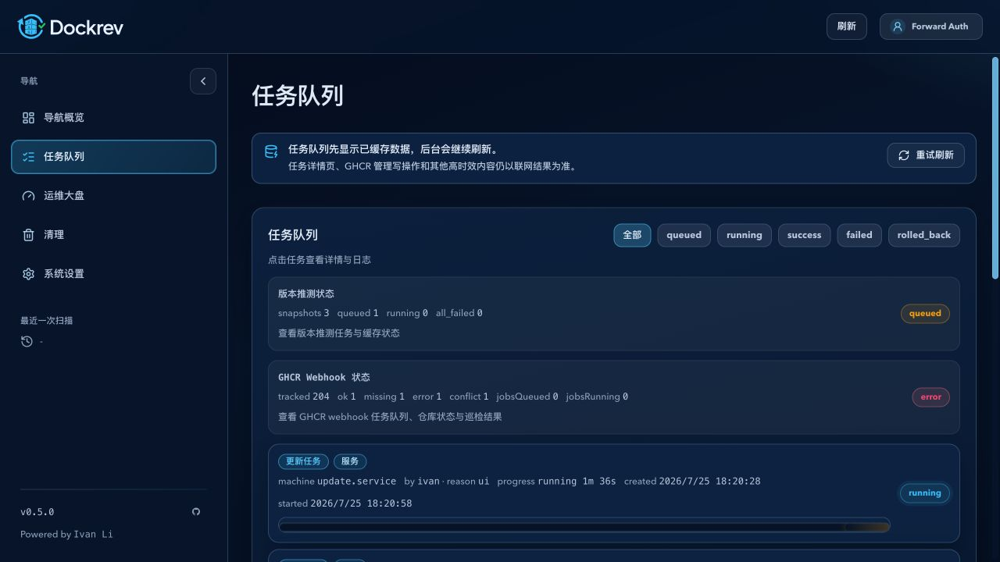
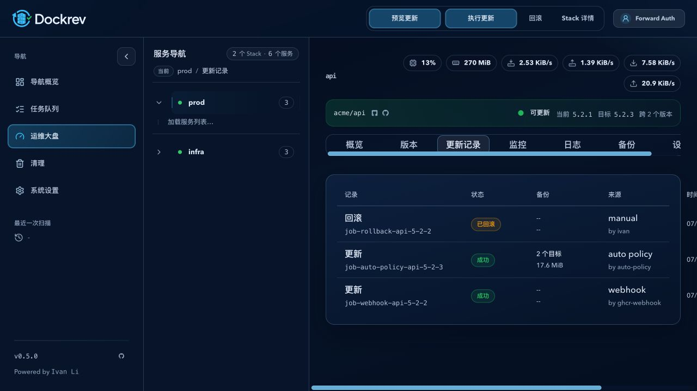

# Dockrev: Job History Retention And Pagination

## Goal

Keep SQLite job and resource history bounded while preserving backup audit metadata, and make job history retrieval stable at production scale.

## Requirements

- Resource samples older than 24 hours are removed in bounded batches at startup and then once per minute, with at most `10 x 10,000` rows per run and a scheduler yield between batches. GC is independent from sampler in-flight invalidation and never repopulates sampling caches. No automatic `VACUUM` is performed; SQLite compaction remains an operator maintenance-window action.
- Terminal `success`, `failed`, and `rolled_back` jobs older than 30 days are deleted in bounded batches using `finished_at`, falling back to `created_at`. Queued and running jobs are never selected.
- Deleting a job must preserve its backup record and set `backups.job_id` to `NULL`.
- `GET /api/jobs` accepts opaque `cursor`, `limit` (default 100, maximum 200), `type`, `status`, `stackId`, and `serviceId`; it returns `jobs` and optional `nextCursor` sorted by `created_at DESC, id DESC`.
- Service, stack, and all-scope update jobs must remain discoverable through an indexed job-to-service target relation.
- The queue uses 100-item cursor pages. Service update history uses 20-item cursor pages with previous/next navigation.
- Docker stats with `blkio_stats.io_service_bytes_recursive: null` deserialize as an empty collection. One container failure must not discard successful samples from the same compose project.

## Acceptance

- Cursor pages contain neither duplicate nor skipped records when timestamps tie.
- Invalid cursors return HTTP 400 with `invalid_jobs_cursor`.
- Backup metadata survives terminal-job retention and API consumers accept a missing `jobId`.
- GC and slow jobs-list diagnostics are structured and rate-limited; no new monitoring service or dashboard is introduced.

## Visual Evidence

- source_type: `ui_demo`
  target_program: `mock-only`
  capture_scope: `browser-viewport`
  sensitive_exclusion: `N/A (mock-only data)`
  submission_gate: `approved`
  state: queue cursor page controls
  evidence_note: 队列在真实应用壳内以 100 条页读取任务，并在状态筛选旁保留上一页与下一页操作。

PR: include

- source_type: `ui_demo`
  target_program: `mock-only`
  capture_scope: `browser-viewport`
  sensitive_exclusion: `N/A (mock-only data)`
  submission_gate: `approved`
  state: service update history
  evidence_note: 服务详情的更新记录只呈现当前服务关联的 update/rollback 结果，并保留历史表格与备份摘要。

PR: include

