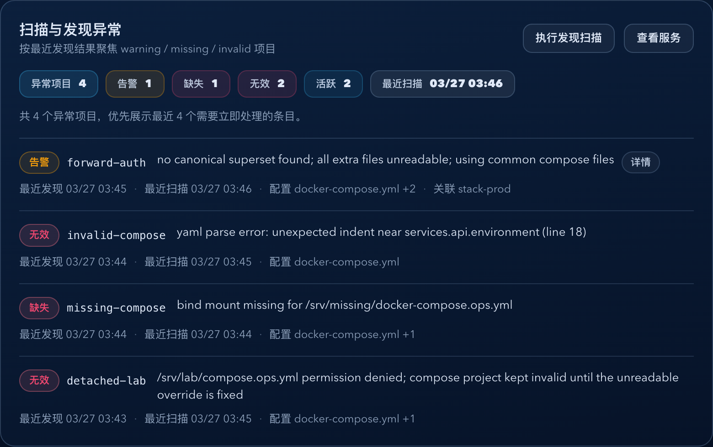

# Dockrev：概览页发现异常卡片可读性重构（#6mqve）

## 状态

- Status: 已完成
- Created: 2026-03-27
- Last: 2026-03-27

## 背景 / 问题陈述

- 概览页右侧“扫描与发现异常”卡片当前把 warning / missing / invalid 直接拼成长句，状态、项目主体、原因和上下文处在同一层级，扫描成本偏高。
- 发现异常常见为长 `lastError`，还会混入重复状态前缀、machine code 和 Hint，导致一线运维必须读完整段文本才能判断严重度。
- 统计 chip 以英文短语为主，最近扫描时间与异常严重度同层竞争，不利于快速判断“先看哪里”。

## 目标 / 非目标

### Goals

- 在不改 discovery API、路由和业务语义的前提下，重构概览 discovery 卡片的信息层级。
- 将异常列表改为“状态标签 + 项目名 + 短原因 + 次级元信息”的结构化行项。
- 将长错误全文退到次级暴露层，默认只展示可读摘要。
- 用 Storybook 固化 mixed status + 长错误场景，并输出稳定视觉证据。

### Non-goals

- 不修改后端 discovery 聚合逻辑、数据库结构和任务执行语义。
- 不扩展到左侧“运行态与结果”卡片、更新候选表或服务详情页。
- 不新增项目详情路由或新的后端字段。

## 范围（Scope）

### In scope

- `web/src/pages/OverviewPage.tsx`
- `web/src/App.css`
- `web/src/stories/pages/OverviewPage.stories.tsx`
- `web/src/stories/mocks/dockrevMockApi.ts`
- `docs/specs/README.md`

### Out of scope

- `crates/**`
- `web/src/pages/ServicesPage.tsx`
- `web/src/pages/ServiceDetailPage.tsx`

## 接口契约（Interfaces & Contracts）

- Backend API: None（继续使用 `listDiscoveryProjects()` 与现有 `DiscoveredProject` 字段）。
- Frontend route: None（保留 `navigate({ name: 'services' })` 作为次级入口）。
- Storybook: 新增一个聚焦 discovery 卡片的稳定场景，用于展示 mixed status 与长错误次级暴露。

## 验收标准（Acceptance Criteria）

- Given discovery 卡片存在 warning / missing / invalid 混合数据，When 概览页渲染，Then 操作者先看到异常级别与项目主体，再看到短原因。
- Given `lastError` 很长，When discovery 卡片展示异常项，Then 默认仅显示摘要，完整错误只通过次级暴露层查看。
- Given `stackId`、`configFiles`、`lastSeenAt`、`lastScanAt` 任一存在，When 行项渲染，Then 第二层元信息稳定展示可读上下文。
- Given discovery 无异常，When 概览页渲染，Then 卡片保持简洁空状态，并保留发现扫描与查看服务入口。
- Given Storybook 聚焦场景渲染，When 检查 discovery 卡片，Then 状态层级、截断与 hover/focus 详情暴露稳定可用。

## 实现里程碑（Milestones / Delivery checklist）

- [x] M1: 重构 discovery 卡片统计区与异常列表结构。
- [x] M2: 为长错误补齐摘要提炼与次级暴露交互。
- [x] M3: 增补 Storybook 聚焦场景与 play 断言。
- [x] M4: 产出视觉证据并完成 lint/build/test-storybook 验证。

## Visual Evidence

- source_type: storybook_canvas
  story_id_or_title: Pages/OverviewPage/DiscoveryCardReadable
  state: discovery-card-readable
  evidence_note: 验证 discovery 卡片以“异常统计优先 + 结构化异常行 + 长错误详情次级暴露”的方式展示 mixed status 项目。
  image:
  

## 变更记录（Change log）

- 2026-03-27: 创建规格，冻结“仅重构概览页 discovery 卡片，不改 API / 路由 / 任务语义”的边界。
- 2026-03-27: 完成 discovery 卡片统计区重排、结构化异常列表、长错误次级暴露按钮与元信息摘要。
- 2026-03-27: 新增 Storybook 聚焦场景 `DiscoveryCardReadable` 与 play 断言，覆盖 mixed status 排序和 tooltip 详情暴露。
- 2026-03-27: 验证通过 `bun run --cwd web lint`、`bun run --cwd web build`、`bun run --cwd web test-storybook -- --url http://127.0.0.1:30070/`，并补充 Storybook 视觉证据。
