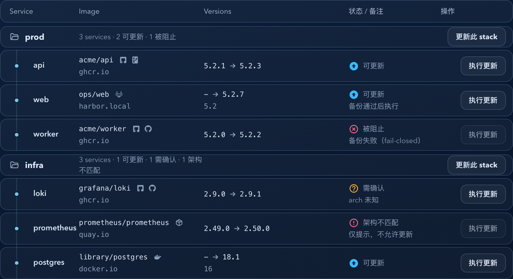

# Dockrev：服务镜像外链与代码仓库字段（#6uwgs）

## 状态

- Status: 已完成
- Created: 2026-03-22
- Last: 2026-03-22

## 背景 / 问题陈述

- 服务列表与服务详情页当前只展示镜像名与 registry 文本，无法直接打开镜像注册表网页。
- 代码仓库入口目前没有稳定的服务级持久化字段，导致列表页无法可靠展示 repo 外链，详情页也无法手工修正。
- 镜像与仓库的对应关系不是永远可从镜像名安全推导，必须允许“人工编辑 + 按需重新推断”的双轨策略。

## 目标 / 非目标

### Goals

- 在服务列表与服务详情页的镜像名旁渲染 icon 外链，支持注册表网页入口与代码仓库入口。
- 将 `repoUrl` 作为服务级可持久化字段纳入现有服务设置。
- 在服务详情页提供 `repoUrl` 输入、直接打开入口与“重新推断”按钮，推断结果只回填草稿。
- 新增按需推断 API，优先使用 OCI `org.opencontainers.image.source`，其次做 GHCR 精确回退。

### Non-goals

- 不在服务列表页内直接编辑 `repoUrl`。
- 不为未知或私有 registry 猜测网页地址。
- 不在推断成功后自动保存结果。
- 不执行实际 PR merge。

## 范围（Scope）

### In scope

- `docs/specs/README.md`
- `docs/specs/6uwgs-service-image-links-and-repo-url/**`
- `crates/dockrev-api/src/api/**`
- `crates/dockrev-api/src/db/**`
- `crates/dockrev-api/src/discovery.rs`
- `crates/dockrev-api/src/updater.rs`
- `crates/dockrev-api/src/backup.rs`
- `web/src/api.ts`
- `web/src/pages/ServiceDetailPage.tsx`
- `web/src/pages/ServicesPage.tsx`
- `web/src/App.css`
- `web/src/stories/**`

### Out of scope

- 新增独立的 registry 配置项或 host 映射规则
- 修改服务更新/版本推测既有语义
- 变更外部鉴权模型

## 需求（Requirements）

### MUST

- `repoUrl` 必须作为服务设置的一部分参与 `GET /api/stacks/{id}`、`GET /api/services/{id}/settings` 与 `PUT /api/services/{id}/settings`。
- `PUT /api/services/{id}/settings` 在请求体省略 `repoUrl` 时必须保留已有值，兼容旧客户端；显式 `null` 或空字符串才表示清空。
- 服务详情页 header 必须即时反映当前设置草稿中的 `repoUrl`。
- 服务列表页只使用已持久化 `repoUrl`。
- 新增 `POST /api/services/{service_id}/repo-link/infer`，返回 `{ repoUrl, strategy, reason? }`。
- 推断顺序固定为 `OCI source -> GHCR exact fallback -> none`。
- registry 外链规则固定为“仅对可稳定推导公开仓库页的 registry 显示入口”：GHCR 用专属图标、Docker Hub 用专属图标、Quay 这类可稳定推导但暂无专属品牌 glyph 的入口使用通用 registry 图标；无法稳定推导网页地址的 registry 不显示入口。

### SHOULD

- icon 链接应复用统一样式，避免页面间视觉与交互分叉。
- 推断失败或无结果时，前端应给出明确提示且不覆盖已保存值。

### COULD

- 未来把镜像展示解析 helper 提取为共享模块。

## 功能与行为规格（Functional/Behavior Spec）

### Core flows

- 服务详情页加载后，镜像名右侧显示 registry icon；若当前草稿 `repoUrl` 非空，再显示 repo icon。
- 用户编辑“代码仓库”输入框时，只更新本地草稿；点击“保存服务设置”后才持久化。
- 用户点击“重新推断”时，前端调用推断 API；若返回 `repoUrl`，则覆盖输入框草稿并立即在 header 显示 repo icon。
- 服务列表页 Image 列对每个服务显示镜像名、registry 文本以及已保存的外链 icon；点击 icon 不触发行跳转。

### Edge cases / errors

- 若服务不存在，服务设置接口与推断接口返回 `404`。
- 若 `repoUrl` 为非绝对 `http/https` URL，保存时返回现有 invalid argument 错误。
- 推断不到仓库时返回 `200` 与 `repoUrl: null`，前端保留当前草稿并提示用户。
- 空字符串保存为 `null`。

## 接口契约（Interfaces & Contracts）

### 接口清单（Inventory）

| 接口（Name） | 类型（Kind） | 范围（Scope） | 变更（Change） | 契约文档（Contract Doc） | 负责人（Owner） | 使用方（Consumers） | 备注（Notes） |
| --- | --- | --- | --- | --- | --- | --- | --- |
| `ServiceSettings.repoUrl` | Type | internal | Modify | `./contracts/http-apis.md` | dockrev-api | web | 服务级持久化字段 |
| `POST /api/services/{service_id}/repo-link/infer` | HTTP API | internal | New | `./contracts/http-apis.md` | dockrev-api | web | 按需推断，不落库 |
| `services.repo_url` | DB | internal | New | `./contracts/db.md` | dockrev-api | dockrev-api | 可空文本列 |

- [contracts/README.md](./contracts/README.md)
- [contracts/http-apis.md](./contracts/http-apis.md)
- [contracts/db.md](./contracts/db.md)

## 验收标准（Acceptance Criteria）

- Given 服务详情页成功加载，When header 渲染镜像信息，Then registry icon 始终按规则显示，且草稿 `repoUrl` 存在时 repo icon 立即可见。
- Given 服务列表页已有持久化 `repoUrl`，When Image 列渲染，Then repo icon 可见且点击不会触发行导航。
- Given 用户在服务详情页将 `repoUrl` 清空并保存，When 后端持久化成功，Then 后续详情页与列表页都不再显示 repo icon。
- Given 推断接口通过 OCI source 找到 GitHub 仓库，When 用户点击“重新推断”，Then 输入框被回填该 URL，strategy 为 `oci_source`。
- Given OCI source 缺失但镜像为精确 `ghcr.io/<owner>/<repo>` 且命中已跟踪 GHCR repo，When 调用推断接口，Then 返回 `https://github.com/<owner>/<repo>` 与 `ghcr_exact`。
- Given 推断不到仓库，When 调用推断接口，Then 返回 `200`、`repoUrl: null`、`strategy: none`，且前端不覆盖已有持久化值。

## 实现前置条件（Definition of Ready / Preconditions）

- 目标、范围、验收标准、外链规则与推断顺序已锁定。
- `repoUrl` 采用完整 URL 存储，非 `owner/repo` 短名。
- 列表页使用已持久化值，详情页 header 使用当前草稿值。

## 非功能性验收 / 质量门槛（Quality Gates）

### Testing

- Unit tests: Rust API/DB tests covering settings persistence, validation, and repo-link inference branches
- Integration tests: service settings + infer endpoint HTTP coverage
- E2E tests (if applicable): Storybook interaction for infer-now-preview and post-save list visibility

### UI / Storybook (if applicable)

- Stories to add/update: `ServiceDetailPage`, `ServicesPage`
- `play` / interaction coverage to add/update: infer repo link in detail page, then save and observe list page persisted icon

### Quality checks

- `cargo test`
- `bun run --cwd web lint`
- `bun run --cwd web build`
- `bun run --cwd web test-storybook`

## 文档更新（Docs to Update）

- `docs/specs/README.md`: 新增索引项并在完成后同步状态

## 计划资产（Plan assets）

- Directory: `docs/specs/6uwgs-service-image-links-and-repo-url/assets/`
- In-plan references: ``
- PR visual evidence source: maintain `## Visual Evidence (PR)` in this spec when PR screenshots are needed.

## Visual Evidence (PR)

- source_type: storybook_canvas
  target_program: mock-only
  capture_scope: element
  sensitive_exclusion: N/A
  submission_gate: approved
  story_id_or_title: Pages/ServicesPage/RegistryAndRepoLinks
  state: common platform icons + compact spacing
  evidence_note: 验证服务列表里的 GHCR、GitHub、GitLab、Docker Hub 与通用兜底图标已分流显示，且相邻入口间距已收紧。
  image:
  

## 资产晋升（Asset promotion）

None

## 实现里程碑（Milestones / Delivery checklist）

- [x] M1: DB / API / service settings 链路补齐 `repoUrl`
- [x] M2: 服务级 repo-link inference API 落地并覆盖 OCI/GHCR/none 分支
- [x] M3: 服务详情页与服务列表页完成 registry/repo icon 外链与详情页编辑交互
- [x] M4: Storybook 与自动化验证覆盖 infer + save + persisted rendering

## 方案概述（Approach, high-level）

- 后端在 `services` 表新增 `repo_url` 列，并把该字段纳入服务设置读写与 stack/service 序列化。
- 推断 API 复用现有 registry client、runtime digest 快照与 GHCR tracked repo 数据，保证“准确优先”而非宽松猜测。
- 前端复用统一的镜像展示与外链规则，让列表页和详情页的行为保持一致，只在 repo 数据源上区分“草稿”与“持久化”。

## 风险 / 开放问题 / 假设（Risks, Open Questions, Assumptions）

- 风险：部分 OCI source 可能是非 GitHub URL，需要严格归一化，避免产出错误仓库链接。
- 风险：服务详情页 header 使用草稿值，列表页使用持久化值，若提示文案不清晰容易造成“看起来已生效”的错觉。
- 假设：GHCR exact fallback 仅接受已跟踪仓库集合，避免把任意 `ghcr.io/foo/bar` 都盲目映射到 GitHub。

## 变更记录（Change log）

- 2026-03-22：创建规格，锁定 `repoUrl` 字段语义、推断顺序、registry 链接规则与详情页交互边界。
- 2026-03-22：完成实现与验证，补齐 `repoUrl` 持久化、repo-link inference API、列表/详情 icon 外链、Storybook 交互回归，以及 review-loop 收敛修复。

## 参考（References）

- [GitHub changelog: ghcr.io container names redirect to the container page](https://github.blog/changelog/2020-12-14-ghcr-io-container-names-redirect-to-the-container-page)
- [Docker Hub repositories docs](https://docs.docker.com/docker-hub/repos/)
