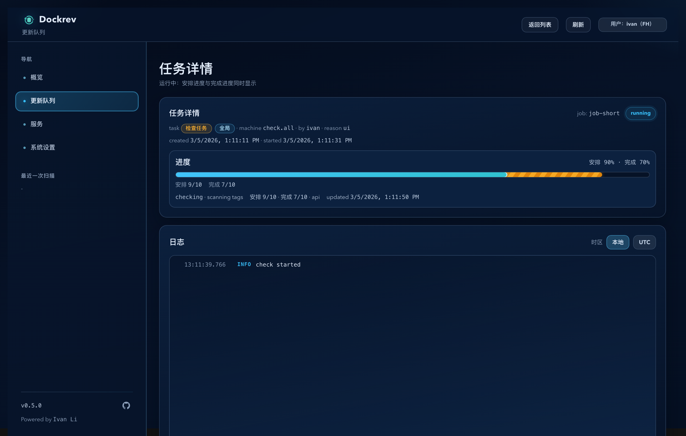
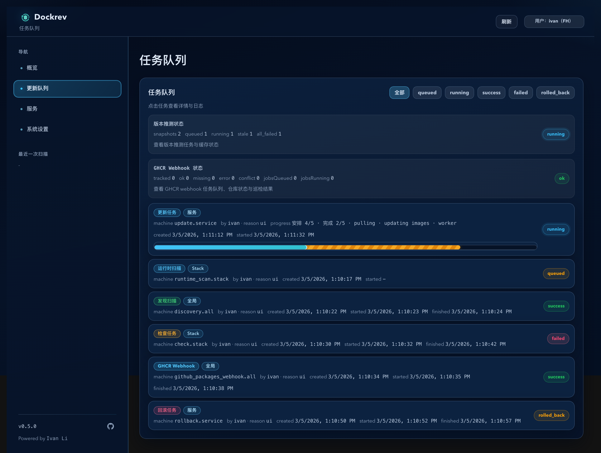

# Dockrev：任务类型/作用域标签间距修复（#7cbvf）

## 状态

- Status: 已完成
- Created: 2026-03-05
- Last: 2026-03-05

## 背景 / 问题陈述

- `/queue/:jobId` 的任务元信息行里，`jobTypeTag` 与 `jobScopeTag` 会直接贴在一起，阅读时难以快速区分。
- `/queue` 已通过同类标签容器控制间距，但详情页没有复用统一容器语义，导致全站呈现不一致。

## 目标 / 非目标

### Goals

- 统一 `jobTypeTag` 与 `jobScopeTag` 的横向间隔为 `6px`。
- 修复任务详情页标签贴边问题，并保持队列页同类标签的间距口径一致。
- 保持现有 type tone 配色、文字映射与后端数据契约不变。

### Non-goals

- 不调整 badge 的配色、字号、圆角、边框样式。
- 不修改 `formatJobReadableDisplay` 的映射逻辑。
- 不改动任何后端 API、任务状态机或 SSE 行为。

## 范围（Scope）

### In scope

- `web/src/pages/JobDetailPage.tsx`
- `web/src/pages/QueuePage.tsx`
- `web/src/App.css`
- `docs/specs/README.md`

### Out of scope

- `crates/**` 与 API 类型定义。
- 任务列表/详情页其他布局重构。

## 接口契约（Interfaces & Contracts）

- Public API / Types: None（无接口与类型变更）。
- 前端仅调整 DOM 结构与样式类复用，`formatJobReadableDisplay(type, scope)` 契约保持不变。

## 验收标准（Acceptance Criteria）

- Given 任务详情页存在 type + scope 标签，When 渲染任务元信息，Then 两个标签之间固定可见间隔（6px），不再贴边。
- Given 队列页渲染同类任务标签，When 检查 type + scope 标签组合，Then 间距与任务详情页保持一致。
- Given 任务无 `scopeTag`，When 渲染 type 标签，Then 不出现多余占位或异常空隙。
- Given 不同 `typeTone` 标签，When 渲染，Then 颜色与边框表现与改动前一致。
- `bun run --cwd web lint` 通过。
- `bun run --cwd web build` 通过。
- `bun run --cwd web storybook:screenshots` 生成可复核截图，`Pages/JobDetailPage/RunningDualProgress` 与 `Pages/QueuePage/Default` 可见一致间距。

## Visual Evidence (PR)

## 实现里程碑（Milestones / Delivery checklist）

- [x] M1: 新增统一标签容器语义，任务详情页改为复用统一容器。
- [x] M2: 队列页对齐同一容器类命名与口径，CSS 固化 `6px` gap。
- [x] M3: 完成 lint/build/storybook 截图验证并同步规格索引状态。

## 变更记录（Change log）

- 2026-03-05: 创建规格，冻结“仅修复标签间距，不改映射与配色”的实现边界。
- 2026-03-05: 将 `JobDetailPage` 的 type/scope 标签改为复用统一 `jobReadableTagGroup` 容器，修复标签贴边。
- 2026-03-05: `QueuePage` 对齐同一容器类名；`App.css` 固化共享容器 `gap: 6px`，统一全站标签间距基线。
- 2026-03-05: 通过 `bun run --cwd web lint`、`bun run --cwd web build`、`bun run --cwd web storybook:screenshots` 验证。
- 2026-03-05: 补充 PR 可视证据截图至 `assets/`，用于 PR 正文渲染复核。
