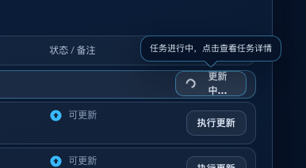
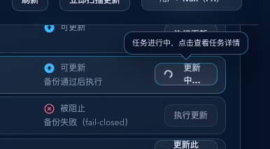
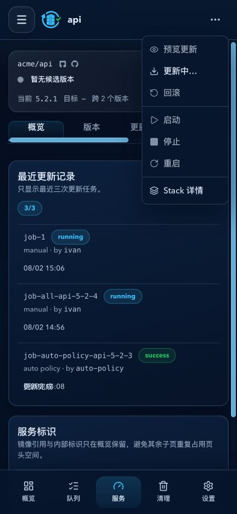

# Dockrev：更新进行中按钮可点击直达任务详情（#7ruev）

## 状态

- Status: 已完成
- Created: 2026-03-04
- Last: 2026-03-04

## 背景 / 问题陈述

- 现有 `更新全部 / 更新此 stack / 执行更新` 在触发后会进入 loading，但按钮被禁用，操作员无法直接从“正在执行”的入口跳到任务详情。
- GHCR Webhook 维护页中的“同步状态”按钮已经采用“活跃态点击跳详情”交互，更新候选区域希望统一该操作模型。

## 目标 / 非目标

### Goals

- 在 update 任务活跃态（`queued/running`）下，更新按钮保持可点击并跳转到对应 `/queue/<jobId>`。
- 空闲态维持现有行为（确认弹窗 + 提交更新任务）。
- 服务详情页以 `lifecycle-status.activeJob.type` 作为服务级操作归属；更新、回滚和生命周期任务只能在所属动作组显示进度，另一动作组必须明确置灰。
- 更新任务仍处于 `queued/running` 时，更新进度优先于候选版本是否存在；候选在结算前消失不得把主动作误显示为回滚。
- 覆盖概览页、服务页、服务详情页的 apply 按钮（含顶部 `更新全部`）。

### Non-goals

- 不改后端 `/api/updates` 协议与任务调度行为。
- 不改 `预览更新`（dry-run）按钮语义。
- 不新增“跨刷新恢复历史运行任务映射”的能力。
- 不修改服务任务调度、串行锁或 HTTP API。

## 范围（Scope）

### In scope

- `web/src/updateActionTracking.ts`：扩展目标级活跃任务读取能力，暴露 `jobId/status`。
- `web/src/ui.tsx`：`Button` 支持 `loading` 态下按需保持可点击。
- `web/src/pages/OverviewPage.tsx`：`更新全部 / 更新此 stack / 执行更新` 活跃态可跳转。
- `web/src/pages/ServicesPage.tsx`：`更新此 stack / 执行更新` 活跃态可跳转。
- `web/src/pages/ServiceDetailPage.tsx`：`执行更新` 活跃态可跳转。
- `web/src/pages/useServiceDetailPageState.tsx`：按服务级活动任务类型派发唯一操作 owner，并保持更新末尾的更新进度优先级。
- `web/src/components/ServiceSplitActionButton.tsx`：支持动作组级禁用原因；桌面主按钮与菜单箭头同步禁用并提供 Tooltip。
- `web/scripts/test-storybook.mjs`：补充“活跃态二次点击跳详情”的自动回归。

### Out of scope

- queue 页与 job detail 页 UI 结构改造。
- 更新任务状态源扩展（仍以当前前端会话内 `trackJob` 绑定为主）。

## 需求（Requirements）

### MUST

- 活跃态按钮文案进入 `更新中… / 排队中…`（提交瞬间允许 `提交中…` 过渡）。
- 活跃态点击优先执行 `navigate({ name: 'job', jobId })`，禁止重复发起 update 请求。
- 禁用规则保持业务约束：非候选、被阻止、架构不匹配等状态不能绕过。
- 服务详情更新、回滚或生命周期任务活跃时，仅 owner 动作组可进入任务详情；非 owner 组不可打开菜单或提交任务。

### SHOULD

- 维持现有 loading spinner 行为与无障碍属性（`aria-busy`）。
- 在不改调用点语义的前提下保留 `isTargetBusy` 兼容性。

## 功能与行为规格（Functional/Behavior Spec）

### Core flows

- 用户首次点击 apply 按钮并确认后，前端记录目标 key 与 `jobId`。
- 当目标 key 映射到活跃任务时：
  - 按钮显示 spinner + 活跃文案；
  - 按钮点击跳转对应 job 详情。
- 当任务进入终态（非 `queued/running`）后，清理映射并恢复默认按钮文案与行为。

### Edge cases / errors

- 提交失败：清理 submitting 态，不保留“可跳详情”能力。
- 轮询短暂失败：遵循既有容错重试，避免误留活跃态。
- `rollback-target.activeJobId` 仅用于冲突信息，不单独决定“回滚中…”文案；回滚进度必须来自活动任务类型为 `rollback` 的服务状态。

## 验收标准（Acceptance Criteria）

- Given 概览页触发 `更新全部`，When 任务活跃，Then 按钮文案为活跃态且点击后 hash 跳转 `#/queue/job-*`。
- Given 服务页某 service 触发 `执行更新`，When 该行任务活跃，Then 该按钮可点击跳详情，其他未活跃行仍维持原状态。
- Given 服务详情页触发 `执行更新`，When 任务活跃，Then 顶部按钮可点击跳详情且 `预览更新` 行为不变。
- Given 更新任务处于 `queued/running` 且候选在结算前消失，When 服务详情刷新，Then 主动作仍显示“更新排队中…/更新中…”，直到任务进入终态。
- Given 服务存在更新、回滚或生命周期活动任务，When 查看服务详情，Then 只有任务所属动作组显示进度并可跳转，另一动作组整组置灰且通过 Tooltip 说明占用原因。

## 非功能性验收 / 质量门槛（Quality Gates）

- `bun run --cwd web lint`
- `bun run --cwd web build`
- `bun run --cwd web build-storybook`
- `bun run --cwd web test-storybook`

## 变更记录（Change log）

- 2026-03-04：实现“更新中按钮可点击跳任务详情”，并补充 storybook 自动回归。
- 2026-03-04：review-loop 修复活跃态按钮禁用判断与 tracker 轮询竞态覆盖问题。
- 2026-03-05：更新按钮提示气泡为浮层定位方案，补充气泡证据截图用于 PR 展示。

## Visual Evidence

- source_type: `ui_demo`
- target_program: `mock-only`
- capture_scope: `browser-viewport`
- requested_viewport: `1440x900 CSS px`
- viewport_strategy: `devtools-emulate`
- margin_policy: `trim_only`
- evidence_surface: `page`
- sensitive_exclusion: `N/A`
- submission_gate: `approved`
- story_id_or_title: `?demoScenario=service-action-progress`
- state: `desktop update owner with lifecycle group disabled`
- evidence_note: `更新任务在候选已消失时仍显示“更新中…”，生命周期主按钮与菜单箭头同步置灰，点击可见占用 Tooltip。`

PR: none

- source_type: `ui_demo`
- target_program: `mock-only`
- capture_scope: `browser-viewport`
- requested_viewport: `393x852 CSS px`
- viewport_strategy: `devtools-emulate`
- margin_policy: `trim_only`
- evidence_surface: `page`
- sensitive_exclusion: `N/A`
- submission_gate: `approved`
- story_id_or_title: `?demoScenario=service-action-progress`
- state: `mobile owner menu open`
- evidence_note: `移动端保留统一服务操作菜单，更新项可进入任务，生命周期和回滚等非 owner 项保持禁用。`

PR: none

## 参考（References）

- `web/src/updateActionTracking.ts`
- `web/src/pages/OverviewPage.tsx`
- `web/src/pages/ServicesPage.tsx`
- `web/src/pages/ServiceDetailPage.tsx`
- `web/scripts/test-storybook.mjs`
