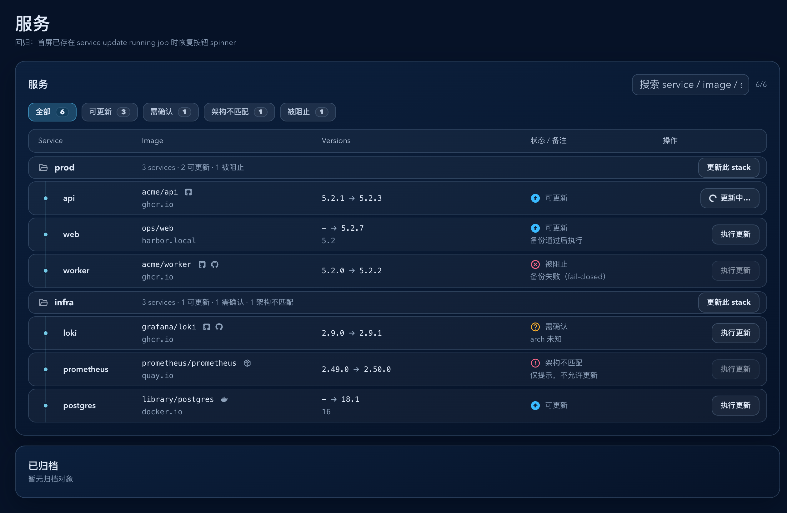

# Dockrev：更新按钮整页刷新后恢复运行态

- ID: `89ctg`
- Status: `已完成`
- Owner: `web`
- Last Updated: `2026-03-30`
- Related: `q6x2g-update-action-button-spin`, `pv9vc-update-button-route-return-spin`

## 背景

`q6x2g` 已让 Overview / Services / ServiceDetail 的 update 按钮在 `queued/running` 时显示 spinner，`pv9vc` 又把这套 tracker 提升到 AppShell 层，解决了“跨路由返回后运行态丢失”。

当前仍有一个遗留缺口：整页刷新后，provider 内存态会被重建，而前端不会从 `/api/jobs` 恢复正在运行的 update job。结果是后端明明仍在执行服务更新，页面按钮却错误地回到默认态。

## 目标

- 页面刷新后，Overview / Services / ServiceDetail 的 update 按钮能从后端活跃 job 恢复 spinner。
- 恢复后的按钮继续复用既有“点击进入任务详情”的行为。
- 同一 target 若存在多个活跃 update job，只跟踪最新一条，避免跳到旧任务详情。

## 非目标

- 不改后端 update job contract、DB schema 或 HTTP API。
- 不扩展到 dry-run / 预览更新 按钮。
- 不调整 Queue / JobDetail 的视觉结构。

## 范围

### In scope

- `web/src/updateActionTracking.ts`
- `web/tests/updateActionTracking.test.ts`
- `web/src/stories/mocks/dockrevMockApi.ts`
- `web/src/stories/pages/OverviewPage.stories.tsx`
- `web/src/stories/pages/ServicesPage.stories.tsx`
- `web/src/stories/pages/ServiceDetailPage.stories.tsx`
- `web/scripts/test-storybook.mjs`

### Out of scope

- 后端 job API / model 变更
- 非 update 类任务按钮
- Storybook docs/MDX 新页面

## 接口与实现约束

- `useUpdateActionTracker()` 对页面侧的消费接口保持不变。
- hydration 只读取 `listJobs()`，仅采纳 `type=update` 且 `status in queued|running` 的任务。
- target key 继续使用 `all` / `stack:<stackId>` / `service:<serviceId>`。
- 同一 target 的多条活跃 job，按 `startedAt ?? createdAt ?? progress.updatedAt` 的最新有效时间选择；时间完全相同时以 `jobId` 稳定打破平局。
- hydration 是 best-effort：恢复失败不能影响手动点击后的正常 spinner 跟踪。

## 验收标准

- Given 页面首次加载时后端已存在某个 service-scope update job 为 `queued/running`，When 打开 Overview / Services / ServiceDetail，Then 对应 `执行更新` 按钮初始即显示 spinner。
- Given 同页还有其他未命中的 update 按钮，When hydration 完成，Then 只有命中的 target 显示 spinner，其他按钮保持默认态。
- Given 活跃按钮来自 hydration，When 用户点击该按钮，Then 仍跳转到对应 `/queue/:jobId`。
- Given 活跃 job 进入终态，When tracker 轮询到终态，Then spinner 自动清理，不残留“更新中”。

## 验证

- `bun test tests/updateActionTracking.test.ts`
- `bun run lint`
- `bun run build`
- `bun run build-storybook`
- `bun run test-storybook`

## Visual Evidence

- source_type: `storybook_canvas`
- target_program: `mock-only`
- capture_scope: `element`
- story_id_or_title: `pages-servicespage--hydrated-running-update`
- state: `initial hydrated running update`
- evidence_note: `验证页面首屏即恢复 service update 按钮 spinner，无需再次点击触发。点击跳转到任务详情的行为由 test-storybook 自动校验。`

## 里程碑

- [x] M1: `updateActionTracking` 新增 provider 级 hydration 和“同 target 取最新活跃 job”逻辑。
- [x] M2: Overview / Services / ServiceDetail 保持既有消费方式，并能由 hydrated active job 驱动 spinner 与跳转行为。
- [x] M3: 补齐单测，覆盖 hydration 过滤与同 target 去重。
- [x] M4: Storybook 场景与交互回归覆盖三个页面的首屏 spinner 恢复。
- [x] M5: 写入 owner-facing `## Visual Evidence`。

## 变更记录

- 2026-03-30: 创建 follow-up spec，聚焦“整页刷新后恢复 update 按钮运行态”。
- 2026-03-30: 完成 provider hydration、单测、Storybook 场景与视觉证据落盘。
