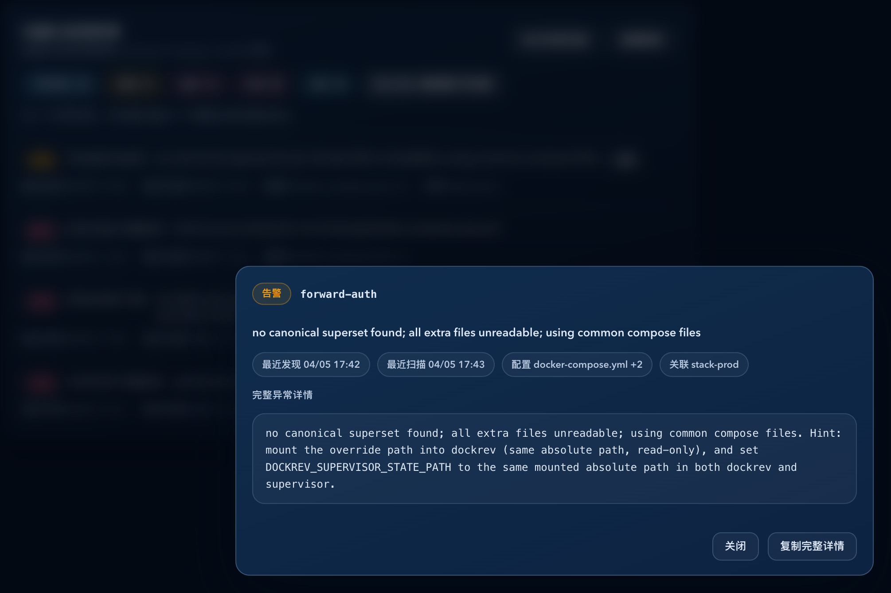

# Dockrev：概览发现异常详情改为点击弹窗并消除双 tooltip（#8hewd）

## 状态

- Status: 已完成
- Created: 2026-04-05
- Last: 2026-04-05

## 背景 / 问题陈述

- 概览页 discovery 卡片当前对长 `fullError` 同时保留浏览器原生 `title` 与 Radix `Tooltip`，同一条目会叠出两层 tooltip，阅读和定位都很别扭。
- 一线操作员需要复制完整异常文本做排障，但现有 hover tooltip 既不稳定，也不适合做长文本复制。

## 目标 / 非目标

### Goals

- 把 discovery 异常行的完整错误查看方式改成点击 `详情` 打开 dialog。
- 移除 `fullError` 的 hover/title 暴露，避免双 tooltip。
- 在 dialog 中展示完整异常详情，并提供“复制完整详情”按钮，同时保留文本可选中复制。
- 用 Storybook 固化新的 dialog 交互与概览页聚焦场景，并产出稳定视觉证据。

### Non-goals

- 不修改 discovery API、路由、数据库结构或后端聚合逻辑。
- 不扩展到 Services / ServiceDetail / 其他 tooltip 交互。
- 不新增独立详情路由。

## 范围（Scope）

### In scope

- `web/src/components/ui/dialog.tsx`
- `web/src/pages/OverviewPage.tsx`
- `web/src/App.css`
- `web/src/stories/pages/OverviewPage.stories.tsx`
- `web/src/stories/components/Dialog.stories.tsx`
- `docs/specs/README.md`

### Out of scope

- `crates/**`
- `web/src/pages/ServicesPage.tsx`
- `web/src/pages/ServiceDetailPage.tsx`

## 接口契约（Interfaces & Contracts）

- Backend API: None（继续使用既有 `listDiscoveryProjects()` 数据，不新增字段）。
- Frontend route: None（仍停留在概览页内，通过 dialog 展示完整详情）。
- Shared UI primitive: 新增共享 `Dialog` primitive，供当前 discovery 详情弹窗与后续普通信息型 modal 复用。

## 验收标准（Acceptance Criteria）

- Given discovery 行存在长 `fullError`，When hover 摘要或 `详情` 按钮，Then 不再出现该错误详情的浏览器原生 tooltip，也不再出现第二层 Radix tooltip。
- Given 点击 `详情`，When dialog 打开，Then `role="dialog"` 的弹窗展示项目名、摘要、元信息与完整异常详情，且长文本可滚动、不挤坏视口。
- Given 点击“复制完整详情”，When 复制成功或失败，Then 按钮文案给出当前打开周期内的反馈，并在关闭后重置。
- Given Storybook 聚焦场景渲染，When 执行 play，Then 能验证“打开 dialog / 完整详情可见 / 复制按钮存在且可调用 / 关闭恢复”主路径。

## 实现里程碑（Milestones / Delivery checklist）

- [x] M1: 新增共享 `Dialog` primitive，并保持 Storybook primitive 覆盖。
- [x] M2: 概览页 discovery `详情` 交互切换到 dialog，移除 `fullError` hover/title 暴露。
- [x] M3: 补齐复制反馈、长文本样式与移动端 dialog 布局。
- [x] M4: 更新 Storybook 场景、play 断言与视觉证据。
- [x] M5: 完成 lint/build/test-storybook、spec sync 与 merge-ready 收口。

## Visual Evidence

- source_type: storybook_canvas
  story_id_or_title: Pages/OverviewPage/DiscoveryCardReadable
  state: discovery-detail-dialog-open
  evidence_note: 验证概览 discovery 卡片改为点击 `详情` 打开可复制 dialog，且不再依赖 hover tooltip 暴露完整异常详情。
  image:
  

## 变更记录（Change log）

- 2026-04-05: 创建规格，冻结“概览 discovery 长错误详情改为点击 dialog + 支持复制”的范围与验收口径。
- 2026-04-05: 完成 shared `Dialog` primitive、概览页 discovery 详情弹窗、复制反馈、Storybook play 回归与视觉证据。
