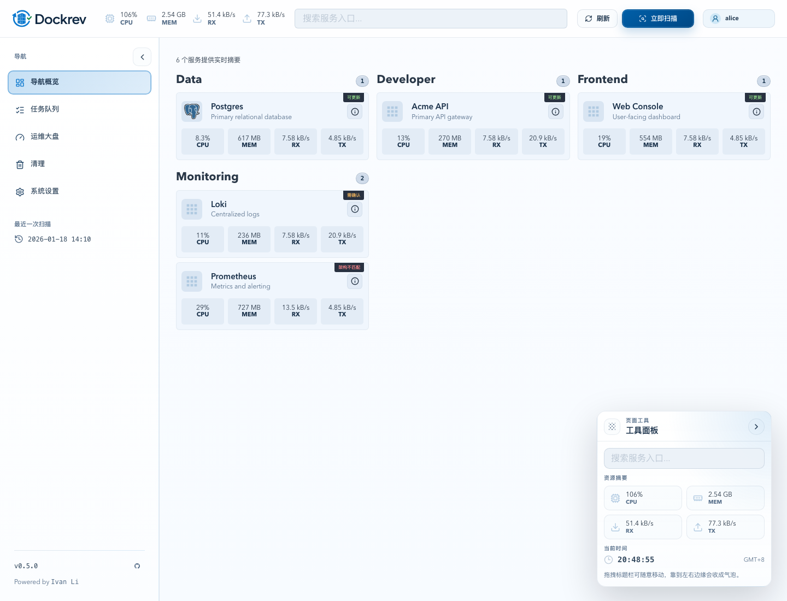
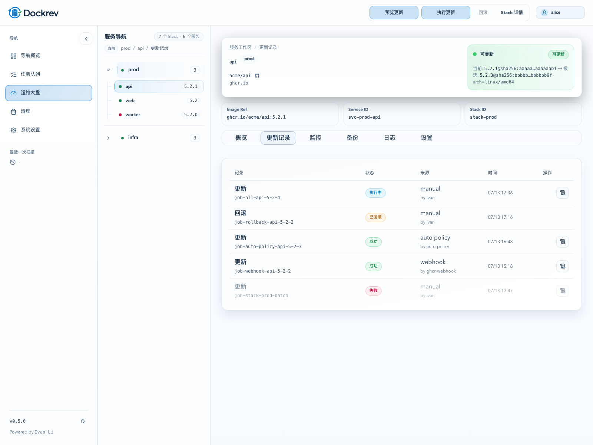
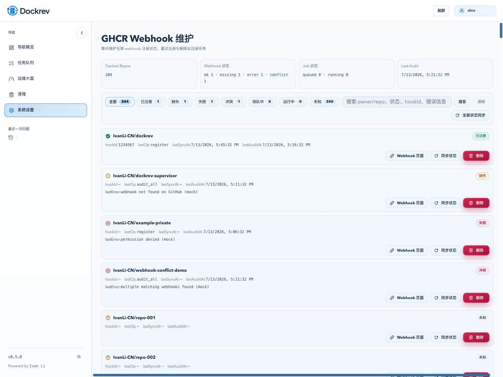
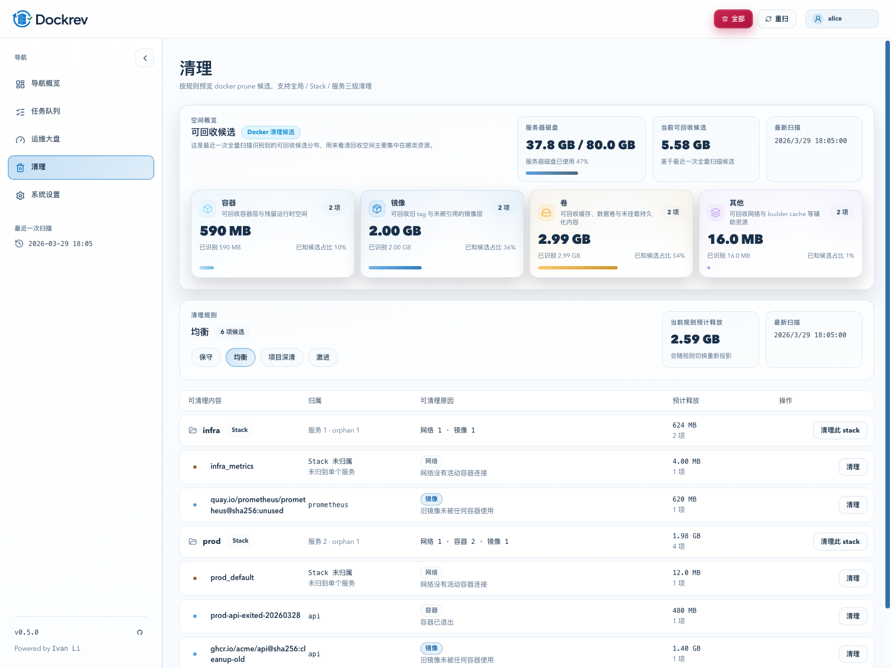
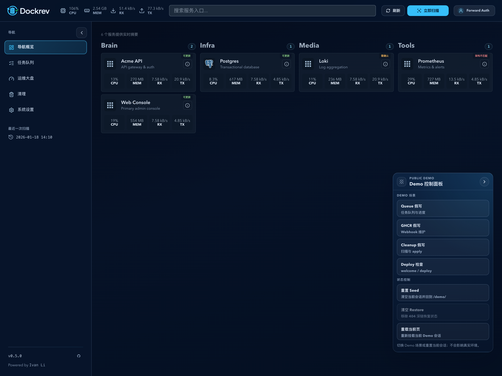

# Dockrev：GitHub Pages 公共 Web Demo（/demo/）正式化（#8m2dp）

## 状态

- Status: 已完成
- Created: 2026-07-13
- Last: 2026-07-14

## 背景 / 问题陈述

- 当前仓库只有本地 `demo:app`，而且旧合同把 demo 限死在 `/` 根路径，不具备 GitHub Pages 上稳定可分享的公开入口。
- 现有 `web/src/demo/appDemoApi.ts` 是 demo-only 大文件，接口覆盖面与 Storybook 的共享 mock API 已经漂移，无法保证 Demo 与 QA surface 的行为一致。
- GitHub Pages 现在只组装 docs 根站和 `/storybook/`。Docs、Storybook 与产品 demo 的职责边界没有被明确写成当前真相。

## 目标 / 非目标

### Goals

- 在 GitHub Pages 组合站中新增正式公共入口 `/demo/`，复用正式 React app routes 与 state model，而不是另做 docs-site/Storybook 壳。
- 所有 nav-visible 主路由与 major detail route 都能在 `/demo/` 下以 seeded、session-backed mock state 稳定运行；写操作允许交互和状态变化，但绝不触达真实 auth/backend。
- 路由、导航、release drawer query 与 public-base-url 推导全部尊重 `BASE_URL`；Pages 深链恢复通过 root `404.html` 保存原始 demo path 并跳回 `/demo/` 恢复，不退回 hash routing。
- GitHub Pages 组装产物同时发布 docs、Storybook 与 `/demo/`；CI 不新增 required check 名称，但把 demo build folding 进现有 `Frontend lint + build`。
- README、docs 首页、导航与 FAQ 清楚区分 Docs / Demo / Storybook。

### Non-goals

- 不新增 marketing landing page，也不把 Storybook 或 docs-site 伪装成产品 demo。
- 不接真实登录、真实后端或生产同源 runtime；本期只做 GitHub Pages 公共 demo。
- 不保留 Pages demo 的 PWA install/service worker contract。

## 范围（Scope）

### In scope

- `docs/specs/8m2dp-pages-public-demo/**`
- `web/src/routes.ts`
- `web/src/demo/**`
- `web/src/stories/mocks/dockrevMockApi/**`
- `web/src/pwaStatus.tsx`
- `web/src/pages/useSettingsPageState.tsx`
- `web/index.html`
- `web/vite.config.ts`
- `web/package.json`
- `web/tests/**`
- `web/src/stories/pages/InteractiveApp.stories.tsx`
- `.github/workflows/ci-pr.yml`
- `.github/workflows/ci-main.yml`
- `.github/workflows/docs-pages.yml`
- `.github/scripts/assemble-pages-site.sh`
- `docs-site/**`
- `README.md`

### Out of scope

- Rust API / supervisor / deploy runtime 改造
- 真实 auth、真实 webhook、真实 Web Push 订阅
- 第二份本地化 demo app 或额外 public host

## 需求 / 行为合同

- 公开 demo 的唯一 URL 形态固定为 `/demo/`；zh/en docs 都链接到同一个 demo app。
- React 路由解析、`href()`、`navigate()`、release drawer query、Settings Public Base URL 建议值都必须基于 `BASE_URL` 工作；不允许再假设 app 永远挂在站点根目录。
- Pages demo build 必须显式关闭 PWA/service worker/install contract：不注册 SW、不暴露 manifest link、不依赖 installability。
- demo state 固定为 seeded + `sessionStorage` 持久化：同一 browser session 内刷新/深链恢复保留状态，新会话回到 seed 数据。
- demo runtime 必须复用共享 `dockrevMockApi`，不得继续维护独立 demo-only API 面；所有共享状态变更必须继续可被 Storybook/page harness 消费，避免 demo 与 QA mock 漂移。
- 组装后的 Pages 产物必须包含：
  - docs root
  - `/storybook/`
  - `/demo/`
  - root `404.html` demo deep-link restore bridge
- Demo 与 Storybook 的职责固定为：
  - Demo：公开产品 surface，真实 pathname 路由，可点击、可假写、可分享深链
  - Storybook：QA / component / state gallery，不作为公开产品 demo

## 验收标准（Acceptance Criteria）

- Given `bun run --cwd web build`，When 常规前端构建执行，Then 非 demo app 行为不回归。
- Given `bun run --cwd web build:demo:pages`，When 以 demo build 变体构建，Then 静态产物可部署到 `/demo/` 子路径，且不注册 service worker、不暴露 manifest link。
- Given 组装后的 Pages 站点，When 首次直接打开 `/demo/`、`/demo/services`、`/demo/services/stack-prod/svc-prod-api/history`、`/demo/queue`、`/demo/settings/ghcr-webhooks`、`/demo/cleanup`、`/demo/deploy-check`，Then 均能进入正确页面而非 404/白屏。
- Given demo session 中执行一次 update/cleanup 类假写操作与一次 settings/GHCR 类假写操作，When 刷新页面或从深链返回，Then 状态变化仍在同一 session 内可读。
- Given zh/en docs 首页、导航、FAQ 与根 README，When 用户寻找在线入口，Then 能明确区分 Docs / Demo / Storybook。

## Visual Evidence

- source_type: `storybook_canvas`
  target_program: `mock-only demo-runtime page harness`
  capture_scope: `browser-viewport`
  sensitive_exclusion: `mock-only seeded data`
  submission_gate: `approved`
  story_id_or_title: `Public Demo / Overview`
  state: `assembled Pages overview landing`
  evidence_note: 验证 GitHub Pages 组装产物中的 `/demo/` 首页使用真实 pathname 路由、公共导航与 seeded mock state，而不是 Storybook 壳或 docs 页包装。

- source_type: `storybook_canvas`
  target_program: `mock-only demo-runtime page harness`
  capture_scope: `browser-viewport`
  sensitive_exclusion: `mock-only seeded data`
  submission_gate: `approved`
  story_id_or_title: `Public Demo / Service History`
  state: `deep-linked service detail history route`
  evidence_note: 验证 `/demo/services/stack-prod/svc-prod-api/history` 作为真实深链可直接落到服务详情子页，左侧树导航、顶部动作与历史记录表在 public demo 内完整可读。

- source_type: `storybook_canvas`
  target_program: `mock-only demo-runtime page harness`
  capture_scope: `browser-viewport`
  sensitive_exclusion: `mock-only seeded data`
  submission_gate: `approved`
  story_id_or_title: `Public Demo / GHCR Webhooks`
  state: `settings ghcr registry maintenance`
  evidence_note: 验证 `/demo/settings/ghcr-webhooks` 在 public demo 中以 session-backed mock state 展示可交互的 GHCR webhook 维护视图，明确区别于 Storybook 的 QA surface。

- source_type: `ui_demo`
  target_program: `assembled GitHub Pages /demo/ surface`
  capture_scope: `browser-viewport`
  sensitive_exclusion: `mock-only seeded data`
  submission_gate: `approved`
  story_id_or_title: `Public Demo / Cleanup`
  state: `cleanup route with streaming mock scan`
  evidence_note: 验证 `/demo/cleanup` 在 assembled Pages demo 中使用 public demo mock scope 正常展示 cleanup 概览、规则切换与按 stack/service 分组列表，不再出现未处理 mock route 错误。

- source_type: `ui_demo`
  target_program: `assembled GitHub Pages /demo/ surface`
  capture_scope: `browser-viewport`
  sensitive_exclusion: `mock-only seeded data`
  submission_gate: `approved`
  story_id_or_title: `Public Demo / Overview Demo Control Panel`
  state: `demo-only scene shortcuts with session controls`
  evidence_note: 验证 overview 桌面端 `Demo 控制面板` 已移除低价值 runtime 状态卡，只保留 Demo 场景快捷入口与会话控制；按钮文案不再溢出，底部说明改成简短结果描述；拖到左侧边缘时仍保持展开，只有点击“收起”动作才会贴边变成气泡。

## 变更记录（Change log）

- 2026-07-13：创建规格，冻结 `/demo/` 公共入口、Pages 404 深链恢复、session-backed mock state、PWA-off demo contract 与 Docs/Demo/Storybook 分工。
- 2026-07-13：实现完成，`/demo/` 作为 GitHub Pages docs 子目录内的正式 public demo 发布面落地，包含 BASE_URL 感知路由、session-backed mock state、cleanup/GHCR 假写能力、root `404.html` 深链恢复与 docs/workflow/gate 同步。
- 2026-07-14：overview 工具面板最终交互收口为“手动收起 only”，补齐贴边气泡与左侧拖拽不自动收起的 owner-facing 视觉证据。
- 2026-07-15：overview 浮层语义改为 `Demo 控制面板`，移除与 demo/mock 无关的搜索、资源摘要与时钟；后续再删去低价值 runtime 状态卡，收口成 Demo 场景快捷入口与会话控制。
