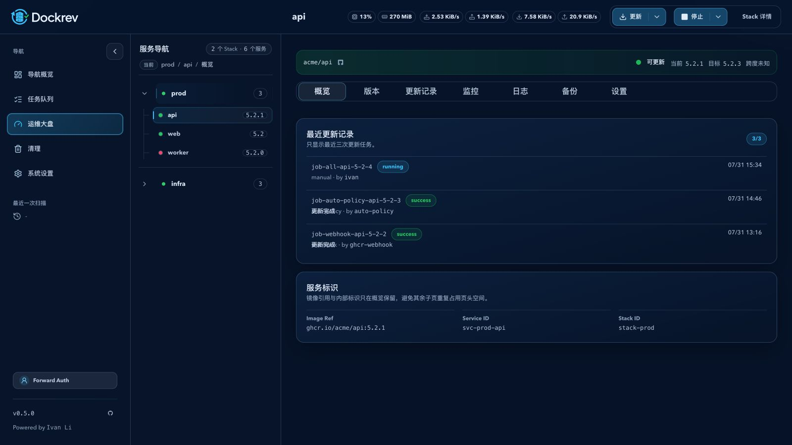
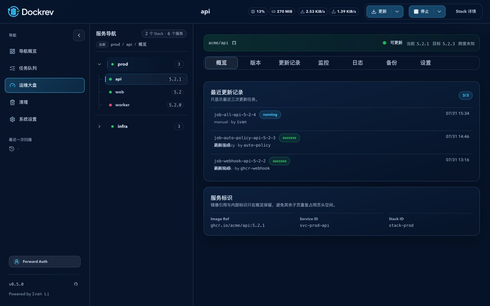
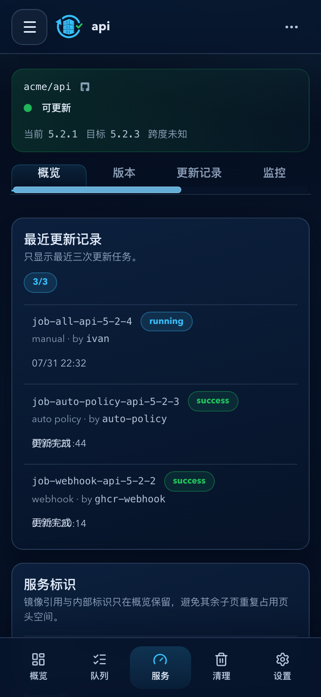
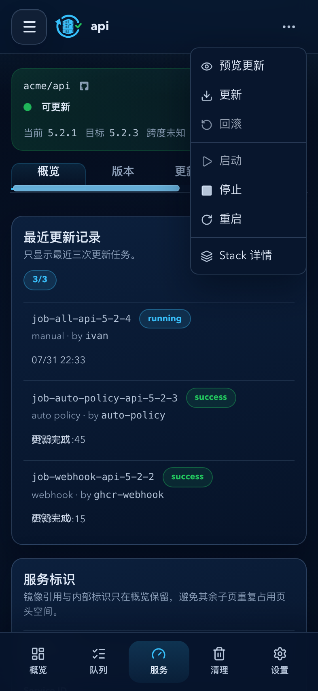
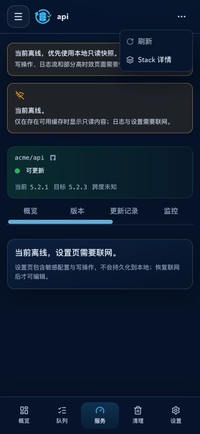
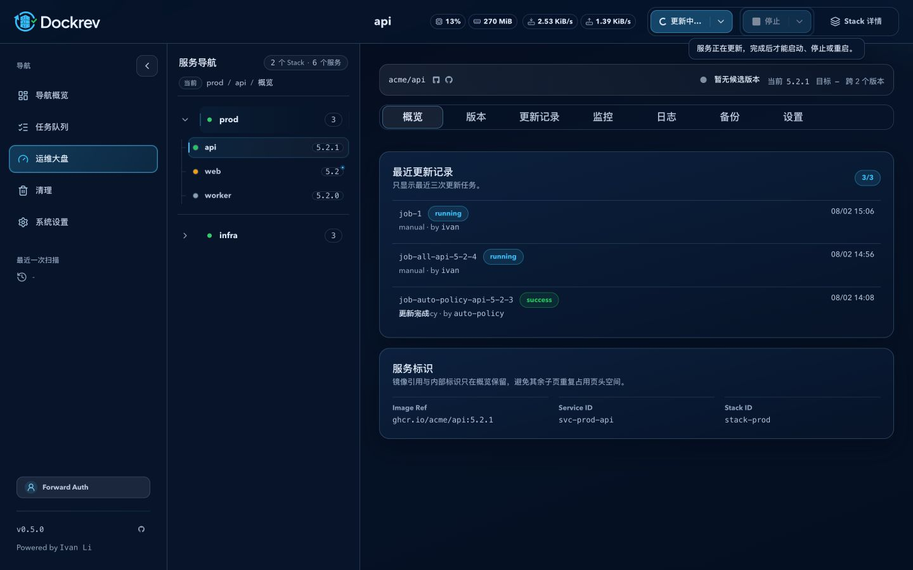
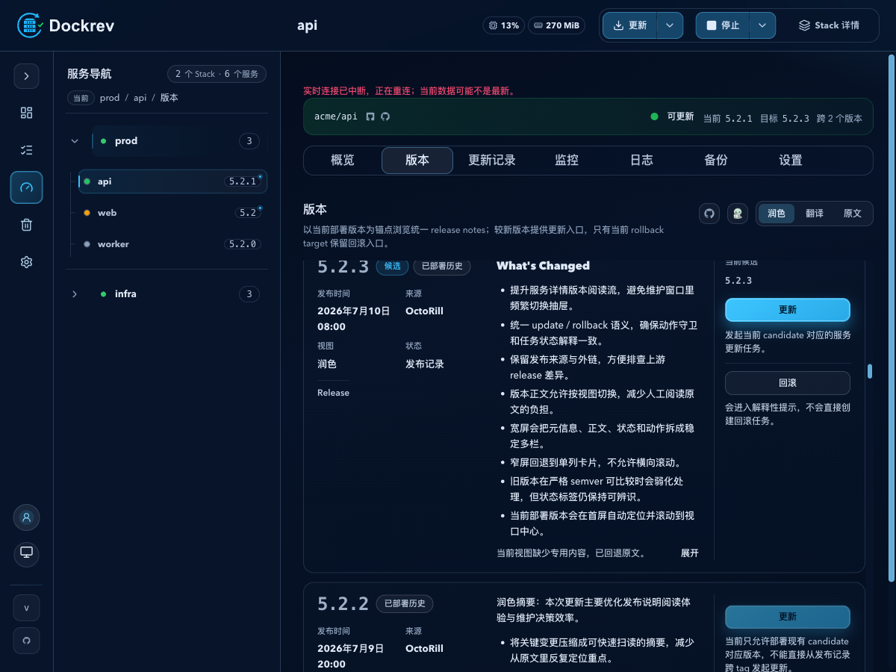

# Dockrev：服务详情操作下拉与生命周期任务（#9cq2a）

> 当前有效规范以本文为准；实现覆盖与当前状态见 `./IMPLEMENTATION.md`，关键演进原因见 `./HISTORY.md`。

## 目标 / 非目标

### Goals

- 将服务详情顶部的更新动作收束为一个 split dropdown：有候选时默认“更新”，无候选时默认“回滚”，菜单始终可发现“预览更新 / 更新 / 回滚”。
- 提供服务级 `启动 / 停止 / 重启` split dropdown，并把真实执行过程记录为可审计的队列任务。
- 在 AppShell 顶栏显示当前服务名，并在名称与操作组之间显示服务资源摘要；正文不再重复服务标题或资源摘要。资源摘要按 `CPU + 内存`、`磁盘读 + 写`、`下载 + 上传` 三个不可拆分组随可用宽度逐级隐藏。
- 移动端服务详情页头保持单行，右上角使用一个服务操作入口代替独立操作行；入口菜单按更新、生命周期、Stack 三组平铺，并以水平分隔线区分。
- 生命周期任务与同一服务的 update、rollback 完全串行，并显示在服务操作历史中。
- 服务级活动任务由 `lifecycle-status.activeJob.type` 归属到唯一动作组；owner 组显示进度并可进入任务详情，非 owner 组不允许提交操作。

### Non-goals

- 不新增 stack 级或全局生命周期操作。
- 不改变既有 update、rollback 或 Dockrev Supervisor 自升级的执行协议。
- 不自动修复部分副本运行或未知运行态。

## 接口契约

完整 HTTP 定义见 [contracts/http-api.md](./contracts/http-api.md)。

- `GET /api/services/{serviceId}/lifecycle-status` 读取该服务的实时 Compose 生命周期状态和会阻塞操作的活跃任务。
- `GET /api/stacks/{id}` 返回的 `services[]` 同步附带只读 `lifecycleState`，供详情服务树批量展示运行态；它不改变服务级 lifecycle API 或写操作权限。
- `POST /api/services/{serviceId}/lifecycle` 接收 `{ "action": "start" | "stop" | "restart" }`，成功返回 `{ "jobId": "..." }`。
- 任务类型为 `service_lifecycle`；摘要必须携带动作，供队列、详情和服务历史展示。
- 生命周期任务结算后必须发布对应 Stack 的定向详情树刷新事件，避免服务树继续显示旧运行态。

## 行为规格

- `running` 默认主动作是“停止”；`stopped` 默认主动作是“启动”。
- `partial` 表示多副本服务仅部分运行；`unknown` 表示 Compose 查询失败或结果无法判定。两种状态都保持菜单可见但不可执行；原因只在悬浮时显示为浮动提示，点击不可执行项时以 toast 提示。
- 启动直接提交；停止和重启必须经现有确认交互确认后才创建任务。
- 启动不得拉取镜像、替换已有容器或影响依赖服务：Compose V2 plugin 与 standalone 均执行 `up -d --pull never --no-recreate --no-deps <service>`；Compose V1、版本失败或版本无法解析时拒绝所有写操作并返回稳定原因 `compose_v2_required`。停止执行对应 `stop <service>`；重启执行对应 `restart <service>`。
- 生命周期读取必须先成功解析 Compose 配置并确认目标服务存在，再同时成功查询 `ps -a` 与运行态；有效配置下两者均为空时状态为 `stopped`，任一查询、配置校验或服务解析失败时状态为 `unknown`。
- 同服务的 update、rollback、service_lifecycle 若有 queued 或 running 任务，新的同服务操作必须以 `409` 返回既有任务 ID。服务 status 响应也必须暴露该活动任务，前端可直接跳转详情。
- Dockrev 自身服务不显示 lifecycle 菜单，继续只使用既有 Supervisor 自升级入口。
- 已归档的服务或所属 Stack 不接受生命周期写操作；历史详情保持可读。
- 当前默认主动作仅由 split button 的主按钮表达；不可用动作仍可发现，但不在菜单内展示原因。
- 桌面端保留两个 split button；移动端只显示一个 44px 服务操作入口。菜单直接列出更新三项、生命周期三项与 Stack 详情，不使用二级菜单或组标题，组间使用 UI 库分隔线。
- 操作历史应包含 update、rollback 和 service_lifecycle；生命周期项显示“启动 / 停止 / 重启”而不是泛化类型名。
- 桌面端在 update 或 rollback 占用服务时，完整禁用生命周期 split button（主按钮与箭头），保留“启动/停止”默认文案并通过 Tooltip 说明占用原因；生命周期占用时对称禁用更新组。
- 移动端仍可打开服务操作菜单，非 owner 动作项保持可发现但禁用，点击继续使用 Toast 提示原因。

## 验收标准

- Given 服务有候选版本，When 打开详情页，Then 更新 split button 的主动作是“更新”；没有候选时主动作是“回滚”，且菜单始终含三项更新动作。
- Given 服务详情已加载，When 查看页面，Then 当前服务名显示在 AppShell 顶栏，正文不再重复渲染服务标题。
- Given 服务详情顶栏空间缩小时，When 资源摘要无法完整容纳，Then 先整体隐藏网络组，再隐藏磁盘组，最后才隐藏 CPU 与内存组；任一组内的两个指标不得拆开、折行或造成横向溢出。
- Given 服务正在运行，When 打开详情页，Then 生命周期 split button 主动作为“停止”；服务停止时为“启动”。
- Given 在 393 × 852 移动视口打开服务详情，When 查看页头，Then Logo、服务名和服务操作入口处于同一行；展开入口后显示三组平铺菜单项及两条组间分隔线，页面不再保留第二行服务操作。
- Given 状态为 partial 或 unknown，When 打开详情页，Then 生命周期菜单保留可见但不可执行，且原因可读取。
- Given 用户点击停止或重启，When 未确认或关闭确认对话框，Then 不创建生命周期任务。
- Given 某服务已有 queued/running update、rollback 或 lifecycle 任务，When 再提交该服务的任一此类操作，Then 后端返回冲突和既有任务 ID。
- Given Dockrev 自身服务，When 打开详情页，Then 不显示 lifecycle menu。
- Given 任务完成，When 服务详情刷新，Then 生命周期状态用一次服务级 Compose 查询收敛，不触发全量 runtime scan。
- Given 更新任务处于 `queued/running` 且候选版本在结算前消失，When 服务详情刷新，Then 更新组保持“更新排队中…/更新中…”而不是切换到“回滚中…”。
- Given `docker-compose version` 输出 Compose V2+，When 执行服务启动，Then standalone 命令使用 `version/config/ps/up` 合同且包含 `--pull never --no-recreate --no-deps`。
- Given Compose V1、版本命令失败或版本输出无法解析，When 提交更新、回滚或生命周期写操作，Then 返回 `compose_v2_required` 且不生成容器变更命令。
- Given Compose 配置合法、服务存在且 `ps -a` 为空，When 查看服务或 Stack 状态，Then 状态为 `stopped` 并允许执行 no-pull 启动。

## 验证

- `cargo fmt --all --check`
- `cargo test -p dockrev-api`
- `bun run --cwd web lint`
- `bun run --cwd web build`
- `bun run --cwd web build-storybook`
- `bun run --cwd web test-storybook`

## Visual Evidence

- source_type: `storybook_canvas`
- target_program: `mock-only`
- capture_scope: `browser-viewport`
- requested_viewport: `1600x900`
- viewport_strategy: `browser-resize-fallback` (isolated iframe capture; no Storybook chrome)
- margin_policy: `trim_only`
- evidence_surface: `page`
- sensitive_exclusion: `N/A`
- submission_gate: `approved`
- story_id_or_title: `Pages/ServiceDetailPage/LifecycleRunning`
- state: `wide topbar, all metric groups`
- evidence_note: `服务名位于 AppShell 顶栏，资源摘要紧随其后并处于操作组之前；宽屏容纳 CPU/内存、磁盘读/写与下载/上传三个完整指标组，正文不再保留重复摘要。边缘空白检查无需裁剪。`

- source_type: `storybook_canvas`
- target_program: `mock-only`
- capture_scope: `browser-viewport`
- requested_viewport: `1440x900`
- viewport_strategy: `browser-resize-fallback` (isolated iframe capture; Storybook has no desktop-width story variant)
- margin_policy: `trim_only`
- evidence_surface: `page`
- sensitive_exclusion: `N/A`
- submission_gate: `approved`
- story_id_or_title: `Pages/ServiceDetailPage/LifecycleRunning`
- state: `compact desktop, network hidden`
- evidence_note: `顶栏可用宽度不足时先完整隐藏下载/上传组；CPU/内存与磁盘读/写仍作为完整成对组显示，且顶栏没有横向溢出。边缘空白检查无需裁剪。`

- source_type: `storybook_canvas`
- target_program: `mock-only`
- capture_scope: `browser-viewport`
- requested_viewport: `393x852 CSS px`
- viewport_strategy: `storybook-viewport`
- margin_policy: `trim_only`
- evidence_surface: `page`
- sensitive_exclusion: `N/A`
- submission_gate: `approved`
- story_id_or_title: `Pages/ServiceDetailPage/LifecycleRunningMobile`
- state: `mobile single-row header, action menu closed`
- evidence_note: `移动端页头保持单行：图标 Logo、当前服务名和 44px 服务操作入口沿 Y 轴居中；资源摘要和旧的第二行操作均不占用页头空间。边缘空白检查无需裁剪。`

PR: include

- source_type: `storybook_canvas`
- target_program: `mock-only`
- capture_scope: `browser-viewport`
- requested_viewport: `393x852 CSS px`
- viewport_strategy: `storybook-viewport`
- margin_policy: `trim_only`
- evidence_surface: `page`
- sensitive_exclusion: `N/A`
- submission_gate: `approved`
- story_id_or_title: `Pages/ServiceDetailPage/LifecycleRunningMobile`
- state: `mobile service action menu open`
- evidence_note: `右上角入口展开后，预览更新/更新/回滚、启动/停止/重启、Stack 详情按三组直接平铺；两条 UI 库分隔线表达组边界，面板按最长内容自然定宽，没有二级菜单或额外说明文字。边缘空白检查无需裁剪。`

PR: include

- source_type: `storybook_canvas`
- target_program: `mock-only`
- capture_scope: `browser-viewport`
- requested_viewport: `393x852 CSS px`
- viewport_strategy: `storybook-viewport`
- margin_policy: `trim_only`
- evidence_surface: `page`
- sensitive_exclusion: `N/A`
- submission_gate: `approved`
- story_id_or_title: `Pages/ServiceDetailPage/MobileSettingsOfflineReadonly`
- state: `mobile readonly service action menu open`
- evidence_note: `离线或缓存快照状态继续使用单一 44px 服务操作入口；刷新项保持可发现但禁用，Stack 详情仍可导航，页头没有恢复独立操作按钮。边缘空白检查无需裁剪。`

- source_type: `ui_demo`
- target_program: `mock-only`
- capture_scope: `browser-viewport`
- requested_viewport: `1440x900 CSS px`
- viewport_strategy: `devtools-emulate`
- margin_policy: `trim_only`
- evidence_surface: `page`
- sensitive_exclusion: `N/A`
- submission_gate: `approved`
- story_id_or_title: `?demoScenario=service-action-progress`
- state: `desktop update owner with lifecycle group disabled`
- evidence_note: `更新任务在候选已消失时仍显示“更新中…”，生命周期主按钮与菜单箭头同步置灰，点击可见占用 Tooltip。`

PR: include

- source_type: `ui_demo`
- target_program: `mock-only`
- capture_scope: `browser-viewport`
- requested_viewport: `393x852 CSS px`
- viewport_strategy: `devtools-emulate`
- margin_policy: `trim_only`
- evidence_surface: `page`
- sensitive_exclusion: `N/A`
- submission_gate: `approved`
- story_id_or_title: `?demoScenario=service-action-progress`
- state: `mobile owner menu open`
- evidence_note: `移动端保留统一服务操作菜单，更新项可进入任务，生命周期和回滚等非 owner 项保持禁用。`

PR: include

- source_type: `ui_demo`
- target_program: `mock-only`
- capture_scope: `browser-viewport`
- requested_viewport: `1200x900 CSS px`
- viewport_strategy: `chrome-cdp-viewport`
- margin_policy: `trim_only`
- evidence_surface: `page`
- sensitive_exclusion: `N/A`
- submission_gate: `approved`
- story_id_or_title: `demo:app / /demo/services/stack-prod/svc-prod-api/versions`
- state: `intermediate desktop candidate action rail`
- evidence_note: `在服务详情真实应用壳内，版本区释放目录后保持既有宽卡三栏与固定操作轨道；候选版本的更新与回滚入口均完整可见。截图只陈述该页面状态，不将顶栏留白或指标分组的既有主干行为误判为版本卡回归。边缘空白检查无需裁剪。`

PR: include

## 变更记录

- 2026-07-30: 创建规格，冻结服务生命周期任务、操作菜单、串行边界、文档和 Storybook 验收契约。
- 2026-07-31: 移动端页头收束为单行，并以三组平铺服务操作菜单替代第二行操作。
- 2026-07-31: 主人确认移动端关闭态与展开态证据；移除已被当前布局取代且不再被规范引用的旧截图。
