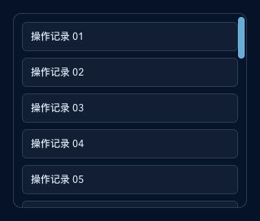
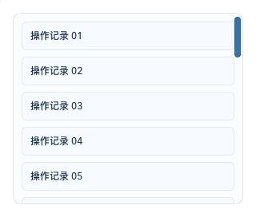

# Dockrev：UI 主题重构（UI UX Pro Max，稳健增强）（#af32v）

## 状态

- Status: 已完成
- Created: 2026-02-27
- Last: 2026-02-27

## 背景 / 问题陈述

- 现有界面信息密度高，但视觉层级与状态对比不够稳定，在不同页面与浮层间存在风格割裂。
- 移动端在隐藏侧栏后导航可达性弱，运维场景下跨页面跳转成本高。
- 主题变量已具备 dark/light 双模式，但组件层未形成统一 token 约束，局部样式重复偏多。

## 目标 / 非目标

### Goals

- 按 UI UX Pro Max（Data-Dense Dashboard + Real-Time Monitoring）重构 Dockrev 前端视觉系统。
- 保留当前蓝/青主题方向，完成 dark/light 双主题一致性提升。
- 在不改变业务逻辑和 API 的前提下，统一壳层、表格、卡片、弹窗、部署检查页视觉语言。
- 提升移动端导航可达性与信息摘要可读性。

### Non-goals

- 不变更后端 API、数据库结构、任务执行语义。
- 不引入新前端框架，不重写为 Tailwind / CSS-in-JS。
- 不接入外链字体（Google Fonts）。

## 范围（Scope）

### In scope

- `/web/src/index.css`：重建 design tokens 与主题层变量。
- `/web/src/App.css`：重构全局组件与页面样式（含 modal/popover/deploy 页面）。
- `/web/src/Shell.tsx`：壳层结构微调（移动导航、品牌区与摘要信息）。
- `/web/src/ui.tsx` 及 `/web/src/pages/*.tsx`：仅在必要处做非行为变更的结构配合。

### Out of scope

- Rust crates 与 API 契约文件。
- CI/CD 工作流调整。

## 需求（Requirements）

### MUST

- 保持路由、数据流和交互语义不变。
- 保留 dark/light 两套主题并确保文本对比度可读。
- 保持无外链字体策略，仅使用本地/system 字体栈。
- 移动端必须提供可用导航入口。
- 所有改动通过 `web` 的 lint/build/storybook 测试。

### SHOULD

- 按 token 驱动方式减少重复硬编码颜色。
- 关键交互（按钮、导航、行 hover、focus）有统一反馈和时长。

## 接口契约（Interfaces & Contracts）

| 接口（Name） | 类型（Kind） | 范围（Scope） | 变更（Change） | 备注 |
| --- | --- | --- | --- | --- |
| `/api/**` | HTTP API | external | None | 不变 |
| `Route/href/navigate` | TS routing API | internal | None | 不变 |
| CSS tokens (`--color-*`, `--dockrev-*`) | Style contract | internal | Modify | 加入语义层并保持兼容变量 |

## 验收标准（Acceptance Criteria）

- Given 用户在 dark/light 模式下浏览主要页面，When 切换主题，Then 文本、边框、状态点可读且风格一致。
- Given 用户在移动端宽度（<=960px）访问，When 侧栏隐藏，Then 顶部/内容区仍可完成页面导航。
- Given 用户访问 Overview/Services/Queue/Settings/DeployWelcome，When 查看卡片与表格，Then 视觉层级一致且无功能回归。
- Given 执行 `bun run lint`、`bun run build`、`bun run test-storybook`，Then 全部通过。

## Visual Evidence

滚动条使用 OverlayScrollbars 统一主要长内容区，并为原生遗留滚动区提供相同的主题 fallback；深浅主题均保持紧凑、可见且可拖拽的操作型轨道。

## 实现里程碑（Milestones / Delivery checklist）

- [x] M1：创建并落地主题 token（dark/light）与全局字体体系。
- [x] M2：完成 AppShell 与响应式导航重构。
- [x] M3：完成页面与浮层统一样式重构。
- [x] M4：完成 lint/build/storybook 验证并归档截图证据。

## 风险 / 假设

- 风险：旧样式选择器过多，覆盖顺序不当可能导致局部回归。
- 风险：移动端表格折叠策略如处理不当可能影响信息浏览效率。
- 假设：保持现有组件类名体系，避免大规模 TSX 结构改动。

## 变更记录（Change log）

- 2026-02-27：创建规格，进入实现阶段。
- 2026-02-27：完成全量页面主题重构与 Storybook 验证。
- 2026-02-27：修复移动端导航键盘焦点可视性（`focus-visible`）。
- 2026-02-27：将表格几何 token 调整为像素锚定，并增强 Storybook 对齐校验稳定性。
