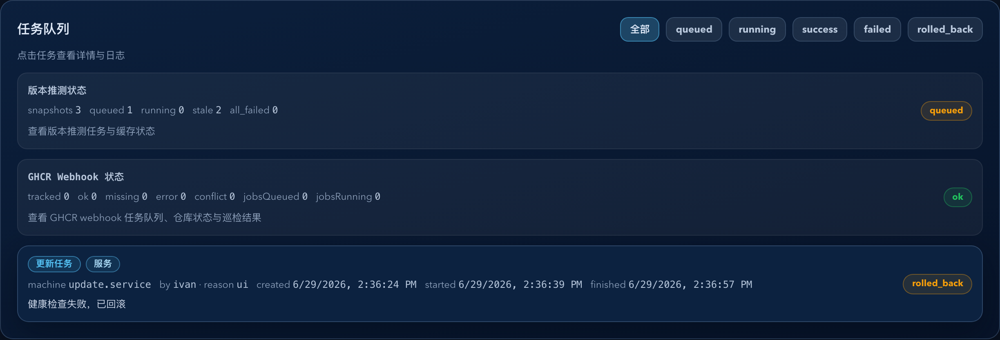
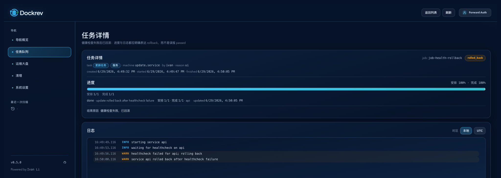
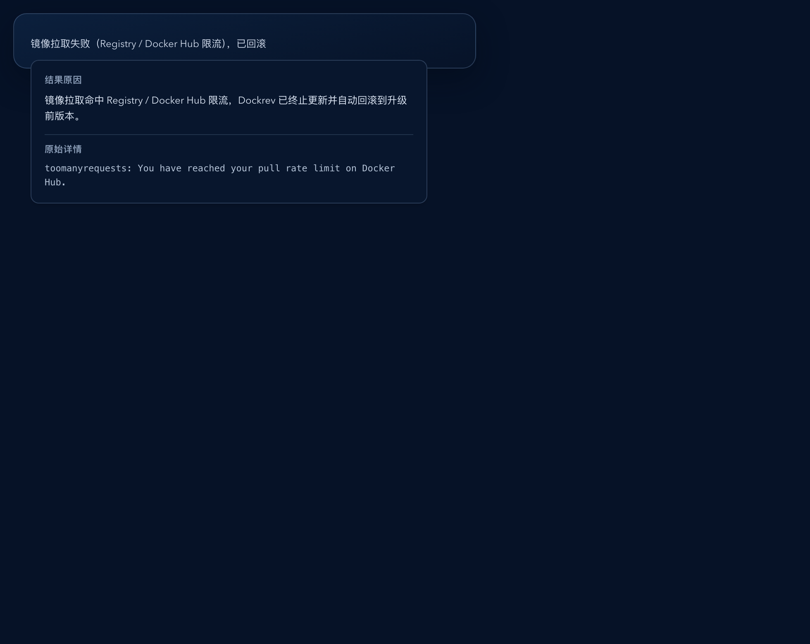

# Dockrev：任务结果原因摘要与气泡详情（#b3fhv）

> 当前有效规范以本文为准；实现覆盖与当前状态见 `./IMPLEMENTATION.md`，关键演进原因见 `./HISTORY.md`。

## 背景 / 问题陈述

- 当前 `/queue`、`/queue/:jobId`、以及服务/Stack 详情里的最近更新记录，只展示任务状态，不展示“为什么成功/失败/已回滚”。
- 一线操作员看到 `rolled_back`、`failed`、`success` 后，仍要继续打开日志或根据经验猜测终态原因，首屏排障效率偏低。
- 现有页面里虽然已经有终态 `progress.message`、结构化 `summary`、甚至 `lastError/failureStep/rollback.trigger`，但这些信息没有被统一提炼成 owner-facing 的短摘要与完整详情合同。

## 目标 / 非目标

### Goals

- 为 `GET /api/jobs` 与 `GET /api/jobs/:id` 增加统一的 `resultReason` 字段，作为终态任务结果原因的 API 合同。
- 在 `QueuePage`、`JobDetailPage`、`RecentUpdateRecords` 三处落地一致的“短摘要 + hover/focus/click 气泡详情”体验。
- 短摘要优先使用友好的中文文案，同时保留关键技术锚点；气泡中展示更完整说明，并在可用时追加原始技术内容。
- 仅对 `success / failed / rolled_back` 终态任务展示结果原因；`running / queued` 继续使用现有 progress 文案。

### Non-goals

- 不修改 jobs 持久化 schema、SSE 协议、任务执行语义或日志格式。
- 不为长原始详情新增 dialog/copy 流程；本次只做 inline 摘要 + 气泡详情。
- 不重做任务队列的筛选、排序、进度条或状态 pill 设计。

## 范围（Scope）

### In scope

- `crates/dockrev-api/src/api/types/jobs.rs`
- `crates/dockrev-api/src/api/jobs.rs`
- `crates/dockrev-api/src/api/operations/transitions/execution.rs`
- `crates/dockrev-api/src/api/tests/**`
- `web/src/api/types.ts`
- `web/src/pages/QueuePage.tsx`
- `web/src/pages/JobDetailPage.tsx`
- `web/src/components/RecentUpdateRecords.tsx`
- `web/src/components/HoverPinnedPopover.tsx`（复用，不重写状态机）
- `web/src/stories/pages/QueuePage.stories.tsx`
- `web/src/stories/pages/JobDetailPage.stories.tsx`
- `web/src/stories/components/**`（新增共享结果原因入口时）
- `web/src/stories/mocks/dockrevMockApi/**`
- `web/src/App.css`

### Out of scope

- 其他非任务结果类 tooltip / dialog 交互。
- `OverviewPage` 任务摘要列表的额外扩展。
- 非终态 job 的原因解释文案。

## 需求（Requirements）

### MUST

- `JobApiListItem` 与 `JobDetail` 必须新增同构可选字段：
  `resultReason?: { summary: string; detail: string; raw?: string | null }`。
- `resultReason` 只在 `status ∈ {success, failed, rolled_back}` 且确实存在高信息量原因时返回；不得为信息量不足的 boilerplate 强行补空泛文案。
- 后端派生优先级必须固定为：
  1. 结构化 `update/rollback` 终态信号（`failureStep` / `lastError` / `rollback.trigger` / `pullTagWarnings`）；
  2. 终态 `progress.message`；
  3. `summary.error` 或其他已有原始错误字段。
- `QueuePage` 必须在终态任务元信息下方新增单行截断摘要。
- `JobDetailPage` 必须在进度区下方新增独立“结果原因”区块，并允许两行展示预算。
- `RecentUpdateRecords` 必须在现有次信息区域新增紧凑单行摘要，不破坏现有扫描顺序。
- 三处前端展示必须复用同一套交互：桌面 `hover + focus` 打开，点击可 pinned；触控端点击打开同一气泡。
- 新气泡交互不得与浏览器原生 `title` 或现有 Tooltip 叠出双层提示。

### SHOULD

- `summary` 采用“友好中文 + 技术锚点”的混合口径，例如“镜像拉取失败（Docker Hub 限流），已回滚”。
- `detail` 应比 `summary` 更完整，但仍保持运维可扫描；`raw` 只在存在更原始、且与 `detail` 不同的技术内容时返回。
- 共享前端展示组件应支持单行与双行截断预算，并把完整内容交给气泡层展示。

### COULD

- 对 generic terminal jobs，在存在明显有效终态文案时展示 `resultReason`，否则允许隐藏整个原因块。

## 功能与行为规格（Functional/Behavior Spec）

### Core flows

- 终态 update job 成功：
  - 若没有额外异常信息，则短摘要可表达“更新完成”一类友好结果。
- 终态 update job rolled_back：
  - 若 `failureStep=healthcheck`，短摘要强调“健康检查失败，已回滚”。
  - 若 `failureStep=pull_target_tag`，短摘要强调“镜像拉取失败，已回滚”；若原始错误命中 rate limit 语义，则保留 “Registry / Docker Hub 限流”锚点。
  - 若 `failureStep=sync_configured_tag`，短摘要强调“Compose tag 同步失败，已回滚”。
- 终态 rollback job failed：
  - 根据 `failureStep` 与原始错误信息生成失败原因。
- 用户在 queue/detail/recent updates 中悬浮或点击摘要：
  - 打开同一气泡。
  - 首先展示 `detail`。
  - 若有 `raw`，再以更弱视觉/等宽文本显示“原始详情”。

### Edge cases / errors

- `running / queued` 任务不展示 `resultReason`，避免和进度文案冲突。
- 若终态任务只有状态值、没有更高信息量原因，则允许不显示该区域。
- 旧任务缺少结构化 summary 时，允许回退到 `progress.message` 或 `summary.error`。

## 接口契约（Interfaces & Contracts）

### 接口清单（Inventory）

| 接口（Name） | 类型（Kind） | 范围（Scope） | 变更（Change） | 契约文档（Contract Doc） | 负责人（Owner） | 使用方（Consumers） | 备注（Notes） |
| --- | --- | --- | --- | --- | --- | --- | --- |
| `GET /api/jobs` job item | external API | external | Modify | 本文 | dockrev-api | web queue / overview-adjacent surfaces | 新增 `resultReason?` |
| `GET /api/jobs/:id` job detail | external API | external | Modify | 本文 | dockrev-api | web job detail / action tracking | 新增 `resultReason?` |
| `TaskResultReason` UI slice | frontend component contract | internal | New | 本文 | web | Queue / JobDetail / RecentUpdateRecords / stories | 统一摘要截断与气泡交互 |

### 契约文档（按 Kind 拆分）

- `None`

## 验收标准（Acceptance Criteria）

- Given 一个 `rolled_back` 的 update job 且 `failureStep=healthcheck`
  When 打开 `/queue` 或 `/queue/:jobId`
  Then 页面可直接看到友好的结果原因摘要，并能通过 hover/focus/click 查看更完整详情。

- Given 一个 `pull_target_tag` 失败且原始错误包含 registry rate limit 语义的任务
  When API 返回 job list/detail
  Then `resultReason.summary` 必须保留“限流”技术锚点，且 `detail/raw` 能保留更完整原始内容。

- Given 最近更新记录中包含终态 update job
  When 渲染 `RecentUpdateRecords`
  Then 行高与信息密度保持紧凑，同时仍能看到单行结果摘要。

- Given 终态任务没有高信息量原因
  When 渲染 queue/detail/recent updates
  Then 允许不展示结果原因，而不是补一句空泛的“任务已完成”。

- Given 新的结果原因组件接入 Storybook
  When 执行交互回归
  Then 至少验证 hover/click 可打开完整详情，且不会出现双 tooltip。

## 验收清单（Acceptance checklist）

- [x] 核心路径的长期行为已被明确描述。
- [x] 关键边界/错误场景已被覆盖。
- [x] 涉及的接口/契约已写清楚或明确为 `None`。
- [x] 相关验收条件已经可以用于实现与 review 对齐。

## 非功能性验收 / 质量门槛（Quality Gates）

### Testing

- `cargo test -p dockrev-api`
- `bun run --cwd web lint`
- `bun run --cwd web build`
- `bun run --cwd web build-storybook`
- `bun run --cwd web test-storybook`

### UI / Storybook (if applicable)

- Stories to add/update: `web/src/stories/pages/QueuePage.stories.tsx`, `web/src/stories/pages/JobDetailPage.stories.tsx`, 以及共享结果原因组件/片段 story。
- Docs pages / state galleries to add/update: 视 repo 现有约定补到 component/page story；若使用 docs 能力，则补一页结果原因状态画廊。
- `play` / interaction coverage to add/update: 摘要渲染、hover/click 打开气泡、终态详情内容可见。
- Visual regression baseline changes (if any): queue/detail 终态原因与气泡展开态。

### Quality checks

- 后端 API tests、web lint/build、Storybook 构建与交互检查必须通过。

## Visual Evidence

- `证据绑定 sha`: `3e1694cdbdf3`
- `Storybook覆盖=通过`
- `视觉证据目标源=storybook_canvas`
- `视觉证据=存在`
- `空白裁剪=无需裁剪`
- `聊天回图=已展示`
- `证据落盘=已落盘`
- `去嵌套卡片=已修正`

- `source_type=storybook_canvas` · `target_program=mock-only` · `capture_scope=element` · `story_id_or_title=Pages/QueuePage / ResultReasonRollback`
  - `requested_viewport=1600x1100`
  - `viewport_strategy=browser-resize-fallback`
  - `sensitive_exclusion=N/A`
  - `submission_gate=pending-owner-approval`
  - `state`: queue terminal summary
  - `evidence_note`: 验证 `/queue` 终态更新任务在元信息下方显示单行“结果原因”摘要，并保持列表扫描顺序稳定。
  

- `source_type=storybook_canvas` · `target_program=mock-only` · `capture_scope=element` · `story_id_or_title=Pages/JobDetailPage / HealthRollback`
  - `requested_viewport=1600x1200`
  - `viewport_strategy=browser-resize-fallback`
  - `sensitive_exclusion=N/A`
  - `submission_gate=pending-owner-approval`
  - `state`: detail two-line reason block
  - `evidence_note`: 验证任务详情页在进度区下方增加两行预算的“结果原因”区块，并保留终态进度与日志上下文。
  

- `source_type=storybook_canvas` · `target_program=mock-only` · `capture_scope=element` · `story_id_or_title=Components/TaskResultReason / QueueSingleLine`
  - `requested_viewport=980x780`
  - `viewport_strategy=browser-resize-fallback`
  - `sensitive_exclusion=N/A`
  - `submission_gate=pending-owner-approval`
  - `state`: pinned popover with raw detail
  - `evidence_note`: 验证共享结果原因组件可在点击后 pin 住气泡，并按“detail 在前、raw 在后”的层级展示更完整原因与原始技术内容。
  

## Related PRs

- None

## 风险 / 开放问题 / 假设（Risks, Open Questions, Assumptions）

- 风险：generic terminal jobs 的 summary 结构差异较大，若原因文本信息量不足，需要谨慎回退，避免噪音。
- 风险：长原始错误可能包含 registry/CLI 输出，需要在 tooltip 中保持可读但不过度撑坏布局。
- 假设：不新增 DB 字段，`resultReason` 可完全由现有 `summary/progress/status` 派生。

## 参考（References）

- `../gh58m-queue-readable-task-name/SPEC.md`
- `../8hewd-overview-discovery-error-detail-dialog/SPEC.md`
