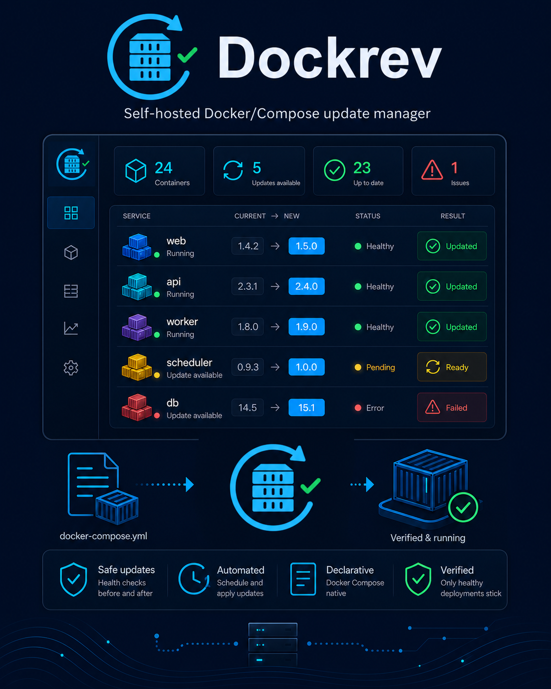

# Dockrev 品牌媒体主题与比例

> 当前有效规范以本文为准；实现覆盖与当前状态见 `./IMPLEMENTATION.md`，主题局部演进见 `./HISTORY.md`，持久决策的完整取舍见关联 ADR。

## 背景 / 问题陈述

- Dockrev 的海报与社交预览曾只有未标注主题的单一资源，海报也不满足所需的 4:5 比例。
- 亮色与暗色投放面需要可明确识别、可复现且尺寸正确的交付物。
- 若不建立主题和比例合同，后续资源容易只在文件名或调用方约定中隐含，导致主题遗漏或拉伸变形。

## 目标 / 非目标

### Goals

- 固定四个品牌媒体交付物：4:5 海报的亮色和暗色版本，以及 2:1 社交图的亮色和暗色版本。
- 让每个最终交付图都保留主题后缀，并由品牌生成脚本从受控源文件复制到公开目录。
- 保持现有无后缀海报资源为暗色海报的兼容副本，直至所有消费者迁移到显式主题文件名。

### Non-goals

- 不改变产品 UI、网站主题切换行为或社交元数据的选图策略。
- 不在本主题中新增宣传文案、品牌标识或产品功能。

## 范围（Scope）

### In scope

- `dockrev-product-poster-dark.png`：暗色 4:5 海报。
- `dockrev-product-poster-light.png`：亮色 4:5 海报。
- `dockrev-social-preview-dark.png`：暗色 2:1 社交图。
- `dockrev-social-preview-light.png`：亮色 2:1 社交图。
- 对应的生成源、公开复制文件和比例验证。

### Out of scope

- 主题切换时动态选择图片。
- 非营销用途的 favicon、应用图标和 UI 截图。

## Related ADRs

- None

## 需求（Requirements）

### MUST

- 四个目标文件均为 PNG，文件名包含明确的 `-dark` 或 `-light` 主题后缀。
- 海报的画布必须严格为 4:5，社交图的画布必须严格为 2:1。
- 每张图的主题必须能从完整画布的背景、文字和主色对比中辨识，不能仅通过文件名区分。
- 暗色海报必须保留既有 Dockrev 海报的品牌区、产品控制台、更新流程、能力栏和基础设施装饰；允许为满足 4:5 进行布局重排，不得删减这些设计元素。
- `docs/branding/generate_brand_assets.py` 的再生成不得拉伸最终交付图。

### SHOULD

- 最终交付物在 `docs/branding/generated/`、`web/public/` 和 `docs-site/docs/public/` 中保持相同像素内容。
- 图片生成提示词应记录在品牌资产说明中，以便后续主题版本保持一致的设计语言。

### COULD

- 在现有消费者完成显式主题迁移后，移除无主题后缀的兼容副本。

## 功能与行为规格（Functional/Behavior Spec）

### Core flows

1. 为一个主题生成或编辑受控的品牌媒体源文件。
2. 运行品牌资产生成脚本，将每张最终图按原始尺寸复制至公开目录。
3. 通过像素尺寸和视觉检查确认比例、主题和设计元素符合合同。

### Edge cases / errors

- 生成源尺寸不符合目标比例时，生成脚本必须失败，不得通过裁切或拉伸静默修正。
- 缺少任一已实现主题的源文件时，生成脚本必须提供明确的缺失文件错误。

## 接口契约（Interfaces & Contracts）

None。资源文件路径是内部构建产物，不新增运行时 API。

## 验收标准（Acceptance Criteria）

- Given 暗色海报源文件存在，When 运行品牌资产生成脚本，Then `dockrev-product-poster-dark.png` 在生成目录和两个公开目录均为严格 4:5，且没有拉伸或裁切品牌元素。

- Given 四个目标资源均已实现，When 对其执行尺寸检查和视觉检查，Then 两个海报均为 4:5、两个社交图均为 2:1，且每个亮/暗主题均可从图像内容辨识。

## 验收清单（Acceptance checklist）

- [x] 核心路径的长期行为已被明确描述。
- [x] 关键边界/错误场景已被覆盖。
- [x] 涉及的接口/契约已明确为 `None`。
- [x] 相关验收条件已经可以用于实现与 review 对齐。

## 非功能性验收 / 质量门槛（Quality Gates）

### Testing

- Unit tests: 品牌生成脚本的尺寸守卫。
- Integration tests: 运行生成脚本并检查公开副本的尺寸与字节一致性。
- E2E tests (if applicable): 不适用。

### UI / Storybook (if applicable)

- Stories to add/update: 不适用。
- Docs pages / state galleries to add/update: 品牌资产联系表。
- `play` / interaction coverage to add/update: 不适用。
- Visual regression baseline changes (if any): 品牌媒体联系表和主题海报的视觉基线。

### Quality checks

- Lint / typecheck / formatting: 运行 Python 编译检查和品牌资产生成脚本。

## Visual Evidence

## Related PRs

- None

## 风险 / 开放问题 / 假设（Risks, Open Questions, Assumptions）

- 风险：图像生成模型可能改变小字号 UI 文字或遗漏细节；最终交付前必须和既有海报做视觉比较。
- 需要决策的问题：无主题后缀的社交图在两种主题均交付后应默认指向哪一版本。
- 假设（需主人确认）：本次暗色海报是四资产合同中的第一项交付。

## 参考（References）

- `docs/branding/generate_brand_assets.py`
- `docs/branding/generated/prompts.md`
