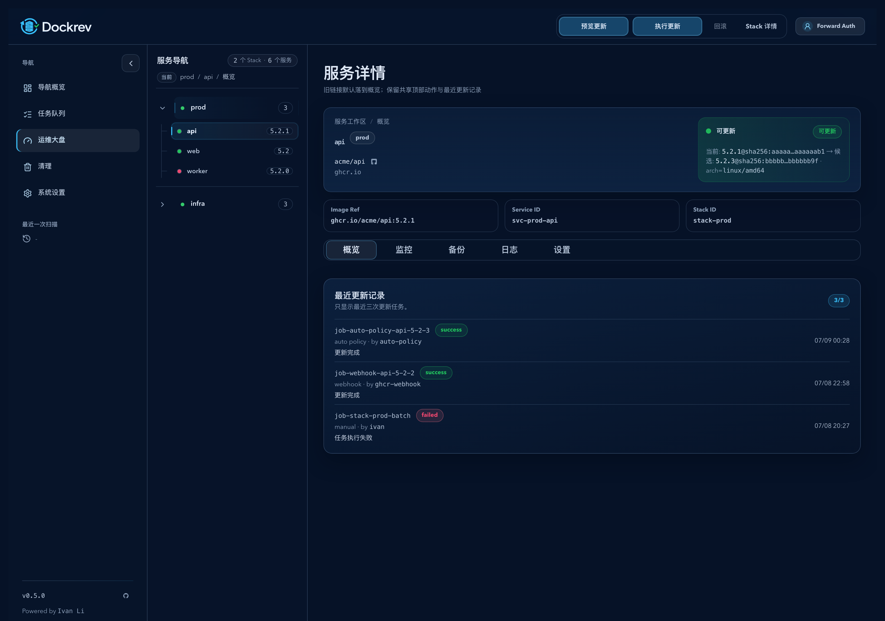
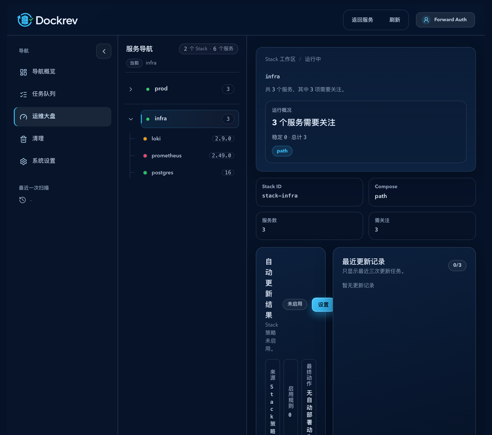
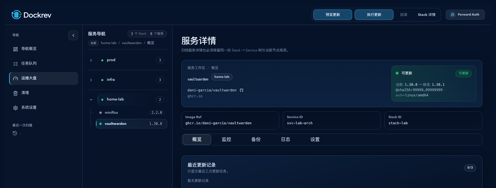
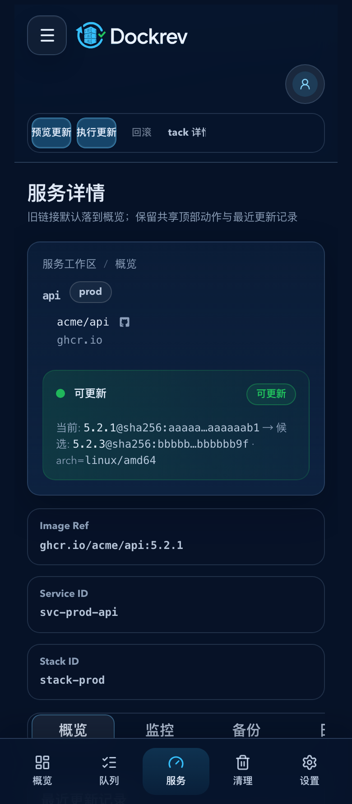
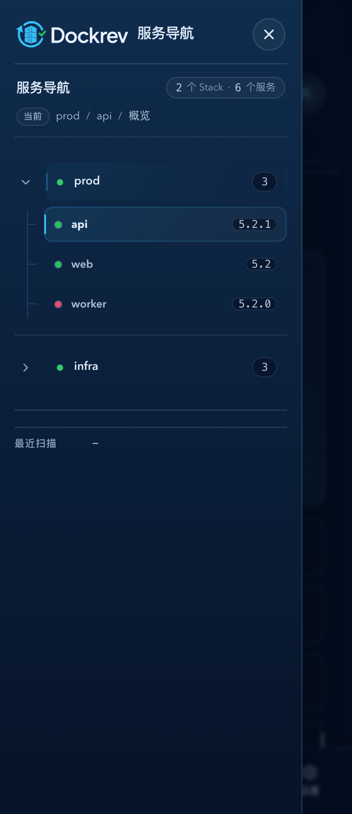

# Dockrev：详情页双侧栏与 Stack→Service 树导航（#c2r2u）

> 当前有效规范以本文为准；实现覆盖与当前状态见 `./IMPLEMENTATION.md`，关键演进原因见 `./HISTORY.md`。

## 背景 / 问题陈述

- 现有 `StackDetailPage` 与 `ServiceDetailPage` 虽然已经拆出 route-backed 子页，但详情页之间仍缺少稳定的跨 Stack / 跨 Service 直达导航。
- 操作者在多个服务或 Stack 之间来回跳转时，必须频繁返回 `/services` 总览，路径冗长，且上下文容易丢失。
- `ey4ar-service-detail-subpages` 已明确将“第二套侧栏导航”列为非目标，因此本次需要独立 spec 来定义新的详情页壳层与导航模型，避免污染原有信息架构拆页规范。

## 目标 / 非目标

### Goals

- 为 `StackDetailPage` 与全部 `ServiceDetailPage` 引入统一的详情页 Layout：桌面端为 `主导航 / 服务树侧栏 / 路由内容` 三列结构。
- 在现有主导航右侧增加 `Stack → Service` 树形导航，支持当前节点高亮、当前 Stack 默认展开、点击 Stack 标题进入 Stack 详情、点击 Service 叶子进入对应服务详情并保留当前 section。
- 移动端切换为 `底部主导航 + 服务树抽屉`，复用同一份树模型与高亮语义，避免正文首屏被挤压。
- 复用现有 Stack / Service 读模型与 Storybook 页级 stories，确保详情页壳层与导航在 mock-only 环境下可稳定验证并产出视觉证据。

### Non-goals

- 不重做 `/services` 总览页的信息架构或卡片分组逻辑。
- 不引入 `group -> stack -> service` 三层导航，也不把 `homepage.group` 提升为新的部署实体。
- 不改写服务详情内部业务模块的功能语义；`overview / monitoring / backup / logs / settings` 的职责边界继续由 `#ey4ar` 持有。
- 不新增后端导航专用 API；本次仅组合现有 `listStacks()` / `getStack()` 等读模型。

## 范围（Scope）

### In scope

- `web/src/Shell.tsx`
- `web/src/App.tsx`
- `web/src/App.css`
- `web/src/components/DetailRouteServiceTree.tsx`
- `web/src/pages/StackDetailPage.tsx`
- `web/src/pages/ServiceDetailPage.tsx`
- `web/src/pages/useServiceDetailPageState.tsx`
- `web/src/stories/mocks/PageHarness.tsx`
- `web/src/stories/pages/ServiceDetailPage.stories.tsx`
- `web/src/stories/pages/StackDetailPage.stories.tsx`
- 本 spec 目录及其视觉证据资产

### Out of scope

- Rust 服务端、任务调度、日志 / 监控 / 备份后端路径
- `/services` 首页与 Overview homepage 的整体 IA 调整
- Stack / Service 详情页内部业务卡片的权限模型或写操作合同

## 需求（Requirements）

### MUST

- `AppShell` 必须显式区分主导航、详情页服务树侧栏与移动端抽屉内容，不能继续把详情页导航塞进 Overview 专用 sidebar slot。
- 桌面端在 `StackDetailPage` 与 `ServiceDetailPage` 上必须显示 `主导航 / 服务树侧栏 / 主内容` 三段式布局，并保留现有主导航折叠能力。
- 服务树必须严格按 `Stack -> Service` 真实部署层级渲染，不得引入额外 `group` 层。
- 当前路由对应的 Stack / Service 节点必须高亮；首次进入详情页时仅当前 Stack 默认展开。
- 点击 Stack 标题必须进入对应 Stack 详情；展开按钮只能改变展开状态，不得替代跳转。
- 点击 Service 节点必须进入目标服务详情，并在当前已打开的 `section` 内保持同一分区语义。
- 移动端必须改为底部主导航，并通过顶部汉堡按钮打开“服务导航”抽屉；抽屉中的树结构、高亮与跳转语义必须与桌面一致。
- Overview 页现有 sidebar/mobile slot 行为不得回归。
- Storybook 必须至少提供 `ServiceDetailPage` 与 `StackDetailPage` 的稳定桌面 / 移动端入口，并覆盖服务树抽屉、路由高亮与 section 保留行为。

### SHOULD

- 服务树组件应只维护页面生命周期内的展开状态，不新增持久化存储。
- 详情页 hero、meta 与状态摘要应采用统一的详情工作区视觉语言，避免 Stack 与 Service 页面各自分裂。
- 服务树应在窄屏下优先展示信息密度与层级，不做装饰性噪音。

## 功能与行为规格（Functional/Behavior Spec）

### Core flows

- 用户进入 `StackDetailPage`：
  - 桌面端显示三列壳层。
  - 服务树默认展开当前 Stack，并高亮当前 Stack 节点。
  - 点击同侧栏中的 Service 可直接进入该 Stack 下对应服务详情。
- 用户进入 `ServiceDetailPage` 任一 section：
  - 桌面端显示三列壳层，当前 Stack 与当前 Service 高亮。
  - 点击同 Stack 内其他 Service 时，保留当前 section 语义，例如从 `logs` 切到同 Stack 其他服务的 `logs`。
  - 点击其他 Stack 标题时进入目标 Stack 详情。
- 用户在移动端进入详情页：
  - 底部主导航可直接切换主模块。
  - 顶部汉堡按钮打开“服务导航”抽屉。
  - 抽屉中点击 Service 后，关闭抽屉并跳转到目标详情页。

### Edge cases / errors

- 当 Stack 详情拉取失败但 `listStacks()` 成功时：
  - 服务树仍显示 Stack 节点。
  - 该 Stack 的 Service 列表允许为空，不阻断其他 Stack 的导航。
- 当当前路由不是 `stack` / `service` 详情页时：
  - 不渲染详情页服务树侧栏。
- 当服务树正在加载或为空时：
  - 详情页侧栏必须显示稳定的 loading / empty / error 状态，而不是留白。

## 验收标准（Acceptance Criteria）

- Given `StackDetailPage`
  When 在桌面端打开页面
  Then 页面显示 `主导航 / 服务树侧栏 / 主内容` 三列结构，且当前 Stack 默认展开并高亮。

- Given `ServiceDetailPage/logs`
  When 在服务树中点击同 Stack 的另一个 Service
  Then 跳转到目标服务的 `logs` section，且树中叶子高亮同步切换。

- Given 任一详情页移动端 story
  When 用户点击顶部汉堡按钮
  Then 打开“服务导航”抽屉，抽屉内显示与桌面一致的 `Stack -> Service` 树结构。

- Given Overview 页现有 stories
  When 渲染原有 sidebar/mobile 内容
  Then 旧 slot 行为保持稳定，不因详情页壳层扩展而回归。

## 非功能性验收 / 质量门槛（Quality Gates）

### Testing

- `bun run --cwd web lint`
- `bun run --cwd web build`
- `bun run --cwd web build-storybook`
- `bun run --cwd web test-storybook`

### UI / Storybook

- Stories to add/update:
  - `web/src/stories/pages/ServiceDetailPage.stories.tsx`
  - `web/src/stories/pages/StackDetailPage.stories.tsx`
- `play` / interaction coverage to add/update:
  - 服务树抽屉打开
  - 当前 Stack / Service 高亮
  - section 保留跳转
  - Stack 详情移动端导航

## Visual Evidence

- source_type: `storybook_canvas`
  target_program: `mock-only`
  capture_scope: `browser-viewport`
  requested_viewport: `1680x1180`
  viewport_strategy: `browser-resize-fallback`
  sensitive_exclusion: `N/A`
  submission_gate: `approved`
  story_id_or_title: `Pages/ServiceDetailPage/Overview Default`
  state: `desktop detail workspace`
  evidence_note: 验证服务详情页在桌面端启用三列壳层，当前 Stack / Service 高亮、服务树与 route-backed 分区页并存。
  PR: include
  PR caption: 服务详情页桌面端采用 `主导航 / 服务树 / 主内容` 三列壳层，并在当前服务节点保持高亮。

- source_type: `storybook_canvas`
  target_program: `mock-only`
  capture_scope: `browser-viewport`
  requested_viewport: `1100x980`
  viewport_strategy: `browser-resize-fallback`
  sensitive_exclusion: `N/A`
  submission_gate: `approved`
  story_id_or_title: `Pages/StackDetailPage/Policy Disabled`
  state: `narrow desktop stack workspace`
  evidence_note: 验证 Stack 详情页在 `961px - 1160px` 窄桌面断点仍保持 `主导航 / 服务树 / 主内容` 三列壳层，当前 Stack 默认展开，服务树可直接跨服务跳转。
  PR: include
  PR caption: Stack 详情页在窄桌面断点仍保持三列壳层，并默认展开当前 Stack。

- source_type: `storybook_canvas`
  target_program: `mock-only`
  capture_scope: `browser-viewport`
  requested_viewport: `1680x640`
  viewport_strategy: `clipped-from-1680x900`
  sensitive_exclusion: `N/A`
  submission_gate: `approved`
  story_id_or_title: `Pages/ServiceDetailPage/Archived Service Navigation`
  state: `archived detail route desktop`
  evidence_note: 验证归档服务详情仍复用同一份 `Stack -> Service` 树，当前 archived Stack / Service 节点保持可见与高亮。
  PR: omit

- source_type: `storybook_canvas`
  target_program: `mock-only`
  capture_scope: `browser-viewport`
  requested_viewport: `390x900`
  viewport_strategy: `browser-resize-fallback`
  sensitive_exclusion: `N/A`
  submission_gate: `approved`
  story_id_or_title: `Pages/ServiceDetailPage/Overview Default`
  state: `mobile detail shell`
  evidence_note: 验证移动端详情页切换为顶部汉堡 + 底部主导航，正文首屏不再被左侧服务树压缩。

- source_type: `storybook_canvas`
  target_program: `mock-only`
  capture_scope: `browser-viewport`
  requested_viewport: `390x900`
  viewport_strategy: `browser-resize-fallback`
  sensitive_exclusion: `N/A`
  submission_gate: `approved`
  story_id_or_title: `Pages/ServiceDetailPage/Overview Default`
  state: `mobile service drawer`
  evidence_note: 验证移动端通过“服务导航”抽屉复用同一份 `Stack -> Service` 树结构与高亮语义。
  PR: include
  PR caption: 移动端通过“服务导航”抽屉承载同一份 `Stack -> Service` 树结构。

