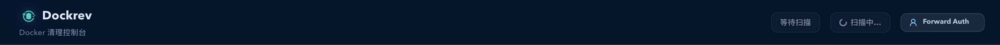
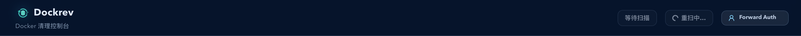
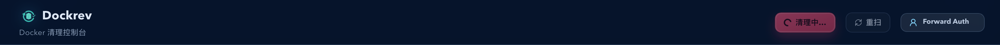

# Dockrev：Cleanup 顶部按钮 loading 态去重与语义收口（#d2u78)

## 状态

- Status: 已完成
- Created: 2026-04-11
- Last: 2026-04-11
- Notes: fast-track（PR #206 follow-up；cleanup top actions loading affordance + storybook evidence + web validation completed）

## 背景 / 问题陈述

- Cleanup 页给 `全部 / 重扫` 补上前导 icon 后，busy 态沿用了通用 `Button.loading` 包装。
- 结果是按钮进入 loading 时会同时出现 `spinner + 原动作 icon + 文本`，在扫描态里表现为两个左侧图标并列，视觉上像重复图标而不是明确的运行态。
- 首屏扫描或重新扫描时，`全部` 按钮仍保留带破坏性色彩的动作样式，容易让人误解为仍可立即执行。

## 目标 / 非目标

### Goals

- Cleanup 顶部按钮在扫描/清理中时必须切换到明确的状态文案，而不是保留原动作 icon。
- `重扫` 在初始扫描与再次扫描时都只显示一个 loading affordance，不再出现重复 icon。
- `全部` 在扫描中或提交清理中时切换到等待/运行文案，避免错误强化破坏性动作。
- Storybook 提供稳定的 `Scanning State`、`Rescanning State`、`Applying All State` 入口用于验收。

### Non-goals

- 不改 cleanup scan/apply 的后端协议。
- 不修改表格行级 `清理` 按钮。
- 不全局改造所有带 icon 的 `Button.loading` 语义。

## 范围（Scope）

### In scope

- `web/src/pages/CleanupPage.tsx` 顶部动作按钮的 loading / disabled copy 与 variant 收口。
- `web/src/stories/pages/CleanupPage.stories.tsx` 的 scanning / rescanning / applying-all 状态覆盖与 play 断言。
- `web/src/stories/mocks/dockrevMockApi/*` 的慢扫描 / 慢 apply mock 场景。
- 本 spec 的索引、状态与视觉证据。

### Out of scope

- 通用 `Button` 组件 API 变更。
- Cleanup 页面主体扫描卡片 / skeleton 结构重做。
- 其他页面按钮 loading affordance。

## 需求（Requirements）

### MUST

- 当 Cleanup 页处于初始扫描或重新扫描中时，`重扫` 按钮只能显示一个 loading affordance，并带 `扫描中… / 重扫中…` 文案。
- 当 Cleanup 页仍在等待扫描结果时，`全部` 按钮必须改为非动作性等待文案，不再显示垃圾桶 icon。
- 当 `全部` 正在提交 cleanup apply 请求时，按钮必须显示 `清理中…`，并隐藏原动作 icon。
- Storybook 必须提供稳定的 `Scanning State`、`Rescanning State`、`Applying All State` 三个状态回归入口。

### SHOULD

- 扫描中不可用的 `全部` 按钮应降为非危险视觉样式，避免误导。
- play 断言应显式校验 busy 文案与 `aria-busy`，避免后续回归时只剩图标结构检查。

## 验收标准（Acceptance Criteria）

- Given Cleanup 页首次进入并仍在扫描，When 顶部动作渲染，Then `全部` 显示等待扫描文案且无动作 icon，`重扫` 显示单一 loading affordance 与 `扫描中…`。
- Given Cleanup 页已加载完成，When 用户点击 `重扫`，Then 顶部动作切到 `等待扫描 / 重扫中…`，且不出现 `spinner + refresh icon` 双图标。
- Given 用户确认执行 `全部` 清理且 apply 请求仍在飞行中，When 顶部动作渲染，Then `全部` 显示 `清理中…` 且不出现 `spinner + trash icon` 双图标。
- Given 运行 `bun run --cwd web lint`、`bun run --cwd web build`、`bun run --cwd web build-storybook`、`bun run --cwd web test-storybook -- --url <leased-port>`，Then 全部通过。

## 质量门槛（Quality Gates）

- `bun run --cwd web lint`
- `bun run --cwd web build`
- `bun run --cwd web build-storybook`
- `bun run --cwd web test-storybook -- --url <leased-port>`

## 文档更新（Docs to Update）

- `docs/specs/README.md`
- `docs/specs/d2u78-cleanup-top-action-loading-clarity/SPEC.md`

## Visual Evidence

- source_type: `storybook_canvas`
  target_program: `mock-only`
  capture_scope: `element`
  sensitive_exclusion: `N/A`
  submission_gate: `pending-owner-approval`
  story_id_or_title: `Pages/CleanupPage/ScanningState`
  state: `initial scan pending top actions`
  evidence_note: 验证初始扫描时顶部动作不再保留垃圾桶 / 刷新原动作 icon；`全部` 切到 `等待扫描`，`重扫` 切到单一 loading affordance 的 `扫描中…`。

- source_type: `storybook_canvas`
  target_program: `mock-only`
  capture_scope: `element`
  sensitive_exclusion: `N/A`
  submission_gate: `pending-owner-approval`
  story_id_or_title: `Pages/CleanupPage/RescanningState`
  state: `manual rescan top actions`
  evidence_note: 验证重新扫描时顶部动作切到 `等待扫描 / 重扫中…`，`重扫` 只保留一个 loading affordance，不再出现 spinner + refresh icon 双图标。

- source_type: `storybook_canvas`
  target_program: `mock-only`
  capture_scope: `element`
  sensitive_exclusion: `N/A`
  submission_gate: `pending-owner-approval`
  story_id_or_title: `Pages/CleanupPage/ApplyingAllState`
  state: `cleanup apply request in flight`
  evidence_note: 验证 `全部` 提交 cleanup apply 后切到 `清理中…`，并隐藏垃圾桶原动作 icon，避免与通用 spinner 叠成双图标。

## 变更记录（Change log）

- 2026-04-11：创建 follow-up spec，聚焦 Cleanup 顶部 `全部 / 重扫` 在 scanning / applying 期间的 loading affordance 收口。
- 2026-04-11：完成 Cleanup 顶部动作文案与 busy affordance 收口：扫描中改为 `等待扫描 / 扫描中… / 重扫中…`，apply 中改为 `清理中…`，并补齐 Storybook `ScanningState` / `RescanningState` / `ApplyingAllState` 回归与视觉证据。
