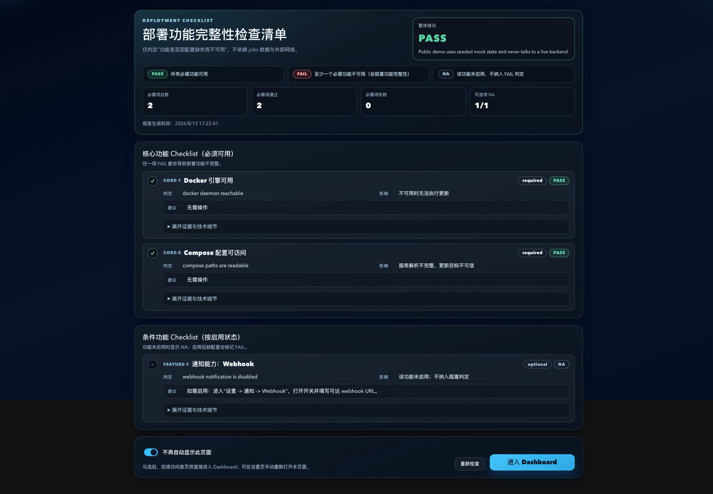
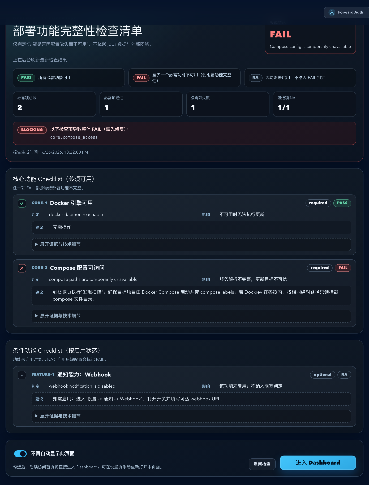
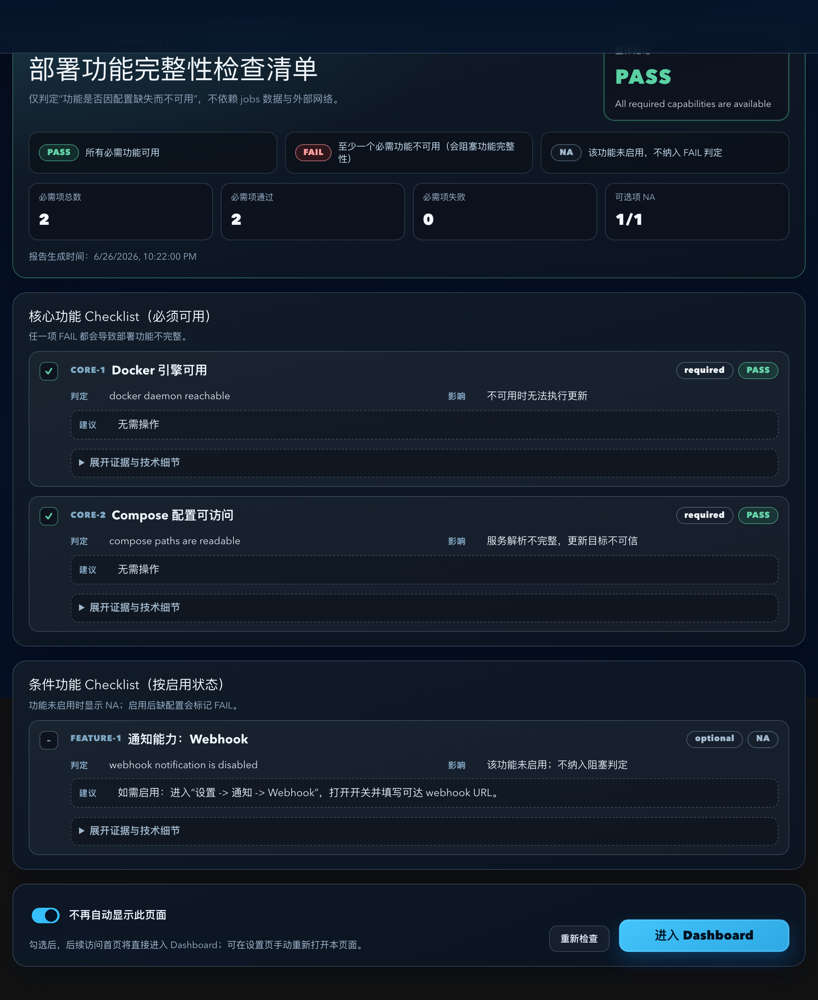
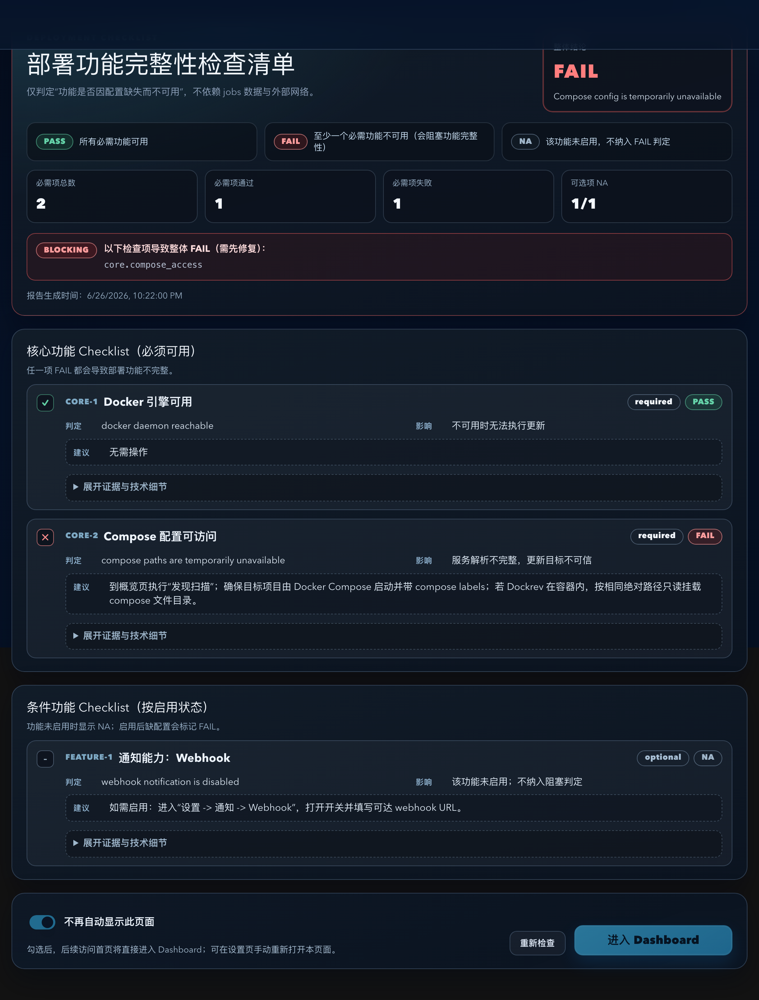
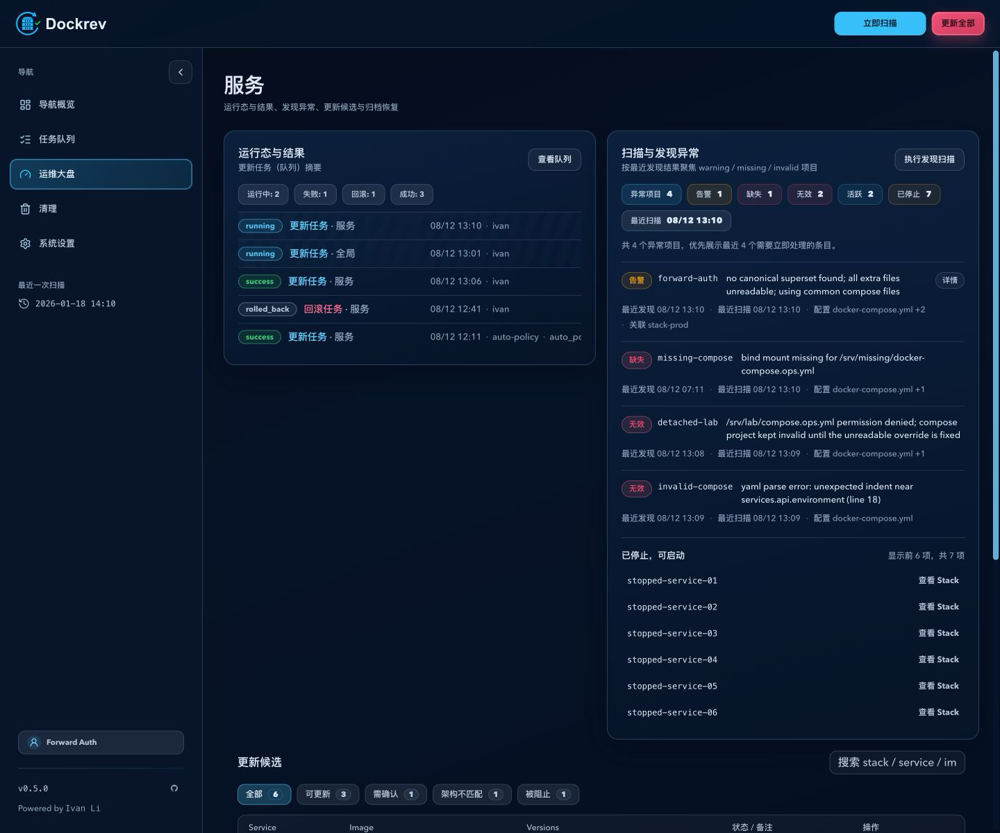
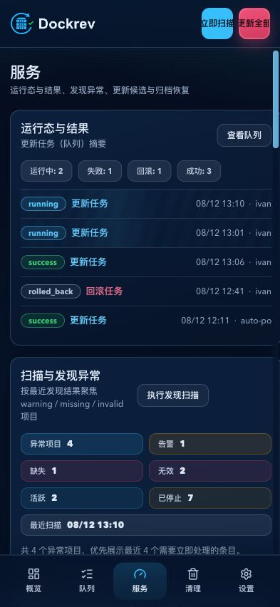
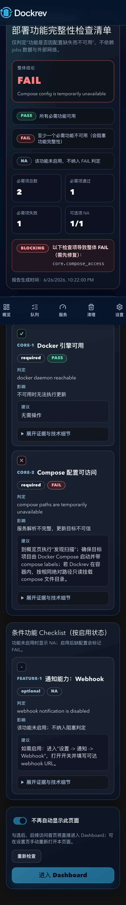

# Dockrev：EdgeOne Origin Timeout Hardening（#dh3i9）

## 状态

- Status: 进行中
- Created: 2026-06-26
- Last: 2026-06-26

## 背景 / 问题陈述

- EdgeOne 默认非 HTTP/2 origin-pull 的 HTTP 回源响应超时窗口是 15 秒；请求链路超过该窗口且中途无持续回包时，会在边缘侧落成 524/554。
- `/cleanup` 首屏当前会同步触发全局 aggressive scan，后端再串行跑大量 Docker CLI，是最容易复现 524 的页面入口。
- 现有 SSE heartbeat 也使用 15 秒间隔，存在与边缘 idle window 正面碰撞的风险。

## 目标 / 非目标

### Goals

- 所有 owner-facing HTTP 请求都不再依赖超过 15 秒的无字节等待。
- `/cleanup` 首屏改为 snapshot-backed 读路径，旧 snapshot 可先显示，后台异步刷新。
- cleanup confirm/apply 不再在请求链路里重扫 Docker，改为 fresh snapshot + fingerprint 校验。
- `/deploy-check` 改为 cached read + async refresh。
- 管理页面通过应用级 SSE 接收失效摘要，并以按实体 REST 读取恢复展示状态。
- Web release drawer 不再依赖 `/github-releases/locate`。
- 所有 SSE 路由统一改为 5 秒 heartbeat，并在连接建立时立即 flush 一次 keepalive comment。

### Non-goals

- 不把修复绑定在 EdgeOne 控制台配置变更上。
- 不在本轮引入通用后台任务框架。
- 不重写 cleanup ownership 归属算法。
- 不新增管理事件表、持久化消息队列，或管理页面 SSE 失败后的轮询降级。

## 兼容性 / 覆盖声明

- 本 spec 覆盖 [fmcxc-snapshot-scan-conservative-filter](/Users/ivan/.codex/worktrees/aeb5/dockrev/docs/specs/fmcxc-snapshot-scan-conservative-filter/SPEC.md) 中“live `/digest-tags` 不改动”的旧非目标；为消除 EdgeOne 长同步风险，本轮允许 live `/digest-tags` 退出 owner-facing 主路径。
- 本 spec 覆盖 [qynjg-docker-prune-cleanup-console/contracts/http-apis.md](/Users/ivan/.codex/worktrees/aeb5/dockrev/docs/specs/qynjg-docker-prune-cleanup-console/contracts/http-apis.md) 中“同步 cleanup scan”假设；cleanup 改为 snapshot-backed async contract。

## 需求

### MUST

- cleanup page request:
  - 有 cached snapshot 时立即返回 ready payload，并标记 `refreshing=true`。
  - 无 cached snapshot 时返回 pending，并给出 `retryAfterMs`。
- cleanup confirm request:
  - 只有当 latest snapshot 年龄 `<=300s`（5 分钟）且无 refresh in-flight 时，才返回 ready confirm payload。
  - 否则返回 pending；前端首个 confirm 请求使用 `refresh=true`，后续按 `retryAfterMs` 以 `refresh=false` 轮询，ready 后才允许确认。
  - confirm worker 已失败且不再运行时返回明确 API 错误，前端显示可重试状态，不得无限 pending。
- cleanup apply:
  - 禁止内联全量重扫。
  - 若 fingerprint 失效，继续返回 `409 cleanup_snapshot_stale + latest payload`。
- deploy-check:
  - GET `/api/deploy-check/report` 必须支持 cached report ready 返回与 pending 返回。
  - POST `/api/deploy-check/report/refresh` 只 enqueue，不同步构建 report。
  - 有缓存且 required core checks 全部 PASS 时，应用必须立即放行，并发起后台复核；复核失败前保留已通过的展示状态，只有新的确定 FAIL 才进入门禁。
  - 无缓存、缓存 FAIL 或 required core check 非 PASS 时仍必须安全阻断。
  - 启动后必须执行一次安全 discovery 扫描；Docker 枚举失败时不得写入 discovery、Stack 或归档状态。
  - 对未出现在运行容器列表中的已登记项目，保存的 Compose 文件全部可读且可解析时写入 `stopped`；全部为 `ENOENT` 时写入 `missing` 并以 `auto_archive_compose_files_missing` 自动归档；混合缺失、权限/I-O 或解析错误写入 `invalid` 且不归档。
  - 只有 `auto_archive_compose_files_missing` 与历史 `auto_archive_on_restart` 可由后续有效扫描解除。人工归档不得被 discovery 修改。该修复不得删除 Stack、服务、Compose 文件、容器或运行时资源。
- GitHub release drawer:
  - 打开时只请求 page 1。
  - 若指定 targetVersion，则以前端分页渐进加载定位并高亮，不依赖 `/locate`。
- SSE:
  - heartbeat 常量统一为 5 秒。
  - 连接建立时立即发一条 keepalive/comment。
  - `GET /api/events` 是管理页面唯一的通用 SSE 连接，沿用 Forward Auth 与同源凭据；未授权返回 `401`。
  - 每浏览器标签页最多一条通用连接。事件只包含 `domain`、实体类型/ID、版本和必要摘要；REST 仍是详情真相源。
  - 服务端在 `100ms` 窗口内按 `domain + entity type + entity id` 合并普通变化；任务终态、deploy-check 确定失败、cleanup 确定终态和 `resync_required` 立即发送。
  - 作业进度写入、有效 discovery 扫描完成、Discovery 人工归档/恢复、GHCR 配置/目标/仓库选择及 webhook 状态写入都必须发布领域失效摘要；页面据此读取 REST 快照，不在 SSE 内复制详情。
  - 历史仅保留进程内 `60s` 或 `1024` 条，以先到者为准；不写 SQLite。`Last-Event-ID` 仅能补发当前实例缓冲，实例世代变化、游标淘汰或无效游标必须发送 `resync_required`。
  - EventSource 自动重连后，页面先读取 REST 快照；后台标签页只累计失效实体，恢复前台再批量同步一次。不得使用定时轮询或轮询降级。
  - `GET /api/events/status` 提供连接数、重连、重同步、缓冲淘汰、事件合并与发布失败计数，供资源边界观测。

### SHOULD

- deploy-check 中本地命令 probe 采用并行执行。
- GitHub client 请求 timeout 收敛到 8 秒。
- deploy-check local command timeout 默认值收敛到 8 秒。

## 验收标准

- 访问 `/cleanup` 时，不再因为首屏同步 Docker scan 触发 524。
- cleanup confirm 在 snapshot stale 或 refresh in-flight 时只返回 pending，不直接给旧 confirm payload；过期只触发/等待新快照，绝不自动创建 cleanup job。
- `/deploy-check` 有 cached report 时可立即展示，refresh 不阻塞首屏。
- Given 一个未运行但保存 Compose 文件均健康的 discovery 项，When Dockrev 完成有效扫描，Then 项目与关联 Stack 必须保持未归档并显示 `stopped`，现有生命周期启动任务可执行。
- Given 一个保存 Compose 文件全部为 `ENOENT` 的 discovery 项，When Dockrev 完成有效扫描，Then 项目与关联 Stack 必须以 `auto_archive_compose_files_missing` 自动归档，失效路径不得阻断 deploy-check。
- Given 部分缺失、权限/I-O 或解析错误，When Dockrev 完成有效扫描，Then 项目必须显示 `invalid` 且保持未归档；人工归档在任何扫描结果下都不得解除。
- Given 有上次通过的 deploy-check report 且后台复核中，When 应用首次加载或恢复前台，Then 必须立即显示管理页面；只有复核得到新的 required core FAIL 才强制进入 `/deploy-check`，`neverAutoOpen` 不得绕过该失败门禁。
- Given `/api/events` 短暂断线，When EventSource 重连，Then 页面保留既有数据并提示陈旧，使用 `Last-Event-ID` 补发或 `resync_required` 后一次 REST 同步恢复；不得启动轮询。
- Given 服务或 Stack 变更，When 服务页在前台，Then 只读取事件涉及的 Stack/Service；后台标签页不得读详情，恢复时只执行一次批量同步。
- release drawer 在不调用 `/github-releases/locate` 的前提下仍可定位目标版本。
- 任一 SSE 连接在 EdgeOne 前方空闲超过 20 秒时，不会因 15 秒 idle window 被断开。
- 管理总线缓冲始终不超过 `60s`/`1024` 条，且不产生新的 SQLite 写入。

## Visual Evidence

- source_type: `ui_demo`
  target_program: `mock-only`
  capture_scope: `page`
  requested_viewport: `browser default`
  viewport_strategy: `ui-demo-source`
  margin_policy: `trim_only`
  evidence_surface: `page`
  sensitive_exclusion: `N/A`
  submission_gate: `owner-approved`
  evidence_binding_sha: `8909741219a80dd302c53ed095aec8fcd0e921f4`
  state: `cached passing report`
  evidence_note: 验证 cached PASS 立即显示部署检查页且“进入 Dashboard”可用；点击后进入 Dashboard。演示只使用本地 mock fixture，不访问线上服务。

PR: include

- source_type: `storybook_canvas`
  target_program: `mock-only`
  capture_scope: `element`
  requested_viewport: `1440x960`
  viewport_strategy: `devtools-emulate`
  sensitive_exclusion: `N/A`
  submission_gate: `pending-owner-approval`
  story_id_or_title: `Pages/CleanupPage/ScanningState`
  state: `snapshot pending on first page load`
  evidence_note: 验证 `/cleanup` 首屏无 ready snapshot 时只显示 pending shell，顶部动作保留 `全部 / 重扫` 短标签并以状态栏表达更新中，不再阻塞在同步全量扫描上。

- source_type: `storybook_canvas`
  target_program: `mock-only`
  capture_scope: `element`
  requested_viewport: `1440x960`
  viewport_strategy: `devtools-emulate`
  sensitive_exclusion: `N/A`
  submission_gate: `pending-owner-approval`
  story_id_or_title: `Pages/DeployWelcomePage/CachedReportRefreshing`
  state: `cached report visible while background refresh runs`
  evidence_note: 验证 `/deploy-check` 在已有 cached report 时直接展示 checklist，并额外标出“正在后台刷新最新检查结果…”，不再把 refresh 放进首屏阻塞链路。

- source_type: `storybook_canvas`
- target_program: `mock-only`
- capture_scope: `element`
- requested_viewport: `1440x900`
- viewport_strategy: `storybook-viewport`
- margin_policy: `trim_only`
- evidence_surface: `page`
- sensitive_exclusion: `N/A`
- submission_gate: `pending-owner-approval`
- story_id_or_title: `Pages/DeployWelcomePage/Default`
- state: `all required checks pass`
- evidence_note: 验证全部 required 核心检查通过时显示 PASS，且“进入 Dashboard”按钮可用。

- source_type: `storybook_canvas`
- target_program: `mock-only`
- capture_scope: `element`
- requested_viewport: `1440x900`
- viewport_strategy: `storybook-viewport`
- margin_policy: `trim_only`
- evidence_surface: `page`
- sensitive_exclusion: `N/A`
- submission_gate: `pending-owner-approval`
- story_id_or_title: `Pages/DeployWelcomePage/BlockedCoreFailure`
- state: `required core failure blocks Dashboard entry`
- evidence_note: 验证 required core FAIL 时进入 BLOCKING 门禁页，`neverAutoOpen` 仍不能绕过，Dashboard 入口保持禁用。

- source_type: `ui_demo`
- target_program: `mock-only`
- capture_scope: `page`
- requested_viewport: `1440x1200 CSS px`
- viewport_strategy: `devtools-emulate`
- margin_policy: `trim_only`
- evidence_surface: `page`
- sensitive_exclusion: `N/A`
- submission_gate: `pending-owner-approval`
- story_id_or_title: `Pages/ServicesPage/DiscoveryStopped`
- state: `overview-stopped`
- evidence_note: 验证停止项目独立显示在“已停止，可启动”区，最多展示 6 项并链接到既有 Stack 详情；停止项目不计入异常项目数。证据对应 mock-only `ui_demo`，不访问生产服务。

- source_type: `ui_demo`
- target_program: `mock-only`
- capture_scope: `page`
- requested_viewport: `393x852 CSS px`
- viewport_strategy: `devtools-emulate`
- margin_policy: `trim_only`
- evidence_surface: `page`
- sensitive_exclusion: `N/A`
- submission_gate: `pending-owner-approval`
- story_id_or_title: `Pages/ServicesPage/DiscoveryStopped`
- state: `overview-stopped-mobile`
- evidence_note: 验证移动端停止项目状态与桌面使用相同 mock fixture，393x852 下无横向溢出；语义与按钮路径保持可访问。

- source_type: `storybook_canvas`
- target_program: `mock-only`
- capture_scope: `element`
- requested_viewport: `393x852 CSS px`
- viewport_strategy: `storybook-viewport`
- margin_policy: `trim_only`
- evidence_surface: `page`
- sensitive_exclusion: `N/A`
- submission_gate: `pending-owner-approval`
- story_id_or_title: `Pages/DeployWelcomePage/BlockedCoreFailureMobile`
- state: `required core failure on mobile`
- evidence_note: 验证 `393x852` 移动视口下故障门禁、核心失败项和禁用 Dashboard 入口均不溢出或重叠。

## 变更记录

- 2026-06-26: 新建 spec，冻结 EdgeOne 15 秒约束、cleanup async snapshot、deploy-check cached-read、release drawer fallback 与 SSE heartbeat 口径。
- discovery 的停止、缺失与异常状态必须由保存 Compose 文件的有效扫描决定；系统归档可恢复，人工归档不可变更。
- cleanup mock pending/failed fixtures remain within the repository file budget while preserving the shared async snapshot contract.
