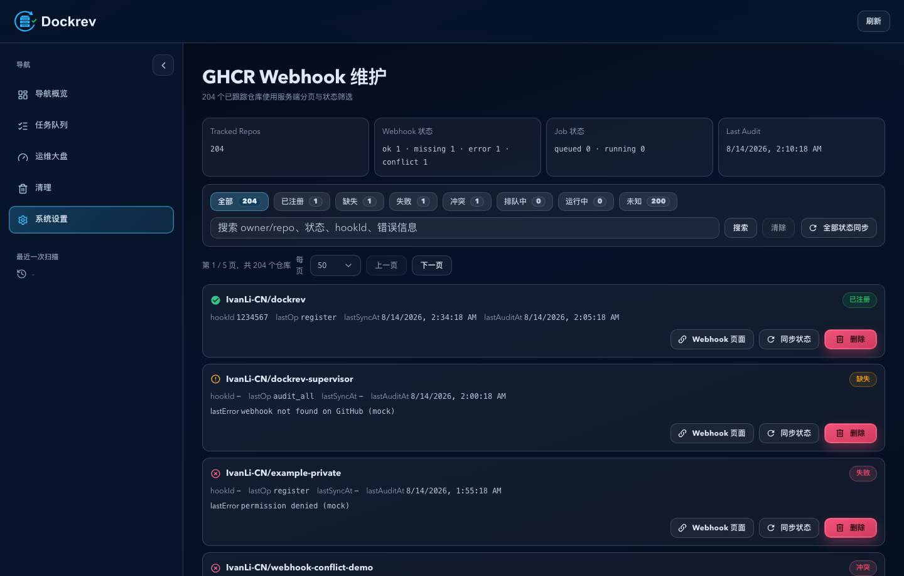
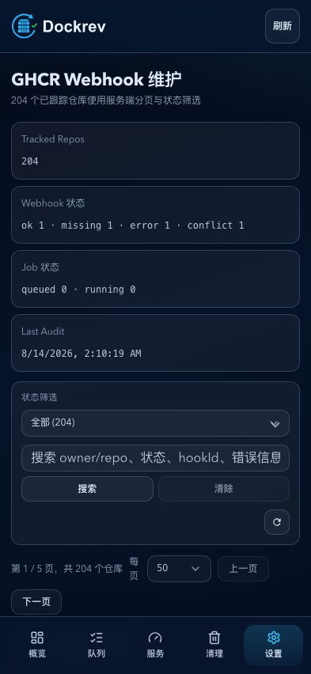

# Dockrev：GHCR Webhook 注册维护专页（Settings 预览 + 专页维护）（#dk4dd）

## 状态

- Status: 已实现，待 PR 收敛
- Lifecycle: active

## 背景 / 问题陈述

- GHCR Webhook 维护页曾通过多页聚合请求读取全部已跟踪仓库，并为全部结果创建 React 与 DOM 行。长期在 GHCR、队列和服务日志间切换时，短时间内产生的大量 Blink 节点会抬高 renderer 的内存高水位。
- 维护页需要保留既有的行级同步、重试注册、删除确认和链接行为，同时让列表、搜索与 SSE 刷新只处理用户正在查看的数据。
- Service Logs 的虚拟测量行缺少 TanStack Virtual 所要求的索引属性，会产生 `missing data-index` 控制台告警并削弱测量合同。

## 目标 / 非目标

### Goals

- 将 `GET /api/github-packages/repos` 扩展为服务端筛选分页：默认每页 50 条，可选 25、50、100 条。
- 增加可选 `webhookState` 查询参数，支持 `ok`、`missing`、`error`、`conflict`、`queued`、`running`、`unknown`；省略或 `all` 不筛选，非法值返回 400。
- 让 `q` 同时匹配 `owner/repo`、`webhook_state`、`hook_id` 与 `last_error`，并保证行结果和 `filteredTotal` 共享同一数据库条件。
- 维护页仅保存和渲染当前页；搜索、状态筛选和页大小变化回到第一页；刷新或删除导致页码越界时回退到最后有效页。
- GHCR 活跃任务仅分别查询 `queued` 与 `running`，每种状态最多读取最新 200 条；SSE 与轮询保持单飞，并防止旧响应覆盖新页面。
- 为 `ServiceLogsPanel` 测量行提供数值 `data-index`，并由 Storybook 覆盖大缓冲日志虚拟化场景。

### Non-goals

- 不新增 API 路由，不修改 GHCR worker、Webhook 操作语义、数据库 schema 或 PWA/service worker 生命周期。
- 不以虚拟列表替代仓库分页，也不重构全局任务队列 API。
- 不以单次任务管理器读数作为性能通过的唯一依据。

## 范围（Scope）

### In scope

- `crates/dockrev-api/src/api/github_packages.rs`
- `crates/dockrev-api/src/db/github_packages.rs`
- `crates/dockrev-api/src/api/tests/suite_14.rs`
- `web/src/api.ts`
- `web/src/pages/GhcrWebhookRegistryPage.tsx`
- `web/src/components/ServiceLogsPanel.tsx`
- `web/src/App.css`
- `web/src/stories/pages/GhcrWebhookRegistryPage.stories.tsx`
- `web/src/stories/pages/ServiceDetailPage.stories.tsx`
- `web/src/stories/mocks/dockrevMockApi/**`
- `docs/specs/dk4dd-ghcr-webhook-registry-maintenance/**`
- `docs/specs/README.md`

### Out of scope

- 新鉴权模型、多用户模型调整。
- `/queue/ghcr-webhooks` 的页面语义或历史任务列表策略。
- 设置页预览入口、删除的两步确认和 GHCR worker 最终一致性语义。

## 接口契约（Interfaces & Contracts）

### `GET /api/github-packages/repos`

- `selected` 保持可选布尔筛选。
- `webhookState` 为可选内部查询参数。值为省略、空字符串或 `all` 时不增加状态条件；允许值必须精确属于 `ok|missing|error|conflict|queued|running|unknown`，其余值返回 400。
- `q` 为大小写无关的部分匹配，覆盖完整仓库名（`owner/repo`）、`webhook_state`、文本化的 `hook_id` 与 `last_error`。
- `page` 从 1 起算；`perPage` 取值被限制在 1 至 200。响应中的 `filteredTotal` 与 `repos` 使用相同的 `selected`、`webhookState` 和 `q` 条件。
- `page` 和 `perPage` 继续出现在响应中，调用方以 `filteredTotal` 计算有效页数。

### 维护页刷新合同

- 页面请求仅携带当前的 `page`、`perPage`、状态筛选和搜索值；不得聚合全部分页结果。
- 概览始终由 Webhook overview 接口提供，仓库行由当前仓库页提供。
- 活跃 GHCR 任务只通过 `listJobsPage` 查询 `queued` 与 `running`，每个状态的 `limit` 为 200，类型为 `github_packages_webhook`、`github_packages_webhook_sync_all` 与 `github_packages_webhook_sync_repo`。
- 筛选、搜索、页大小改变会失效正在进行的旧刷新；后到的旧响应不得显示在新页面。收到 SSE 或轮询刷新时仍使用单飞队列。

### 日志虚拟化合同

- `ServiceLogsPanel` 中传给虚拟测量器的每个 `serviceLogRow` 都必须有等于 `item.index` 的数值 `data-index`。
- 日志缓冲大于视口时，渲染行数应小于日志总数；换行设置改变后仍可测量渲染行。

## 验收标准（Acceptance Criteria）

- 仓库 API 精确支持状态筛选；`all` 与省略保持兼容；非法状态返回 400；搜索覆盖四类字段；分页和 `filteredTotal` 共享条件且页大小上限生效。
- 204 条以上仓库的 Storybook 场景默认只显示 50 行，可切换 25、50、100；筛选、搜索和页大小改变重置页码，首尾页边界与越界回退正确，行级操作仍可用。
- 页面刷新只请求当前仓库页和有界的活跃 GHCR 任务；旧请求不能覆盖新页。
- 日志虚拟列表所有测量行具有有效索引，且没有 TanStack Virtual `missing data-index` 告警。
- `bun run --cwd web test`、`bun run --cwd web lint`、`bun run --cwd web build`、`cargo test -p dockrev-api` 通过。
- 在生产 PWA demo 中重复切换 GHCR、队列和服务日志后：GHCR DOM 行不超过 100；离开 GHCR 后 Blink 节点回到队列基线的两倍以内；预热后的 renderer footprint 低于 300 MB，十轮净增长不超过 100 MB 且无单调增长。
- 桌面和 393 x 852 移动布局中，分页、筛选、搜索和行级操作不重叠，最长文本不溢出。

## 风险 / 假设

- 数据库不新增索引；此列表的目标是有界渲染与请求，而不是对任意规模搜索建立新的索引策略。
- 删除请求成功后，仓库行仍以 worker 最终状态为准。若总数减少使当前页无效，客户端在下一次页响应中回退，而不做乐观移除。
- renderer footprint 会受 Chrome 进程隔离和缓存影响，因此以预热后的多轮趋势、DOM 计数和页面行数共同判断。

## Visual Evidence

PR: include

204 条仓库时，桌面首屏展示 50 行、页码为 1 / 5，筛选、搜索、页大小与行级操作保持在内容容器内。

PR: include

393 x 852 视口下，筛选、搜索与分页按窄屏布局换行，没有横向溢出。

