# Dockrev：服务详情页七子页信息架构升级（#ey4ar）

> 当前有效规范以本文为准；实现覆盖与当前状态见 `./IMPLEMENTATION.md`，关键演进原因见 `./HISTORY.md`。

## 背景 / 问题陈述

- 现有 `ServiceDetailPage` 把运行态摘要、资源监控、自动更新策略、Compose 信息、服务保护、忽略规则与 Webhook 说明堆叠在单一页面里，导致服务详情首屏信息密度过高。
- 该页面已经承载多个逐步独立演进的主题能力，但当前仍缺少稳定的二级信息架构与可直达的子页 URL，导致页面越来越“多、杂”。
- 服务级实时日志目前没有独立的“专注查看”空间，后续若继续塞回 `monitoring` 或聚合页，会再次引入首屏拥挤与高频滚动干扰。
- 如果不冻结这次拆分规范，后续继续往服务详情页新增功能时，会不断重复“首屏堆卡片”和“全量页面滚动”的旧模式。

## 目标 / 非目标

### Goals

- 将服务详情页拆成 route-backed 的 `概览 / 版本 / 更新记录 / 监控 / 备份 / 日志 / 设置` 七个子页，并保留旧 `/services/:stackId/:serviceId` 入口稳定落到默认 `概览`。
- 保留共享的服务上下文：标题、镜像/仓库信息、状态 banner、版本异常提示、全局 success/error 反馈，以及高频顶部动作。
- 将 `ServiceResourcePanel` 独占到 `监控` 子页，将服务级备份摘要、备份设置入口与当前服务相关备份记录集中到 `备份` 子页，将自动更新 / Compose / 服务保护 / 忽略规则 / Webhook / 低频危险动作集中到 `设置` 子页。
- 为服务详情新增 Dozzle 风格的 `日志` 子页，提供单服务 live tail、当前缓冲搜索、默认吸底、自动换行开关与跳到最新交互。
- 新增 `版本` 子页，直接以内联卡片展示统一 release notes 数据源，复用既有阅读视图语义、当前版本定位与版本动作安全边界。
- 新增 `更新记录` 子页，统一展示当前服务关联的 update/rollback 任务，提供客户端分页浏览，并在联网时实时同步状态。
- 在已有 Storybook 与 spec 流程下补齐七子页的稳定 stories、交互断言与 owner-facing 视觉证据。

### Non-goals

- 不修改后端 API、DB schema、SSE 语义、update/rollback job 模型或权限控制。
- 不把 `设置` 子页改造成纯页内编辑器；自动更新、Compose tag、服务保护继续沿用摘要卡片 + 抽屉编辑模式。
- 不增加侧栏级第二套服务详情子导航，也不为本次改造保留长期并行的旧聚合页。
- 不改写现有 feature specs（如自动更新、回滚、Compose tag、资源监控）的主题 owner；这些 spec 继续拥有各自功能契约。
- 不引入持久化日志索引、跨会话全文搜索、单容器 picker、日志下载或 `WebSocket/xterm.js` 终端模拟器。

## 范围（Scope）

### In scope

- `web/src/routes.ts`
- `web/src/App.tsx`
- `web/src/pages/ServiceDetailPage.tsx`
- `web/src/pages/useServiceDetailPageState.tsx`
- `web/src/stories/pages/ServiceDetailPage.stories.tsx`
- `web/src/stories/mocks/PageHarness.tsx`
- `web/src/App.css`
- `web/src/components/ServiceLogsPanel.tsx`
- `web/src/pages/useServiceLogsState.ts`
- `web/src/api.ts`
- `web/src/api/types.ts`
- `web/src/stories/mocks/dockrevMockApi/**`
- `crates/dockrev-api/src/api/services.rs`
- `crates/dockrev-api/src/api/types/service_logs.rs`
- `crates/dockrev-api/src/service_logs.rs`
- `crates/dockrev-api/src/state.rs`
- `crates/dockrev-api/src/main.rs`
- 本 spec 目录与其视觉证据资产
- 相关服务级备份记录 API 的前端消费契约

### Out of scope

- Rust 服务端、数据模型、任务调度或资源监控后端路径
- 服务列表、概览页、Stack 详情页的整体 IA 重构
- 非服务详情页的导航体系调整

## 需求（Requirements）

### MUST

- `Route.name === 'service'` 必须支持 `section?: 'overview' | 'versions' | 'history' | 'monitoring' | 'backup' | 'logs' | 'settings'`。
- `href()` 对 `section=undefined | overview` 必须输出旧 canonical URL `/services/:stackId/:serviceId`，不得生成新的 `/overview` canonical path。
- `parseRoute()` 必须接受旧路径，并把它解析为服务详情 `overview` 语义；对于 `/versions`、`/history`、`/monitoring`、`/backup`、`/logs` 与 `/settings` 需返回对应 section。
- 服务详情页顶部必须提供 route-backed tabs，标签固定为 `概览 / 版本 / 更新记录 / 监控 / 日志 / 备份 / 设置`。
- 服务详情内容区不得再渲染额外的 page-level 标题/说明块；tabs 上方的共享页头固定为两行：第一行是 `服务名 + 紧凑监控指标`，第二行是共享状态信息带。
- 第一行监控摘要必须复用现有服务监控样本，不新增接口口径；桌面端展示服务名与紧凑的 `CPU / 内存 / 磁盘读 / 磁盘写 / 下载 / 上传` 六项指标，其中后四项表达磁盘 I/O 与网络速率两对数据。各指标的可见前缀必须使用图标而不是文字 label；语义文案保留在无障碍标签中。监控关闭、离线缓存或暂无样本时用同一行回退表达，且不得再额外出现“服务监控摘要”这类解释性副标题，也不得保留独立的时间 / 状态 chip。窄屏或宽度不足以单行承载六项指标时，指标区必须切换为 `2 x 3` 网格，并按 `CPU / 内存`、`磁盘读 / 磁盘写`、`下载 / 上传` 两两成列配对。
- `预览更新 / 执行更新 / 回滚 / Stack 详情` 必须在各子页保持一致可达；`归档/恢复` 与 `阻止此服务更新` 必须从全局顶部动作下沉到 `设置` 页。
- 七个服务详情子页必须在 tabs 上方共用同一条紧凑状态信息带：只保留镜像/仓库简述、状态标题、当前版本、目标版本与 `newVersionDiscoveryCount` 映射出的“跨 N 个版本”；无候选时目标显示 `-`，计数缺失时显示“跨度未知”，且不得再重复服务名、Stack pill、digest、raw tag、架构、规则或原因等技术明细。桌面端优先保持单行，窄屏允许自然换行，但仍必须维持为同一条信息带，不得退回独立右侧状态卡或多张 header meta 卡。
- 同一服务存在 update 提交态、活动 update 或活动 rollback 时，共享状态信息带必须优先于静态候选状态，依次使用 `更新任务提交中 / 更新排队中 / 更新中 / 回滚排队中 / 回滚中` 表达真实阶段；活动态统一切换为主题信息色并显示加载图标，动画必须遵守 reduced-motion。状态信息带只负责展示，不得增加点击、链接或键盘导航语义，并继续保留当前版本、目标版本与版本跨度摘要。
- `Image Ref / Service ID / Stack ID` 不得继续出现在共享页头；它们只允许作为 `概览` 子页中的一张紧凑“服务标识”卡出现。
- `概览` 不得再出现资源监控卡、自动更新结果卡、Compose 信息卡或服务保护卡。
- `版本` 子页必须复用 `GET /api/services/{service_id}/release-notes` 的统一数据源与 Settings 固定 provider 语义；`provider=gitHub` 时只暴露 `original`，`provider=octoRill` 时复用 `original | translated | smart`，并改为页内卡片阅读而不是强依赖右侧抽屉。
- `版本` 子页页头必须把仓库、来源、当前版本与候选版本 chips 收敛为仓库级 Releases 图标入口：GitHub 图标固定打开 `https://github.com/<owner>/<repo>/releases`，OctoRill 图标仅在 release-notes 响应提供可信 `externalLinks.octoRillReleasesUrl` 时显示，并在新窗口打开对应地址。
- `版本` 子页首屏必须以当前部署版本为锚点；前端需先调用统一 `release-notes/locate`，只渲染后端返回的锚点窗口，并在命中后把该卡片滚动到视口中心。请求失败时，只允许继续展示当前浏览器会话内最近一次 `serviceId + provider` 同源成功窗口并标记 stale；若没有同源快照，则直接错误态。较新/更旧版本都改为通过 `cursor + direction` 双向续拉。
- `版本` 子页在 `>1100px` 时必须拆为左 `220px` 版本目录与右侧版本卡列表；目录与正文都必须保持虚拟化、共享同一分页数据源、独立滚动，并以右侧视口中心版本驱动目录高亮与跟随。目录项固定高度，展示版本号和发布时间：7 天内显示中文相对时间，更早显示 `YYYY-MM-DD`；点击目录项时，对应卡片必须滚动到正文视口中心。任一列表接近末尾时，都必须复用现有去重分页逻辑继续加载旧版本。
- `版本` 子页的 release card 正文超过 10 行时必须默认折叠，支持原地展开/收起，并继续保持虚拟列表稳定测量，不得因展开造成定位丢失或明显空白。
- `版本` 子页必须对比当前部署版本、candidate 与既有 rollback target，展示状态徽标与动作区。较新版本统一渲染动作位：普通服务继续使用 `更新`，且只有与当前 service candidate 对应且不突破现有 explicit target tag 契约的版本可真正发起更新；命中 Dockrev 自身识别时，candidate 对应卡片必须改为 `升级 Dockrev` 并复用顶部 supervisor 自我升级入口，其它更高版本只保留禁用动作位并明确解释“当前只能通过 supervisor 进入现有 candidate 对应的自我升级流程”。若 supervisor 自我升级入口本身处于 offline / checking / busy 等不可用状态，则所有 Dockrev 版本卡优先直接暴露该阻断原因，不再继续引导用户访问不可用入口。
- `版本` 子页对所有已部署过的历史版本统一渲染 `回滚` 动作位；只有当前 rollback target 对应版本执行真实回滚，其余版本点击后进入解释性提示，不得创建任务。
- 当当前 rollback target 的来源更新任务存在实际纳入的备份记录时，`版本` 子页的目标版本卡与服务级回滚确认都必须补充同一份“来源备份”摘要：显示 included targets 数量与源目标总体积；若 included targets 存在缺失体积，则总体积位置回退为 `--`；若没有实际纳入的备份记录，则不显示该状态块。
- `版本` 子页在同一服务已有 update/rollback 任务提交中、执行中，或 rollback target 刷新中时，必须锁定不属于当前活动任务的版本动作。普通服务的 candidate 目录 chip 与 candidate 卡更新按钮必须同步 update 阶段：提交时显示 `提交中` 且按钮不可点击，Job 建立后按状态显示 `排队中 / 更新中`，按钮保持加载态并可直接进入对应任务详情；顶部更新动作继续提供同一任务入口。版本页不得额外渲染独立的活动任务横幅或横幅式“查看任务”入口。
- `版本` 子页桌面端可执行卡片的右侧状态/动作栏必须固定为 `19rem` 轨道，避免因说明或按钮数量不同导致宽度漂移；无右栏卡片继续使用两栏布局。
- `版本` 子页宽屏必须使用多栏宽卡片；`≤1100px` 必须完全隐藏版本目录并切换为单列窄卡片，正文宽度保持正文阅读尺度且不产生横向滚动。
- 仅当 release tag 与当前部署版本都能 strict-semver 比较且 release 更旧时，版本卡片整体才允许置灰；状态徽标与动作提示不得因置灰失去辨识度。
- `更新记录` 必须通过 `GET /api/jobs?serviceId=<id>&type=update,rollback&limit=20` 的游标页读取当前服务关联的 `update` 与 `rollback` 任务；后端的任务-服务关联索引必须覆盖服务、Stack 和 all scope 的 summary targets，稳定排序为 `createdAt DESC, id DESC`。
- `更新记录` 必须使用记录、状态、备份、来源、时间、操作六列；记录列严格限制为两行：首行操作名与异常或回滚结果摘要，次行 Job ID，摘要必须单行截断，不得出现第三行。`备份` 列也必须固定为两行：首行显示本次实际纳入备份的目标数量，次行显示这些 included targets 的源目标总体积；当任务没有匹配的实际备份记录、匹配记录没有 included targets，或 included targets 存在缺失体积时，必须回退到中性空占位，不得误报“未备份”“失败”或“已跳过”。游标分页每页固定 20 条，提供页码状态与上一页/下一页箭头；服务变更时重置游标栈，SSE 只刷新当前服务的第一页。
- `更新记录` 激活且在线时必须复用全局 jobs SSE；事件 250ms 去抖刷新，连续三次错误后每 10 秒轮询、3 秒后重连，连接恢复立即停止轮询；切离 section 或卸载时清理订阅和计时器。
- `监控` 只承载资源监控面板及其原有空态/错态/SSE 状态，不得混入配置内容。
- `备份` 必须集中承载服务级备份摘要卡、备份设置抽屉入口，以及“当前服务相关”的备份记录卡片列表。
- `日志` 必须独占服务级实时日志面板，不得混入监控卡或配置卡。
- `日志` 必须通过 `GET /api/services/{service_id}/logs?tail=500` 提供最近缓冲 snapshot，并通过 `GET /api/services/{service_id}/logs/events?afterId=` 建立 SSE 增量续流；SSE 继续支持 `Last-Event-ID`、`Cache-Control: no-cache` 与 `X-Accel-Buffering: no`。
- `日志` 必须保留 ANSI 颜色渲染，同时维护 strip-ANSI 文本用于大小写不敏感的当前缓冲过滤搜索。
- `日志` 终端必须使用服务日志局部主题令牌；亮色主题提供不透明浅色终端、表头、行悬浮、时间、Human 正文、元数据、等级与 ANSI 前景色，Human 和 Raw 两种模式中的文字相对各自终端表面均至少达到 WCAG AA `4.5:1`，暗色主题继续保持既有终端语义。
- `日志` 必须在 `ServiceLogLine` 中保留 `ts/raw/plain`，并允许后端返回可选 `meta`：`format=json|logfmt|text`、应用级 `level`、应用时间戳、主消息、结构化 attributes 与重点字段列表。
- `日志` 默认展示 Human 视图：优先使用 `meta.message` 与应用级 `meta.level`，将 `component/event/route/phase/elapsed_ms` 等重点 attributes 渲染为紧凑元数据；缺少 `meta` 时回退到原有 ANSI/关键词推断。
- `日志` 必须提供 Human / Raw 显式切换；Raw 视图必须保留原始输出与 ANSI 分段渲染，Human 视图不得把长 metadata 截断到视口外。
- `日志` 首屏默认展示最近 `500` 行，会话缓冲上限为 `2000` 行；超出 ring buffer 的断线补偿必须通过 `service_log_reset` 触发前端重抓 snapshot。
- `日志` 必须支持默认吸底、用户上滚后暂停跟随、`跳到最新` 恢复吸底，以及查询非空时继续接收流但不自动跳底。
- `日志` 必须提供显式的自动换行开关；关闭时保留原始单行滚动查看，开启时在当前视口内折行，但两种模式都不得放弃虚拟列表渲染。
- `日志` 搜索必须覆盖 `plain/raw`、`meta.message` 与 `meta.attributes`，使操作者可按 `route`、`phase`、`event` 等结构化字段过滤当前缓冲。
- `设置` 不得再承载备份目标编辑入口；设置页中的“服务保护设置”只保留失败回滚与代码仓库配置。
- `设置` 必须集中承载自动更新摘要与抽屉、Compose 信息、部署 tag 编辑、服务保护、忽略规则、Webhook，以及下沉后的低频危险动作。
- Storybook 必须提供七子页稳定入口，并至少覆盖：旧链接默认概览、tabs active/order state、版本页锚点定位/虚拟渲染/宽窄卡布局/动作守卫、更新记录深链/混合排序/备份列命中与空占位/分页边界/更新日志定位/空态/行级跳转、备份页记录列表/空态、日志深链、设置抽屉入口或监控页稳定渲染，以及移动端更新记录与版本卡无横向滚动。

### SHOULD

- 共享数据继续由单一 `useServiceDetailPageState` 驱动，避免按子页重复请求 stack/service/settings 数据。
- 日志流状态应由独立 hook 管理，并通过有界缓冲避免无限堆积 DOM 与内存。
- 服务详情页的六子页应在移动端保持单列、无横向滚动，并确保 tabs 可稳定切换；更新记录窄屏改为两行网格，不产生横向滚动。
- 日志页应在桌面与移动端保持时间戳 / 正文两列的可读性，必要时在窄屏下收紧间距而不是回退到终端模拟器。
- 设置页中的动作分区应把低频危险动作与普通配置分开呈现。

### COULD

- 对 `/services/:stackId/:serviceId/overview` 提供兼容解析，但 `href()` 不主动生成该路径。

## 功能与行为规格（Functional/Behavior Spec）

### Core flows

- 用户访问旧服务详情 URL：
  - 仍进入同一服务详情页面。
  - 默认展示 `概览` 子页。
  - 页头 tabs 显示 `概览` 为 active。
- 用户访问 `.../monitoring`：
  - 共享 hero/banner/top actions 与普通服务详情一致。
  - 内容区只展示资源监控面板。
- 用户访问 `.../versions`：
  - 共享 hero/banner/top actions 与普通服务详情一致。
  - 内容区展示统一 release notes 版本卡片流；命中 locate 时当前版本首屏居中定位，未命中时回到最新窗口首屏并保留 warning banner。
  - 页头只保留 GitHub 与可选 OctoRill 两个仓库级 Releases 图标入口，不再重复展示版本 chips。
  - 宽屏使用 `220px` 左目录 + 右侧正文双虚拟列表；窄屏隐藏目录并保持单列卡片流。
  - 较新版本可见 `更新` 动作位，历史已部署版本可见 `回滚` 动作位，但真实可执行性继续服从现有 update/rollback 合同。
- 用户访问 `.../history`：
  - 共享 hero/banner/top actions 与普通服务详情一致。
  - 内容区展示当前服务的完整更新与回滚记录表；所有状态按最新时间排序，任务行可直接跳转任务详情。已回滚状态使用独立回滚视觉语义，当前可回滚目标的来源更新行显示受控回滚入口。
  - 在线时只在本 section 建立 jobs SSE；离线时只回放既有 60 秒 fresh snapshot 中的 jobs，不建立 SSE。
- 用户访问 `.../backup`：
  - 共享 hero/banner/top actions 与普通服务详情一致。
  - 内容区展示备份说明摘要、进入备份设置抽屉的入口，以及当前服务相关的备份记录卡片。
- 用户访问 `.../logs`：
  - 共享 hero/banner/top actions 与普通服务详情一致。
  - 内容区展示服务级日志 snapshot + SSE live tail、搜索框与吸底控制。
  - 状态条同时提供当前缓冲状态、虚拟渲染状态与自动换行开关。
  - 若用户未主动离开底部且查询为空，则新日志到达后自动保持在最新位置。
- 用户访问 `.../settings`：
  - 共享 hero/banner/top actions 与普通服务详情一致。
  - 内容区展示自动更新摘要、Compose 信息、tag 编辑入口、服务保护（仅回滚 + repoUrl）、忽略规则、Webhook 与危险动作。
- 用户点击页头 tabs：
  - 更新路由 section。
  - 不切换服务实体，不清空已有服务上下文。
  - `概览` tab 回退到旧 canonical path。

### Edge cases / errors

- 旧 bookmark、从服务列表/Stack 详情/概览跳来的 `navigate({ name: 'service', stackId, serviceId })` 调用必须继续可用，不要求调用点立即补 section。
- 若当前服务是 Dockrev 自身：
  - 顶部 `升级 Dockrev` 与 `版本` 子页 candidate 卡必须共用同一份 supervisor 自升级动作真相源。
  - supervisor offline 时，顶部入口与 candidate 卡同时禁用并显示一致 unavailable 语义；重试入口只保留在顶部动作区。
- 六子页结构仍然生效。
- 若服务当前没有日志输出：
  - `日志` 子页显示稳定空态而不是失败页。
  - 后续服务恢复输出时，日志流无需手动刷新即可恢复。
- 全局 success/error notice 仍由服务详情页底部统一承载，不因 section 切换丢失。

## 接口契约（Interfaces & Contracts）

### 接口清单（Inventory）

| 接口（Name） | 类型（Kind） | 范围（Scope） | 变更（Change） | 契约文档（Contract Doc） | 负责人（Owner） | 使用方（Consumers） | 备注（Notes） |
| --- | --- | --- | --- | --- | --- | --- | --- |
| `Route.name='service'` | frontend route union | internal | Modify | 本文 | web | App / pages / stories | 新增 `section` 路由语义 |
| `/services/:stackId/:serviceId[/<section>]` | frontend URL contract | external | Modify | 本文 | web | operators / bookmarks / internal links | `overview` canonical 仍为无 section 旧路径 |
| `ServiceDetailPage backup section` | frontend UI | internal | New | 本文 + `#sxcmc` | web | operators | 新增独立备份子页，承载摘要、入口与记录列表 |
| `GET /api/services/{service_id}/logs` | HTTP JSON API | internal | Add | 本文 | api | web logs page | 返回最近缓冲与 `lastEventId` |
| `GET /api/services/{service_id}/logs/events` | SSE API | internal | Add | 本文 | api | web logs page | 支持 `afterId` / `Last-Event-ID` / `service_log_reset` |

### 契约文档（按 Kind 拆分）

- `ServiceLogEventEnvelope`
  - `service_log_line`: 单条日志行，包含事件 ID、时间戳、原始文本与 strip-ANSI 文本。
  - `service_log_reset`: 表示前端应丢弃增量流状态并重新抓取 snapshot。
- `ServiceLogLine.meta`
  - `format`: `json | logfmt | text`
  - `level`: 应用日志级别，优先于 Docker stdout/stderr 外壳推断。
  - `timestamp`: 应用日志自身时间戳；列表时间列仍使用 Docker log timestamp。
  - `message`: Human 视图主文案。
  - `attributes`: 除 level/timestamp/message 外的结构化字段。
  - `highlights`: 前端优先展示的 attributes key 列表。

## 验收标准（Acceptance Criteria）

- Given 旧链接 `/services/stack-prod/svc-prod-api`
  When 打开服务详情
  Then 页面稳定进入 `概览` 子页，且 URL 无需追加 `/overview`。

- Given 服务详情页处于 `概览`
  When 用户切到 `监控`
  Then 保留相同服务上下文与顶部动作，内容区只显示资源监控面板。

- Given 服务详情页处于 `版本`
  When 当前 release list 能命中当前部署版本
  Then 当前版本卡片首屏滚动到视口中心，上方保留同一锚点窗口里的较新版本，下方按需继续通过 `direction=older` 加载较旧版本，且 DOM 只渲染可视窗口附近卡片。

- Given 服务详情页处于 `版本`
  When locate 返回 `outsideWindow | notFound | unavailable`
  Then 页面显示最新窗口首屏与 warning banner，且不会为了寻找当前版本继续自动线性翻页。

- Given 服务详情页处于 `版本`
  When 用户浏览较新版本或历史已部署版本
  Then 版本卡片会显示与当前服务关系相关的状态徽标、外链与动作区；update/rollback 的真实可执行性继续遵守既有显式 target tag 与 rollback target 合同。

- Given 任一服务详情子页
  When 页面展示共享页头
  Then tabs 上方必须先显示一条 `服务名 + 紧凑监控指标` 行，且桌面端包含 `CPU / 内存 / 磁盘读 / 磁盘写 / 下载 / 上传` 六个紧凑指标；窄屏时这些指标改为 `2 x 3` 网格，并按 `CPU / 内存`、`磁盘读 / 磁盘写`、`下载 / 上传` 成列配对；监控关闭、离线缓存或暂无样本时也必须保持为同一行而不是退回独立卡片。

- Given 任一服务详情子页
  When 页面展示共享状态摘要
  Then tabs 上方只显示一条共享状态信息带，且其内容只包含状态标题、当前版本、目标版本与版本跨度；不得再展示 digest、raw tag、架构、规则、原因、独立状态卡或 header meta cards。

- Given 当前服务正在提交或执行 update/rollback 任务
  When 用户查看任一服务详情子页
  Then 共享状态信息带优先显示对应提交、排队或执行阶段，使用主题信息色与 reduced-motion 兼容的加载图标，同时保持不可点击并保留当前版本、目标版本与跨度摘要。

- Given 普通服务的 update 已从 candidate 版本卡发起
  When 任务从提交态进入 queued/running
  Then candidate 目录 chip 与 candidate 卡按钮依次显示 `提交中 / 排队中 / 更新中`；提交态按钮不可点击，Job 建立后的加载按钮可直接进入对应任务详情，其他版本动作保持锁定，且版本内容区不出现独立活动任务横幅。

- Given 服务详情页处于 `概览`
  When 页面渲染完成
  Then 最近更新记录之后必须出现一张 `服务标识` 卡，完整承接 `Image Ref / Service ID / Stack ID`，且这些字段不再出现在其他子页的共享页头。

- Given 服务详情页处于 `版本`
  When 视口宽度大于 `1100px`
  Then 页面显示 `220px` 固定宽度的版本目录、GitHub/OctoRill 仓库级图标入口、固定 `19rem` 右侧动作栏，以及由正文中心版本驱动的目录高亮。

- Given 服务详情页处于 `版本`
  When 视口宽度为 `390x900`
  Then 版本目录不存在，卡片退化为单列阅读流，且页面不产生横向溢出。

- Given 当前服务命中 Dockrev 自身识别且服务详情页处于 `版本`
  When 页面同时展示 candidate 版本与更高的非 candidate 发布记录
  Then candidate 卡的主动作文案为 `升级 Dockrev`，点击后只进入 `/supervisor/` 自我升级入口而不会创建普通 service update 任务；更高但非 candidate 的卡片继续渲染禁用动作位，并明确说明当前只能通过 supervisor 进入现有 candidate 对应流程。

- Given 当前服务命中 Dockrev 自身识别且 supervisor offline
  When 用户查看 `版本` 子页与顶部动作区
  Then candidate 卡与顶部 `升级 Dockrev` 同时禁用并表达 offline 原因；其它更高的非 candidate 卡也优先表达同一 offline 阻断原因；只有顶部动作区保留 `重试` 入口。

- Given 服务详情页处于 `更新记录`
  When 当前服务关联 update、rollback、Stack scope 与 all scope 任务
  Then 统一表格只显示这些任务，按 `finishedAt ?? startedAt ?? createdAt` 倒序排列，不混入其他服务任务；行 click、Enter、Space 都进入对应 `/queue/:jobId`。若当前回滚目标的来源任务在表中且为成功更新，则仅该行显示回滚按钮，点击不会先触发行级跳转，并进入既有回滚确认。对存在实际备份记录的任务，`备份` 列显示 included targets 数量与源目标总体积；没有匹配记录时显示中性空占位。

- Given 服务详情页处于 `更新记录` 且在线
  When jobs SSE 发出事件或连续三次连接错误
  Then 事件按 250ms 去抖刷新；断线后按 10 秒轮询与 3 秒重连降级，并在重连成功或离开 section 时停止相关订阅与定时器。

- Given 服务详情页处于 `备份`
  When 用户查看页面主体
  Then 可看到备份说明摘要、编辑备份设置入口与备份记录卡片列表，且不再需要回到 `设置` 页寻找备份入口。
- Given 服务详情页处于 `日志`
  When 用户保持在列表底部且查询为空
  Then 新日志到达后页面持续吸底；若用户上滚，则停止吸底并显示 `跳到最新` 控件。

- Given 服务详情页处于 `日志`
  When 查询非空
  Then 只显示当前缓冲内匹配 strip-ANSI 文本的结果，日志流仍继续进入缓冲；清空查询后恢复完整时间流。

- Given 服务详情页处于 `日志`
  When 用户切换自动换行
  Then 页面在“原始单行横向滚动查看”和“当前视口内折行查看”之间切换，且两种模式都继续使用虚拟列表渲染。

- Given 服务详情页处于亮色主题的 `日志`
  When 用户查看 Human 或切换到 Raw
  Then 浅色终端表面、表头、时间、正文、元数据、等级与 ANSI 语义色均保持可读，且不会回退为暗色嵌入面。

- Given 服务详情页处于 `设置`
  When 用户查看页面主体
  Then 可看到自动更新摘要、Compose 信息、部署 tag、服务保护、忽略规则、Webhook 与危险动作，且不再看到最近更新记录卡，也不再看到备份目标编辑入口。

- Given 任一服务详情子页
  When 用户需要执行 `预览更新 / 执行更新 / 回滚 / Stack 详情`
  Then 无需先切回 `概览`，这些高频动作在当前子页即可直接触发。

- Given `GET /api/services/{service_id}/logs/events`
  When 断线后请求的 `afterId` 已超出 ring buffer
  Then 服务端发送 `service_log_reset`，前端随后重抓 snapshot 而不是静默丢日志。

- Given 服务详情 stories 已更新
  When 运行 Storybook interaction 回归
  Then 至少能验证旧链接默认概览、tabs active/顺序切换行为、更新记录深链/混合列表/备份摘要命中与空占位/空态/行级跳转、备份页与日志页的核心入口稳定可用、移动端更新记录无横向滚动，以及设置页或监控页稳定渲染。

## 验收清单（Acceptance checklist）

- [x] 核心路径的长期行为已被明确描述。
- [x] 关键边界/错误场景已被覆盖。
- [x] 涉及的接口/契约已写清楚或明确为 `None`。
- [x] 相关验收条件已经可以用于实现与 review 对齐。

## 非功能性验收 / 质量门槛（Quality Gates）

### Testing

- `cargo test -p dockrev-api`
- `bun run --cwd web test`
- `bun run --cwd web lint`
- `bun run --cwd web build`
- `bun run --cwd web build-storybook`
- `bun run --cwd web test-storybook`（若脚本可用）

### UI / Storybook (if applicable)

- Stories to add/update: `web/src/stories/pages/ServiceDetailPage.stories.tsx`
- Docs pages / state galleries to add/update: `none (reason: repo currently uses page stories/canvas coverage for this surface)`
- `play` / interaction coverage to add/update: tabs route switching 与顺序断言、旧链接默认概览、版本页活动 update 的共享信息带/candidate chip/可点击加载按钮/独立横幅移除、更新记录深链/混合列表/备份列命中与空占位/缺失体积回退/分页边界/更新日志定位/空态/click-Enter-Space 跳转/受控回滚入口、备份页记录卡渲染/空态、日志深链与搜索交互、日志自动换行/虚拟列表断言、亮色终端 Human/Raw ANSI 的计算对比度、移动端更新记录无横向滚动、设置抽屉入口、监控页稳定渲染
- Visual regression baseline changes (if any): 服务详情七子页 mock-only 视觉证据（含 `ui_demo` 版本页桌面/移动端）

### Quality checks

- Lint / typecheck / formatting: API 测试、前端 lint/build 与 Storybook 构建/交互检查必须通过

## Visual Evidence

- source_type: `storybook_canvas`
  target_program: `mock-only`
  capture_scope: `browser-viewport`
  requested_viewport: `1600x1200`
  viewport_strategy: `controlled-viewport`
  sensitive_exclusion: `N/A`
  submission_gate: `approved`
  story_id_or_title: `Pages/ServiceDetailPage/VersionsSection`
  state: `service versions locate-first anchor window`
  evidence_note: `标准桌面 `1600x1200` 页面级视图直接验证服务详情 `版本` 子页首屏落在当前部署版本附近窗口；当前版本卡片被置于视口中心，列表保持虚拟渲染，不再为了定位目标版本自动线性翻页。`
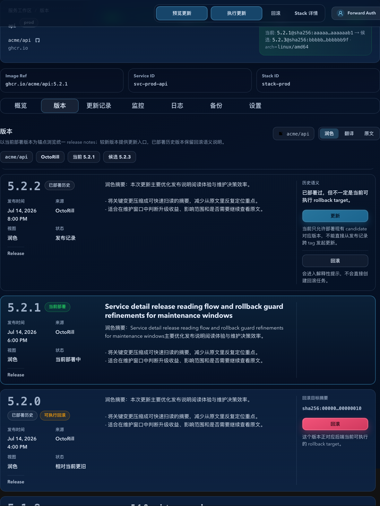

- source_type: `storybook_canvas`
  target_program: `mock-only`
  capture_scope: `browser-viewport`
  requested_viewport: `1600x1200`
  viewport_strategy: `controlled-viewport`
  sensitive_exclusion: `N/A`
  submission_gate: `approved`
  story_id_or_title: `Pages/ServiceDetailPage/UpdateHistorySection`
  state: `history deep link with backup summary column`
  evidence_note: 标准桌面 `1600x1200` 页面级视图验证 `/history` 深链、重排后的 tabs 顺序，以及新增 `备份` 列在桌面六列表格中的落位。带实际备份记录的行显示 `2 个目标 / 17.6 MiB`，无匹配记录的行保持中性空占位；活动 Tab 已表达当前 section，内容区不重复标题、说明或记录数量。更新记录仅保留外层 section card，表格不再使用嵌套圆角容器。当前 Storybook 未配置桌面 viewport preset，故以受控视口模拟采集。

- source_type: `ui_demo`
  target_program: `mock-only`
  capture_scope: `browser-viewport`
  requested_viewport: `1600x1000`
  viewport_strategy: `controlled-viewport`
  sensitive_exclusion: `N/A`
  submission_gate: `approved`
  story_id_or_title: `demo:app / /demo/services/stack-prod/svc-prod-api/versions?demoScenario=dashboard-demo-hydrated-update`
  state: `desktop active update progress synchronization`
  evidence_note: `mock-only ui_demo` 桌面截图验证活动更新优先接管共享状态信息带，信息带使用主题蓝色与加载图标并保留当前版本、目标版本和跨度；左侧候选目录同步显示 `更新中`，候选卡按钮保留加载反馈与任务详情入口，同时页面中不再出现独立活动任务横幅。
  PR: include
  PR caption: 活动更新统一显示在共享蓝色状态信息带，并同步候选目录与候选卡任务入口。

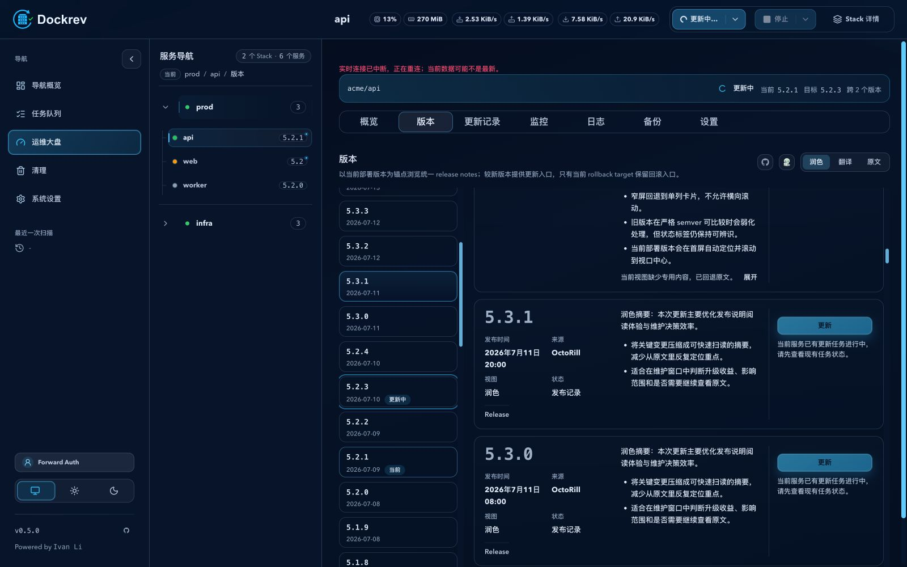

- source_type: `ui_demo`
  target_program: `mock-only`
  capture_scope: `browser-viewport`
  requested_viewport: `390x900`
  viewport_strategy: `controlled-viewport`
  sensitive_exclusion: `N/A`
  submission_gate: `approved`
  story_id_or_title: `demo:app / /demo/services/stack-prod/svc-prod-api/versions?demoScenario=dashboard-demo-hydrated-update`
  state: `mobile active update status rail`
  evidence_note: `mock-only ui_demo` 移动端截图验证共享蓝色状态信息带在 `390x900` 下完整展示 `更新中`、当前版本、目标版本与跨度，加载图标和单列页面均无横向溢出；桌面候选目录在该断点按合同隐藏，页面中没有独立活动任务横幅。
  PR: include
  PR caption: 移动端更新中状态收敛到共享信息带，并保持无横向溢出。

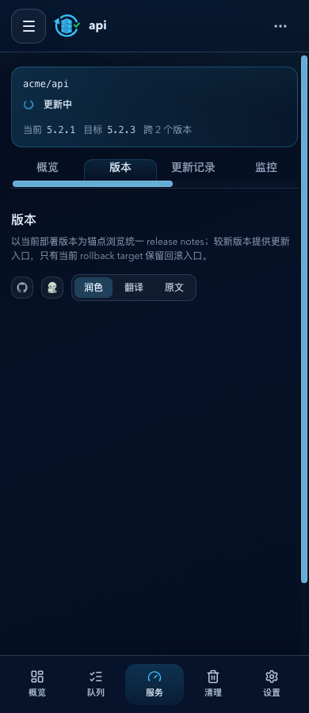

## Visual Evidence (PR)

- final_set: `release-notes-locate`
  story_id_or_title: `Pages/ServiceDetailPage/VersionsSection`
  state: `service versions locate-first anchor window`
  evidence_note: `最终 PR 采用的版本页证据。桌面宽卡首屏直接落在当前部署版本附近的锚点窗口，当前卡保留与可操作版本卡一致的固定 third rail；列表保持虚拟渲染，不再为了定位目标版本自动线性翻页。`

- source_type: `storybook_canvas`
  target_program: `mock-only`
  capture_scope: `element`
  requested_viewport: `1440x1400`
  viewport_strategy: `controlled-viewport`
  sensitive_exclusion: `N/A`
  submission_gate: `approved`
  story_id_or_title: `Pages/ServiceDetailPage/UpdateHistorySection`
  state: `desktop tabs reordered for service detail`
  evidence_note: 聚焦顶部 route-backed tabs，只证明本次要求的顺序已经固定为 `概览 / 更新记录 / 监控 / 日志 / 备份 / 设置`，且 `更新记录` 保持激活态。
  PR: include
  PR caption: 服务详情顶部 tabs 已按 `概览 / 更新记录 / 监控 / 日志 / 备份 / 设置` 重排。

- source_type: `storybook_canvas`
  target_program: `mock-only`
  capture_scope: `element`
  requested_viewport: `1440x1400`
  viewport_strategy: `controlled-viewport`
  sensitive_exclusion: `N/A`
  submission_gate: `approved`
  story_id_or_title: `Pages/ServiceDetailPage/UpdateHistorySection`
  state: `desktop backup summary column with ready and empty rows`
  evidence_note: 聚焦更新记录表本体，直接证明表头为 `记录 / 状态 / 备份 / 来源 / 时间 / 操作`，并同时包含一条实际备份摘要行 `2 个目标 / 17.6 MiB` 与多条空占位行 `-- / --`。
  PR: include
  PR caption: 更新记录表新增备份列，并同时覆盖有值摘要与空占位。

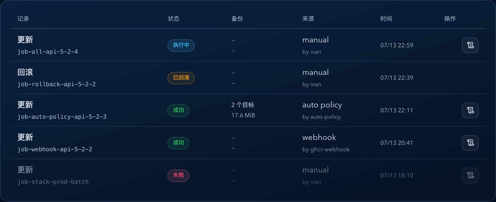

- source_type: `storybook_canvas`
  target_program: `mock-only`
  capture_scope: `browser-viewport`
  requested_viewport: `2048x1221`
  viewport_strategy: `controlled-viewport`
  sensitive_exclusion: `N/A`
  submission_gate: `approved`
  story_id_or_title: `Pages/ServiceDetailPage/UpdateHistorySectionEvidence`
  state: `desktop update history columns stay aligned with rollback action`
  evidence_note: 页面级截图直接验证桌面端 `记录 / 状态 / 备份 / 来源 / 时间 / 操作` 六列在带回滚按钮的行上仍与其它行共享同一套列轨道；`回滚` 按钮出现时不会把其它列压窄，也不会让表头和下方记录错位。
  PR: include
  PR caption: 更新记录桌面六列表格在出现回滚按钮时仍保持列对齐。

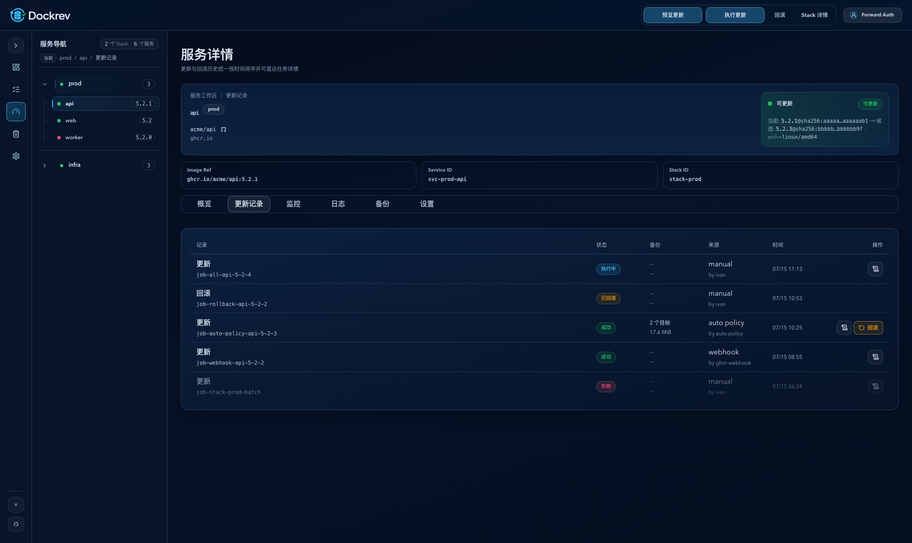

- source_type: `storybook_canvas`
  target_program: `mock-only`
  capture_scope: `browser-viewport`
  requested_viewport: `1440x1200`
  viewport_strategy: `devtools-emulate`
  sensitive_exclusion: `N/A`
  submission_gate: `approved`
  story_id_or_title: `Pages/ServiceDetailPage/OverviewDefault`
  state: `legacy route -> overview with compact monitor row + deduplicated status rail`
  evidence_note: 验证旧 `/services/:stackId/:serviceId` 路径仍稳定落到概览子页；tabs 上方的共享页头现为两行：第一行展示服务名与 `CPU / 内存 / 磁盘读 / 磁盘写 / 下载 / 上传` 六项监控指标，并已将文字 label 收敛为图标前缀，不再出现“服务监控摘要”副标题或独立时间 chip；第二行只保留镜像简述与 `状态 / 当前版本 / 目标版本 / 版本跨度`，不再重复服务名或 Stack pill。`Image Ref / Service ID / Stack ID` 继续只在概览底部的 `服务标识` 卡出现。
  PR: include
  PR caption: 服务详情页头收敛为服务名监控行 + 去重后的状态信息带，技术标识字段继续由概览页单独承接。

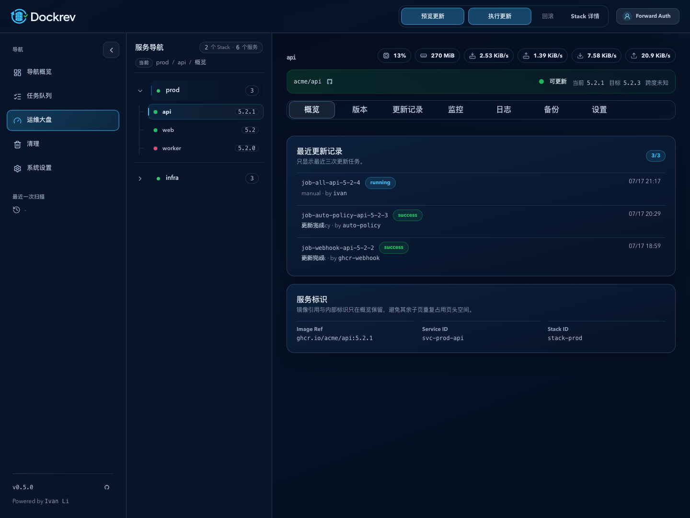

- source_type: `storybook_canvas`
  target_program: `mock-only`
  capture_scope: `element`
  requested_viewport: `1440x1200`
  viewport_strategy: `devtools-emulate`
  sensitive_exclusion: `N/A`
  submission_gate: `approved`
  story_id_or_title: `Pages/ServiceDetailPage/MonitoringSection`
  state: `monitoring deep link`
  evidence_note: 验证 `监控` 子页通过独立 section 深链承载资源监控面板，保留共享 hero/banner/top actions，同时不混入配置卡片。
  PR: include
  PR caption: 监控子页独占资源监控面板，复用同一服务上下文与顶部动作。

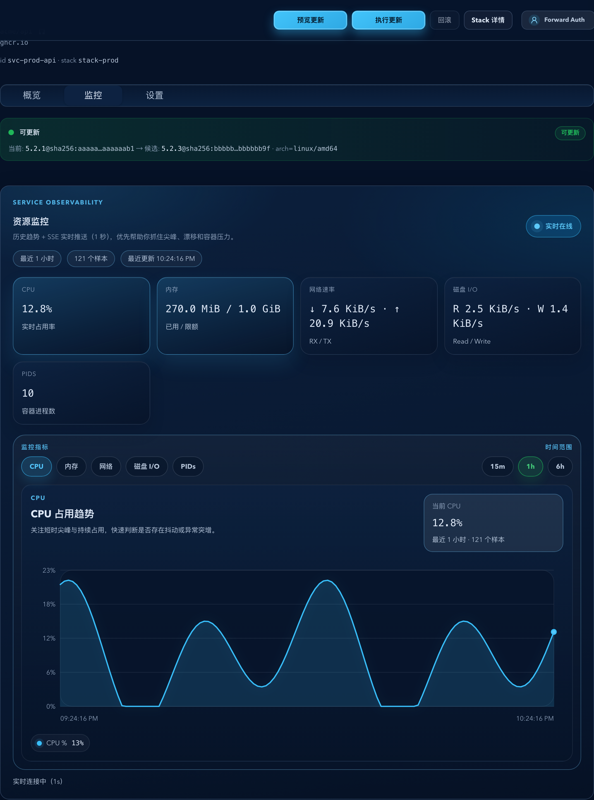

- source_type: `storybook_canvas`
  target_program: `mock-only`
  capture_scope: `browser-viewport`
  requested_viewport: `1440x1200`
  viewport_strategy: `devtools-emulate`
  sensitive_exclusion: `N/A`
  submission_gate: `approved`
  story_id_or_title: `Pages/ServiceDetailPage/LogsSection`
  state: `logs deep link`
  evidence_note: 验证 `日志` 子页通过独立 section 深链承载单服务 live tail、当前缓冲搜索、ANSI 颜色渲染、虚拟列表状态与自动换行开关，且不再把实时日志塞回 `monitoring` 卡片区。
  PR: include
  PR caption: 日志子页新增服务级实时日志视图，支持缓冲搜索与跳到最新。

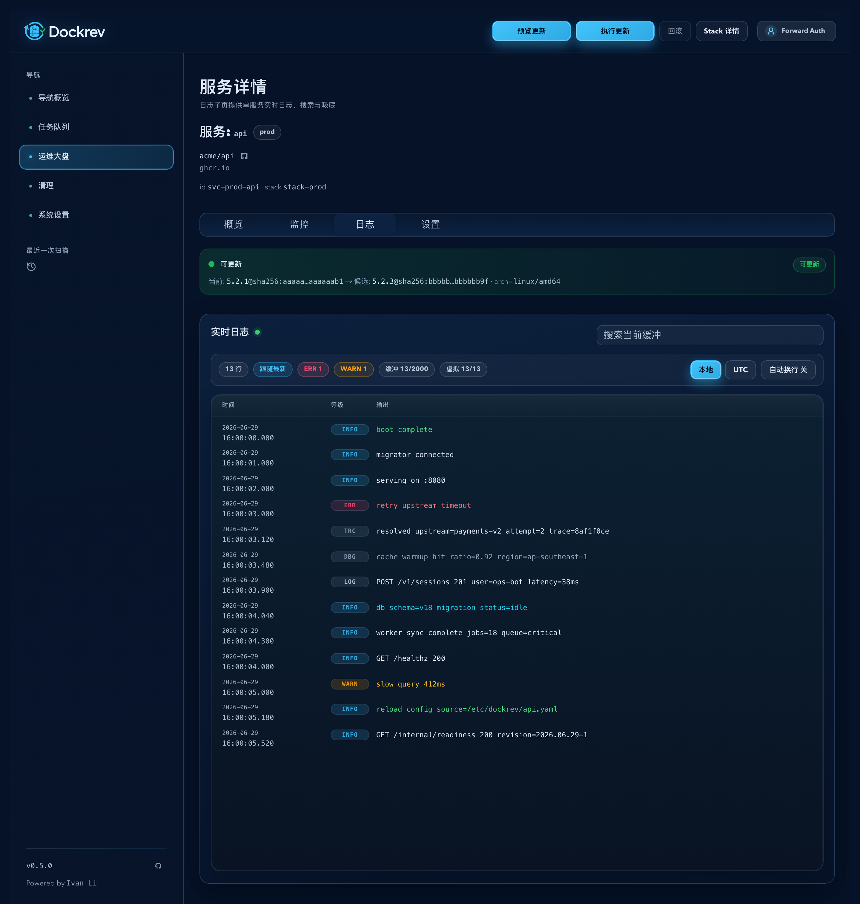

- source_type: `storybook_canvas`
  target_program: `mock-only`
  capture_scope: `element`
  requested_viewport: `1440x1000`
  viewport_strategy: `storybook-canvas`
  sensitive_exclusion: `N/A`
  submission_gate: `approved`
  story_id_or_title: `Pages/ServiceDetailPage/LogsSectionEvidence`
  state: `human structured metadata`
  evidence_note: 验证日志页默认 Human 视图优先使用应用级 JSON metadata 渲染主消息、`INFO` 等级与 `component/event/route/phase/elapsed_ms` chips，metadata 在默认 nowrap 下仍保持视口内可读。
  PR: include
  PR caption: 日志页默认 Human 视图展示结构化消息与元数据，避免把 JSON 原文直接铺满界面。

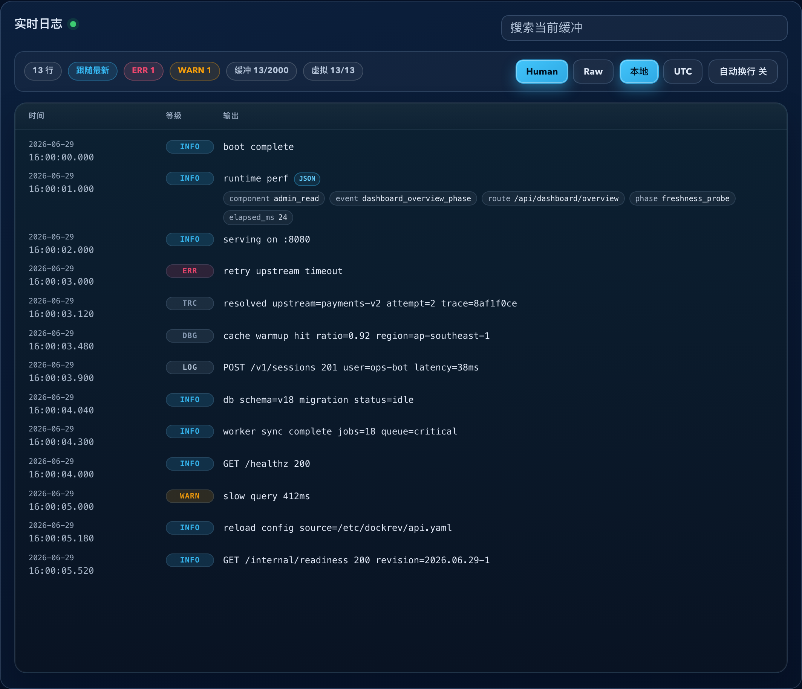

- source_type: `storybook_canvas`
  target_program: `mock-only`
  capture_scope: `element`
  requested_viewport: `1440x1000`
  viewport_strategy: `storybook-canvas`
  sensitive_exclusion: `N/A`
  submission_gate: `approved`
  story_id_or_title: `Pages/ServiceDetailPage/LogsSectionEvidence`
  state: `human tracing text metadata`
  evidence_note: 验证 ANSI tracing 文本日志在 Human 视图中提取应用级 `INFO`、应用时间戳与 `method/uri/proxy_request_id` metadata chips，消息列不再重复显示行首应用时间与等级。
  PR: include
  PR caption: 日志页 Human 视图可解析真实 tracing 文本日志，等级与元数据不再退回到整行文本展示。

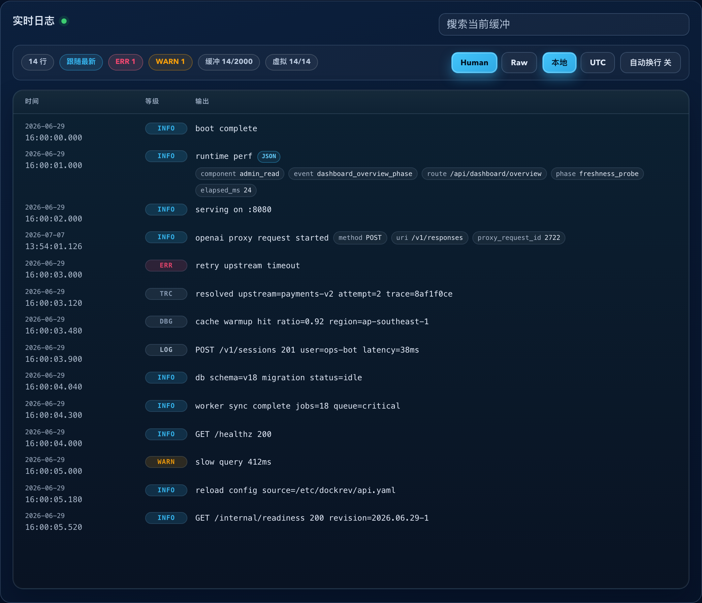

- source_type: `storybook_canvas`
  target_program: `mock-only`
  capture_scope: `element`
  requested_viewport: `1440x1000`
  viewport_strategy: `storybook-canvas`
  sensitive_exclusion: `N/A`
  submission_gate: `approved`
  story_id_or_title: `Pages/ServiceDetailPage/LogsSectionEvidence`
  state: `raw log toggle`
  evidence_note: 验证 Raw 视图可显式切回容器原始输出，JSON 行按原文显示并继续保留 ANSI 颜色与横向查看语义。
  PR: include
  PR caption: 日志页 Raw 视图保留原始日志文本，便于排障时对照结构化摘要。

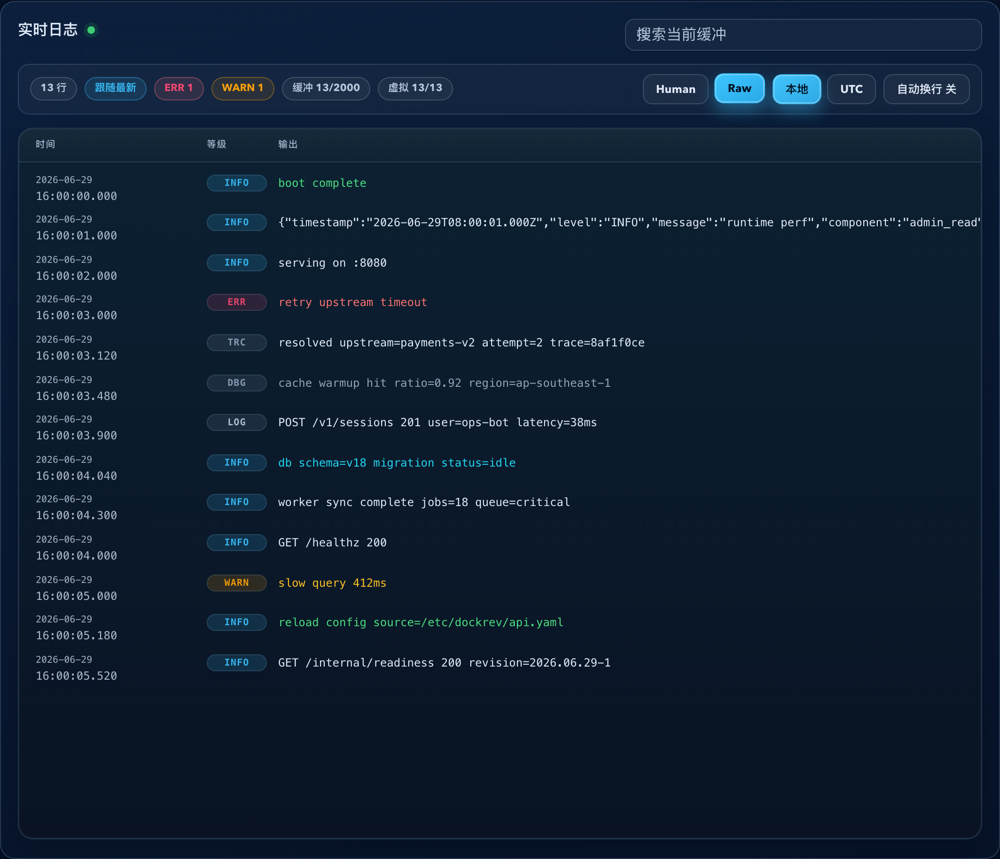

- source_type: `storybook_canvas`
  target_program: `mock-only`
  capture_scope: `element`
  requested_viewport: `1440x1000`
  viewport_strategy: `storybook-canvas`
  sensitive_exclusion: `N/A`
  submission_gate: `approved`
  story_id_or_title: `Pages/ServiceDetailPage/LogsSectionEvidence`
  state: `raw tracing text metadata`
  evidence_note: 验证 Raw 视图仍保留真实 tracing 原文，包括应用级时间戳、等级与 ANSI 颜色，同时等级列继续使用解析后的结构化等级。
  PR: include
  PR caption: 日志页 Raw 视图继续保留 tracing 原文，便于和结构化 Human 摘要互相对照。

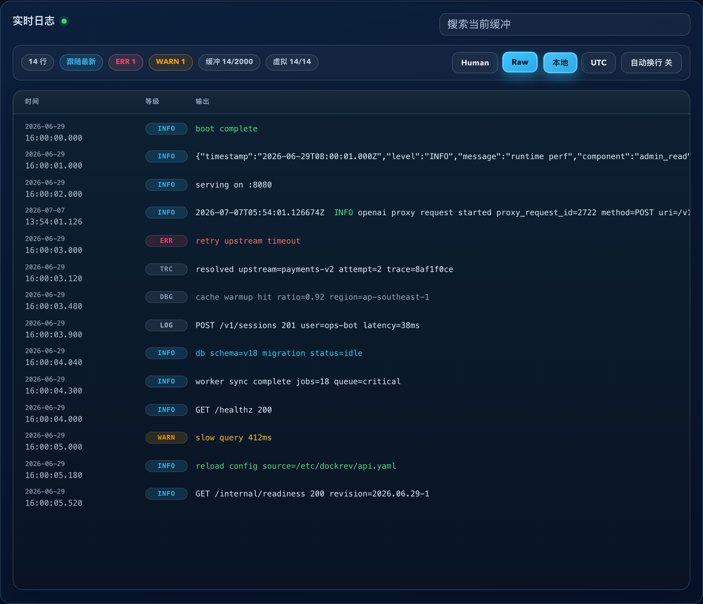

- source_type: `storybook_canvas`
  target_program: `mock-only`
  capture_scope: `element`
  requested_viewport: `1440x900`
  viewport_strategy: `storybook-canvas`
  sensitive_exclusion: `N/A`
  submission_gate: `approved`
  story_id_or_title: `Pages/ServiceDetailPage/LogsSectionMultilineGrouping`
  state: `multiline log grouping`
  evidence_note: 验证 `WARN ... database is locked` 多行应用错误按一条日志组展示，`Caused by:` continuation 保留在同一输出单元内，且正文自带 tracing 级别时等级列不再重复显示 `WARN` 文本。
  PR: include
  PR caption: 日志页按一条日志组展示多行应用错误，并避免重复渲染正文已包含的 tracing 级别。

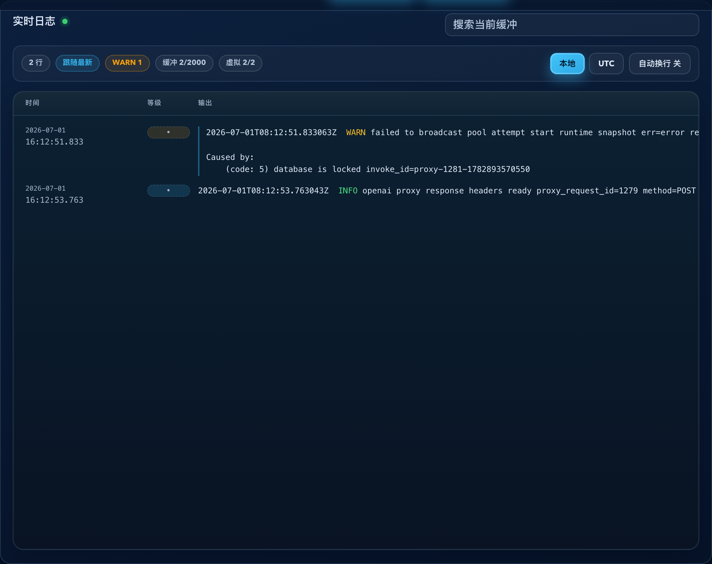

- source_type: `storybook_canvas`
  target_program: `mock-only`
  capture_scope: `element`
  requested_viewport: `1440x1500`
  viewport_strategy: `devtools-emulate`
  sensitive_exclusion: `N/A`
  submission_gate: `approved`
  story_id_or_title: `Pages/ServiceDetailPage/BackupSection`
  state: `backup deep link`
  evidence_note: 验证 `备份` 子页集中备份摘要、编辑入口与当前服务相关备份记录卡片，并从 `设置` 页移除了重复备份入口。
  PR: include
  PR caption: 备份子页集中服务级备份摘要、编辑入口与记录卡片，形成独立深链分区。

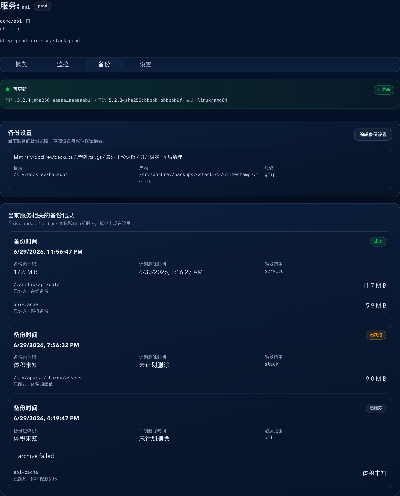

- source_type: `storybook_canvas`
  target_program: `mock-only`
  capture_scope: `element`
  requested_viewport: `1440x1600`
  viewport_strategy: `devtools-emulate`
  sensitive_exclusion: `N/A`
  submission_gate: `approved`
  story_id_or_title: `Pages/ServiceDetailPage/SettingsSection`
  state: `settings deep link`
  evidence_note: 验证 `设置` 子页集中自动更新摘要、Compose 信息、部署 tag、服务保护、忽略规则、Webhook 与维护动作，且低频危险动作已从共享页头下沉。
  PR: include
  PR caption: 设置子页集中低频配置与维护动作，不再把这些卡片堆在服务详情首屏。

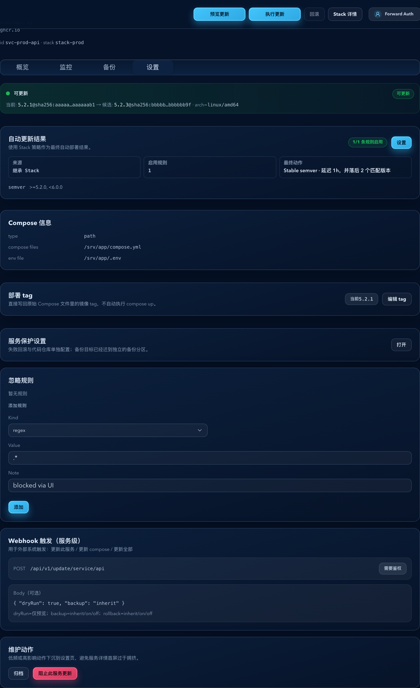

- source_type: `storybook_canvas`
  target_program: `mock-only`
  capture_scope: `browser-viewport`
  requested_viewport: `390x844`
  viewport_strategy: `devtools-emulate`
  sensitive_exclusion: `N/A`
  submission_gate: `approved`
  story_id_or_title: `Pages/ServiceDetailPage/OverviewDefault`
  state: `mobile overview tabs`
  evidence_note: 验证窄屏下服务详情页仍保留共享顶部动作与 route-backed tabs，概览子页在移动端保持单列阅读顺序。

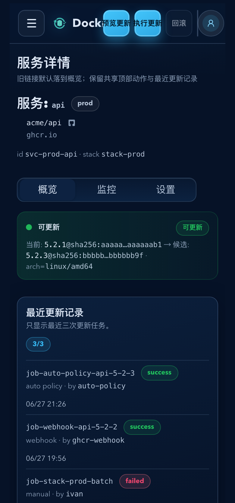

- source_type: `storybook_canvas`
  target_program: `mock-only`
  capture_scope: `browser-viewport`
  requested_viewport: `390x844`
  viewport_strategy: `storybook-viewport-mobile1`
  sensitive_exclusion: `N/A`
  submission_gate: `approved`
  story_id_or_title: `Pages/ServiceDetailPage/MobileHistorySection`
  state: `mobile history with wrapped monitor row + status rail`
  evidence_note: 使用真实 `390x844` 移动端 viewport，并以 Storybook fullscreen canvas 消除外层展示 gutter；截图保持顶部命令条、仅含服务名与监控指标的首行、去重后的共享状态信息带、扁平 tabs 轨道与首条 `更新记录` 面板同时可见。移动端监控指标区收敛为 `2 x 3` 网格，按 `CPU / 内存`、`磁盘读 / 磁盘写`、`下载 / 上传` 成列配对。两条共享页头都允许自然换行，但不得回退独立状态卡、独立时间 chip，或产生横向滚动。
  PR: include
  PR caption: 移动端服务详情保留服务名监控行与去重状态带，窄屏下仍无横向滚动。

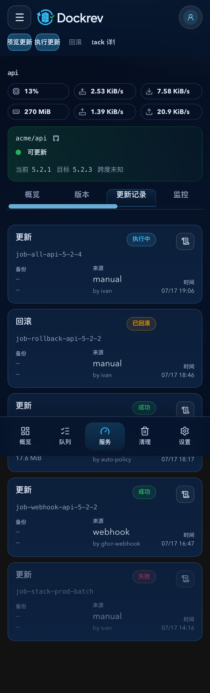

- source_type: `storybook_canvas`
  target_program: `mock-only`
  capture_scope: `browser-viewport`
  requested_viewport: `390x844`
  viewport_strategy: `storybook-viewport-mobile1`
  sensitive_exclusion: `N/A`
  submission_gate: `approved`
  story_id_or_title: `Pages/ServiceDetailPage/MobileHistorySection`
  state: `mobile webpage viewport with tabs left segment`
  evidence_note: 同一移动端网页视口截图，垂直位置固定在 `更新记录` 子页顶部。此状态下 tabs 横向停留在左段，清晰显示 `概览 / 更新记录 / 监控 / 日志`，并保留页面上下文与记录列表开头。
  PR: include
  PR caption: 移动端网页视口左段证明 tabs 顺序前半为 `概览 / 更新记录 / 监控 / 日志`。

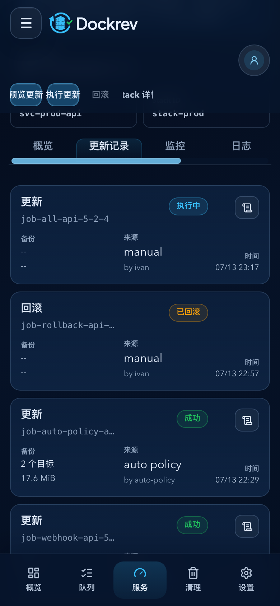

- source_type: `storybook_canvas`
  target_program: `mock-only`
  capture_scope: `browser-viewport`
  requested_viewport: `390x844`
  viewport_strategy: `storybook-viewport-mobile1`
  sensitive_exclusion: `N/A`
  submission_gate: `approved`
  story_id_or_title: `Pages/ServiceDetailPage/MobileHistorySection`
  state: `mobile webpage viewport with tabs right segment`
  evidence_note: 与上一张相同的移动端网页视口、相同的垂直位置，仅将 tabs 横向滚到右段。截图显示 `监控 / 日志 / 备份 / 设置`，与左段通过重叠的 `监控 / 日志` 共同证明完整顺序为 `概览 / 更新记录 / 监控 / 日志 / 备份 / 设置`。
  PR: include
  PR caption: 移动端网页视口右段证明 `日志` 后紧接 `备份 / 设置`。

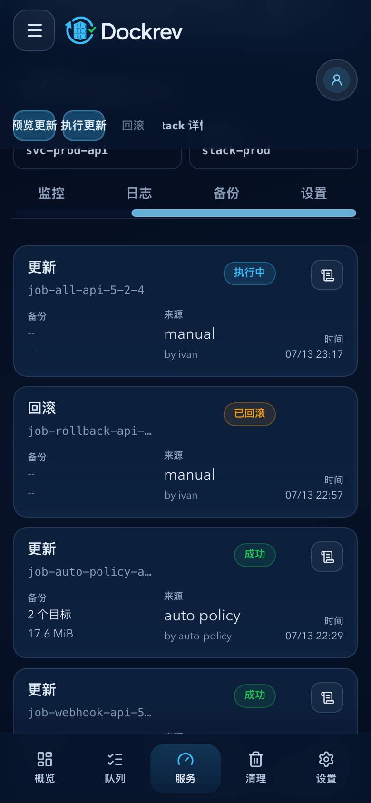

- source_type: `storybook_canvas`
  target_program: `mock-only`
  capture_scope: `browser-viewport`
  requested_viewport: `390x844`
  viewport_strategy: `storybook-viewport-mobile1`
  sensitive_exclusion: `N/A`
  submission_gate: `approved`
  story_id_or_title: `Pages/ServiceDetailPage/MobileHistorySection`
  state: `mobile webpage viewport with backup summary states`
  evidence_note: 同一移动端网页向下滚动后的完整视口截图。页面中同时出现一条命中备份记录的行，`备份` 字段显示 `2 个目标 / 17.6 MiB`，以及至少一条未命中备份记录的行，`备份` 字段保持 `-- / --` 中性空占位。
  PR: include
  PR caption: 移动端网页视口同时覆盖备份命中摘要与空占位。

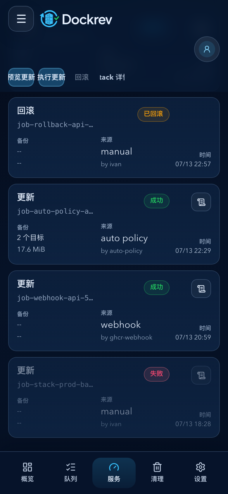

- source_type: `storybook_canvas`
  target_program: `mock-only`
  capture_scope: `browser-viewport`
  requested_viewport: `390x844`
  viewport_strategy: `storybook-viewport-mobile1`
  sensitive_exclusion: `N/A`
  submission_gate: `approved`
  story_id_or_title: `Pages/ServiceDetailPage/MobileHistorySection`
  state: `mobile summary status flattened into the hero card`
  evidence_note: 聚焦服务摘要下半区，单独证明移动端状态摘要已经并入同一张服务摘要卡。图中只有服务摘要外层卡和内部内容分隔线，不再存在第二层绿色状态卡。
  PR: include
  PR caption: 移动端服务摘要已去除内嵌状态卡。

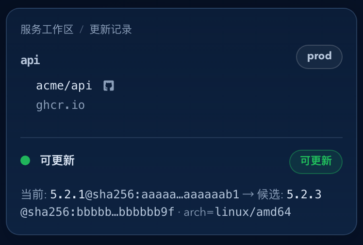

- source_type: `storybook_canvas`
  target_program: `mock-only`
  capture_scope: `browser-viewport`
  requested_viewport: `390x844`
  viewport_strategy: `storybook-viewport-mobile1`
  sensitive_exclusion: `N/A`
  submission_gate: `approved`
  story_id_or_title: `Pages/ServiceDetailPage/MobileHistorySection`
  state: `mobile history status badge beside card title`
  evidence_note: 同一移动端网页视口直接证明更新记录卡片的状态 pill 已从独立列并入标题行，紧贴 `更新 / 回滚` 标题右侧；右上角只保留 release notes 操作按钮。
  PR: include
  PR caption: 移动端更新记录状态标记已放到卡片标题右边。

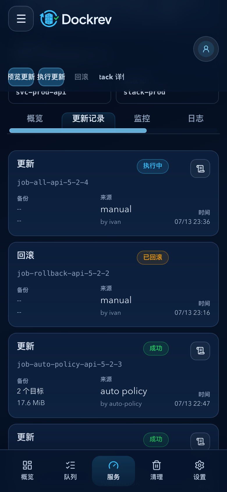

- source_type: `storybook_canvas`
  target_program: `mock-only`
  capture_scope: `browser-viewport`
  requested_viewport: `390x844`
  viewport_strategy: `storybook-viewport-mobile1`
  sensitive_exclusion: `N/A`
  submission_gate: `approved`
  story_id_or_title: `Pages/ServiceDetailPage/MobileHistorySection`
  state: `mobile history rows rendered without an outer shell`
  evidence_note: 聚焦更新记录中段，单独证明 history 区只保留每条记录自己的行面板。多条记录之间直接落在页面背景上，不再额外包一层父级卡壳。
  PR: include
  PR caption: 移动端更新记录区已取消外层包卡，仅保留记录行面板。

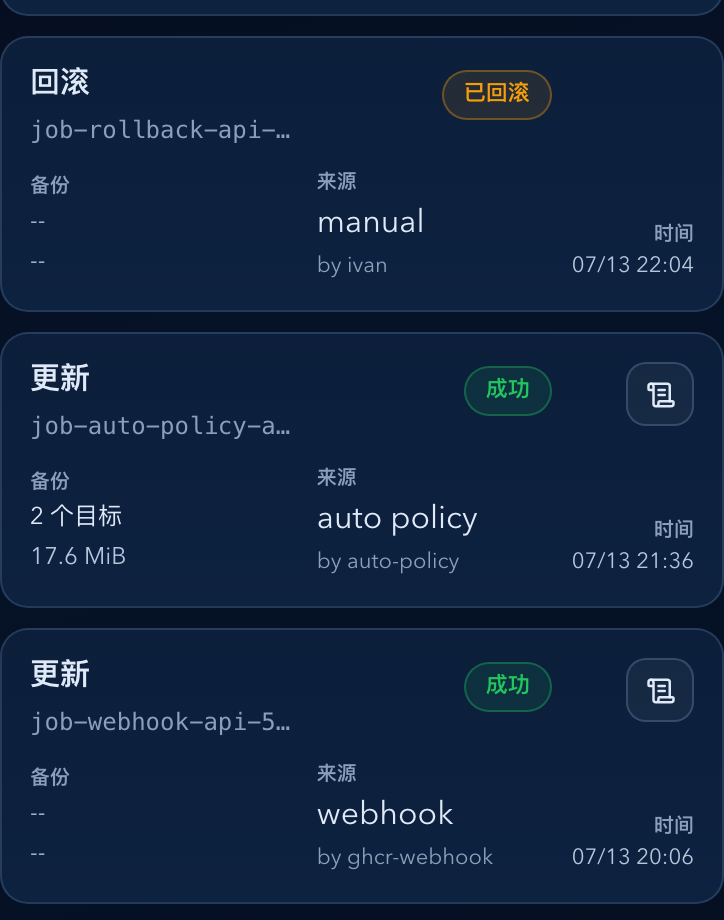

- source_type: `storybook_canvas`
  target_program: `mock-only`
  capture_scope: `browser-viewport`
  requested_viewport: `390x844`
  viewport_strategy: `storybook-viewport-mobile1`
  sensitive_exclusion: `N/A`
  submission_gate: `approved`
  story_id_or_title: `Pages/ServiceDetailPage/MobileHistorySection`
  state: `mobile topbar first row stays single-line`
  evidence_note: 同一移动端网页视口证明详情页 topbar 首行保持单行：菜单按钮、Dockrev 品牌和右侧用户触发器处于同一横向行，顶部动作条单独下沉到第二行，不再把头像挤到下一行。
  PR: include
  PR caption: 移动端详情页 topbar 首行固定为菜单、品牌、头像同一行。

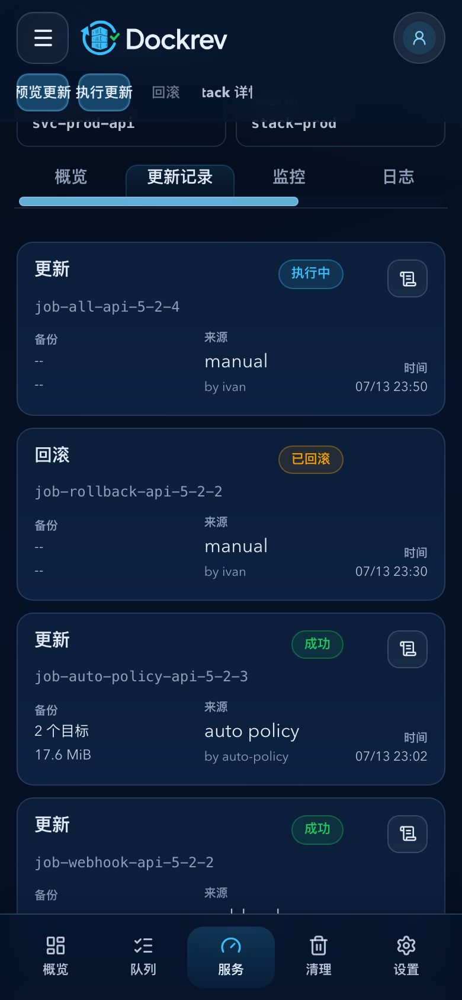

- source_type: `storybook_canvas`
  target_program: `mock-only`
  capture_scope: `browser-viewport`
  requested_viewport: `1600x1200`
  viewport_strategy: `storybook-fullscreen-desktop`
  sensitive_exclusion: `N/A`
  submission_gate: `approved`
  story_id_or_title: `Pages/ServiceDetailPage/VersionsSection`
  state: `desktop versions subpage with current release card in view`
  evidence_note: 桌面宽视口下，服务详情 tabs 已扩成 `概览 / 版本 / 更新记录 / 监控 / 日志 / 备份 / 设置`，且 `版本` 保持激活。版本页不再套一层大 section card 或内层 scroll shell card，而是直接进入 release cards 列表；当前版本卡与相邻历史卡同时可见，证明宽卡使用多栏布局承载版本元信息、正文、状态与动作区。
  PR: include
  PR caption: 服务详情新增 `版本` 子页，并在桌面宽屏下使用多栏宽卡展示 release notes。

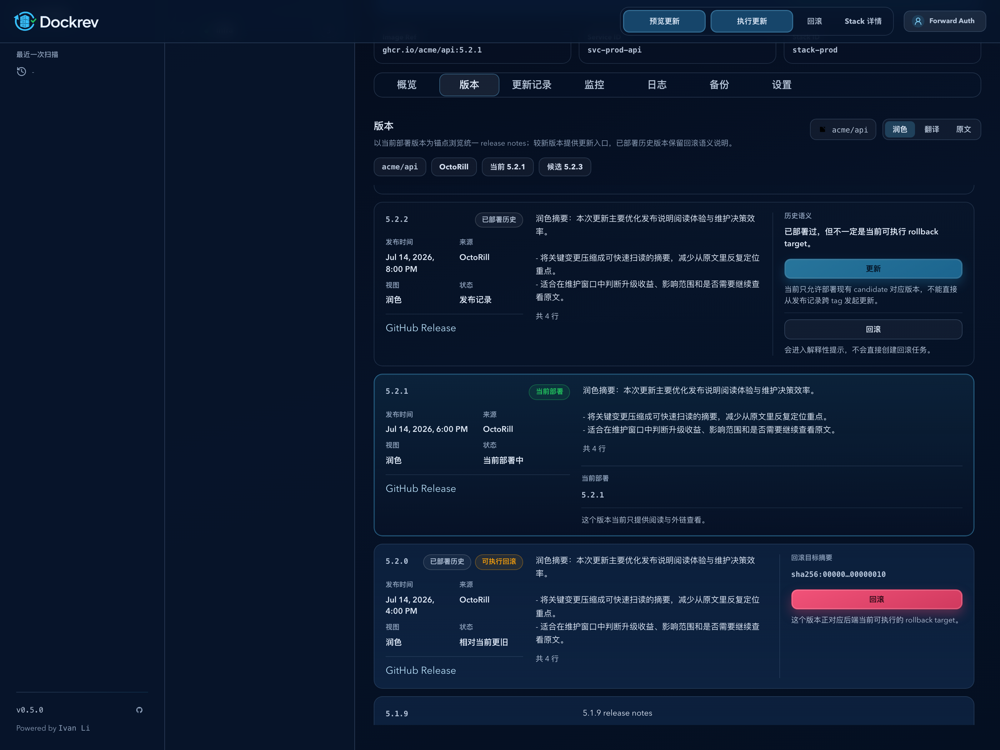

- source_type: `storybook_canvas`
  target_program: `mock-only`
  capture_scope: `element`
  requested_viewport: `1600x1200`
  viewport_strategy: `storybook-fullscreen-desktop`
  sensitive_exclusion: `N/A`
  submission_gate: `approved`
  story_id_or_title: `Pages/ServiceDetailPage/VersionsSection`
  state: `desktop current release wide card`
  evidence_note: 聚焦当前部署版本卡本体，证明桌面卡片不是表格行，也不再在卡内嵌套一组小卡片；信息改为四区并置的平面分区：左侧版本与事实信息、中间正文预览、右侧状态说明和动作语义用细分隔线组织，同时保持正文阅读宽度。
  PR: include
  PR caption: 桌面版本卡采用多栏宽卡而不是更新记录表格复刻。

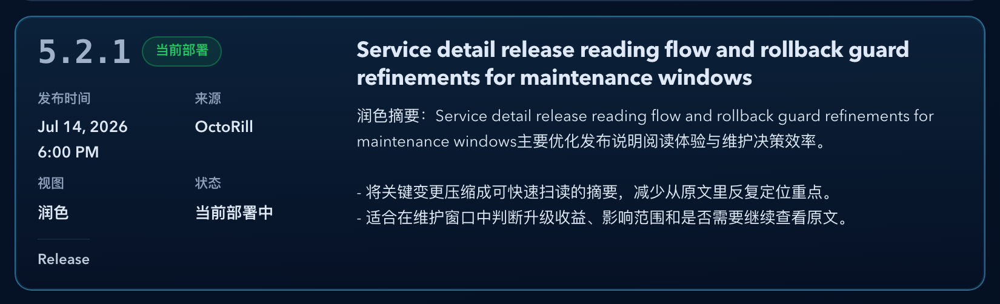

- source_type: `storybook_canvas`
  target_program: `mock-only`
  capture_scope: `browser-viewport`
  requested_viewport: `1600x1200`
  viewport_strategy: `storybook-fullscreen-desktop`
  sensitive_exclusion: `N/A`
  submission_gate: `approved`
  story_id_or_title: `Pages/ServiceDetailPage/DockrevVersionsSelfUpgradeVisual`
  state: `dockrev versions page candidate card shares supervisor action with topbar before navigation`
  evidence_note: Dockrev 服务详情 `版本` 子页中，顶部与 candidate 卡同时暴露 `升级 Dockrev`，且更高的 `0.63.0` 非 candidate 卡只保留禁用解释。该视图停留在版本页本身，用来证明 candidate 卡已收敛到 supervisor 自我升级语义，而不是普通 `更新` 入口。
  PR: include
  PR caption: Dockrev 版本页候选卡与顶部入口共享 supervisor 自我升级语义，非 candidate 版本仅保留禁用解释。

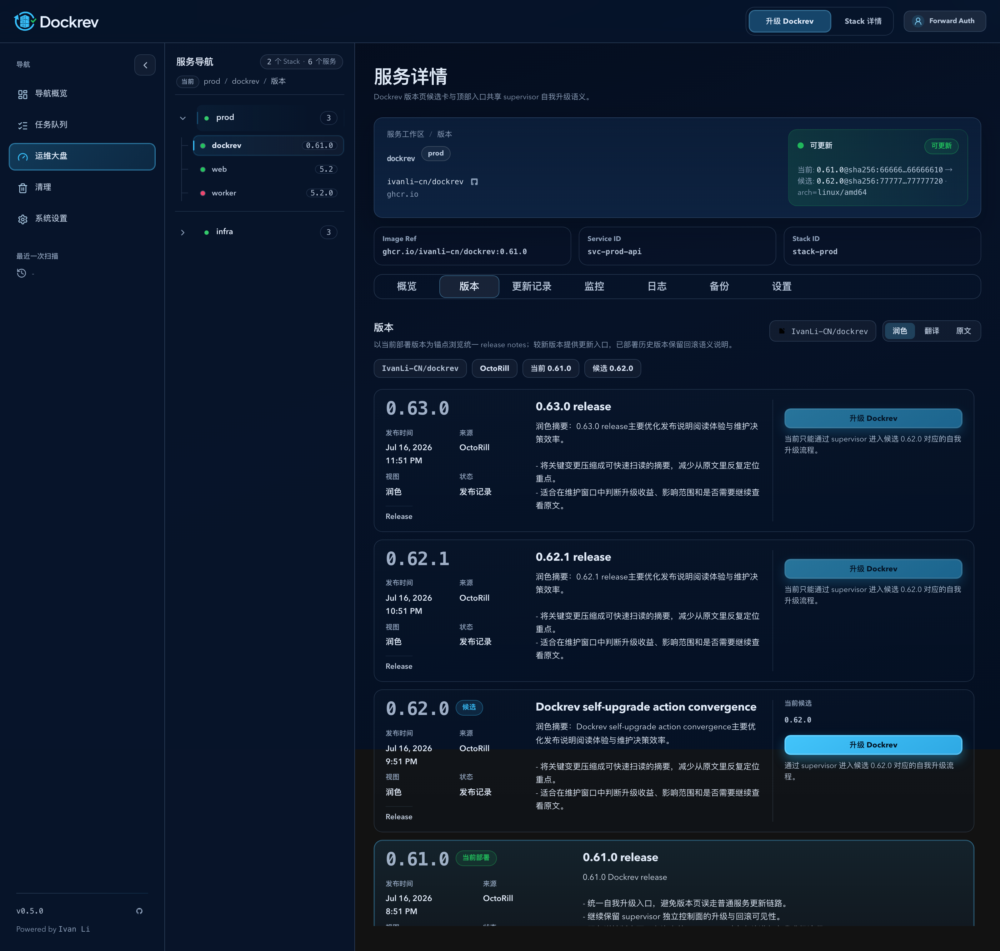

- source_type: `storybook_canvas`
  target_program: `mock-only`
  capture_scope: `browser-viewport`
  requested_viewport: `1600x1200`
  viewport_strategy: `storybook-fullscreen-desktop`
  sensitive_exclusion: `N/A`
  submission_gate: `approved`
  story_id_or_title: `Pages/ServiceDetailPage/DockrevVersionsSelfUpgradeOffline`
  state: `dockrev supervisor offline disables topbar and candidate card`
  evidence_note: offline Storybook 视图中，顶部 `升级 Dockrev` 与 candidate 卡同时禁用，顶部保留 `重试`；更高的 `0.63.0` 非 candidate 卡也直接表达 `supervisor offline` 阻断原因，而不是继续把用户引导到一个已经离线的入口。
  PR: include
  PR caption: supervisor offline 时，Dockrev 所有版本卡优先直接表达离线阻断原因，重试仅保留在顶部。

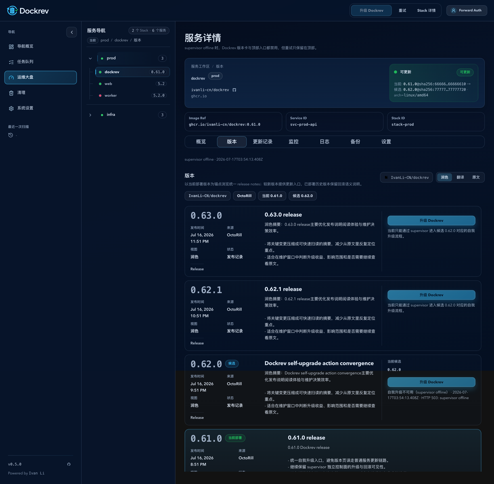

- source_type: `storybook_canvas`
  target_program: `mock-only`
  capture_scope: `browser-viewport`
  requested_viewport: `390x844`
  viewport_strategy: `storybook-viewport-mobile1`
  sensitive_exclusion: `N/A`
  submission_gate: `approved`
  story_id_or_title: `Pages/ServiceDetailPage/MobileVersionsSection`
  state: `mobile versions subpage anchored around current release block`
  evidence_note: 移动端页面级截图证明 `版本` 子页在窄屏下切换为单列阅读流。顶部 chips、正文区域与下一张旧版本卡按纵向顺序堆叠，不出现横向滚动，也不再出现虚拟列表卡片互相压住的问题；页面级 section 壳已退掉，只保留版本卡本身作为主要容器。
  PR: include
  PR caption: 移动端 `版本` 子页切换为单列卡片流，并保持无横向滚动。

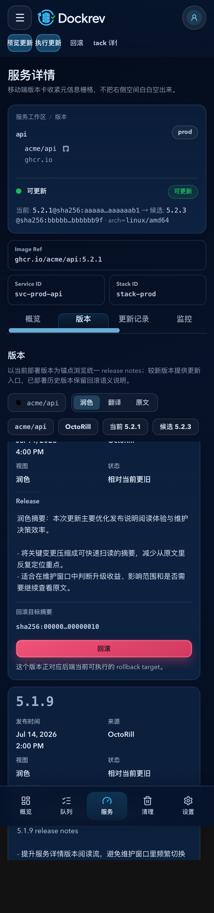

- source_type: `storybook_canvas`
  target_program: `mock-only`
  capture_scope: `element`
  requested_viewport: `390x844`
  viewport_strategy: `storybook-viewport-mobile1`
  sensitive_exclusion: `N/A`
  submission_gate: `approved`
  story_id_or_title: `Pages/ServiceDetailPage/MobileVersionsSection`
  state: `mobile narrow card stack`
  evidence_note: 聚焦移动端窄卡本体，证明单张 release card 内的发布时间、来源、视图、状态与正文全部按单列顺序展开，阅读宽度稳定，没有桌面多栏布局在小屏上的压缩和重叠，也没有“卡片里再套事实卡/状态卡/动作卡”的结构噪音。
  PR: include
  PR caption: 移动端版本卡改为单列窄卡，信息按阅读顺序自然下沉。

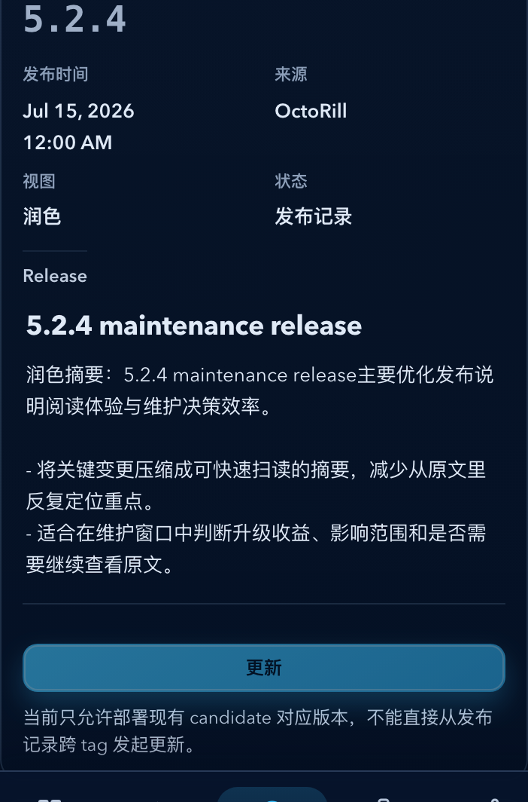

- source_type: `ui_demo`
  target_program: `mock-only`
  capture_scope: `browser-viewport`
  requested_viewport: `1960x1400`
  viewport_strategy: `controlled-viewport`
  sensitive_exclusion: `N/A`
  submission_gate: `approved`
  story_id_or_title: `demo:app / /demo/services/stack-prod/svc-prod-api/versions`
  state: `desktop split versions layout with repository-level release links`
  evidence_note: `mock-only ui_demo` 页面级截图，直接验证版本子页在真实应用壳内启用折叠后的主导航图标 rail、服务目录、仓库级 GitHub / OctoRill 图标入口、紧凑状态摘要，以及固定右侧动作栏。目录高亮与正文版本卡同时可见，且当前 rollback target 卡片右栏展示 `来源备份 2 个目标 · 17.6 MiB`，证明双虚拟列表布局与回滚备份摘要都已经落到最终交付面。
  PR: include
  PR caption: `ui_demo` 桌面端版本页折叠主导航，同时保留左目录、仓库级图标入口与固定动作栏。

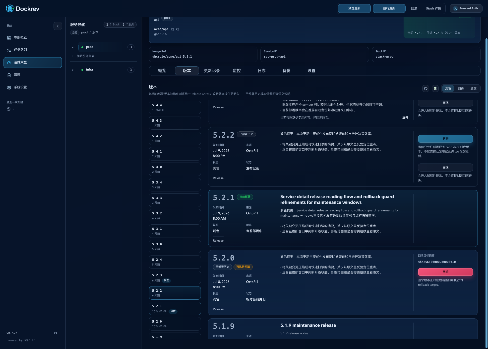

- source_type: `ui_demo`
  target_program: `mock-only`
  capture_scope: `browser-viewport`
  requested_viewport: `390x900`
  viewport_strategy: `controlled-viewport`
  sensitive_exclusion: `N/A`
  submission_gate: `approved`
  story_id_or_title: `demo:app / /demo/services/stack-prod/svc-prod-api/versions`
  state: `mobile versions layout without directory`
  evidence_note: `mock-only ui_demo` 移动端整页截图，直接验证 `≤1100px` 时版本目录完全隐藏，版本卡保持单列纵向阅读流，页面滚动宽度与视口宽度一致，不产生横向溢出；同一视图内的 rollback target 卡片继续显示 `来源备份` 摘要。
  PR: include
  PR caption: `ui_demo` 移动端版本页隐藏目录并保持无横向溢出。

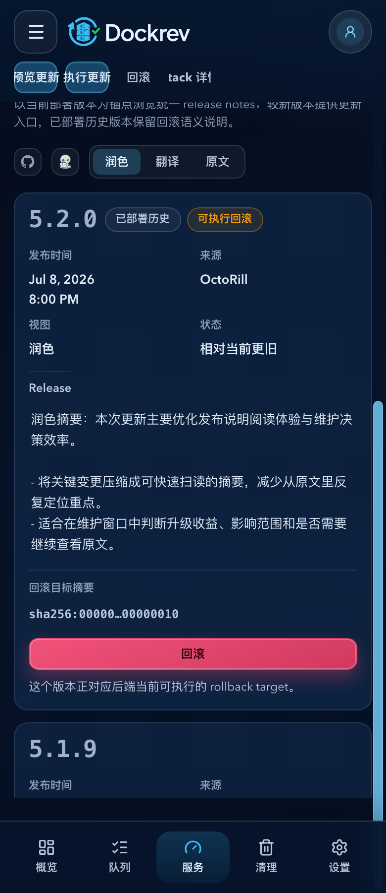

## Related PRs

- None

## 风险 / 开放问题 / 假设（Risks, Open Questions, Assumptions）

- 风险：服务详情现有 stories 数量较多，若不显式切换到对应 section，容易因内容搬迁导致 Storybook 回归集中失败。
- 风险：顶部 `设置` tab 与现有自动更新卡片 `设置` 按钮同名，stories 需避免依赖“第一个同名按钮”这类脆弱选择器。
- 风险：高频日志若不做有界缓冲与虚拟滚动，会迅速放大前端内存、重排与渲染成本。
- 假设：`useServiceDetailPageState` 继续作为服务详情共享数据与顶部动作逻辑的单一真相源，无需拆成多 hook。
- 假设：v1 只搜索当前会话内的 live buffer，不提供跨刷新或跨会话全文检索。

## 参考（References）

- `docs/specs/kbz3z-service-resource-monitoring-sse/SPEC.md`
- `docs/specs/xyy72-auto-deploy-policy-configurator/SPEC.md`
- `docs/specs/r4t8k-service-compose-tag-editor/SPEC.md`
- `docs/specs/hb4cp-service-manual-rollback/SPEC.md`
- `docs/specs/t9x88-remove-sidebar-compose-move-to-detail/SPEC.md`
