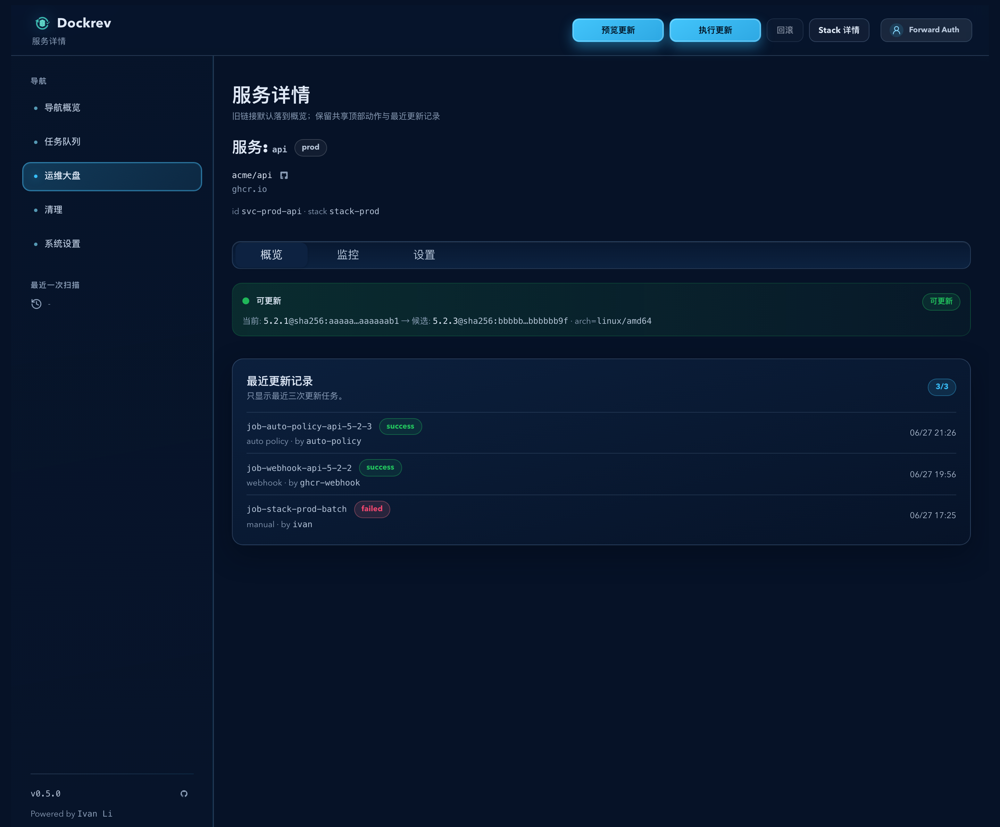

# Dockrev：服务详情页三子页信息架构升级（#ey4ar）

> 当前有效规范以本文为准；实现覆盖与当前状态见 `./IMPLEMENTATION.md`，关键演进原因见 `./HISTORY.md`。

## 背景 / 问题陈述

- 现有 `ServiceDetailPage` 把运行态摘要、资源监控、自动更新策略、Compose 信息、服务保护、忽略规则与 Webhook 说明堆叠在单一页面里，导致服务详情首屏信息密度过高。
- 该页面已经承载多个逐步独立演进的主题能力，但当前仍缺少稳定的二级信息架构与可直达的子页 URL，导致页面越来越“多、杂”。
- 如果不冻结这次拆分规范，后续继续往服务详情页新增功能时，会不断重复“首屏堆卡片”和“全量页面滚动”的旧模式。

## 目标 / 非目标

### Goals

- 将服务详情页拆成 route-backed 的 `概览 / 监控 / 设置` 三个子页，并保留旧 `/services/:stackId/:serviceId` 入口稳定落到默认 `概览`。
- 保留共享的服务上下文：标题、镜像/仓库信息、状态 banner、版本异常提示、全局 success/error 反馈，以及高频顶部动作。
- 将 `ServiceResourcePanel` 独占到 `监控` 子页，将自动更新 / Compose / 服务保护 / 忽略规则 / Webhook / 低频危险动作集中到 `设置` 子页。
- 在已有 Storybook 与 spec 流程下补齐三子页的稳定 stories、交互断言与 owner-facing 视觉证据。

### Non-goals

- 不修改后端 API、DB schema、SSE 语义、update/rollback job 模型或权限控制。
- 不把 `设置` 子页改造成纯页内编辑器；自动更新、Compose tag、服务保护继续沿用摘要卡片 + 抽屉编辑模式。
- 不增加侧栏级第二套服务详情子导航，也不为本次改造保留长期并行的旧聚合页。
- 不改写现有 feature specs（如自动更新、回滚、Compose tag、资源监控）的主题 owner；这些 spec 继续拥有各自功能契约。

## 范围（Scope）

### In scope

- `web/src/routes.ts`
- `web/src/App.tsx`
- `web/src/pages/ServiceDetailPage.tsx`
- `web/src/pages/useServiceDetailPageState.tsx`
- `web/src/stories/pages/ServiceDetailPage.stories.tsx`
- `web/src/stories/mocks/PageHarness.tsx`
- `web/src/App.css`
- 本 spec 目录与其视觉证据资产

### Out of scope

- Rust 服务端、数据模型、任务调度或资源监控后端路径
- 服务列表、概览页、Stack 详情页的整体 IA 重构
- 非服务详情页的导航体系调整

## 需求（Requirements）

### MUST

- `Route.name === 'service'` 必须支持 `section?: 'overview' | 'monitoring' | 'settings'`。
- `href()` 对 `section=undefined | overview` 必须输出旧 canonical URL `/services/:stackId/:serviceId`，不得生成新的 `/overview` canonical path。
- `parseRoute()` 必须接受旧路径，并把它解析为服务详情 `overview` 语义；对于 `/monitoring` 与 `/settings` 需返回对应 section。
- 服务详情页顶部必须提供 route-backed tabs，标签固定为 `概览 / 监控 / 设置`。
- `预览更新 / 执行更新 / 回滚 / Stack 详情` 必须在三页保持一致可达；`归档/恢复` 与 `阻止此服务更新` 必须从全局顶部动作下沉到 `设置` 页。
- `概览` 不得再出现资源监控卡、自动更新结果卡、Compose 信息卡或服务保护卡。
- `监控` 只承载资源监控面板及其原有空态/错态/SSE 状态，不得混入配置内容。
- `设置` 必须集中承载自动更新摘要与抽屉、Compose 信息、部署 tag 编辑、服务保护、忽略规则、Webhook，以及下沉后的低频危险动作。
- Storybook 必须提供三子页稳定入口，并至少覆盖：旧链接默认概览、tabs active state、设置抽屉入口或监控页稳定渲染。

### SHOULD

- 共享数据继续由单一 `useServiceDetailPageState` 驱动，避免按子页重复请求 stack/service/settings 数据。
- 服务详情页的三子页应在移动端保持单列、无横向滚动，并确保 tabs 可稳定切换。
- 设置页中的动作分区应把低频危险动作与普通配置分开呈现。

### COULD

- 对 `/services/:stackId/:serviceId/overview` 提供兼容解析，但 `href()` 不主动生成该路径。

## 功能与行为规格（Functional/Behavior Spec）

### Core flows

- 用户访问旧服务详情 URL：
  - 仍进入同一服务详情页面。
  - 默认展示 `概览` 子页。
  - 页头 tabs 显示 `概览` 为 active。
- 用户访问 `.../monitoring`：
  - 共享 hero/banner/top actions 与普通服务详情一致。
  - 内容区只展示资源监控面板。
- 用户访问 `.../settings`：
  - 共享 hero/banner/top actions 与普通服务详情一致。
  - 内容区展示自动更新摘要、Compose 信息、tag 编辑入口、服务保护、忽略规则、Webhook 与危险动作。
- 用户点击页头 tabs：
  - 更新路由 section。
  - 不切换服务实体，不清空已有服务上下文。
  - `概览` tab 回退到旧 canonical path。

### Edge cases / errors

- 旧 bookmark、从服务列表/Stack 详情/概览跳来的 `navigate({ name: 'service', stackId, serviceId })` 调用必须继续可用，不要求调用点立即补 section。
- 若当前服务是 Dockrev 自身：
  - 继续保留既有 supervisor 自升级动作逻辑。
  - 三子页结构仍然生效。
- 全局 success/error notice 仍由服务详情页底部统一承载，不因 section 切换丢失。

## 接口契约（Interfaces & Contracts）

### 接口清单（Inventory）

| 接口（Name） | 类型（Kind） | 范围（Scope） | 变更（Change） | 契约文档（Contract Doc） | 负责人（Owner） | 使用方（Consumers） | 备注（Notes） |
| --- | --- | --- | --- | --- | --- | --- | --- |
| `Route.name='service'` | frontend route union | internal | Modify | 本文 | web | App / pages / stories | 新增 `section` 路由语义 |
| `/services/:stackId/:serviceId[/<section>]` | frontend URL contract | external | Modify | 本文 | web | operators / bookmarks / internal links | `overview` canonical 仍为无 section 旧路径 |

### 契约文档（按 Kind 拆分）

- `None`

## 验收标准（Acceptance Criteria）

- Given 旧链接 `/services/stack-prod/svc-prod-api`
  When 打开服务详情
  Then 页面稳定进入 `概览` 子页，且 URL 无需追加 `/overview`。

- Given 服务详情页处于 `概览`
  When 用户切到 `监控`
  Then 保留相同服务上下文与顶部动作，内容区只显示资源监控面板。

- Given 服务详情页处于 `设置`
  When 用户查看页面主体
  Then 可看到自动更新摘要、Compose 信息、部署 tag、服务保护、忽略规则、Webhook 与危险动作，且不再看到最近更新记录卡。

- Given 任一服务详情子页
  When 用户需要执行 `预览更新 / 执行更新 / 回滚 / Stack 详情`
  Then 无需先切回 `概览`，这些高频动作在当前子页即可直接触发。

- Given 服务详情 stories 已更新
  When 运行 Storybook interaction 回归
  Then 至少能验证旧链接默认概览、tabs active/切换行为，以及设置页或监控页的核心入口稳定可用。

## 验收清单（Acceptance checklist）

- [x] 核心路径的长期行为已被明确描述。
- [x] 关键边界/错误场景已被覆盖。
- [x] 涉及的接口/契约已写清楚或明确为 `None`。
- [x] 相关验收条件已经可以用于实现与 review 对齐。

## 非功能性验收 / 质量门槛（Quality Gates）

### Testing

- `bun run --cwd web lint`
- `bun run --cwd web build`
- `bun run --cwd web build-storybook`
- `bun run --cwd web test-storybook`（若脚本可用）

### UI / Storybook (if applicable)

- Stories to add/update: `web/src/stories/pages/ServiceDetailPage.stories.tsx`
- Docs pages / state galleries to add/update: `none (reason: repo currently uses page stories/canvas coverage for this surface)`
- `play` / interaction coverage to add/update: tabs route switching、旧链接默认概览、设置抽屉入口、监控页稳定渲染
- Visual regression baseline changes (if any): 服务详情三子页 mock-only 视觉证据

### Quality checks

- Lint / typecheck / formatting: 前端 lint/build 与 Storybook 构建/交互检查必须通过

## Visual Evidence

- source_type: `storybook_canvas`
  target_program: `mock-only`
  capture_scope: `browser-viewport`
  requested_viewport: `1440x1200`
  viewport_strategy: `devtools-emulate`
  sensitive_exclusion: `N/A`
  submission_gate: `approved`
  story_id_or_title: `Pages/ServiceDetailPage/OverviewDefault`
  state: `legacy route -> overview`
  evidence_note: 验证旧 `/services/:stackId/:serviceId` 路径仍稳定落到概览子页，顶部高频动作保留在共享页头，主体仅展示运行摘要与最近更新记录。
  PR: include
  PR caption: 服务详情旧链接默认落到概览子页，页头 tabs 与共享高频动作保持稳定可达。

- source_type: `storybook_canvas`
  target_program: `mock-only`
  capture_scope: `element`
  requested_viewport: `1440x1200`
  viewport_strategy: `devtools-emulate`
  sensitive_exclusion: `N/A`
  submission_gate: `approved`
  story_id_or_title: `Pages/ServiceDetailPage/MonitoringSection`
  state: `monitoring deep link`
  evidence_note: 验证 `监控` 子页通过独立 section 深链承载资源监控面板，保留共享 hero/banner/top actions，同时不混入配置卡片。
  PR: include
  PR caption: 监控子页独占资源监控面板，复用同一服务上下文与顶部动作。

- source_type: `storybook_canvas`
  target_program: `mock-only`
  capture_scope: `element`
  requested_viewport: `1440x1600`
  viewport_strategy: `devtools-emulate`
  sensitive_exclusion: `N/A`
  submission_gate: `approved`
  story_id_or_title: `Pages/ServiceDetailPage/SettingsSection`
  state: `settings deep link`
  evidence_note: 验证 `设置` 子页集中自动更新摘要、Compose 信息、部署 tag、服务保护、忽略规则、Webhook 与维护动作，且低频危险动作已从共享页头下沉。
  PR: include
  PR caption: 设置子页集中低频配置与维护动作，不再把这些卡片堆在服务详情首屏。

- source_type: `storybook_canvas`
  target_program: `mock-only`
  capture_scope: `browser-viewport`
  requested_viewport: `390x844`
  viewport_strategy: `devtools-emulate`
  sensitive_exclusion: `N/A`
  submission_gate: `approved`
  story_id_or_title: `Pages/ServiceDetailPage/OverviewDefault`
  state: `mobile overview tabs`
  evidence_note: 验证窄屏下服务详情页仍保留共享顶部动作与 route-backed tabs，概览子页在移动端保持单列阅读顺序。

## Related PRs

- None

## 风险 / 开放问题 / 假设（Risks, Open Questions, Assumptions）

- 风险：服务详情现有 stories 数量较多，若不显式切换到对应 section，容易因内容搬迁导致 Storybook 回归集中失败。
- 风险：顶部 `设置` tab 与现有自动更新卡片 `设置` 按钮同名，stories 需避免依赖“第一个同名按钮”这类脆弱选择器。
- 假设：`useServiceDetailPageState` 继续作为服务详情共享数据与顶部动作逻辑的单一真相源，无需拆成多 hook。

## 参考（References）

- `docs/specs/kbz3z-service-resource-monitoring-sse/SPEC.md`
- `docs/specs/xyy72-auto-deploy-policy-configurator/SPEC.md`
- `docs/specs/r4t8k-service-compose-tag-editor/SPEC.md`
- `docs/specs/hb4cp-service-manual-rollback/SPEC.md`
- `docs/specs/t9x88-remove-sidebar-compose-move-to-detail/SPEC.md`
