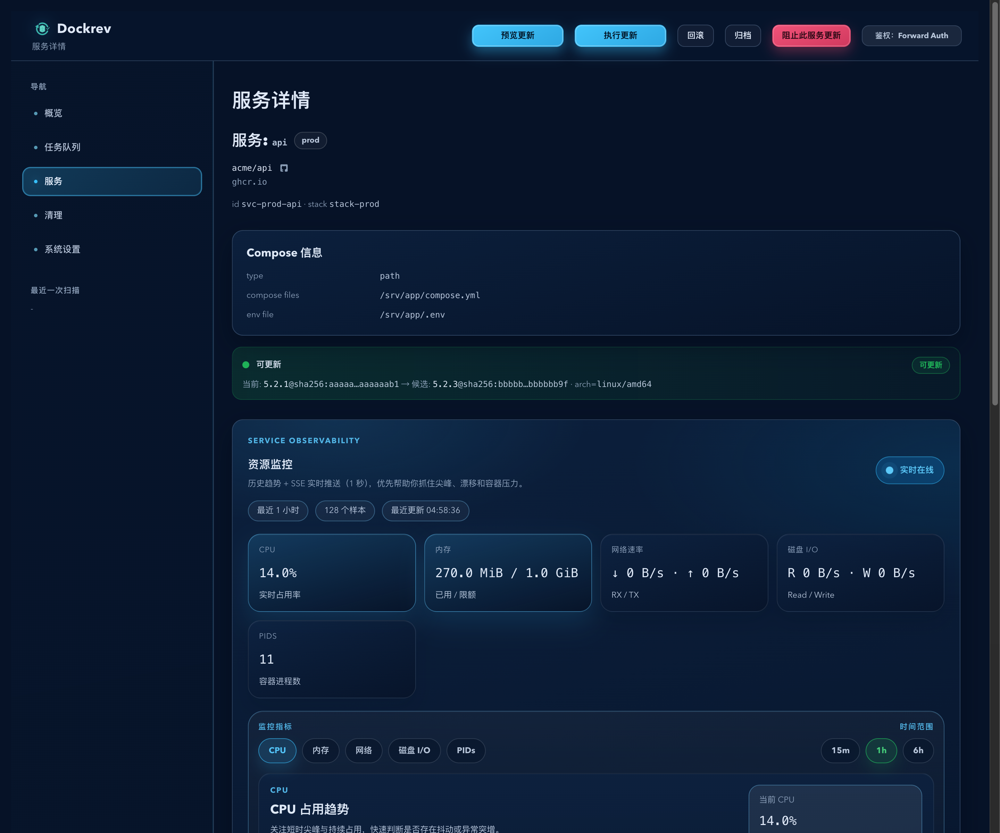
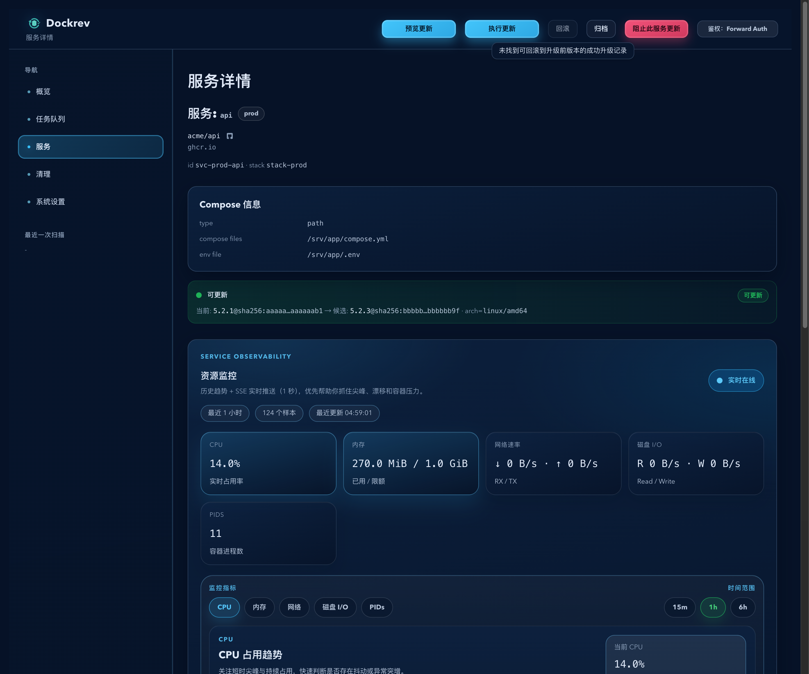
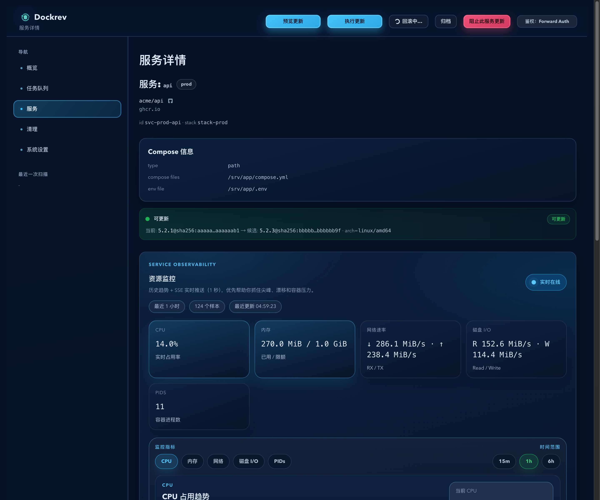
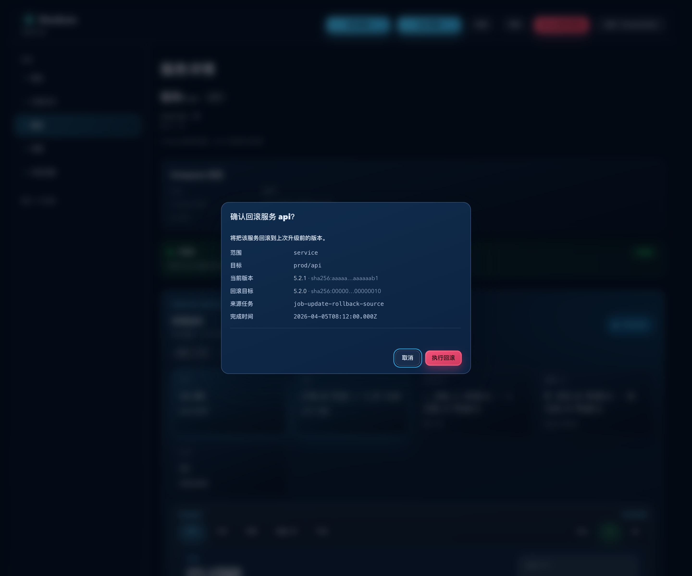

# Dockrev：服务详情页手动回滚到升级前版本（#hb4cp）

## 状态

- Status: 已完成
- Created: 2026-04-05
- Last: 2026-04-05

## 背景 / 问题陈述

- 当前普通服务只能从详情页执行升级或预览升级，缺少“回滚到升级前版本”的手动入口。
- 现有系统虽然已经存在 `JobType::Rollback`、`rolled_back` 终态和 update 内部失败回滚逻辑，但没有面向服务详情页的独立手动回滚接口、冲突保护和可视化入口。
- 服务手动回滚属于高影响操作，必须明确回滚目标来源并要求用户二次确认，避免误触或回滚到错误版本。

## 目标 / 非目标

### Goals

- 在 `ServiceDetailPage` 顶部动作区为非 Dockrev 服务增加“回滚”按钮。
- 回滚目标基于最近一次成功 update 历史反推，只接受“把该服务升级到当前 digest 的最近一次记录”。
- 新增 `GET /api/services/{service_id}/rollback-target` 与 `POST /api/services/{service_id}/rollback`，并返回/复用任务详情所需的结构化信息。
- 创建真实的 `type=rollback` 服务级任务，成功终态使用 `status=rolled_back`，队列与任务详情继续复用现有 rollback 展示。
- 补齐 Storybook 场景、mock API、视觉证据，并把快车道收口到 latest PR `merge-ready`。

### Non-goals

- 不修改 Dockrev supervisor 自升级页与 `POST /supervisor/self-upgrade/rollback`。
- 不提供 stack-scope 或 all-scope 的手动回滚入口。
- 不重写自动失败回滚状态机，只复用其既有 updater 显式 digest 能力。

## 范围（Scope）

### In scope

- `crates/dockrev-api/src/api/mod.rs`
- `crates/dockrev-api/src/api/operations.rs`
- `crates/dockrev-api/src/api/types/jobs.rs`
- `crates/dockrev-api/src/api/tests.rs`
- `crates/dockrev-api/src/updater.rs`
- `crates/dockrev-api/src/notify.rs`
- `web/src/api.ts`
- `web/src/pages/ServiceDetailPage.tsx`
- `web/src/stories/mocks/dockrevMockApi.ts`
- `web/src/stories/pages/ServiceDetailPage.stories.tsx`
- `docs/specs/README.md`
- 本 spec 与其 `assets/`

### Out of scope

- Supervisor 自升级回滚交互
- 历史 job 数据迁移
- 非服务详情页的新增回滚入口

## 接口契约（Interfaces & Contracts）

### `GET /api/services/{service_id}/rollback-target`

返回：

```json
{
  "available": true,
  "currentDigest": "sha256:current",
  "currentDisplayTag": "1.4.2",
  "targetDigest": "sha256:old",
  "targetDisplayTag": "1.4.1",
  "sourceUpdateJobId": "job-update-123",
  "sourceFinishedAt": "2026-04-05T09:15:00Z",
  "unavailableReason": null,
  "activeJobId": null,
  "activeJobStatus": null
}
```

- `available=false` 时仍必须返回 `currentDigest`，并通过 `unavailableReason` 说明不可回滚原因。
- 若当前存在冲突中的 rollback job，则 `activeJobId` / `activeJobStatus` 必须指向该任务；若冲突来自 update job，也必须能通过这两个字段暴露当前阻塞任务。

### `POST /api/services/{service_id}/rollback`

- 成功返回：

```json
{ "jobId": "job-rollback-123" }
```

- 若无可回滚目标，或存在冲突中的 service/stack/all update 或 service rollback，返回 `409`，并包含 `reason` 与可选 `existingJobId`。
- 手动 rollback job 必须为：
  - `type=rollback`
  - `scope=service`
  - `status=queued -> running -> rolled_back|failed`

## 功能与行为规格（Functional / Behavior Spec）

### 回滚目标解析

- 只扫描成功完成的 update jobs。
- 覆盖 `scope=service`、`scope=stack`、`scope=all` 三类 update 历史。
- 从 `summary.stacks[*].update.oldDigests/finalDigests` 中找出“`finalDigests[service] == 当前运行 digest` 的最近一次成功升级”，并把对应的 `oldDigests[service]` 作为回滚目标。
- 若当前运行 digest 与任何成功 update 的 `finalDigests[service]` 都无法对齐，则服务不可回滚。

### 冲突保护

- 手动 rollback 前必须阻止：
  - 同服务的进行中 rollback job
  - 同服务的进行中 update job
  - 同 stack 的进行中 update job
  - 全局进行中的 update job
- 如果检测到冲突 job，GET 与 POST 都应返回一致的阻塞语义，前端可直接跳转到该任务详情。

### 前端交互

- 非 Dockrev 服务详情页顶部动作区显示“回滚”按钮，与“预览更新 / 执行更新”并列。
- 有可回滚目标时按钮可点击；无目标时按钮仍显示但禁用，并展示明确原因。
- 首次点击只打开现有 `useConfirm` 对话框；取消、关闭或按 `Esc` 都不得发起请求。
- 确认文案必须展示服务名、当前版本/摘要、目标版本/摘要、来源 update job 与完成时间。
- 若已有活跃 rollback/update 冲突任务，则按钮进入运行态并允许直达该任务详情。

### 任务语义

- 手动 rollback 执行路径复用 updater 的显式 target digest 能力，但任务类型、日志、进度和终态必须对外呈现为 rollback 语义，而不是 update 语义。
- 成功回滚后，任务终态为 `rolled_back`；失败时为 `failed`。

## 验收标准（Acceptance Criteria）

- Given 某服务最近一次成功升级把它从 `oldDigest=A` 升到 `finalDigest=B`，且当前运行 digest 仍是 `B`，When 打开服务详情页，Then “回滚”按钮可用，并展示目标为 `A` 的确认信息。
- Given 最近成功升级来自 `scope=service`、`scope=stack` 或 `scope=all`，When 当前 digest 与那次升级的 `finalDigests[service]` 对齐，Then rollback target 解析规则一致生效。
- Given 当前 digest 无法与任何成功 update 的 `finalDigests[service]` 对齐，When 打开详情页，Then 按钮禁用，且 `GET rollback-target` 与 `POST rollback` 都返回一致的 unavailable reason。
- Given 用户第一次点击“回滚”，When 未确认或直接关闭弹窗，Then 不发送 rollback 请求、不创建 job。
- Given 用户确认回滚，When 请求成功，Then 创建 `type=rollback`、`scope=service` 的 job，并在 Queue / JobDetail 中按 rollback 语义展示，成功终态为 `rolled_back`。
- Given 同服务已有进行中的 rollback，或有会影响该服务的进行中 update，When 尝试再次发起回滚，Then 后端返回冲突，前端回跳已有 job 或展示阻止原因。
- Given 当前服务是 Dockrev 自身，When 打开详情页，Then 继续只显示既有 supervisor 自升级入口，不新增第二套手动回滚按钮。

## 非功能性验收 / 质量门槛（Quality Gates）

### Testing

- `cargo test -p dockrev-api`

### UI / Storybook

- `bun run --cwd web build-storybook`
- `bun run --cwd web test-storybook`

## Visual Evidence

- source_type: `storybook_canvas`
- target_program: `mock-only`
- capture_scope: `browser-viewport`
- submission_gate: `owner-approved`
- story_id_or_title: `Pages/ServiceDetailPage/RollbackAvailable`
- state: `available`
- evidence_note: `存在匹配升级历史时，服务详情页顶部动作区显示可执行的“回滚”按钮。`



- source_type: `storybook_canvas`
- target_program: `mock-only`
- capture_scope: `browser-viewport`
- submission_gate: `owner-approved`
- story_id_or_title: `Pages/ServiceDetailPage/RollbackUnavailable`
- state: `unavailable`
- evidence_note: `无匹配升级历史时，“回滚”按钮保持可见但禁用。`



- source_type: `storybook_canvas`
- target_program: `mock-only`
- capture_scope: `browser-viewport`
- submission_gate: `owner-approved`
- story_id_or_title: `Pages/ServiceDetailPage/RollbackActive`
- state: `active-job`
- evidence_note: `存在活跃 rollback 任务时，顶部动作区显示“回滚中…”运行态按钮并可直达任务详情。`



- source_type: `storybook_canvas`
- target_program: `mock-only`
- capture_scope: `browser-viewport`
- submission_gate: `owner-approved`
- story_id_or_title: `Pages/ServiceDetailPage/RollbackConfirmOpen`
- state: `confirm-dialog`
- evidence_note: `二次确认弹窗展示当前版本、回滚目标、来源任务与完成时间，确认前不会直接创建任务。`



## 实现里程碑（Milestones / Delivery checklist）

- [x] M1: 新增 rollback target 解析与服务级手动 rollback API。
- [x] M2: 新增 rollback job 真实生产路径、冲突保护与后端回归测试。
- [x] M3: 服务详情页接入回滚按钮、确认对话框、禁用提示与任务直达行为。
- [x] M4: 补齐 Storybook mock/stories、视觉证据与 spec 落盘。
- [x] M5: 快车道推进到 latest PR `merge-ready`。

## 风险 / 假设（Risks / Assumptions）

- 假设：现有 updater 显式 digest 能力足以执行手动 rollback，无需新增另一套 compose 覆盖生成路径。
- 风险：历史 update summary 可能缺少足够字段或存在 digest 漂移，需要对“无目标”给出稳定且一致的原因。
- 风险：rollback job 对外使用 `rolled_back` 作为成功终态，必须避免与“失败后自动回滚”的 copy 混淆。

## 变更记录（Change log）

- 2026-04-05: 创建规格，冻结服务详情页手动 rollback 的范围、契约、Storybook 覆盖与视觉证据要求。
- 2026-04-05: 完成 rollback target API、服务详情页回滚按钮/确认弹窗、Storybook 场景、视觉证据与后端/前端验证；等待主人批准后推进 push/PR。
- 2026-04-05: 主人已批准视觉证据，PR #201 已创建并收敛到 merge-ready；latest head = `dde830d7405d7cacc8158b274779e90521b79d0b`。
