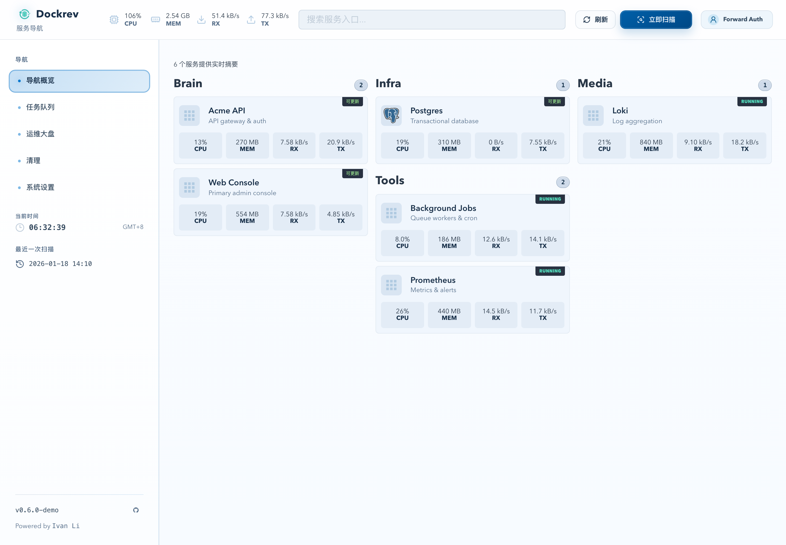
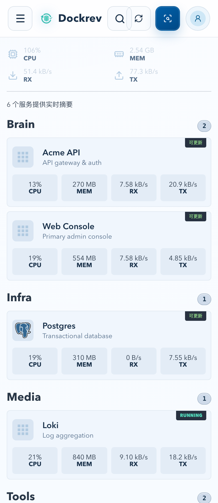
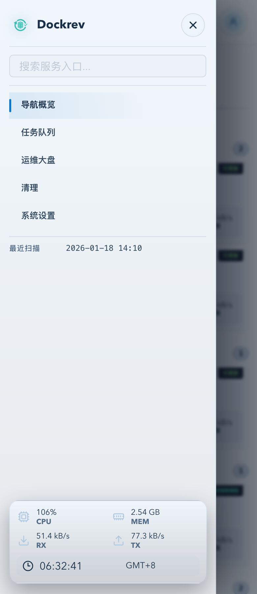
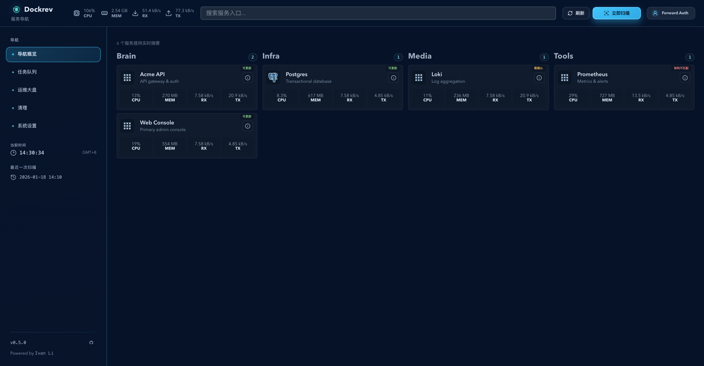
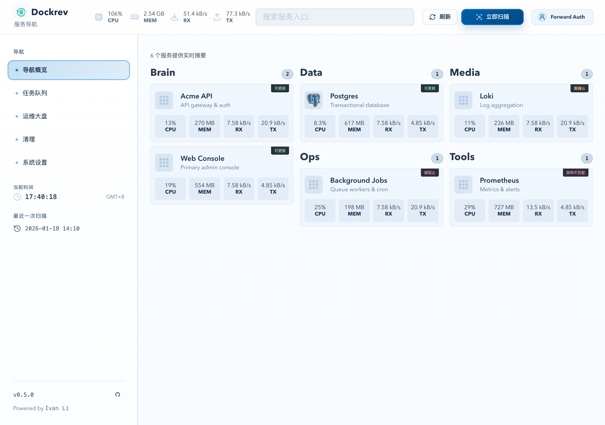
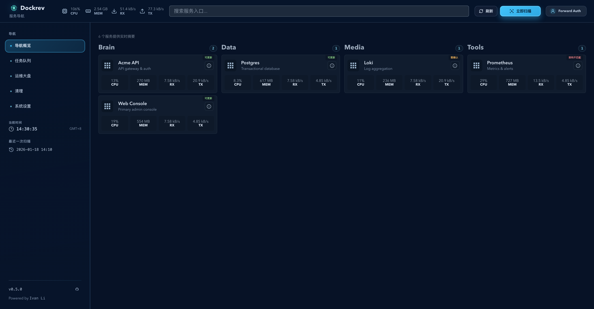
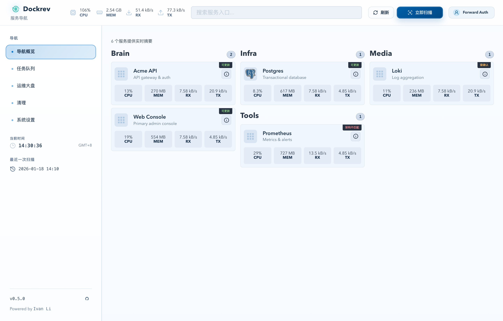
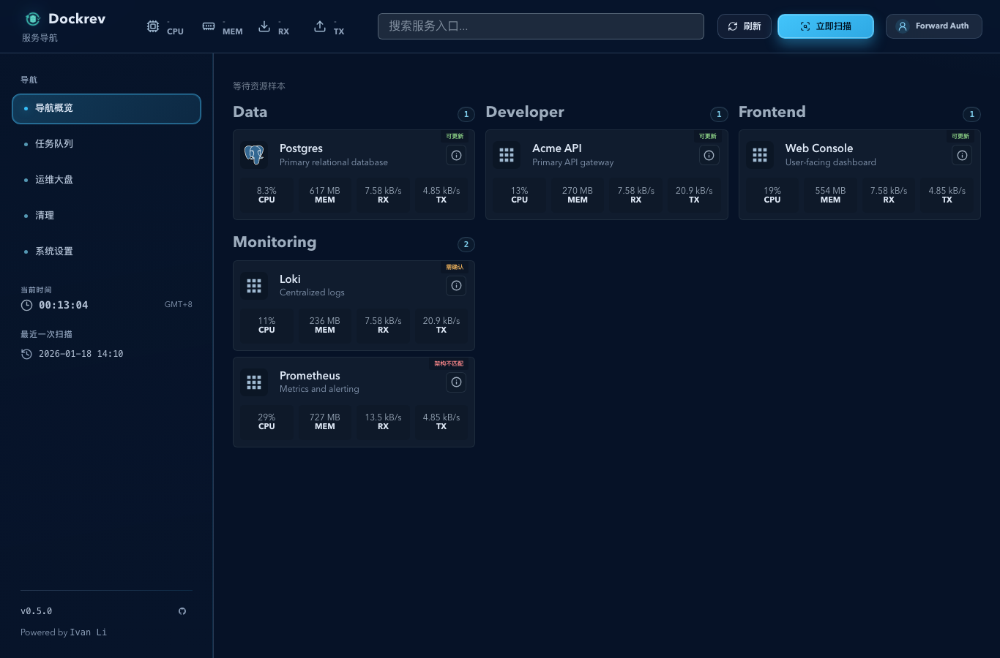
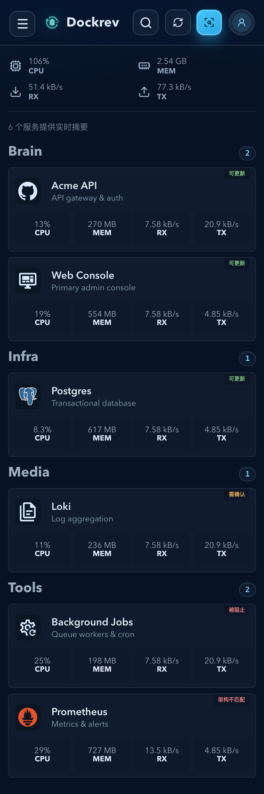
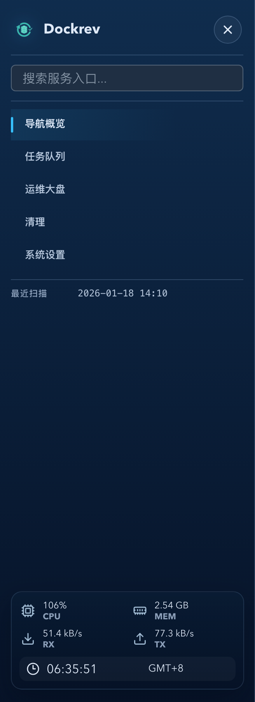

# Dockrev：服务页接管运维大盘，概览页改为 Homepage 兼容导航页（#hps4f）

## 状态

- Status: 已完成
- Created: 2026-04-13
- Last: 2026-05-07

## 背景 / 问题陈述

- 当前 `/` 概览页承载了“运行态与结果 + discovery 异常 + 更新候选”运维视图，但它并不是最适合日常入口的首页形态。
- 当前 `/services` 主要是服务列表与归档恢复，缺少概览页里的任务摘要、发现异常与更新候选主操作区，导致“找入口”和“做运维动作”分散在两个页面。
- 线上自托管栈已经在 compose 中沉淀了大量 `homepage.*` 标签；若 Dockrev 不兼容这些标签，就无法复用现有分类、名称、图标、入口地址等元数据。
- 不做这次调整，首页仍会偏向运维后台而非导航入口；同时已有 Homepage 标签数据也无法在 Dockrev 内形成完整导航体验。

## 目标 / 非目标

### Goals

- 让 `/services` 接管当前 `/` 概览页的运维大盘职责，并在更新候选区增加搜索。
- 让 `/` 改造成 Homepage 兼容的自托管服务导航页，按分组卡片展示服务入口。
- 将 `/` 的视觉结构升级为接近 Homepage：顶部资源摘要 / 搜索 / 当前时间一体化条，主体按分组形成多列，紧凑服务卡片纵向堆叠，移动端单列。
- 为 `/` 新增资源聚合摘要接口，卡片展示每个服务最新 CPU、内存、网络 RX/TX 速率与 stale 状态，避免前端逐服务请求历史接口。
- 在后端 discovery / compose 解析链中兼容 `homepage.group/name/icon/href/description` 五项标签，并通过现有 stack/service API 暴露给前端。
- 导航页仅展示带有合法 `homepage.href` 的 Web 入口服务，避免无 Web 界面的运行服务污染入口列表。
- 保持现有更新状态、新版本发现次数、归档恢复等既有语义不变。
- 修复 Homepage 导航页 audit 发现的信息密度、可访问性、light theme 对比度、图标可靠性与动画性能问题。

### Non-goals

- 不处理 `homepage.widget.*` 的解析、持久化或卡片渲染。
- 不新增独立导航服务清单 API；服务元数据继续复用现有 stack/service 响应。
- 不把每张卡片改成独立 SSE 实时流。
- 不伪造磁盘或主机级资源指标；顶部摘要只展示后端已有服务样本可聚合出的 CPU/MEM/RX/TX。
- 不改动服务详情、任务队列、更新执行语义。
- 不在本规格内执行 101 线上数据修复或批量补标签。
- 不把任意外部绝对图标 URL 交给后端代理；只有 Dockrev 自己生成的 Iconify/selfhst/dashboard-icons 地址走白名单代理。

## 范围（Scope）

### In scope

- `docs/specs/README.md`
- `docs/specs/hps4f-overview-homepage-nav/**`
- `crates/dockrev-api/src/api/**`
- `crates/dockrev-api/src/compose.rs`
- `crates/dockrev-api/src/discovery.rs`
- `crates/dockrev-api/src/db/**`
- `crates/dockrev-api/src/models/**`
- `web/src/api/**`
- `web/src/pages/**`
- `web/src/stories/pages/**`
- `web/src/App.css`
- `web/src/components/**`（若需抽共享导航/运维面板组件）

### Out of scope

- `homepage.widget.*` 的组件或数据模型
- 101 线上部署或远端 compose 批量修改
- 新增 Dockrev 外部可配置的图标映射注册表
- 变更归档恢复、更新任务、版本推测的业务语义

## 需求（Requirements）

### MUST

- `/services` 首屏必须展示原 `/` 概览页的三块核心内容：运行态与结果、discovery 异常、更新候选。
- `/services` 必须保留现有 archived stacks / services 恢复区，并置于运维大盘下方。
- `/services` 的新增搜索只过滤更新候选区，且匹配 `stack.name`、`service.name`、`image.ref`、`homepage.name`、`homepage.description`。
- `/` 必须展示分组导航卡片；仅纳入带有合法 `homepage.href` 的服务，显示时优先使用 `homepage.group/name/icon/description`，缺失字段按 `stack.name`、`service.name`、`image.ref`、默认图标兜底。
- `/` 顶部必须展示 Homepage-like 一体化条：资源摘要、搜索输入、当前时间；资源摘要只允许展示聚合服务样本得出的 CPU/MEM/RX/TX。
- 导航卡片点击必须在新标签页打开合法 `homepage.href`；服务详情通过卡片标题/描述行右侧的独立 icon 按钮进入。
- 导航卡片必须显示真实资源摘要 `CPU/MEM/RX/TX`；资源监控关闭、从未采样、stale 或请求失败时显示稳定占位，不发起逐服务历史请求。
- `/api/services/resource-usage/overview?window=1h` 必须返回所有 active 服务的最新资源样本摘要、样本数量、采样时间与 stale 标记；当窗口内无样本但该服务存在历史样本时，使用最近一次历史样本兜底并按当前时间标记 stale；监控关闭时返回 `enabled=false` 且不以错误中断导航页。
- 必须提供全站前端 demo：通过 Vite app 根路径 `/` 配合 `VITE_DOCKREV_DEMO=app` 安装本地 mock API 并渲染真实 Dockrev 应用；该 demo 不增加第二个 URL path 或 query 入口，且不依赖 Storybook iframe、toolbar 或 story runtime。
- 服务 API 中的 `Service` 必须新增可空 `homepage` 元数据对象，包含 `group`、`name`、`icon`、`href`、`description` 五项。
- compose 解析必须兼容 `labels` 的 YAML list / map 两种写法，并只提取 Homepage 基础五项标签。
- 前端图标解析必须支持绝对 URL、`mdi-*`、`si-*`、`sh-*` 与 dashboard-icons 文件名；无法识别时回退默认图标。
- Dockrev 生成的 `mdi-*`、`si-*`、`sh-*` 与 dashboard-icons 图标请求必须走同源白名单代理；代理仅允许固定 provider/path pattern、`svg|png|webp` 响应类型、短超时与缓存头，且 SVG 响应必须带禁止脚本执行的 CSP。
- 已失败的 Homepage 图标 URL 必须在前端会话中缓存，后续渲染直接走默认图标，避免重复慢失败。
- 导航卡片上的新版本/状态标记必须复用现有 `serviceRowStatus` 与 `newVersionDiscoveryCount` 语义，不引入第二套状态口径。
- Dockrev 自身服务即使有合法 `homepage.href` 与新版本候选，导航卡片也不得暴露普通单服务更新动作；Dockrev 自升级仍必须通过 Supervisor 专用入口执行。
- 导航页主体必须使用平衡多列分组布局，按 `1 + cards.length` 估算分组高度分配到最短列，分组列内服务卡片纵向堆叠；移动端必须降级为单列。
- 导航页搜索框必须使用 `type="search"` 且提供稳定可访问名称；窄屏顶部刷新、扫描、搜索与身份入口必须在标签隐藏后仍有 accessible name，触控目标不小于 44px。
- Light theme 下主 CTA、状态行文字与分组数量徽标必须满足 WCAG AA 4.5:1 对比度目标。
- 进度条动画不得通过 `width` transition 驱动；必须使用 transform 类动画并继续尊重 reduced-motion。
- 导航卡片右上角状态徽标必须复用 `serviceRowStatus` 对更新相关状态的判断；资源样本状态仅用于 `RUNNING/STALE/NO DATA` 等摘要态，不替代更新口径。
- 导航页顶部不再显示独立“服务导航”汇总卡片或旧 summary-card 布局。
- Storybook 必须覆盖新 `/` 导航页与新 `/services` 运维页的主要状态与关键交互，但不作为 owner-facing demo 入口。

### SHOULD

- 运维大盘与导航卡片应抽出可复用的共享显示/过滤逻辑，避免 `/` 与 `/services` 再次分叉。
- 导航页搜索应支持按 `homepage.group/name/description`、`image.ref`、`stack.name`、`service.name` 跨分组过滤，并保留分组标题可读性。
- Homepage 图标解析应尽量复用现有 icon 基础设施，避免引入新的品牌依赖碎片。

### COULD

- 将 Homepage 元数据与图标解析封装成独立 helper，供未来服务详情或更多页面复用。

## 功能与行为规格（Functional/Behavior Spec）

### Core flows

- 用户进入 `/services` 时，页面顶部先显示运维大盘：运行态与结果卡片、discovery 异常卡片、更新候选区域；更新候选区域提供搜索，并继续支持现有批量更新、单服务更新、跳转任务等操作。
- 用户继续向下滚动 `/services` 时，仍能看到当前的 active/archived 服务列表与归档恢复区，不丢失恢复能力。
- 用户进入 `/` 时，页面显示“以入口导航为主”的 Homepage-like 多列导航；带有合法 `homepage.href` 的服务按 `homepage.group` 分组，缺失 group 时按所属 `stack.name` 分组兜底。
- `/` 顶部使用资源摘要、搜索栏、当前时间组成的一体化条；搜索栏过滤当前导航卡片，提交方式为输入框回车，不展示独立搜索按钮。不再额外展示独立汇总卡片或统计芯片区。
- 每张导航卡片优先显示 `homepage.name`、`homepage.description`、`homepage.icon` 与 `homepage.href`；若展示字段缺失，则分别回退到 `service.name`、`image.ref` 与默认图标；没有合法 `homepage.href` 的服务不进入导航页。
- 每张导航卡片的内置图标源优先请求 `/api/homepage-icons/{provider}/{path}`，该接口只代理 Iconify、selfh.st icons 与 dashboard-icons 的受限路径；任意绝对 URL 仍由浏览器直连。
- 每张导航卡片读取 `/api/services/resource-usage/overview?window=1h` 的聚合结果展示 CPU、内存、网络 RX/TX 速率；该接口按窗口返回最新样本与前一条样本推导出的网络速率。
- 用户点击任一卡片时，Dockrev 在新标签页打开 `homepage.href`，不影响当前页面上下文；点击卡片内详情 icon 时进入 Dockrev 服务详情页。
- 若某服务存在新版本候选、需确认、被阻止、架构不匹配等状态，导航卡片上必须展示对应标记；其中非 Dockrev 自身服务的“可更新”标记可点击并弹出单服务更新确认对话框；若存在 `newVersionDiscoveryCount`，则继续显示发现次数。

### Edge cases / errors

- 若服务有合法 `homepage.href` 但没有 `homepage.group`，则必须归入 `stack.name` 兜底分组，而不是隐藏。
- 若服务没有 `homepage.href`、值为空或 URL 不合法，则不显示在导航页；它仍可在 `/services` 与服务详情页中管理。
- 若 `homepage.icon` 不可识别或加载失败，则使用统一默认图标，不能让卡片留空。
- 若资源监控关闭，则 Overview 资源摘要和卡片指标显示占位，并保留所有合法 Web 入口。
- 若资源样本缺失或超过 stale 阈值，则卡片布局不抖动；从未采样显示 `NO DATA`，窗口内无样本但存在历史样本时显示 `STALE` 并保留最近数值。
- 若 `/services` 搜索为空结果，仅更新候选区域展示空态；任务摘要、discovery 异常与归档恢复区仍应正常显示。
- 若同一 stack 下部分服务有合法 Homepage href、部分没有，则导航页只展示有 Web 入口的服务，其余服务留在运维大盘管理。
- 若 compose 同时出现 `homepage.widget.*`，本轮必须忽略，不得报错或污染 `homepage` 基础元数据。

## 接口契约（Interfaces & Contracts）

### 接口清单（Inventory）

| 接口（Name） | 类型（Kind） | 范围（Scope） | 变更（Change） | 契约文档（Contract Doc） | 负责人（Owner） | 使用方（Consumers） | 备注（Notes） |
| --- | --- | --- | --- | --- | --- | --- | --- |
| `Service.homepage` | HTTP API | internal | Modify | `./contracts/http-apis.md` | dockrev-api | web | stack/service 响应新增可空 Homepage 元数据 |
| `GET /api/services/resource-usage/overview` | HTTP API | internal | New | `./contracts/http-apis.md` | dockrev-api | web | Overview 聚合最新资源摘要 |
| `GET /api/homepage-icons/{provider}/{path}` | HTTP API | internal | New | `./contracts/http-apis.md` | dockrev-api | web | Homepage 内置图标源同源白名单代理 |
| `services.homepage_json` | DB | internal | New | `./contracts/db.md` | dockrev-api | dockrev-api | 持久化 Homepage 五项基础元数据 |
| `compose services.<name>.labels homepage.*` | File format | internal | Modify | `./contracts/file-formats.md` | dockrev-api | dockrev-api | 兼容 Homepage 标签 list/map 两种写法 |

- [contracts/README.md](./contracts/README.md)
- [contracts/http-apis.md](./contracts/http-apis.md)
- [contracts/db.md](./contracts/db.md)
- [contracts/file-formats.md](./contracts/file-formats.md)

## 验收标准（Acceptance Criteria）

- Given 用户打开 `/services`，When 页面加载完成，Then 首屏展示原 `/` 概览页的三块核心内容，且更新候选区支持搜索过滤。
- Given `/services` 的更新候选区存在搜索关键字，When 用户输入 `gitea` 或某个服务名，Then 仅候选区结果被过滤，任务摘要、discovery 异常与 archived 恢复区不受影响。
- Given compose 为某服务配置了 `homepage.group/name/icon/href/description`，When discovery 完成并前端获取 stack/service 数据，Then 该服务的 `homepage` 元数据按原值返回且可在导航页展示。
- Given compose 的 `labels` 使用 YAML map 写法或 list 写法，When 后端解析，Then Homepage 基础五项标签都能正确提取。
- Given 服务未配置 `homepage.href` 或 href 不合法，When 用户打开 `/`，Then 该服务不会出现在导航页。
- Given 导航卡片存在 `homepage.href`，When 用户点击卡片，Then 该地址在新标签页打开。
- Given 导航卡片存在对应服务，When 用户点击卡片右侧详情 icon，Then Dockrev 进入该服务详情页。
- Given 非 Dockrev 自身导航卡片状态为“可更新”，When 用户点击该标记，Then 弹出单服务更新确认对话框。
- Given Dockrev 自身导航卡片状态为“可更新”，When 用户打开 `/`，Then 卡片保留状态展示但不渲染普通单服务更新按钮，且后端普通 service-scope update 也不会选中 Dockrev 镜像。
- Given 服务当前存在 `serviceRowStatus=blocked|confirm|archMismatch|newVersion` 等状态或 `newVersionDiscoveryCount>0`，When `/` 渲染导航卡片，Then 卡片展示与现有服务列表一致的状态标记与发现次数。
- Given `homepage.icon` 为绝对 URL、`mdi-*`、`si-*`、`sh-*`、dashboard-icons 文件名或未知值，When `/` 渲染导航卡片，Then 图标分别按对应规则显示或回退默认图标。
- Given `homepage.icon` 为 Dockrev 可解析的 `mdi-*`、`si-*`、`sh-*` 或 dashboard-icons 文件名，When `/` 渲染导航卡片，Then 图片请求使用 `/api/homepage-icons/...` 同源代理；若代理返回失败，Then 卡片立即回退默认图标且后续同 URL 不重复请求。
- Given 用户打开 `/`，When 页面展示 Homepage 导航卡片，Then 页面使用顶部资源/搜索/时间条、多列分组、紧凑深色服务卡片，且移动端降级为单列。
- Given 用户在桌面宽度打开 `/` 且存在长短不一的分组，When 导航页渲染完成，Then 分组按平衡列堆叠，短分组下方不再出现由 CSS grid 行高导致的大块空白。
- Given 用户在 390px 宽度打开 `/`，When 顶部动作标签被视觉隐藏，Then 刷新、扫描、搜索按钮仍可被辅助技术读出，主要顶栏控件触控目标不小于 44px，页面没有横向滚动。
- Given 用户在 light theme 打开 `/`，When 页面展示主 CTA、资源状态行与分组数量徽标，Then 这些文字与背景的对比度满足 WCAG AA 4.5:1。
- Given 用户通过 `bun run demo:app` 打开 `/`，When 前端加载完成，Then 页面通过纯前端 mock API 渲染同一 Dockrev 应用体验，且不出现 Storybook shell。
- Given `/api/services/resource-usage/overview?window=1h` 返回最新样本，When `/` 渲染导航卡片，Then 每张卡片显示真实 CPU/MEM/RX/TX。
- Given 资源监控关闭、从未采样、窗口内无样本但存在历史样本或样本 stale，When `/` 渲染导航卡片，Then 服务入口仍展示，指标显示稳定占位或 stale 状态；存在历史样本时保留最近数值。
- Given 某服务存在 `serviceRowStatus=updatable|hint|archMismatch|blocked`，When `/` 渲染导航卡片，Then 右上角徽标展示与现有服务列表一致的状态语义；正常资源状态不得新增第二套更新口径。
- Given 运行 `cargo test`、`bun run --cwd web lint`、`bun run --cwd web build`、`bun run --cwd web build-storybook` 与 `bun run --cwd web test-storybook -- --url <leased-port>`，When 本改动完成，Then 全部通过。

## 实现前置条件（Definition of Ready / Preconditions）

- 页面职责互换、Homepage 五项标签范围与 PR-ready 收口条件已锁定。
- 已确认本轮只兼容 `homepage.group/name/icon/href/description`，忽略 `homepage.widget.*`。
- 已确认 `/services` 继续保留 archived 恢复区，且无 Web 入口的服务不出现在导航页。

## 非功能性验收 / 质量门槛（Quality Gates）

### Testing

- Unit tests: Rust compose label parsing、DB persistence / readback、discovery sync coverage；前端 overview/homepage helper tests（若新增 helper）
- Integration tests: stack/service API round-trip for Homepage metadata；Dockrev self-update guard 的普通 service-scope API 与更新选择回归；页面搜索/新标签页行为的 Storybook `play` 覆盖；全站前端 demo smoke 验证
- E2E tests (if applicable): Frontend-demo-driven smoke checks for owner-facing `/` under `VITE_DOCKREV_DEMO=app`；Storybook-driven interaction checks for overview navigation and services candidate search

### UI / Demo / Storybook (if applicable)

- App demo: `/` under `VITE_DOCKREV_DEMO=app` must install a browser-only mock API before React renders; no alternate demo route or query trigger is allowed
- Stories to add/update: `OverviewPage`, `ServicesPage`
- Docs pages / state galleries to add/update: Overview grouped navigation gallery；Services operations-dashboard + archived restore gallery
- `play` / interaction coverage to add/update: overview search + card target behavior；homepage accessibility names；dense balanced grouping；light contrast story；services candidate search + archived area preservation
- Visual regression baseline changes (if any): new Homepage-style balanced grouped navigation canvas/docs screenshots

### Quality checks

- `cargo test`
- `bun run --cwd web lint`
- `bun run --cwd web build`
- `bun run --cwd web build-storybook`
- `bun run --cwd web test-storybook -- --url <leased-port>`
- `npx --yes impeccable detect --json --fast web/src`
- App demo smoke: run Vite app with `VITE_DOCKREV_DEMO=app` and verify `/`

## 文档更新（Docs to Update）

- `docs/specs/README.md`: 新增索引项并在完成后同步状态

## 计划资产（Plan assets）

- Directory: `docs/specs/hps4f-overview-homepage-nav/assets/`
- In-plan references: ``
- Visual evidence source: maintain `## Visual Evidence` in this spec when owner-facing or PR-facing screenshots are needed.

## Visual Evidence

- source_type: app_demo
  story_id_or_title: `http://127.0.0.1:<leased-port>/`
  state: `homepage audit app demo desktop`
  evidence_note: 验证 Vite app demo 已使用修复后的 Homepage 入口，桌面端为紧凑平衡列，顶部资源/搜索/时间条与 CTA 在 light theme 下保持可读对比度。

  

- source_type: app_demo
  story_id_or_title: `http://127.0.0.1:<leased-port>/`
  state: `homepage audit app demo mobile`
  evidence_note: 验证 390px app demo 无横向滚动，移动端主内容降级为单列，顶部动作保持 44px 触控目标与稳定 accessible name。

  

- source_type: app_demo
  story_id_or_title: `http://127.0.0.1:<leased-port>/`
  state: `homepage audit app demo mobile hamburger menu`
  evidence_note: 验证全站前端 demo 的移动端汉堡菜单中，搜索位于导航项上方，资源摘要与当前时间固定在抽屉底部，且无 live/story wrapper 残留。

  

- source_type: storybook_canvas
  story_id_or_title: `pages-overviewpage--default`
  state: `homepage v2 desktop resource/search/time strip + grouped columns`
  evidence_note: Storybook 作为覆盖与回归入口，验证 `/` 已切换为 Homepage-like 导航页，顶部展示资源摘要、搜索与当前时间，主体按 Homepage 分组形成多列，卡片展示真实 CPU/MEM/RX/TX 摘要与复用的更新状态徽标。

  

- source_type: storybook_canvas
  story_id_or_title: `pages-overviewpage--audit-proof`
  state: `homepage audit proof story canvas`
  evidence_note: 验证单个 proof story 同时覆盖 light theme、搜索/刷新/扫描 accessible name、平衡列连续堆叠、内置图标代理、绝对 URL 直连与 fallback 图标行为。

  

- source_type: storybook_canvas
  story_id_or_title: `pages-overviewpage--dense-balanced-groups`
  state: `homepage audit dense balanced grouping`
  evidence_note: 验证长短分组不再被同一 CSS grid row 拉齐，桌面端分组按列连续堆叠，消除短分组下方的大块空白。

  

- source_type: storybook_canvas
  story_id_or_title: `pages-overviewpage--light-contrast`
  state: `homepage audit light theme contrast`
  evidence_note: 验证 light theme 下主 CTA、状态行文字与分组数量徽标使用修复后的对比度 token。

  

- source_type: storybook_canvas
  target_program: mock-only
  capture_scope: browser-viewport
  requested_viewport: `1366x900`
  viewport_strategy: devtools-emulate
  sensitive_exclusion: N/A
  submission_gate: pending-owner-approval
  story_id_or_title: `pages-overviewpage--metrics-stale`
  state: `resource overview stale sample keeps latest values`
  evidence_note: 验证 Overview 资源样本 stale 时，卡片继续保留最近 CPU/MEM/RX/TX 数值并显示 `STALE` 摘要态。

  

- source_type: storybook_canvas
  story_id_or_title: `pages-overviewpage--mobile-stacked`
  state: `homepage audit mobile single-column stack`
  evidence_note: 验证移动端页头不再承载资源/搜索/时间条；该条进入导航页内容模块，分组列降级为单列纵向堆叠。

  

- source_type: storybook_canvas
  story_id_or_title: `pages-overviewpage--mobile-stacked`
  state: `homepage audit mobile hamburger menu`
  evidence_note: 验证移动端汉堡菜单内同样提供资源摘要、搜索与当前时间，导航抽屉不依赖页头承载这些控件。

  

## 资产晋升（Asset promotion）

None

## 实现里程碑（Milestones / Delivery checklist）

- [x] M1: 后端完成 Homepage 元数据数据模型、持久化列与 API 类型扩展
- [x] M2: compose/discovery 链完成 Homepage 标签解析、同步与 Rust 回归
- [x] M3: `/services` 接管运维大盘并新增更新候选搜索，同时保留 archived 恢复区
- [x] M4: `/` 重建为 Homepage 兼容导航页，完成分组卡片、图标解析、Web 入口过滤、详情入口与状态标记
- [x] M5: 全站前端 demo、Storybook 覆盖、视觉证据、浏览器 smoke、review-loop 与 PR-ready 收口完成

## 方案概述（Approach, high-level）

- 后端以 `services` 表中的 JSON 列持久化 Homepage 基础五项元数据，discovery 每次根据 compose 解析结果执行 upsert / overwrite / clear，保证运行态以当前 compose 为准。
- 前端通过共享的服务状态判定与图标 helper 复用既有更新标记口径，只对页面布局与导航方式做职责重组。
- `/services` 通过抽取/复用现有概览页逻辑承接运维大盘，`/` 则改用分组卡片网格承接“日常进入服务”的主入口体验。

## 风险 / 开放问题 / 假设（Risks, Open Questions, Assumptions）

- 风险：`homepage.icon` 来源较自由，前端若解析策略过宽可能引入错误请求或图标闪烁，需要明确兜底规则。
- 风险：页面职责互换后，旧的 Storybook 场景、文案和路由断言容易一起失效；owner-facing demo 不再依赖 Storybook，但 Storybook 覆盖仍需同步刷新。
- 假设：存量 compose 中的 Homepage 标签值被视为可信配置输入，不在本轮做额外校验标准化。

## 变更记录（Change log）

- 2026-04-13：创建规格，锁定页面职责互换、Homepage 五项标签合同、前端图标兼容范围与 fast-track PR-ready 收口条件。
- 2026-05-01：追加 Homepage audit 修复：平衡列信息密度、可访问名称、44px 移动端触控、light theme 对比度、同源白名单图标代理与 transform 进度动画。

## 参考（References）

- [Homepage Docker labels docs](https://gethomepage.dev/configs/docker/)
- [Homepage services docs](https://gethomepage.dev/configs/services/)
