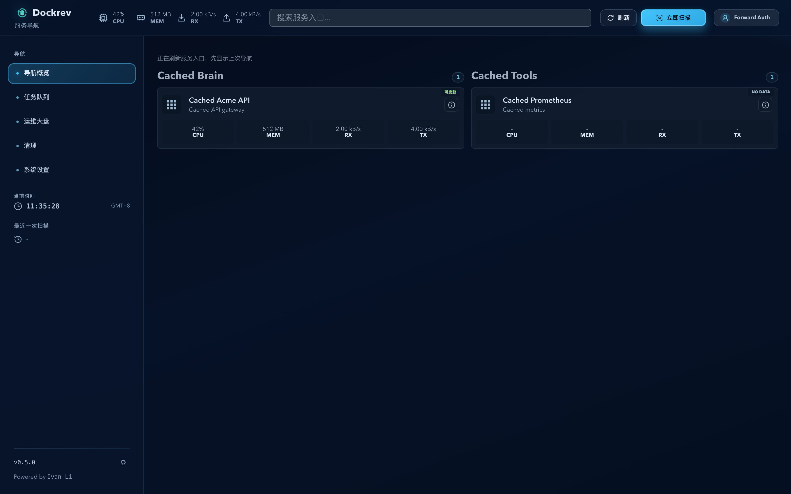
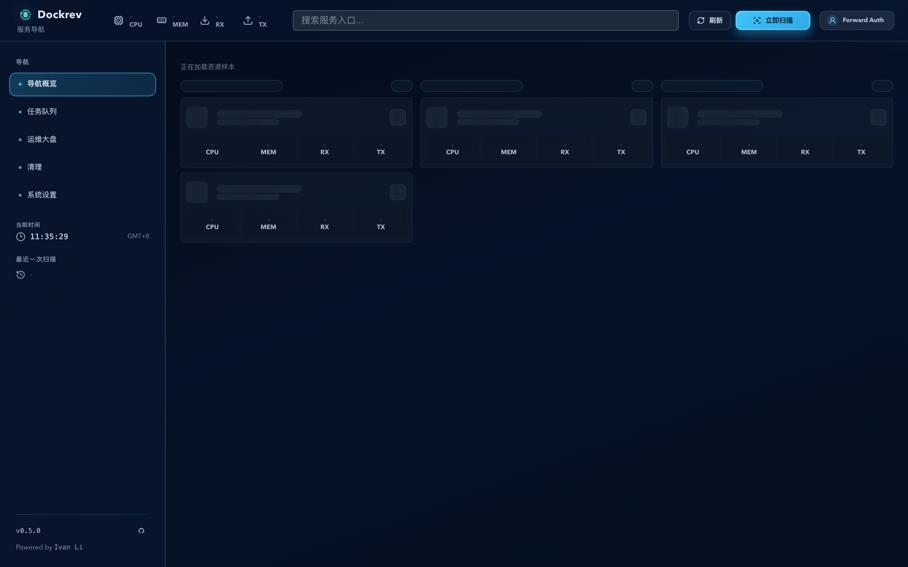

# Dockrev 首页导航首屏性能与抖动修复（#hps4f）

## 状态

- Status: In progress
- Created: 2026-04-13
- Last: 2026-06-27

## 背景 / 问题陈述

- 首页 `/` 当前真实加载链路是 `GET /api/stacks` + `GET /api/services/resource-usage/overview` + `N × GET /api/stacks/{id}`。在 101 现网 reload 取证里，`/api/stacks` 约 `1.97s`，`/api/services/resource-usage/overview?window=1h` 约 `1.94s`，随后还有 24 个 `/api/stacks/{id}`，单个约 `147-316ms`。
- 前端在缓存首显后，会在 `liveCards.length > 0` 时立刻从完整缓存切到 partial live 子集；与此同时每个 `getStack()` 完成都会单独触发 `setDetails()`，导致分组、排序与 `balanceHomepageGroups()` 在同一轮刷新里反复重算，用户可见为整页刷新与整列抖动。
- 后端资源概览原先直接读取 `service_resource_samples` 历史大表。101 现网同日诊断时，该表约有 `2,029,393` 行，SQLite 仍运行在 `journal_mode=delete`、`busy_timeout=0`，只读查询已经观测到 `database is locked`，首页主读链路被数据库竞争放大。
- 首页图标失败路径还会叠加次级噪音。多个 homepage icon 请求在真实页发生 `404/500` 慢失败，单条可拖到 `3s+`，虽然不是主瓶颈，但会造成卡片图标级回退抖动。

## 目标 / 非目标

### Goals

- 为首页引入单次 read model：新增 `GET /api/homepage/nav`，一次返回首页卡片、顶部资源摘要、更新时间与更新状态输入字段，去掉首页 `1 + N` 客户端扇出。
- 为资源摘要引入轻量持久化 latest 表 `service_resource_latest_samples`，由采样写入时同步 upsert 最新样本与前一条网络计数；首页与 `/api/services/resource-usage/overview` 都读取该小表，不再在请求时扫描历史表。
- 将 SQLite 运行时固定切到 `WAL` 并配置非零 `busy_timeout`，把“读请求因为锁竞争超时/失败”从运维经验变成应用默认配置。
- 保留“极速优先”的 cached-first 首屏，但升级为单一 `HomepageSnapshotV2`，把卡片和资源摘要收敛到同一时间戳快照。
- live 响应到达后，首页必须按 `serviceId` in-place merge，禁止整页先清空、先缩到 partial live 子集、或随着单个服务返回连续整列重排。
- 图标位必须保持固定尺寸、固定 fallback，并对同一坏 URL 做会话级负缓存，避免重复慢失败与布局变化。

### Non-goals

- 不改 `/services` 运维大盘的交互设计；它只共享 backend/read model 优化的顺带收益。
- 不在本轮重写资源历史图表与详情页历史接口；`service_resource_samples` 历史表继续保留给趋势图使用。
- 不在本轮处理 registry `429`、snapshot worker 调度策略或 101 现网部署回滚，除非它们直接阻塞首页主读取链路。
- 不把已有 `/api/stacks*` 或 `/api/services/resource-usage/overview` 删除；本轮只增加首页专用 read model，并把 overview 读路径切到 latest 表。

## 范围（Scope）

### In scope

- `docs/specs/hps4f-overview-homepage-nav/**`
- `crates/dockrev-api/src/api/**`
- `crates/dockrev-api/src/db/**`
- `web/src/api/**`
- `web/src/pages/OverviewPage.tsx`
- `web/src/pages/homepageSnapshot.ts`
- `web/src/stories/pages/OverviewPage.stories.tsx`
- `web/src/stories/mocks/**`
- `web/tests/homepage*.test.ts`

### Out of scope

- `/services` 页面新交互或视觉结构改版
- 资源历史趋势接口与图表语义
- 101 线上部署、人工 VACUUM/重建数据库、手工修复历史坏 icon 数据

## 需求（Requirements）

### MUST

- 首页 owner-facing 主数据请求必须收敛为单个 `GET /api/homepage/nav`；其余 `version/settings/deploy-welcome` 等辅助请求不得再决定卡片首屏可见性。
- `GET /api/homepage/nav` 必须返回：
  - `generatedAt`
  - `lastCheckAt`
  - `resourceSummary`
  - `items[]`
- `items[]` 中每项必须包含：
  - `stackId`、`stackName`
  - `serviceId`、`serviceName`
  - `imageRef`、`imageTag`
  - `imageDigest`、`imageResolvedTag`、`imageResolvedTags`
  - `isDockrev`
  - 完整 `homepage`
  - 现有更新状态判断所需字段：`candidate`、`ignore`、`versionInference`、`newVersionDiscoveryCount`、`settings`、`archived`
  - 该服务最新资源摘要 `resource`
- 首页前端不得再调用 `listStacks()`、`getStack()` 或独立资源概览接口来拼卡片。
- 首页缓存必须升级为单一 `HomepageSnapshotV2`，并支持从旧的 nav/resource 双 snapshot 兼容迁移。
- 首页在缓存存在时必须立即显示缓存卡片与缓存资源摘要；live 成功后仅允许一次完整 payload 应用后的局部增删与单次列平衡，不允许出现：
  - 整页空白
  - partial live 子集替换完整缓存
  - 随着单个服务返回而连续整列重排
- live payload 如果最终为空，首页必须接受“当前没有可展示的服务入口”这一真实结果，不能错误回退旧缓存。
- `service_resource_latest_samples` 必须由资源采样写入路径同步 upsert，保存最新样本和上一条网络计数与时间。
- `/api/services/resource-usage/overview` 与 `/api/homepage/nav` 都必须从 latest 表读取，而不是在请求时扫描 `service_resource_samples` 历史大表。
- SQLite 初始化必须在应用启动时固定执行：
  - `PRAGMA foreign_keys = ON`
  - `PRAGMA journal_mode = WAL`
  - `PRAGMA busy_timeout = 5000`
- 首页图标位必须固定尺寸，失败时立即回退统一默认图标；相同坏 URL 在同一浏览器会话里不得重复触发慢失败请求。
- 首页卡片状态徽标与单服务更新按钮语义必须保持不回退：
  - 新标签打开 `homepage.href`
  - 详情跳转
  - 非 Dockrev 单服务更新按钮
  - 状态徽标
  - 顶部资源摘要

### SHOULD

- 首页 live payload 应用应复用已有卡片对象，尽量减少不必要的 React 重建与 DOM 抖动。
- 首页 read model 的排序应稳定按 `stackName/serviceName` 输出，便于前端缓存 merge 与测试断言。
- 后端对显然不可解析或无效的 homepage icon 值应尽量直接返回 `null`/可回退值，减少浏览器侧重复失败。

## 功能与行为规格（Functional/Behavior Spec）

### Core flows

- 用户打开 `/` 时，若本地存在 `HomepageSnapshotV2`，页面先立即渲染快照卡片与快照资源摘要，不等待网络。
- 页面随后只发起一次 `GET /api/homepage/nav`。响应返回后，按 `serviceId` 把 live 卡片合入当前网格：
  - 已存在服务只 patch 内容
  - 新增服务插入其目标分组
  - 本次 payload 中已消失的服务在同一次 apply 中移除
- 分组、排序与 `balanceHomepageGroups()` 只基于完整 live payload 重新计算一次。
- 如果没有快照，则首页展示稳定 skeleton，而不是误导性的空态。
- 如果单次 nav payload 失败，但存在快照，则首页继续展示旧快照并暴露“首页导航刷新失败，保留旧快照”状态。
- 如果资源监控关闭，`resourceSummary.enabled=false`，首页仍显示服务入口，但摘要与卡片指标展示稳定占位。

### Edge cases / errors

- 非法或空 `homepage.href` 的服务不得进入 `items[]`，前端也必须再次校验，避免脏数据穿透成可点击卡片。
- 图标失败不能触发卡片高度变化，不能让列布局因为 fallback icon 重新抖动。
- 当 live payload 返回空列表时，首页应稳定进入真实空态，不能“因为缓存存在而继续显示已删除服务”。

## 接口契约（Interfaces & Contracts）

### 接口清单（Inventory）

| 接口（Name） | 类型（Kind） | 范围（Scope） | 变更（Change） | 契约文档（Contract Doc） | 负责人（Owner） | 使用方（Consumers） | 备注（Notes） |
| --- | --- | --- | --- | --- | --- | --- | --- |
| `GET /api/homepage/nav` | HTTP API | internal | New | `./contracts/http-apis.md` | dockrev-api | web | 首页单次 read model |
| `GET /api/services/resource-usage/overview` | HTTP API | internal | Modify | `./contracts/http-apis.md` | dockrev-api | web | 改为读取 latest 表 |
| `service_resource_latest_samples` | DB | internal | New | `./contracts/db.md` | dockrev-api | dockrev-api | 首页/latest read model 小表 |
| `HomepageSnapshotV2` | File format | internal | New | `./contracts/file-formats.md` | web | web | 单快照缓存格式 |

- [contracts/README.md](./contracts/README.md)
- [contracts/http-apis.md](./contracts/http-apis.md)
- [contracts/db.md](./contracts/db.md)
- [contracts/file-formats.md](./contracts/file-formats.md)

## 验收标准（Acceptance Criteria）

- Given 真实 `https://dockrev.ivanli.cc/` reload，When 首页首屏加载，Then owner-facing 主数据链路收敛为单个 `GET /api/homepage/nav`，不再出现 `24 × /api/stacks/{id}` 扇出。
- Given 101 现网或同量级本地种子数据，When `GET /api/homepage/nav` 处于 warm path，Then 目标响应时间 `< 500ms`；若未达标，必须继续提供 SQL/锁竞争证据，不能以“前端已平滑”收口。
- Given 首页存在缓存 snapshot，When 用户 reload，Then 卡片网格连续可见，不能先空白、不能先缩到 partial live 子集、不能在同一轮刷新里多次整列重排。
- Given 首页图标失败，When 浏览器渲染卡片，Then 卡片高度、图标槽尺寸和列布局保持稳定；相同坏 URL 在同一会话里不重复慢失败。
- Given live payload 最终为空，When 首页完成刷新，Then 页面显示真实空态，而不是错误保留缓存服务。
- Given 首页存在非 Dockrev 可更新服务，When 用户点击状态按钮，Then 单服务更新确认对话框仍可打开。

## 非功能性验收 / 质量门槛（Quality Gates）

### Testing

- Backend:
  - `service_resource_latest_samples` upsert 回归
  - `/api/services/resource-usage/overview` 基于 latest 表返回资源摘要
  - `/api/homepage/nav` 契约、排序、过滤与状态字段回归
  - SQLite PRAGMA 初始化回归
- Frontend:
  - `HomepageSnapshotV2` round-trip 与 v1 兼容迁移
  - cached-first + slow live 返回
  - live empty payload 不回退旧缓存
  - icon failure 稳定 fallback

### UI / Demo / Storybook

- Stories to add/update:
  - `CachedInstantNavigation`
  - `ColdStartSkeleton`
  - `MetricsUnavailable`
  - `MetricsStale`
  - `IconKinds`
- `play` / interaction coverage:
  - 缓存首显期间不出现空态
  - slow nav payload 后卡片稳定切换
  - 单 payload 失败时保留缓存快照

### Quality checks

- `cargo test -p dockrev-api`
- `bun test web/tests/homepageSnapshot.test.ts web/tests/homepageRefreshState.test.ts`
- `bun run --cwd web build`
- `bun run --cwd web build-storybook`

## 文档更新（Docs to Update）

- `docs/specs/hps4f-overview-homepage-nav/contracts/http-apis.md`
- `docs/specs/hps4f-overview-homepage-nav/contracts/db.md`
- `docs/specs/hps4f-overview-homepage-nav/contracts/file-formats.md`

## Visual Evidence

- 现有本 spec 下的 Homepage 审核图继续保留作为视觉结构参考。
- 本轮新增的 owner-facing 收口证据应补充：
  - before/after 请求瀑布
  - 缓存 reload 期间网格连续可见
  - 图标失败 fallback 稳定
- 本地 Storybook 收口证据（source_type=storybook_canvas）：
  - `pages-overviewpage--cached-instant-navigation`
    - 证明点：慢 live payload 返回前，缓存卡片与缓存资源摘要已可见；页面不先掉成空态。
    - 资产：
  - `pages-overviewpage--cold-start-skeleton`
    - 证明点：无缓存冷启动时，首页先显示稳定 skeleton，而不是误导性空列表；live 完成后再进入真实卡片态。
    - 资产：
