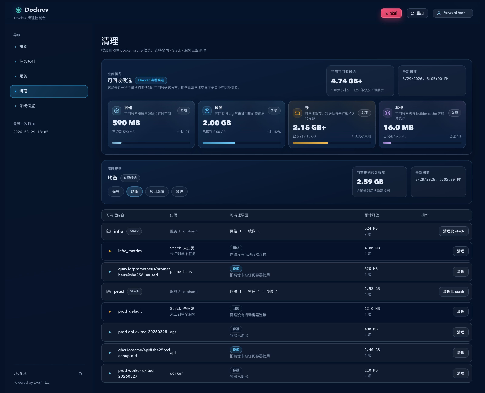
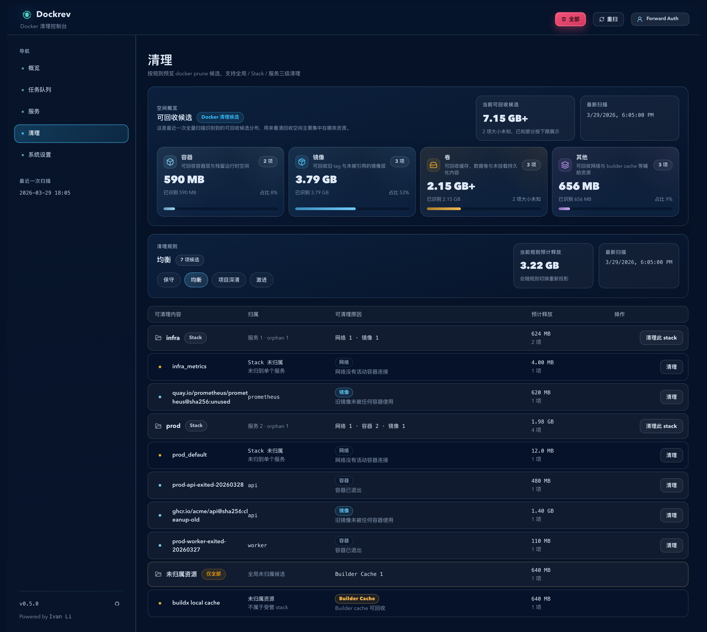

# Dockrev：Cleanup 顶部按钮图标与估算兜底收口（#htwyp）

## 状态

- Status: 已完成
- Created: 2026-04-06
- Last: 2026-04-07
- Notes: fast-track（PR #205 released as 0.39.3；2026-04-07 follow-up hardens runtime estimate fallbacks so Cleanup no longer stalls on unknown sizes when daemon metadata is missing）

## 背景 / 问题陈述

- Cleanup 页顶部 `全部 / 重扫` 缺少左侧图标，首屏操作辨识度不如其他页。
- 当前 cleanup scan 只在部分 Docker 命令返回可回收字节时才显示数值；`volume inspect UsageData.Size` 与 `buildx du` 摘要解析拿不到值时，UI 会直接显示 `待估`。
- `待估` 容易被理解为“系统稍后会自动补值”，但真实语义是“本次扫描没有拿到明确大小”，会误导操作员判断。

## 目标 / 非目标

### Goals

- 顶部 `全部 / 重扫` 复用现有图标体系，补齐一致的前导 icon。
- 为 unused volume 增加 `docker system df -v` + `Mountpoint -> du -sk` 双层尺寸兜底；builder cache 改为优先走 `docker buildx du --format=json`，并在 shared/缺值场景回退到文本摘要 `Reclaimable:` 总量。
- 当 Docker 仍不给值时，把 Cleanup 页文案统一为“大小未知 / 已知部分按下限展示”，不再显示 `待估`。
- 保持现有 cleanup API schema、scope/filter/fingerprint/apply 语义不变。

### Non-goals

- 改造 cleanup preset、scope、确认弹窗流程或 apply 执行语义。
- 为所有 `清理` 行内按钮统一加 icon。
- 通过直接遍历宿主机 volume 目录等高风险方式强行计算精确大小。

## 范围（Scope）

### In scope

- `crates/dockrev-api/src/cleanup.rs` 的 volume / builder cache 估算来源增强（含 mountpoint/summary 强制兜底）与测试。
- `web/src/pages/CleanupPage.tsx` 顶部按钮图标与 unknown copy 调整。
- `web/src/stories/pages/CleanupPage.stories.tsx` 的 autodocs / play 回归更新。
- 本 follow-up spec 的状态、验收、视觉证据与索引同步。

### Out of scope

- 新增或修改 `CleanupScanResponse` / `CleanupResourceItem` 字段。
- cleanup 任务日志、job summary wire shape 调整。
- 非 Cleanup 页面或非 Storybook 视觉资产。

## 需求（Requirements）

### MUST

- 顶部 `全部` 按钮显示清理图标，`重扫` 按钮显示刷新图标，且 loading / disabled 态布局不退化。
- 当 Docker metadata 缺失但 volume mountpoint 可读、或 builder summary 可提供 `Reclaimable:` 汇总时，Cleanup 页仍必须显示数值而非 unknown。
- 当所有估算来源都失败时，UI 必须显示“未知大小”语义，并明确“已知部分按下限展示 / 释放量按下限展示”。
- Storybook 现有 `Pages/CleanupPage` 入口必须更新，覆盖新 copy 与顶部按钮 icon 回归。

### SHOULD

- Builder cache JSON 主路径失败时自动回退到现有文本摘要解析，不把可估算状态错误降级为 unknown。
- Volume 兜底只在 `volume inspect` 未提供 `UsageData.Size` 时触发，并按 `system df -v` 优先、`Mountpoint -> du -sk` 次之，避免覆盖 daemon 直接给出的值。

### COULD

- 在 autodocs 说明里补一句该页对“未知大小”语义的解释。

## 功能与行为规格（Functional/Behavior Spec）

### Core flows

- Cleanup 页继续先做 page scan，再基于 page scan 投影各 preset；顶部动作按钮仅新增前导 icon，不改交互路径。
- 后端扫描 unused volumes 时，优先使用 `volume inspect` 的 `UsageData.Size`；若缺失，则先从同轮 `docker system df -v` 的 local volumes 区块按 volume 名称补齐大小，再回退到 `Mountpoint -> du -sk` 读取真实占用。
- 后端扫描 builder cache 时，优先解析 `docker buildx du --format=json` 的 reclaimable 记录；若 JSON 不可用、不可解析，或仅得到 shared lower-bound，则回退到当前 `buildx du` 文本摘要的 `Reclaimable:` 行作为总量兜底。
- 前端渲染估算值时，未知且无已知字节时显示 `未知大小`；未知但已有已知部分时继续显示 `<bytes>+`，并在 hint 中明确“大小未知 / 下限展示”。

### Edge cases / errors

- `docker system df -v` 失败或未返回目标 volume 行时，volume 继续尝试 `Mountpoint -> du -sk`；仅在 mountpoint 不可读或命令失败时才保持 unknown，且不阻断整页扫描。
- `docker buildx du --format=json` 返回空、非法 JSON，或只给 shared lower-bound 时，builder cache 自动回退到文本摘要解析；若文本也无法解析，则保持 unknown。
- 顶部按钮 icon 不影响既有 `findButton(..., '全部'|'重扫')` 文本识别，也不影响 loading spinner 包装。

## 接口契约（Interfaces & Contracts）

### 接口清单（Inventory）

None

### 契约文档（按 Kind 拆分）

None

## 验收标准（Acceptance Criteria）

- Given 打开 Cleanup 页，When 顶部动作渲染，Then `全部` 与 `重扫` 左侧分别显示现有清理 / 刷新图标。
- Given unused volume 在 `volume inspect` 中缺少 `UsageData.Size` 且 `system df -v` 没给对应行，When volume `Mountpoint` 可读且 `du -sk` 返回占用，Then scan 响应中的该 volume/group 估算值为该字节数，且 `hasUnknownSize=false`。
- Given builder cache JSON 主路径失败或仅返回 shared lower-bound，但文本摘要包含 `Reclaimable:`，When 执行 cleanup scan，Then builder cache 仍显示可回收字节值且不退化为 unknown。
- Given Cleanup 页存在未知大小资源，When 页面渲染，Then UI 不出现 `待估`，而是显示 `未知大小` / `大小未知，已知部分按下限展示` 等明确语义。
- Given 运行 `cargo test -p dockrev-api cleanup -- --nocapture`、`bun run --cwd web lint`、`bun run --cwd web build`、`bun run --cwd web build-storybook`、`bun run --cwd web test-storybook -- --url <leased-port>`，When 本改动完成，Then 全部通过。

## 实现前置条件（Definition of Ready / Preconditions）

- Cleanup unknown 语义、按钮 icon 取值与估算兜底来源已冻结。
- 已确认该 follow-up 不修改 cleanup API schema，只做实现收口与 copy 修正。
- Storybook 已存在 `Pages/CleanupPage` 入口，可作为视觉证据主源。

## 非功能性验收 / 质量门槛（Quality Gates）

### Testing

- Unit tests: `cargo test -p dockrev-api cleanup -- --nocapture`
- Integration tests: cleanup API tests embedded in `cargo test -p dockrev-api cleanup -- --nocapture`
- E2E tests (if applicable): `bun run --cwd web test-storybook -- --url <leased-port>`

### UI / Storybook (if applicable)

- Stories to add/update: `web/src/stories/pages/CleanupPage.stories.tsx`
- Docs pages / state galleries to add/update: autodocs for `Pages/CleanupPage`
- `play` / interaction coverage to add/update: top action icon render、unknown copy、confirm dialog 基础路径
- Visual regression baseline changes (if any): Cleanup 页顶部动作与 unknown copy 视觉证据

### Quality checks

- `bun run --cwd web lint`
- `bun run --cwd web build`
- `bun run --cwd web build-storybook`
- `bun run --cwd web test-storybook -- --url <leased-port>`

## 文档更新（Docs to Update）

- `docs/specs/README.md`: 新增本 follow-up 索引并同步状态
- `docs/specs/htwyp-cleanup-estimate-fallback-and-topbar-icons/SPEC.md`: 记录实现结果、视觉证据与状态

## 计划资产（Plan assets）

- Directory: `docs/specs/htwyp-cleanup-estimate-fallback-and-topbar-icons/assets/`
- In-plan references: ``
- Visual evidence source: maintain `## Visual Evidence` in this spec when owner-facing or PR-facing screenshots are needed.

## Visual Evidence

- source_type: `storybook_canvas`
  target_program: `mock-only`
  capture_scope: `browser-viewport`
  sensitive_exclusion: `N/A`
  submission_gate: `approved`
  story_id_or_title: `Pages/CleanupPage/Default`
  state: `default page with top action icons`
  evidence_note: 验证 Cleanup 页顶部 `全部 / 重扫` 已补齐前导 icon，且默认页继续展示清理摘要与表格主路径。

- source_type: `storybook_canvas`
  target_program: `mock-only`
  capture_scope: `browser-viewport`
  sensitive_exclusion: `N/A`
  submission_gate: `approved`
  story_id_or_title: `Pages/CleanupPage/UsageOverviewFocus`
  state: `usage overview with unknown-size wording`
  evidence_note: 验证未知估算文案已从 `待估` 收口为 `大小未知 / 已知部分按下限展示`，同时保留已识别字节值与 `+` 下限表达。

## 资产晋升（Asset promotion）

None

## 实现里程碑（Milestones / Delivery checklist）

- [x] M1: Cleanup 后端补齐 volume / builder cache 估算兜底，并覆盖 parser + fallback 回归测试
- [x] M2: Cleanup 页顶部按钮 icon 与 unknown copy 收口完成，Storybook stories/autodocs/play 同步更新
- [x] M3: 视觉证据、spec sync、验证与 PR 收敛完成

## 方案概述（Approach, high-level）

- 保持 cleanup API 合同不变，只增强 Docker CLI 数据源的容错链路。
- 前端以 copy 与 icon 微调收口，不改变既有流程和 layout hierarchy。
- 视觉证据继续以 Storybook canvas/docs 作为稳定来源，避免真实环境截图波动。

## 风险 / 开放问题 / 假设（Risks, Open Questions, Assumptions）

- 风险：不同 Docker 版本的 `system df -v` / `buildx du --format=json` 输出格式可能略有差异，parser 需要保守容错。
- 风险：builder cache JSON 行按 reclaimable size 求和属于近似值；当 shared rows 存在时改用 summary 总量，可读性更强，但与逐行统计口径可能略有差异。
- 需要决策的问题：None
- 假设（需主人确认）：当前目标环境允许 Dockrev 读取 volume mountpoint 并执行 `du -sk`；若部署环境限制宿主机文件系统读取，则该兜底会退回 unknown。

## 变更记录（Change log）

- 2026-04-06：创建 follow-up spec，冻结 Cleanup 顶部按钮 icon、unknown copy 与 volume / builder cache 估算兜底方向。
- 2026-04-06：完成本地实现与验证：unused volume 新增 `system df -v` 兜底，builder cache 改为 JSON 主路径 + 文本 fallback，Cleanup 顶部按钮补 icon，unknown copy 收口并生成 Storybook 视觉证据。
- 2026-04-06：主人批准截图后完成 push/PR 收口，创建 PR #205、补齐 `type:patch` / `channel:stable`，并完成 latest head 的 review-loop 清空。
- 2026-04-06：根据 final merge-proof review，将 Docker CLI 的 `MB/GB` 文本人类可读 size 改按十进制 SI 解析，避免把 cleanup 估算值按 1024 进制放大。
- 2026-04-06：根据后续 merge-proof review，将 `estimateUnknown` 纳入 cleanup confirmation fingerprint，避免 lower-bound 状态变化绕过 stale confirm 失效。

## 参考（References）

- `docs/specs/qynjg-docker-prune-cleanup-console/SPEC.md`
- `web/src/pages/CleanupPage.tsx`
- `crates/dockrev-api/src/cleanup.rs`

- 2026-04-07：发布后根据真实运行截图补强兜底策略：unused volume 在 `system df -v` 缺值时继续读取 `Mountpoint -> du -sk`，builder cache 在 JSON 仅返回 shared lower-bound 时继续使用文本摘要 `Reclaimable:` 总量，确保 Cleanup 页面尽可能输出明确数值。
