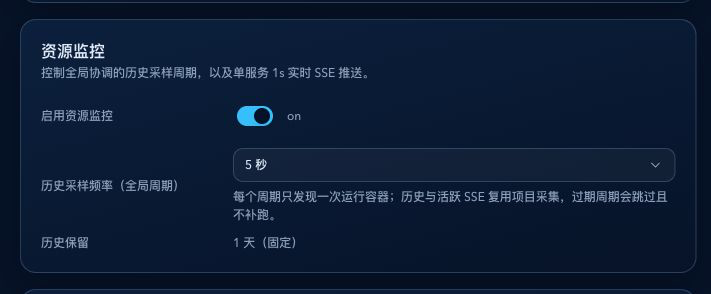
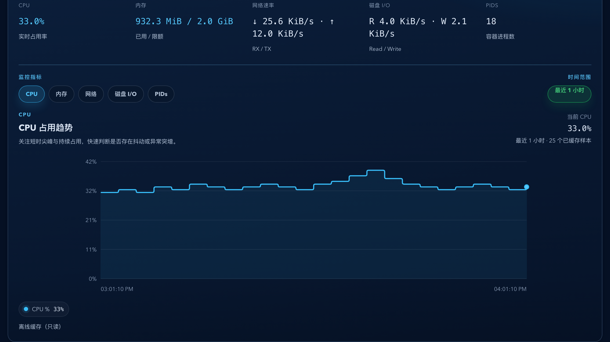
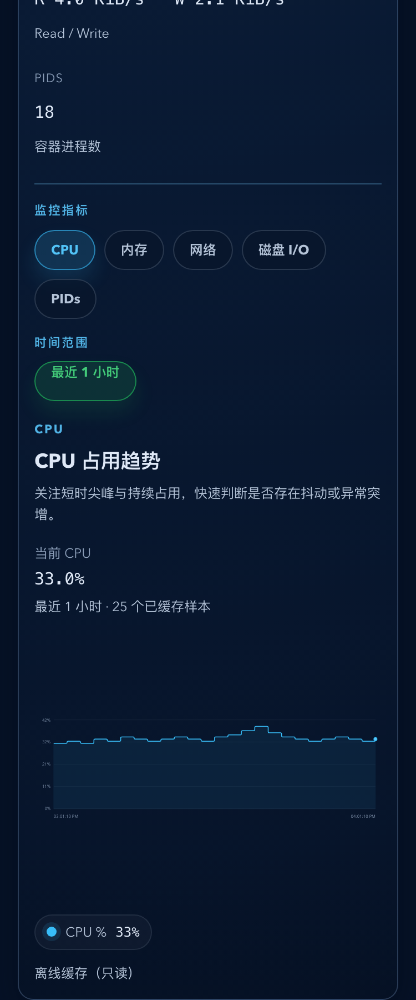
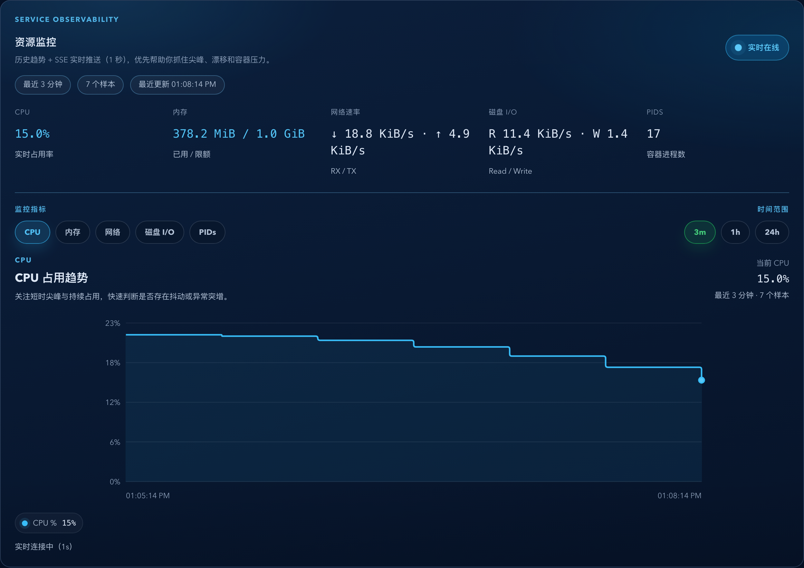
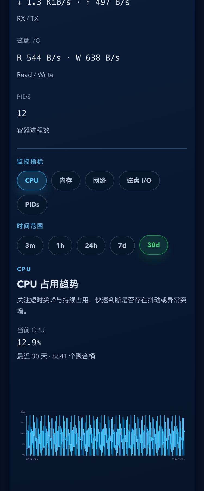

# Dockrev：服务资源监控（SSE 实时推送 + 历史持久化 + 图表）（#kbz3z）

> 当前有效规范以本文为准；实现覆盖与当前状态见 `./IMPLEMENTATION.md`，关键演进原因见 `./HISTORY.md`。

## 状态

- Status: active
- Created: 2026-03-03
- Last: 2026-07-27

## 背景 / 问题陈述

- 现有 Service Detail 缺少持续可视化资源监控，无法同时观察短时波动与历史趋势。
- 用户已锁定首版要求：历史低频持久化、实时 1s SSE 推送、图表展示、磁盘 I/O 必须纳入。

## 目标 / 非目标

### Goals

- 系统设置支持资源监控开关与采样频率（5/10/30/60/300，默认 5），其语义是“全局历史采样周期”。
- 历史采样按 service 落库，由一个进程级协调器在每个周期完成一次容器发现，原始样本固定保留 24 小时并自动分批清理。
- 业务主库与指标库必须分文件存储。主库保留服务、设置与迁移状态；指标库承担原始样本、latest 读模型和分层汇总，避免持续采样阻塞交互读。
- 服务详情页提供 1s SSE 实时流与趋势图（CPU/内存/网络/磁盘 I/O/PIDs）。
- 服务详情资源监控面板强化头部层级、SSE 状态可见性、统一工具栏与移动端数值排版。
- 资源监控关闭时，历史与实时接口统一返回 `409 resource_monitor_disabled`。

### Non-goals

- 服务详情页保留完整趋势图与 1s SSE；Overview 仅允许展示聚合最新摘要，不扩展为列表页图表或逐卡片 SSE。
- 不引入告警规则、阈值通知、自动扩缩容。
- 不实现多实例分布式采样去重。
- 不为单个 compose project 提供独立于全局设置之外的采样频率覆盖。
- 不新增 API/UI stale、skip、backlog 提示字段；采样保护导致的退化仅通过结构化日志暴露。

## 范围（Scope）

### In scope

- 后端：DB schema/migration、历史采样任务、SSE endpoint、settings 读写扩展。
- 前端：Settings 资源监控配置、Service Detail 监控卡片与自研 SVG 图表。
- Storybook：服务详情资源监控典型场景与异常场景。

### Out of scope

- 第三方图表依赖引入。
- 默认不新增 PR/spec 图片证据；若需要提交图片，先由主人确认。

## 接口契约（Interfaces & Contracts）

- `GET /api/settings`：新增 `resourceMonitor`。
- `PUT /api/settings`：支持写入 `resourceMonitor.enabled` 与 `resourceMonitor.sampleIntervalSeconds`。
- `GET /api/services/{service_id}/resource-usage/history?window=3m|1h|24h|7d|30d`：短窗口返回原始样本；长窗口返回均值 `samples`、对齐 `peaks` 与 `resolutionSeconds`。
- `GET /api/services/{service_id}/resource-usage/events`：SSE 事件
  - `resource_usage_snapshot`
  - `resource_usage_tick`
  - `resource_usage_error`
- `GET /api/services/resource-usage/overview?window=3m|1h|24h|7d|30d`：Overview 聚合最新摘要，只返回 CPU、内存、网络 RX/TX、样本时间、stale 与样本数量，不提供图表序列或 SSE。
- 监控关闭统一错误：`409` + `details.reason=resource_monitor_disabled`。
  - 例外：Overview 聚合摘要接口返回 `200 enabled=false`，用于导航页非阻塞降级。
- `resourceMonitor.sampleIntervalSeconds` 的 wire shape 与合法值保持不变，但其契约为“全局协调历史采样周期”；`resourceMonitor.retentionDays` 固定为 `1`。
- CPU 原始计数基线至少保留超过最长 `300s` cadence 的窗口；缺少 `system_cpu_usage` 等累计计数的 one-shot 响应不得安装基线，避免生成伪差分。
- `ServiceResourcePanel` 的短窗口继续允许叠加页面打开后的 `1s` SSE 实时点；`7d` 与 `30d` 只展示桶均值主线与对齐峰值提示，不能把实时原始点混入聚合序列。

## 数据与运行时设计

- `settings` 表新增：
  - `resource_monitor_enabled INTEGER NOT NULL DEFAULT 1`
  - `resource_sample_interval_seconds INTEGER NOT NULL DEFAULT 5`
- 历史采样频率合法值为 `5/10/30/60/300`；已有合法 `10` 继续保留，不做隐式迁移。
- `DOCKREV_METRICS_DB_PATH` 默认为主库同目录下的 `metrics.sqlite3`，且启动必须拒绝它与 `DOCKREV_DB_PATH` 指向同一文件，包括主库创建前的符号链接别名。
- 指标库包含 `service_resource_samples`、`service_resource_latest_samples` 与 `service_resource_rollups`。原始样本保留 24 小时，1 分钟桶保留 7 天，5 分钟桶保留 30 天。
- 启动时先从主库旧指标表可恢复复制到指标库。首次完整复制必须由主库迁移状态、幂等写入、稳定排序行哈希和行数验证控制；验证完成前不得启动新的采样写路径，旧表保持为回滚源。
- 从旧表导入的原始行必须保存稳定内容签名。指标 GC 在删除带 legacy id 的原始行或孤儿服务数据前，必须记录该 id 的墓碑；后续启动以完整源哈希、保留原始行签名及“保留行数加墓碑数覆盖旧表行数”验证已迁移数据。验证后 latest/rollup 只从现存 raw 重算；latest 还必须以来源标记重建 active service 的 legacy 投影并完成逐行验证，保留更新鲜的运行时样本，同时修复陈旧、缺失或时间回退的导入值；无来源列的旧 metrics latest 必须先标记为未知并保留，只有不早于未知行的 raw 或源投影才能替换它。rollup 以行级完整性指纹和行数元数据检测缺失或篡改，仅在首次完整复制或校验失败时重建，已验证的重启不得全量重建。非 active service 的 legacy latest 不得回灌。必须保留超出 raw 留存期的 active latest 和长窗口桶。完整复制源变化时才清除墓碑重拷；修复目标数据时不得复活已由 GC 裁剪的旧行。
- 迁移 manifest 同时保存 legacy raw 与 latest 的稳定排序行哈希/行数及 raw 最大 id；任何源指纹变化或缺少新字段都不得直接复用 `complete` 状态。
- `GET /api/jobs?view=compact` 的查询只经 SQLite JSON 投影读取进度、结果原因、展示标签和目标版本等派生字段，Rust 不得选取或反序列化完整 `summary_json`；默认 jobs 响应继续保持兼容。
- 后台历史采样任务：
  - 仅在开关开启时运行，由单一进程级 coordinator 以设置频率执行全局周期。
  - 每个周期只发现一次带 Compose 标签的运行容器，再将结果按 compose project/service fan-out；全部成功项目的样本在指标库内只提交一个事务。活跃 SSE 对同项目复用 in-flight 或不足一秒的缓存结果。
  - 周期以目标 schedule time 推进；单轮耗时超过 interval 时跳过过期 tick，不补历史欠账、不生成 backlog。
  - 原始样本保留 24 小时。独立 GC 任务在启动后及每分钟最多连续删除 `10 x 10,000` 条过期样本，批间让出执行权并只输出聚合 GC 日志；不自动执行 `VACUUM`，且不得阻塞历史采样 cadence。
  - 退化仅记录结构化日志，至少包含 `interval_seconds`、`duration_ms`、`skipped_ticks`、`service_count`、`result`。
- 资源采集通道：
  - 资源监控历史采样与详情页实时采样统一直接读取 Docker Engine API。
  - 实时与历史采样必须共享同一个进程级 Docker Engine client 及其保护状态；不得为两条链路分别创建独立的限流器或熔断器。
  - 共享 client 最多同时执行 4 个 Docker Engine 请求。等待中的请求在熔断已经打开后必须直接降级，不得继续访问 daemon。
  - 连续 2 次连接错误、请求超时、5xx 或成功响应的解码失败后打开熔断；退避从 5 秒指数增长到最多 60 秒。冷却结束后仅允许一个半开探测，成功后恢复正常采样，失败后继续退避；探测被取消时必须回到带退避的打开状态，不能永久停在半开。
  - 4xx 容器生命周期竞争仍按局部采集失败处理，不触发熔断；熔断打开、半开与恢复仅记录状态转换级结构化日志。
  - Docker 控制面退化期间允许实时和历史样本缺失；恢复后由后续既有 cadence 自动续采，不补历史欠账。
  - 默认通过挂载的 `/var/run/docker.sock` 访问；若部署改走 `docker-socket-proxy`，则复用现有 `DOCKER_HOST=tcp://docker-socket-proxy:2375` 入口。
  - Docker Engine API 请求默认不钉死版本前缀，避免被现代 Engine 的 `MinAPIVersion` 门槛拒绝；兼容性由 Engine 当前默认路由负责。
  - 容器 stats 使用 `stream=false&one-shot=true`，CPU 以前一次同容器 ID 的原始 CPU/system 计数在应用侧计算差分；首次样本 CPU 为 `0`。单项目过滤发现只回收该项目中消失容器的基线；全局发现还必须回收不再存在于当前项目集合中的旧项目基线。
  - 本次仅替换资源监控采集路径；日志、更新、cleanup 等其它 Docker 操作仍可继续使用现有 CLI 路径。
- 实时采样 Hub：
  - 同服务多 SSE 连接复用单个 1s 采样器。
  - 活跃 SSE 连接必须持有订阅 guard，避免被 10s idle 回收误判为无订阅。
  - 最后订阅断开后 10s 回收。
  - 本次 cadence 重构不改变 SSE `1s` 语义与事件类型。

## UI 规格（Service Detail）

- 顶部 Hero：标题、副说明、实时状态 badge 与窗口/样本/最近更新时间 facts 同屏可见。
- 设置页与监控页文案必须明确：历史采样由全局协调周期驱动，页面样本数会混入打开页面后的实时 SSE 点。
- 实时指标卡：CPU、内存作为主指标卡，网络速率、磁盘 I/O、PIDs 作为次级摘要卡。
- 图表工具栏：同一区域内提供指标 tabs（CPU/内存/网络/磁盘 I/O/PIDs）与时间窗口切换（3m/1h/24h/7d/30d，默认 1h）。7 天和 30 天主线显示桶均值，最新点 hover 显示对应桶峰值。
- 图表舞台：自研 SVG 趋势图保留单线/双线逻辑，并增强末端锚点、图例当前值与空/错态。所有指标将每个原始样本保持到下一次采样，以 right-continuous 阶梯表达变化，不平均数值、不生成斜线；CPU、内存、网络与磁盘 I/O 仅在阶梯拐角加极小圆角，PIDs 保持严格直角。单线面积填充必须复用对应阶梯路径且保持低视觉权重，双线图不绘制面积。
- SSE：页面可见时订阅，断线退避重连（1s→2s→5s）。

## 验收标准（Acceptance Criteria）

- 设置页可读写资源监控开关与采样频率，默认开启且默认 5 秒。
- 历史采样频率必须真实代表全局协调周期；每个周期只进行一次容器发现，不能为每个 compose project 重复扫描 Docker。
- 监控关闭后，history/events 返回 `409 resource_monitor_disabled`，前端展示禁用态。
- 服务详情页在开启状态可看到历史曲线与实时滚动，且实时状态无需查看 footer 即可感知。
- 图表支持指标切换与窗口切换，空数据/错误态有明确提示。
- 前台实时 SSE 继续保持 `1s` 采样 cadence，不受历史采样频率设置影响。
- 既有数据库里保存的合法 `10s` 历史采样配置继续生效，不被自动回写成 `5s`。
- Docker Engine 健康时，历史周期与活跃 SSE 不会重复采集同一 compose project；当 Engine 控制面退化时，全局保护可主动降级当前周期样本以避免放大 daemon 压力。
- 协调器仅保留不足一秒、正在进行或当前请求所需的项目采集状态，避免已删除项目长期占用进程内存；单项目 SSE 发现继续使用 Compose project label 过滤。
- 项目级采集 future 被取消时，协调器必须清除该项目的 `in-flight` 状态并通知等待者重新抢占采集；资源监控关闭期间必须清除已缓存完成结果，仅保留正在进行的采集状态以避免竞态。
- 监控关闭期间若已有采集进行中，完成结果必须标记为失效并以错误传播给等待者，不能重新填充缓存或触发等待者隐式重试。
- 单一全局周期耗时超过 interval 时，不会并发启动下一轮，也不会补跑过期 tick。
- Docker Engine 连续故障后，实时与历史采样不得分别继续积压请求；熔断期无新增 daemon 请求，冷却后的单个探测成功才恢复采样。
- 所有指标以水平保持和垂直跳变经过每个有效采样点、缺口处断线，不生成连续中间值；折线端点平切并保留最新样本锚点。
- 磁盘 I/O、网络 I/O 均以速率形式展示。
- 深色/浅色主题与 375px 宽度下版式稳定，无横向滚动，长数值不炸版。

## 质量门槛（Quality Gates）

- `cargo fmt --all -- --check`
- `cargo clippy --workspace --all-targets --all-features -- -D warnings`
- `cargo test --workspace --locked --all-features`
- `python3 ./.github/scripts/check-file-budgets.py`
- `bun run --cwd web build`
- `bun run --cwd web build-storybook`

## Visual Evidence

- source_type: `storybook_canvas`
  target_program: `mock-only`
  capture_scope: `element`
  requested_viewport: `none`
  viewport_strategy: `storybook-viewport`
  sensitive_exclusion: `N/A (mock-only data; resource-monitor card only)`
  submission_gate: `owner-approved`
  evidence_binding_sha: `37bd80eddca7cf97aad283700a028487f301ad67`
  story_id_or_title: `Pages/SettingsPage/ResourceMonitorCoordinator`
  state: `global coordinator settings`
  evidence_note: 资源监控卡片明确展示全局历史采样周期、每周期一次运行容器发现、历史/SSE 项目采集复用和固定 1 天原始留存。

PR: include

- source_type: `storybook_canvas`
  target_program: `mock-only`
  capture_scope: `browser-viewport`
  requested_viewport: `1280x720`
  viewport_strategy: `storybook-viewport`
  sensitive_exclusion: `N/A`
  submission_gate: `owner-approved`
  story_id_or_title: `Components/ServiceResourcePanel/HighVariationCurves`
  state: `high variation with a missing memory sample`
  evidence_note: 固定 1280x720 浏览器视口。资源面板是唯一容器；指标摘要、工具栏、`3m / 1h / 24h` 时间窗口、当前值与图表以无框分区呈现。25 个样本等间隔覆盖一小时，连续指标以双侧微圆角的水平保持和垂直跳变呈现稳定基线与少量可解释波动，PIDs 保持直角阶梯。

PR: include

- source_type: `storybook_canvas`
  target_program: `mock-only`
  capture_scope: `browser-viewport`
  requested_viewport: `375x900`
  viewport_strategy: `storybook-viewport`
  sensitive_exclusion: `N/A`
  submission_gate: `owner-approved`
  story_id_or_title: `Components/ServiceResourcePanel/HighVariationCurves`
  state: `high variation mobile CPU view`
  evidence_note: 固定 375x900 浏览器视口。CPU、网络与 PIDs 切换均无横向溢出；`3m / 1h / 24h` 时间窗口、摘要、指标切换、当前值与趋势图在唯一面板内按单列稳定排列，未形成嵌套卡片。

PR: include

- source_type: `storybook_canvas`
  target_program: `mock-only`
  capture_scope: `component-surface`
  requested_viewport: `1280x720`
  viewport_strategy: `storybook-viewport`
  sensitive_exclusion: `N/A`
  submission_gate: `owner-approved`
  evidence_binding_sha: `8e943e541a72a2889de64f0f2d4595f9cd312359`
  story_id_or_title: `Components/ServiceResourcePanel/WindowSwitchContract`
  state: `30d aggregated CPU history`
  evidence_note: 固定 1280x720 浏览器视口。资源监控工具栏展示 `3m / 1h / 24h / 7d / 30d`，其中 `30d` 已选中。8,641 个五分钟聚合桶保留在响应中，图表渲染限为 480 个均值点，最近桶仍保留峰值提示。

PR: include

- source_type: `storybook_canvas`
  target_program: `mock-only`
  capture_scope: `browser-viewport`
  requested_viewport: `375x900`
  viewport_strategy: `storybook-viewport`
  sensitive_exclusion: `N/A`
  submission_gate: `owner-approved`
  evidence_binding_sha: `8e943e541a72a2889de64f0f2d4595f9cd312359`
  story_id_or_title: `Components/ServiceResourcePanel/WindowSwitchContract`
  state: `30d aggregate mobile toolbar`
  evidence_note: 固定 375x900 浏览器视口。时间范围控件在移动端换行，`3m / 1h / 24h / 7d / 30d` 均可见，`30d` 选中后标题和聚合历史图表不溢出视口。

PR: include

## 变更记录（Change log）

- 2026-03-03: 完成后端采样与 SSE 能力、前端设置与服务详情图表、Storybook 监控场景。
- 2026-03-09: 修复资源监控 SSE 订阅 guard 生命周期，避免活跃连接在约 10 秒后被误回收，并补充持续 streaming 回归测试。
- 2026-03-11: 完成 Service Detail 资源监控面板中等强度视觉升级，统一工具栏并强化实时状态/响应式层级。
- 2026-04-28: 修正 Overview 边界：服务详情继续承载图表/SSE，Overview 仅展示聚合最新资源摘要并允许监控关闭时非阻塞降级。
- 2026-07-15: 历史采样 contract 扩展为 `5/10/30/60/300` 且默认 `5s`，共享窗口 contract 切到 `3m/1h/24h`，前台实时 SSE 继续保持 `1s`；资源监控采集路径切换为直接读取 Docker Engine API（默认 socket，兼容 `DOCKER_HOST`），并移除固定 `/v1.24` 前缀以兼容现代 Docker Engine 的 `MinAPIVersion`。
- 2026-07-20: 历史采样改为“每个 compose project 独立固定 cadence + single-flight + skip overdue”，慢 project 不再拖慢整站；settings 与监控页文案同步明确 `sampleIntervalSeconds` 的真实语义，以及页面样本数混入实时 SSE 点的现状。
- 2026-07-25: Docker stats 的 nullable block-I/O 字段按空集合兼容；单容器失败改为保留同项目成功样本并限频记录结构化诊断。原始资源样本保留期收敛为 7 天，启动后及每小时按批清理，不自动执行 `VACUUM`。
- 2026-07-26: 普通 Docker CLI 命令超时改为终止子进程；资源监控实时与历史采样共享 Docker Engine client，加入全局 4 请求限流、2 次连续可恢复故障熔断、5s 至 60s 指数退避与单半开探测，避免 daemon 退化时请求堆积。
- 2026-07-27: 101 实测确认 `stats?stream=false` 每容器等待约两秒，而 `one-shot=true` 约十毫秒；采样重构为单一全局协调器、应用侧 CPU 差分基线和 24 小时分批留存，避免 per-project 历史 worker 放大扫描与 SQLite 积压。
- 2026-07-27: 收紧基线与失效语义：基线窗口覆盖最长支持 cadence，缺少累计 CPU 计数不安装基线；监控关闭时已开始的采集只向等待者传播失效，不重新写入缓存或隐式重试。

## 参考（References）

- `crates/dockrev-api/src/resource_usage.rs`
- `crates/dockrev-api/src/api/mod.rs`
- `crates/dockrev-api/src/db.rs`
- `web/src/components/ServiceResourcePanel.tsx`
- `web/src/pages/ServiceDetailPage.tsx`
- `web/src/pages/SettingsPage.tsx`
