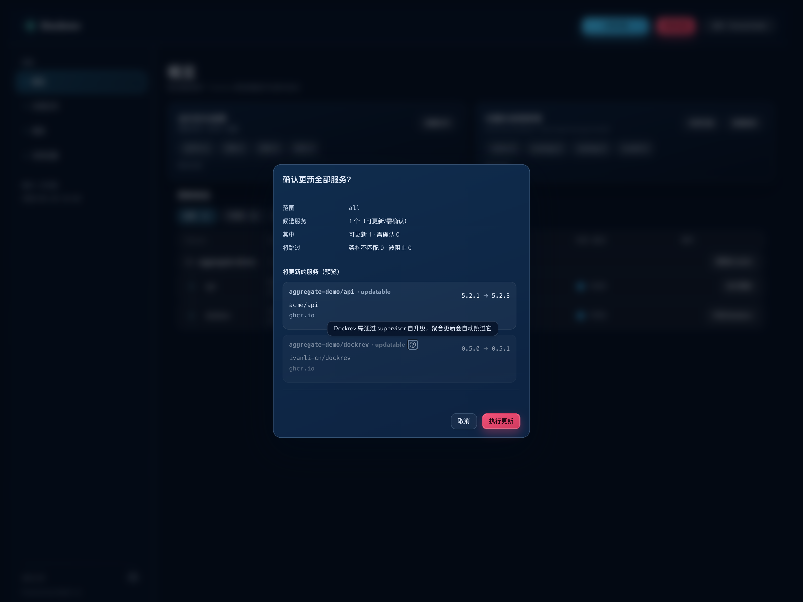
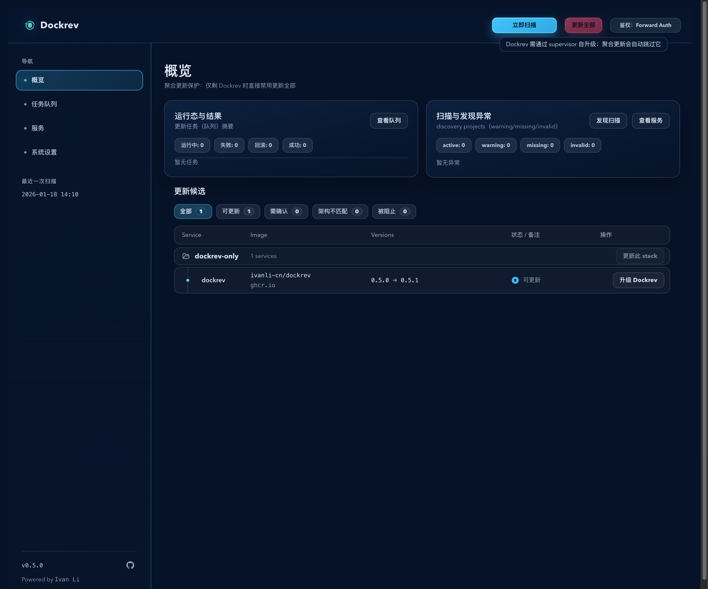
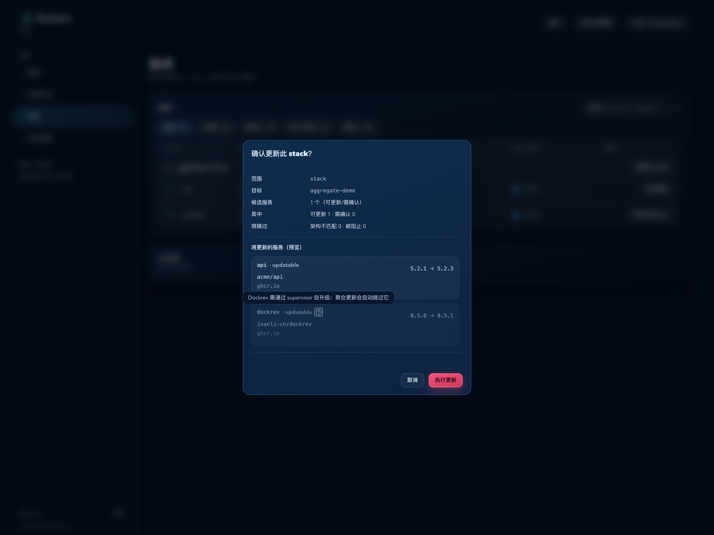

# Dockrev：聚合更新自升级保护（#mmffn）

## 状态

- Status: 已完成
- Created: 2026-03-09
- Last: 2026-03-09

## 背景 / 问题陈述

- 现有 `更新全部 / 更新此 stack` 会把 `dockrev` 当成普通候选服务一起纳入聚合更新。
- 这会让 Dockrev 主服务沿着普通 update job 链路执行 `compose pull / up -d`，等价于运行中的 Dockrev 尝试升级自己，存在 job 中断、状态误导与控制面失联风险。
- 产品上已经存在独立的 `升级 Dockrev` -> supervisor 自升级入口；聚合更新入口需要与该边界保持一致。

## 目标 / 非目标

### Goals

- `dockrev` 不再参与 `更新全部 / 更新此 stack` 的实际执行范围。
- 聚合确认框继续展示 `dockrev` 预览行，但使用禁用视觉 + 图标悬浮气泡提示“需走 supervisor 自升级”，不追加文字标记。
- 当聚合范围里只剩 `dockrev` 候选时，对应聚合按钮直接禁用，并通过 tooltip 解释原因。
- 覆盖 Overview 与 Services 的聚合更新入口；`dockrev` 服务行与详情页的 `升级 Dockrev` 独立入口保持不变。

### Non-goals

- 不调整 `dockrev-supervisor` 的聚合更新行为。
- 不修改 `scope=service` 的更新协议与显式 targetTag/targetDigest 契约。
- 不修改 supervisor 自升级 API、运行逻辑或独立页面交互。

## 范围（Scope）

### In scope

- `crates/dockrev-api/src/updater.rs`：为 `scope=all|stack` 的服务选择链路加入 `dockrev` aggregate guard。
- `crates/dockrev-api/src/api/operations.rs`：聚合 update 的 backup/no-op 判定与 updater 调用对齐 guard 结果。
- `web/src/pages/OverviewPage.tsx` 与 `web/src/pages/ServicesPage.tsx`：聚合按钮启用逻辑、候选计数、stack 摘要与确认框预览改用 aggregate guard 分组结果。
- `web/src/App.css` 与相关 Web 组件：补齐 guarded preview 行的禁用样式与 tooltip 图标样式。
- Storybook/mock 与自动化回归：补齐含 `dockrev` 候选的 Overview / Services 场景。

### Out of scope

- `web/src/pages/ServiceDetailPage.tsx` 的 `升级 Dockrev` 行为。
- `dockrev-supervisor` 的候选展示、状态映射或普通更新入口。
- 新增后端公开字段、变更 `/api/updates` 请求/响应结构。

## 需求（Requirements）

### MUST

- `scope=all|stack` 的实际更新选择必须排除 `dockrev`，识别语义复用 `DOCKREV_IMAGE_REPO` 的现有精确/前缀匹配规则。
- `scope=service` 更新不得被本次 guard 误伤。
- 聚合确认框中的 guarded `dockrev` 行必须使用禁用视觉，且只能通过图标 + tooltip 表达“需走 supervisor 自升级”；不得增加文字 badge、文字尾注或额外列表文案。
- 当 guard 过滤后无可执行候选时，聚合按钮保持禁用，不允许打开确认框发起空操作。
- 直接命中的后端 `scope=all|stack` 请求在 guard 后无候选时必须安全 no-op，且不触发 backup。

### SHOULD

- Guarded 预览行继续展示镜像与版本差异，便于操作者理解为何它会出现在预览里。
- Overview 与 Services 的 guard 展示、tooltip 文案与禁用视觉保持一致。

## 功能与行为规格（Functional/Behavior Spec）

### Core flows

- 前端聚合候选分组拆为：
  - `actionable`：真正会被聚合 update 执行的服务；
  - `guardedDockrevPreview`：命中 `dockrev` guard 的只读预览行。
- `更新全部 / 更新此 stack` 的按钮启用、候选数与“可更新/需确认”汇总仅统计 `actionable`。
- 确认框列表按 `actionable + guardedDockrevPreview` 渲染；guarded 行使用禁用样式与 tooltip 图标。
- 后端 aggregate update 在 selection 阶段排除 `dockrev`；若过滤后为空，则以 no-op 成功结束，并标记 backup skipped。

### Edge cases / errors

- 若某个聚合范围内只有 `dockrev` 一个候选，按钮直接禁用并提示使用 supervisor；不允许提交后端任务。
- 若同一范围同时存在普通候选与 `dockrev`，普通候选照常执行，`dockrev` 仅作为只读预览行展示。
- `dockrev-supervisor` 即便镜像仓库名相近，也不得被 `dockrev` guard 错误排除。

## 验收标准（Acceptance Criteria）

- Given Overview 的 `更新全部` 覆盖到普通服务与 `dockrev`，When 打开确认框，Then `dockrev` 行以禁用视觉展示并带 tooltip，且候选数只统计普通服务。
- Given Overview 或 Services 的某个 stack 仅剩 `dockrev` 候选，When 查看聚合按钮，Then 按钮处于禁用态并提示使用 supervisor，自身不会触发确认框。
- Given 后端收到 `scope=stack` 且唯一候选为 `dockrev` 的 apply 请求，When job 完成，Then `changedServices=0` 且 backup 为 skipped，不会执行普通 update 命令。
- Given `scope=service` 指向 `dockrev`，When 触发服务级更新，Then 本次 aggregate guard 不影响既有服务级契约。
- Given `dockrev-supervisor` 与普通服务出现在同一 stack，When 选择 aggregate update，Then `dockrev-supervisor` 不会被本次 guard 误判为 `dockrev`。

## 非功能性验收 / 质量门槛（Quality Gates）

- `cargo test -p dockrev-api`
- `bun run --cwd web lint`
- `bun run --cwd web build`
- `bun run --cwd web test-storybook`

## 变更记录（Change log）

- 2026-03-09：创建规格，冻结 `dockrev` 聚合更新 guard 的范围、交互约束与验收口径。
- 2026-03-09：完成前后端 aggregate guard、Overview/Services 聚合入口、Storybook 场景与回归测试。

## Visual Evidence (PR)

- source_type: storybook_canvas
  target_program: mock-only
  capture_scope: browser-viewport
  sensitive_exclusion: N/A
  submission_gate: approved
  story_id_or_title: Pages/OverviewPage/AggregateDockrevGuard
  state: confirm-dialog-open + guard-tooltip-visible
  evidence_note: verifies Overview `更新全部` excludes `dockrev` from actionable count while keeping a disabled preview row with tooltip in the confirmation dialog.
  image:
  

- source_type: storybook_canvas
  target_program: mock-only
  capture_scope: browser-viewport
  sensitive_exclusion: N/A
  submission_gate: approved
  story_id_or_title: Pages/OverviewPage/AggregateDockrevOnlyDisabled
  state: dockrev-only-disabled
  evidence_note: verifies Overview aggregate actions are disabled when the range only contains guarded `dockrev`, with the supervisor tooltip still visible.
  image:
  

- source_type: storybook_canvas
  target_program: mock-only
  capture_scope: browser-viewport
  sensitive_exclusion: N/A
  submission_gate: approved
  story_id_or_title: Pages/ServicesPage/AggregateDockrevGuard
  state: confirm-dialog-open + guard-tooltip-visible
  evidence_note: verifies Services `更新此 stack` keeps `dockrev` as a read-only guarded preview row and only counts the normal service as actionable.
  image:
  

## 参考（References）

- `crates/dockrev-api/src/updater.rs`
- `crates/dockrev-api/src/api/operations.rs`
- `web/src/pages/OverviewPage.tsx`
- `web/src/pages/ServicesPage.tsx`
