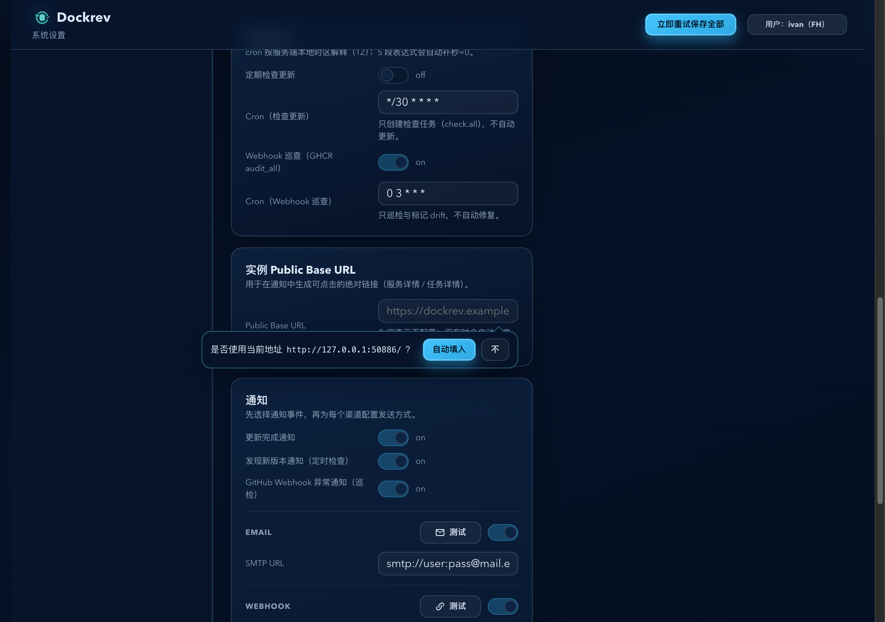
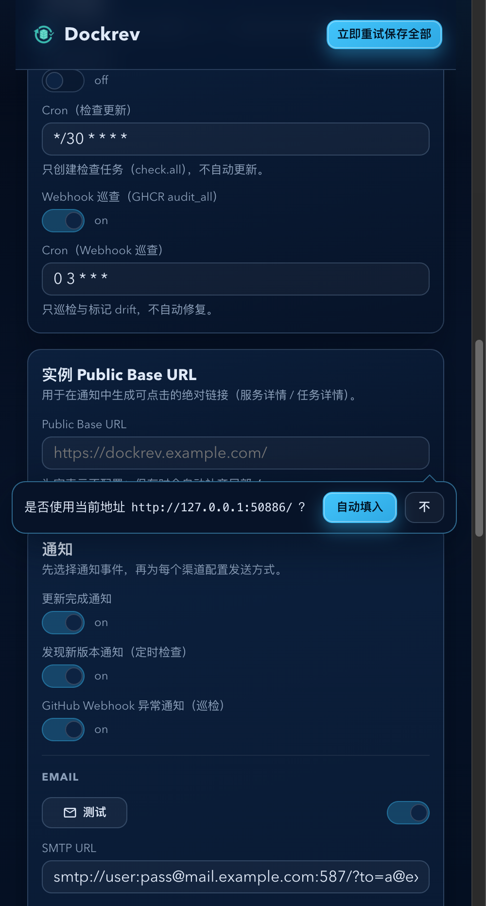

# Dockrev：Settings 空 Public Base URL 当前地址建议气泡（#myy3w）

## 状态

- Status: 已完成
- Created: 2026-03-07
- Last: 2026-03-07

## 背景 / 问题陈述

- Settings 页的实例 `Public Base URL` 允许留空，但首次部署或从空白配置进入时，用户往往不知道该填什么。
- 当前页面已经具备可直接复用的站点根地址，缺少一个就地建议入口，导致用户需要手动复制粘贴。
- 用户要求：当字段为空时自动出现一个非占位气泡，直接提示使用当前网页地址，并允许一键填入或永久拒绝该建议。

## 目标 / 非目标

### Goals

- 当 `instance.publicBaseUrl` 为空（含全空白字符）且未被本浏览器拒绝时，在输入框下方显示当前站点根地址建议气泡。
- 候选值固定从当前页面 URL 推导目录根地址（根路径部署时等价于 `origin + '/'`），例如 `https://dockrev.ivanli.cc/`；不带 `/settings`、query 或 hash，并保留部署 base path。
- 气泡中的候选地址使用 `Mono` 内联 code 样式展示，按钮文案固定为 `自动填入` 与 `不`。
- 点击 `自动填入` 复用现有 `updateInstance('instance.publicBaseUrl', ...)` 与 autosave 链路，不新增后端接口。
- 点击 `不` 后用 `localStorage['dockrev:settings:instancePublicBaseUrl:suggestCurrentOriginDismissed'] = '1'` 记住偏好，下次同浏览器不再显示。

### Non-goals

- 不修改后端 settings schema、数据库字段或通知链接生成逻辑。
- 不把拒绝偏好同步到服务端或其它设备。
- 不引入全局 toast、弹窗或额外设置项。

## 范围（Scope）

### In scope

- `web/src/pages/SettingsPage.tsx`
- `web/src/publicBaseUrlSuggestion.ts`
- `web/src/App.css`
- `web/src/stories/pages/SettingsPage.stories.tsx`
- `web/tests/publicBaseUrlSuggestion.test.ts`
- `docs/specs/README.md`

### Out of scope

- `crates/dockrev-api/**`
- `web/src/api.ts`
- 其它设置卡片或通知卡片交互

## 需求（Requirements）

### MUST

- 建议气泡只在以下条件同时成立时显示：
  - `settings.instance.publicBaseUrl` 为 `null`、空字符串或仅空白字符；
  - 本地拒绝偏好不存在；
  - 当前运行环境可解析出有效的浏览器 origin，且当前 Settings 路由可推导出实例根路径。
- 建议文案固定为“是否使用当前地址 `<Mono>{suggestedPublicBaseUrl}</Mono>`？”。
- `自动填入` 必须把输入框值设置为候选地址，并走现有 autosave 队列。
- `不` 必须立即隐藏当前页气泡，并尽力写入 localStorage；若写入失败，当前页隐藏仍然成立。
- 输入框出现任意非空白值时，建议气泡必须消失；若用户之后再次清空且未拒绝，允许重新出现。

### SHOULD

- 气泡样式应与现有 Settings 视觉风格一致，并沿用项目现有的 bubble / tooltip 视觉语法（包含明确的锚点箭头）；气泡应相对输入框右对齐悬浮显示，提示文案与操作按钮保持单行并排，必要时允许 URL 文本省略，但不让按钮掉到下一行。
- Storybook 应有可复现的两个场景：建议可见并自动填入、已拒绝后刷新不再显示。
- 纯函数测试应覆盖 `/settings`、`/settings/`、带 base path 的 `/dockrev/settings` / `/dockrev/settings/`，以及 hash-routing 下从当前页面 pathname 保留 base path 的推导结果（含带点号的部署目录如 `/v1.2.3/`）。

## 验收标准（Acceptance Criteria）

- Given `publicBaseUrl` 为空且 localStorage 未拒绝，When 打开 Settings，Then Public Base URL 输入框附近出现相对输入框右对齐的悬浮建议气泡，显示当前站点根地址，同时不把后续内容向下撑开。
- Given 当前页面路径为 `/settings`，When 生成候选地址，Then 展示值为页面目录根地址（根路径部署时即 `origin + '/'`），而不是包含 `/settings` 的完整 URL。
- Given 用户点击 `自动填入`，When 交互完成，Then 输入框被填入候选地址，建议气泡立即消失，后续保存继续复用现有 autosave。
- Given 用户点击 `不`，When 刷新页面且字段仍为空，Then 建议气泡不再显示。
- Given 输入框已有任意非空白值，When 页面渲染，Then 建议气泡不存在。

## 验收截图（Storybook）

- 桌面宽度（右对齐悬浮气泡）：

- 小屏宽度（当前实现截图）：

## 里程碑（Milestones / checklist）

- [x] M1: Settings 页新增 Public Base URL 建议值推导与 localStorage 拒绝偏好 helper（含 base path 保留）。
- [x] M2: Public Base URL 输入区新增 inline suggestion bubble 与 `自动填入` / `不` 交互。
- [x] M3: Storybook 新增可见态与已拒绝态场景。
- [x] M4: `lint` / `build` / `build-storybook` / `test-storybook` 与 `bun test web/tests/publicBaseUrlSuggestion.test.ts` 回归通过。

## 风险 / 假设

- 假设：当前 Settings 路由形态稳定为 `<base>/settings`（可带尾斜杠）；若启用 hash routing，则仍可结合当前页面 pathname 反推出实例根路径。
- 风险：若部署拓扑与当前浏览器访问地址不一致，建议值仍可能不是最终对外地址，用户仍可手动改写。

## 变更记录（Change log）

- 2026-03-07: 新建规格并冻结“空 Public Base URL 当前地址建议气泡”的交互口径。
- 2026-03-07: 完成 Settings inline suggestion bubble、localStorage 拒绝偏好与 Storybook 场景；`bun run --cwd web lint`、`build`、`build-storybook`、`test-storybook` 通过。
- 2026-03-07: 根据复查补充 base path 保留逻辑与纯函数测试，避免在 `/base/settings/` 场景下错误建议到设置页子路径。
- 2026-03-07: 进一步覆盖 hash-routing 场景，确保 `/#/settings` 也能结合当前页面 pathname 保留部署 base path。
- 2026-03-07: 收紧 page pathname 文件段识别，仅把 `index.html` / `iframe.html` 视为文件名，避免带点号的部署目录被误裁剪。
- 2026-03-07: 根据视觉反馈将建议气泡改为悬浮定位，避免显示时撑开 Settings 布局。
- 2026-03-07: 进一步对齐项目现有 bubble 语法，补上箭头与更接近通知测试气泡的视觉锚点。
- 2026-03-07: 根据最新视觉反馈收紧为单行气泡布局，保持文案与按钮同排，必要时对 URL 做省略。
- 2026-03-07: 根据最新定位反馈将建议气泡改为相对输入框右对齐，并把尾巴固定到更贴近项目原生 bubble 的右侧锚点。
- 2026-03-07: 检查移动端 DOM 后确认旧的 `.settingsInlineSuggestionActions { width: 100% }` 媒体查询导致文案宽度被压到 0；移除该覆盖并更新 Desktop / Mobile 验收截图。
- 2026-03-07: 记录快车道交付分支与 PR #145，规格与实现保持同步。
