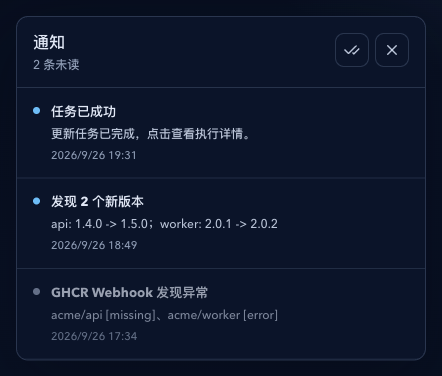
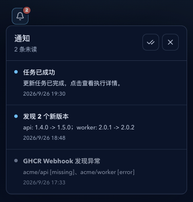
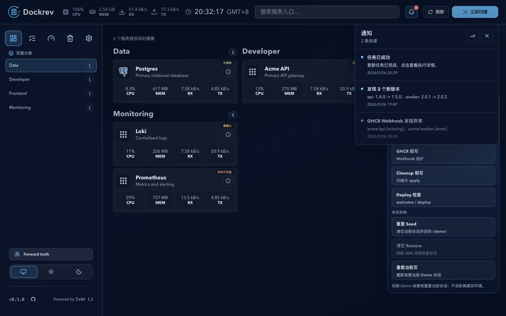
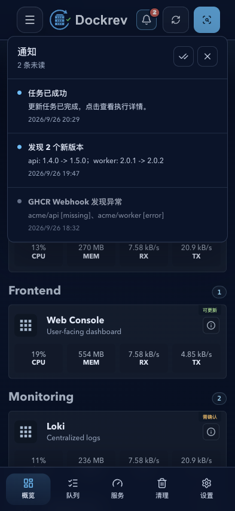

# Dockrev：通知收件箱与 PWA Badge

> 本文是通知收件箱、未读数和 PWA 图标 Badge 的长期行为合同。实现覆盖见 `IMPLEMENTATION.md`，主题生命周期与兼容背景见 `HISTORY.md`。

## Context and Scope

- Context: Dockrev 已有更新完成、新版本发现和 GHCR Webhook 异常通知事件，也支持可选 Web Push，但缺少跨设备共享的未读通知收件箱与 PWA 图标 Badge 真相源。
- In scope: 通知项持久化、事件聚合与去重、已读状态、Badge 计数、通知收件箱 API、Push payload 扩展、前台同步、跨标签页同步和 PWA 能力边界。
- Out of scope: 新的外部通知渠道、Periodic Background Sync 作为必选能力、关闭 PWA 后无 Push 的实时保证、通知模板编辑器、离线写操作和多用户权限模型。

## Terms and Interfaces

- `qualified notification event`: 事件开关允许且属于本主题三类正式来源的运维事件；测试通知不属于此类事件。
- `notification item`: 服务端持久化的一条用户可见通知，也是 Badge 的一个计数单位。
- `notification acknowledgement`: 操作者显式将通知项标记为已读的动作；展示通知或打开收件箱本身不构成确认。
- `badge unread count`: 服务端未读通知项数量。客户端只能把它作为绝对值写入 Badge，不得用本地增量推演真相。
- `foreground notification synchronization`: 页面启动、恢复可见、获得焦点或可见期间定期从服务端读取未读数和收件箱的过程。
- `background badge update`: PWA 关闭时更新图标 Badge 的过程；在 Web 平台上由 Push 驱动，不能由普通 Service Worker 定时器保证。
- `NotificationItem`: 收件箱 API 返回的通知项模型，字段详见 [HTTP API contract](./contracts/http-api.md)。
- `dockrev.notification.*.v2`: 现有外部通知 payload schema；Push 在保留既有字段的基础上增加通知项 ID 和绝对未读数。

## Interfaces

| Interface | Kind | Change | Contract |
| --- | --- | --- | --- |
| `notification_items` | SQLite table | New | [db.md](./contracts/db.md) |
| `GET /api/notifications/inbox` | HTTP API | New | [http-api.md](./contracts/http-api.md) |
| `GET /api/notifications/unread-count` | HTTP API | New | [http-api.md](./contracts/http-api.md) |
| `POST /api/notifications/{notificationId}/read` | HTTP API | New | [http-api.md](./contracts/http-api.md) |
| `POST /api/notifications/read-all` | HTTP API | New | [http-api.md](./contracts/http-api.md) |
| Web Push notification payload | External payload | Modify | [push-payload.md](./contracts/push-payload.md) |
| `dockrev:notifications` | BroadcastChannel | New | [http-api.md](./contracts/http-api.md) |

## Requirements

### REQ-NPB-001

- Dockrev MUST use a server-persisted notification item as the source of truth for the inbox and Badge unread count.
- A qualifying event MUST create an inbox item when its event switch is enabled, even when Web Push, Email, Webhook and Telegram delivery are disabled or unavailable.
- External delivery settings MUST NOT turn a qualifying in-app notification into a delivery-count approximation.

### REQ-NPB-002

- The supported event sources and Badge creation rules MUST be:

| Event source | Creates one item when | Aggregation and exclusions |
| --- | --- | --- |
| `job_finished` | An existing update or rollback notification reaches its terminal event path | One item per job identity; do not add a second generic check-completion item |
| `new_version_discovered` | A scheduled or formally supported check discovers a new candidate | One item per aggregated check job; reuse `service + candidate digest` identity across later checks |
| `ghcr_webhook_anomaly` | A scheduled audit finds a new or changed anomaly state | One item per audit aggregation; first appearance, state change, or recurrence after recovery |
| notification test | Never | Tests exercise delivery only and MUST NOT change the inbox or Badge |

- An event switch disabled by the operator MUST suppress the corresponding qualified event and its inbox item.

### REQ-NPB-003

- Notification item creation MUST be idempotent under job retry, worker retry, duplicate delivery and concurrent observations.
- `job_finished` identity MUST use the terminal job identity.
- `new_version_discovered` identity MUST use the existing candidate notification identity for the service and candidate digest; a changed display version alone MUST NOT create another item.
- GHCR anomaly comparison MUST use owner, repository and anomaly state. A changed error message alone MUST NOT create another item.
- A transition to another anomaly state MUST create one new aggregated item. Recovery closes the active anomaly state without decrementing Badge; a later recurrence creates a new item.

### REQ-NPB-004

- Each notification item MUST have the logical fields `id`, `kind`, `title`, `body`, `url`, `sourceJobId` when applicable, `createdAt` and nullable `readAt`.
- An item MUST have exactly two operator states: unread when `readAt` is null, and read when `readAt` is set.
- Read items MUST be retained for 90 days. Unread items MUST remain until explicitly acknowledged and MUST NOT expire merely because their source candidate or anomaly was later resolved.

### REQ-NPB-005

- Marking one unread item read MUST logically reduce the unread count by one; marking an already read item MUST have no effect.
- Marking all items read MUST make the server unread count zero and MUST clear the Badge.
- Opening the app, opening the notification drawer, displaying a system notification, reading an external channel, unsubscribing Push, or a Push delivery failure MUST NOT mark an item read.
- A system notification click and an inbox item click MUST acknowledge the item before completing target navigation. A target-page failure MUST NOT roll back the acknowledgement.
- Read operations MUST be idempotent and shared by all installed Dockrev clients for the same deployment.

### REQ-NPB-006

- The existing `GET/PUT /api/notifications` settings contract and `POST /api/notifications/test` route MUST remain compatible.
- The inbox API MUST provide a cursor-paginated list, an unread-count read, a single-item read action and a mark-all-read action as defined in [HTTP API contract](./contracts/http-api.md).
- Inbox responses and successful read mutations MUST return the current absolute `unreadCount` so clients can repair local state without applying deltas.

### REQ-NPB-007

- Web Push MUST remain optional and MUST be an acceleration channel for a persisted notification item, not the source of its existence or count.
- Push payloads for real notification items MUST preserve existing `schema`, `kind`, `title`, `body` and `url` fields and add `notificationId` plus absolute `unreadCount`.
- A Push handler MUST use `unreadCount` to set or clear the Badge when supported. It MUST NOT execute `currentBadge + 1`.
- Test payloads MUST omit notification identity and unread count and MUST NOT mutate the Badge.

### REQ-NPB-008

- When the app is authenticated and visible, the frontend MUST synchronize notification state at bootstrap, `pageshow`, `visibilitychange -> visible`, `focus` and `online` recovery.
- While visible, the frontend MUST poll the unread-count endpoint every 60 seconds; polling MUST pause while the document is hidden and MUST resume with an immediate sync when it becomes visible.
- Open tabs MUST broadcast successful count/read changes through `dockrev:notifications` so another tab can update without waiting for its next timer. Broadcast data is an invalidation hint; the server remains authoritative.
- The first implementation MUST use REST plus BroadcastChannel and MUST NOT add a dedicated notification SSE stream.

### REQ-NPB-009

- The backend's existing scheduled check and audit workers remain responsible for discovering events and persisting notification items; browser wake-up is a separate concern.
- An ordinary Service Worker MUST NOT be treated as a persistent timer. With Push disabled and the PWA closed, Dockrev MUST NOT promise real-time Badge updates.
- Periodic Background Sync MAY be evaluated as a future best-effort enhancement, but it MUST NOT be required for correctness, acceptance, or a notification freshness SLA.
- On the next app launch or foreground resume without Push, the frontend MUST repair the Badge from the server unread count.

### REQ-NPB-010

- Dockrev MUST provide a lightweight AppShell notification drawer or list showing unread state, item content, item target and a mark-all-read action.
- Opening the drawer MUST not acknowledge items. Clicking an item MUST acknowledge it before navigating to its target.
- A cold-start system notification click MUST be handed from the Service Worker to the app so the app owns the authenticated acknowledgement request before finishing navigation.

### REQ-NPB-011

- The client MUST feature-detect the Badging API and gracefully degrade when the browser or platform does not expose it.
- When supported, a positive absolute unread count MUST call the equivalent of `setAppBadge(unreadCount)` and a zero count MUST call the equivalent of `clearAppBadge()`.
- Lack of an icon Badge MUST NOT hide or alter the server-backed inbox and unread-count behavior.

### REQ-NPB-012

- Notification item persistence MUST complete before external delivery attempts are treated as successful.
- A failed Push attempt, expired subscription, missing Push permission, or external channel failure MUST preserve the unread item and its count.
- Concurrent clients MUST converge on the server response after read actions, including when one client marks an item read while another is polling.

## Verification

### VER-NPB-001

- Method: Backend event-source tests covering terminal update/rollback, aggregated candidate discovery, aggregated GHCR anomaly transitions, event switches and notification tests.
- covers: `REQ-NPB-001`, `REQ-NPB-002`
- Pass condition: Only qualifying formal events create items; delivery settings do not suppress the in-app item; test notifications never change unread count.

### VER-NPB-002

- Method: Idempotency tests with retries, duplicate observations, concurrent candidate discovery and anomaly recovery/recurrence.
- covers: `REQ-NPB-003`
- Pass condition: Each agreed event identity creates at most one item per occurrence, while a new digest, state transition or post-recovery recurrence creates the expected new item.

### VER-NPB-003

- Method: Database and API tests for item fields, unread/read transitions, retention cleanup and cursor pagination.
- covers: `REQ-NPB-004`, `REQ-NPB-005`, `REQ-NPB-006`
- Pass condition: Single read, repeated read and mark-all-read are idempotent; read history follows the 90-day rule; every successful response exposes the current absolute count.

### VER-NPB-004

- Method: Push payload and Service Worker tests for real notification payloads, test payloads, missing fields and delivery failures.
- covers: `REQ-NPB-007`, `REQ-NPB-012`
- Pass condition: Real payloads carry `notificationId` and `unreadCount`; test or legacy payloads do not perform a local increment; delivery failure never deletes or reads an item.

### VER-NPB-005

- Method: Frontend lifecycle tests with hidden/visible transitions, focus, pageshow, online recovery, 60-second polling and BroadcastChannel messages.
- covers: `REQ-NPB-008`
- Pass condition: Visible pages converge by REST, hidden pages do not poll, and open tabs react to broadcast invalidation without treating it as authoritative data.

### VER-NPB-006

- Method: Capability matrix covering Push subscribed/unsubscribed, PWA open/closed, Badging API available/unavailable and unsupported Periodic Background Sync.
- covers: `REQ-NPB-009`, `REQ-NPB-011`
- Pass condition: Push can update a closed PWA; no-Push closed PWA has no real-time guarantee; next launch repairs the count; unsupported Badge or periodic sync does not break the inbox.

### VER-NPB-007

- Method: AppShell drawer and system-click interaction tests, including cold start, target navigation failure and mark-all-read.
- covers: `REQ-NPB-010`
- Pass condition: Drawer open does not read items, item/system clicks acknowledge before navigation, and target failure does not undo acknowledgement.

### VER-NPB-008

- Method: Multi-client integration tests with two tabs or installed clients sharing one authenticated deployment.
- covers: `REQ-NPB-005`, `REQ-NPB-012`
- Pass condition: One client acknowledging an item is reflected by the other after broadcast or the next authoritative sync, without negative counts or resurrection.

## Related ADRs

- [ADR 0014：通知收件箱与 PWA Badge 的一致性边界](../../adr/0014-notification-inbox-pwa-badge.md)

## Visual Evidence

- 
- 
- 
- 

## References

- [Existing notification event switches](../p2n8k-notification-event-switches-and-new-alerts/SPEC.md)
- [New-version notification identity](../4n5vr-new-version-notification-records/SPEC.md)
- [Web PWA shell and Push boundary](../r8kpa-web-pwa-offline-shell/SPEC.md)
- `./IMPLEMENTATION.md`
- `./HISTORY.md`
