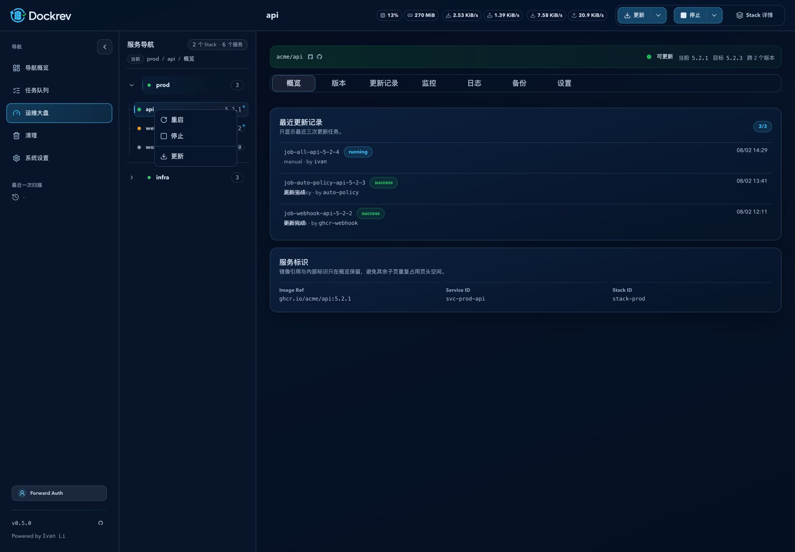

# Dockrev：服务树上下文快捷操作（#puwpx）

> 当前有效规范以本文为准；实现覆盖与当前状态见 `./IMPLEMENTATION.md`，关键演进原因见 `./HISTORY.md`。

## 背景 / 问题陈述

详情页服务树已经提供 Stack 与 Service 的运行态、更新信号和路由导航，但运维操作只能进入详情页后执行。高频维护时，这增加了定位与切页成本，也让移动端缺少与桌面右键等价的紧凑入口。

## 目标 / 非目标

### Goals

- 为 Stack 名称状态区和完整 Service 行提供右键、触摸长按、Context Menu 键及 `Shift+F10` 上下文菜单。
- 直接提交启动、重启、停止和更新任务，并在原页面提供可跳转任务详情的反馈。
- 新增原生 Stack 生命周期任务，并与 Stack 内服务的更新、回滚和生命周期任务形成双向冲突保护。

### Non-goals

- 不改变服务详情页 split action 的既有确认规则。
- 不允许普通生命周期接口操作 Dockrev 自身服务。
- 不增加二级菜单、组标题或常驻操作按钮。

## 范围（Scope）

### In scope

- 详情路由桌面服务树与移动服务导航抽屉。
- Service 与 Stack 的运行态快捷操作、更新快捷操作、任务反馈和定向刷新。
- Stack 生命周期 HTTP、队列任务、Compose runner、冲突锁和审计摘要。

### Out of scope

- 全局生命周期操作、批量跨 Stack 生命周期操作及生命周期计划任务。
- Dockrev Supervisor 协议重构。

## 需求（Requirements）

### MUST

- `stopped` 只显示“启动”；`running` 显示“重启、停止”；`partial/unknown` 显示禁用的“重启、停止”并暴露原因。
- 生命周期项与“更新”之间使用库内 Separator；Dockrev 自身 Service 仅显示 Supervisor 更新入口。
- 上下文菜单动作不弹确认，直接提交；成功、冲突和失败均通过 Toast 反馈，成功或冲突时提供任务详情入口。
- Stack 生命周期任务必须锁定 Stack 内全部服务；同 Stack update/rollback/service lifecycle 与 stack lifecycle 必须双向互斥。
- 包含 Dockrev 自身服务、已归档或运行态不可判定的 Stack 不得提交生命周期任务。

### SHOULD

- 菜单打开时按目标懒加载最新状态和更新目标，加载期间保持稳定尺寸并禁用动作。
- 移动滚动或指针明显移动必须取消长按，展开箭头不得成为 Stack 菜单触发区。

## 功能与行为规格（Functional/Behavior Spec）

- Stack 触发区仅包含名称、状态点和服务数量；Service 触发区覆盖完整可导航行。
- 状态为 `partial/unknown` 时不推断修复动作；“重启、停止”保留可发现但不可执行。
- Service 更新仅在存在可执行候选时启用；Stack 更新使用现有聚合候选过滤，并提交 `mode=apply`、`backupMode=inherit`、`allowArchMismatch=false`。
- Dockrev 自身 Service 的“更新”打开 Supervisor；包含 Dockrev 的 Stack 仍可更新其他合格目标，但生命周期项禁用。
- Compose V2 Stack 启动使用 `up -d --pull never --no-recreate`；Compose V1 使用只启动已有容器的 `start`。停止与重启使用项目级 `stop` / `restart`。
- 任务提交后菜单关闭、页面不跳转；Toast 提供任务详情入口，任务开始与结算均定向刷新对应 Stack。

## 接口契约（Interfaces & Contracts）

| 接口（Name） | 类型（Kind） | 范围（Scope） | 变更（Change） | 契约文档（Contract Doc） | 负责人（Owner） | 使用方（Consumers） | 备注（Notes） |
| --- | --- | --- | --- | --- | --- | --- | --- |
| Stack lifecycle status | HTTP | external | New | `./contracts/http-api.md` | dockrev-api | Web service tree | 实时状态与阻塞任务 |
| Stack lifecycle trigger | HTTP | external | New | `./contracts/http-api.md` | dockrev-api | Web service tree | 创建 `stack_lifecycle` 任务 |
| Service lifecycle status/trigger | HTTP | external | Modify | `./contracts/http-api.md` | dockrev-api | Web service detail/tree | 识别 Stack 级活动锁 |

## 验收标准（Acceptance Criteria）

- Given 键盘焦点位于 Stack 或 Service 条目，When 按 Context Menu 键或 `Shift+F10`，Then 菜单在目标附近打开且关闭后焦点返回原条目。
- Given 目标已停止，When 打开菜单，Then 只显示“启动”、Separator 和“更新”；Given 目标运行中，Then 显示“重启、停止”、Separator 和“更新”。
- Given 用户选择任一可执行动作，When API 接受提交，Then 不出现确认框、不切页，并显示带任务入口的成功 Toast。
- Given Stack 内任一服务已有 apply update、rollback 或 lifecycle 任务，When 提交 Stack lifecycle，Then 返回 `409` 与 `existingJobId`；反向提交亦然。
- Given Stack 包含 Dockrev 自身服务，When 打开菜单，Then 生命周期项禁用并说明需通过宿主机或 Supervisor 操作。
- Given 在移动抽屉滚动服务树，When 指针移动超过长按阈值，Then 不打开菜单且不创建任务。

## 非功能性验收 / 质量门槛（Quality Gates）

- 后端覆盖状态聚合、V1/V2 命令、归档、自托管保护、冲突锁和任务结算测试。
- `DetailRouteServiceTree` Storybook autodocs 覆盖运行、停止、未知、自托管和移动状态，并以 `play` 覆盖右键、键盘和直接提交反馈。
- 最终 `ui_demo` 证据覆盖桌面菜单与 `393x852` 移动长按菜单。
- 通过 Rust format/tests、Web lint/build/tests、Storybook build/test、文件预算与 Impeccable detector。

## Visual Evidence

PR: include

最终 mock-only `ui_demo` 桌面右键菜单证据：

截图显示运行态服务菜单按“重启、停止、分隔线、更新”排列，更新项使用下载箭头；移动长按行为由 Storybook `play` 用例覆盖。

## Related PRs

- None

## 风险 / 开放问题 / 假设（Risks, Open Questions, Assumptions）

- Stack 原生生命周期作用于 Compose 项目整体，因此自托管 Stack 必须硬禁用以避免控制面自行停机。
- 上下文菜单刻意选择直接执行；误触风险由长按取消、状态禁用和后端冲突锁控制。

## 参考（References）

- `../c2r2u-detail-route-service-navigation/SPEC.md`
- `../9cq2a-service-lifecycle-actions/SPEC.md`
