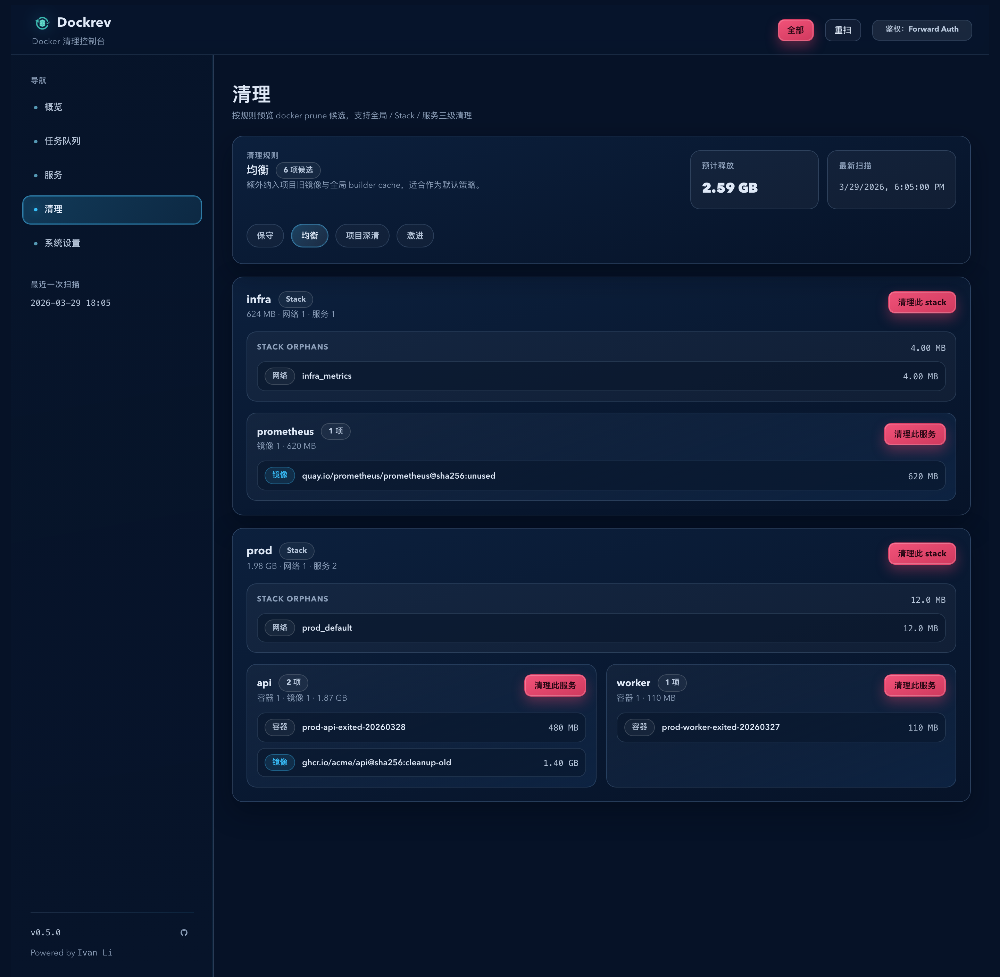
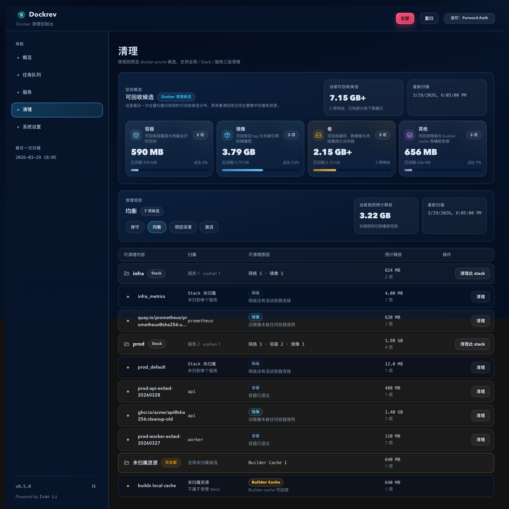
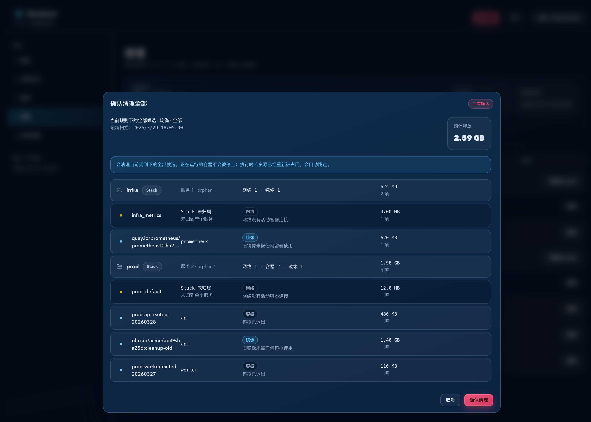

# Dockrev：Docker Prune 清理控制台（#qynjg）

## 状态

- Status: 已完成
- Created: 2026-03-29
- Last: 2026-04-04

## 背景 / 问题陈述

- 当前项目没有面向 `docker system prune` 家族能力的可视化入口，操作者只能脱离 Dockrev 手动执行高风险 CLI。
- 现有服务/stack 视图也没有提供“清理前先扫描、按归属分组、执行前二次确认”的安全操作路径。
- 若继续依赖手工命令，既无法精确限定到 `all | stack | service` 范围，也无法在执行前展示最新可回收资源与预计释放空间。

## 目标 / 非目标

### Goals

- 提供新的 `/cleanup` 顶级页面与导航入口，专门承载 Docker 清理能力。
- 固定提供 `conservative`、`balanced`、`project_deep_clean`、`aggressive` 四个预设规则，并以 tabs 切换视图。
- 清理候选按 stack 分组展示，区分 service 级资源、stack orphan 资源与 `all` 范围下的 `未归属资源`。
- 所有执行动作都必须先做 scoped confirm-scan，并在二次确认对话框中展示最新候选与最新预计释放空间。
- 后端执行链路必须按目标资源类型拆解成定向 prune/remove 命令，不允许对 `stack` 或 `service` 盲跑 `docker system prune`。

### Non-goals

- 自动定时清理与自定义规则编辑器。
- 删除仍被运行中容器占用的资源。
- 依赖不确定启发式把歧义 volume/image 强行归属到某个 service。
- 改造现有 update/check/rollback 页面与其交互模型。

## 范围（Scope）

### In scope

- `dockrev-api` 新增 cleanup inventory scanner、归属分类、preset 过滤、confirm fingerprint 与 apply job。
- `POST /api/cleanups/scan`、`POST /api/cleanups/apply` 两个新接口与相关前后端共享类型。
- 新增 `cleanup_apply` job 类型、summary/log 字段约定与 stale fingerprint `409 cleanup_snapshot_stale` 处理。
- Web 新增 `/cleanup` 路由、导航入口、分组列表、tab 视图、确认弹窗与 stale confirm 回流 UX。
- Storybook 场景、前后端测试、视觉证据与 spec/contract 同步。

### Out of scope

- 自动重试、后台定时任务、批量自定义筛选器。
- 非 Docker runtime 的清理能力。
- 对 builder cache 做 stack/service 级归属。
- 在 `stack` 或 `service` 作用域展示/执行无法归属到 managed stack 的全局孤儿资源。

## 需求（Requirements）

### MUST

- 页面首次进入自动触发一次 `reason=page` 扫描，并默认落在 `balanced` tab。
- tabs 切换只能切同一份 page scan inventory 的 preset 投影，不能重复触发全量扫描。
- 顶部主动作按钮文案固定为 `全部`，语义为“当前 preset 下的 all scope 清理”。
- `stack` 动作可包含该 compose project 的 stack orphan 资源；`service` 动作只能包含可确定归属到该服务的资源。
- 任一 `全部` / `stack` / `服务` 动作都必须先触发 `reason=confirm` scoped scan，再弹出二次确认对话框。
- `POST /api/cleanups/apply` 在实际创建 job 前必须重算 fingerprint；不匹配时返回 `409 cleanup_snapshot_stale`，同时带回最新 confirm payload。
- `aggressive` 预设下的全局 `unused images/volumes` 仅可出现在 `all` 视角的 `未归属资源` 伪分组。

### SHOULD

- UI 对“未知或近似空间”提供清晰文案，而不是伪装成精确字节值。
- 确认弹窗复用页面分组语义，避免操作者在执行前看到另一套信息结构。
- apply job 的日志/summary 能明确列出预计释放空间、实际删除计数与跳过原因。

### COULD

- 页面提供手动重扫按钮与上次扫描时间展示。
- 预估空间旁补充资源项数量，帮助快速理解收益。

## 功能与行为规格（Functional/Behavior Spec）

### Core flows

- 进入 `/cleanup` 页面后，前端立刻调用 `POST /api/cleanups/scan` with `reason=page`, `preset=aggressive`, `scope=all`，并缓存返回的全局 inventory。
- page scan 返回的每个资源项都带 `minPreset`，前端据此把同一份 inventory 本地投影为四个 tabs；切 tab 不重复触发全量扫描。
- 每个 stack 分组头部显示 stack 名称、预计释放空间、stack orphan 资源摘要与 `清理此 stack` 按钮。
- 每个 service 行显示 service 名称、可清理 image/container/volume 等资源摘要、预计释放空间与 `清理此服务` 按钮。
- 顶部主按钮 `全部` 对应 `scope=all`；当点击任一动作时，前端发起 `reason=confirm` scoped scan，拿到最新候选后再打开确认对话框。
- 用户在确认对话框点击确认后，前端调用 `POST /api/cleanups/apply` 创建 `cleanup_apply` job，并跳转/关联任务队列状态。

### Edge cases / errors

- 若 page scan 为空，页面展示对应 preset 的空态，但仍允许手动重扫。
- 若 confirm-scan 结果为空，则确认弹窗展示“当前已无可清理项”，且不继续发起 apply。
- 若 apply 返回 `409 cleanup_snapshot_stale`，前端必须用响应内最新 confirm payload 刷新弹窗内容，并要求用户重新确认。
- 若资源无法确定 service 归属但属于 compose project，则降级为 stack orphan；若无法归属任何 managed stack，则仅在 `all` 中显示为 `未归属资源`。

## 接口契约（Interfaces & Contracts）

### 接口清单（Inventory）

| 接口（Name） | 类型（Kind） | 范围（Scope） | 变更（Change） | 契约文档（Contract Doc） | 负责人（Owner） | 使用方（Consumers） | 备注（Notes） |
| --- | --- | --- | --- | --- | --- | --- | --- |
| `POST /api/cleanups/scan` | HTTP API | external | New | `./contracts/http-apis.md` | dockrev-api | web | page scan + confirm scan |
| `POST /api/cleanups/apply` | HTTP API | external | New | `./contracts/http-apis.md` | dockrev-api | web | async cleanup job trigger |
| `JobType.cleanup_apply` | HTTP API | internal | Modify | `./contracts/http-apis.md` | dockrev-api | web | queue/job list readable type |
| `Cleanup*` shared payloads | HTTP API | internal | New | `./contracts/http-apis.md` | dockrev-api | web | preset/scope/group/fingerprint contract |

### 契约文档（按 Kind 拆分）

- [contracts/http-apis.md](./contracts/http-apis.md)

## 验收标准（Acceptance Criteria）

- Given 用户进入 `/cleanup`，When 页面完成首次加载，Then 前端以 `reason=page + preset=aggressive + scope=all` 拉取一次 inventory，并默认以 `balanced` tab 投影视图展示结果。
- Given 同一份 page scan inventory，When 用户切换四个 preset tabs，Then 页面只切换视图，不重复触发全量扫描。
- Given 某个 stack 下同时存在 service 级候选与 project orphan，When 页面渲染列表，Then stack 头部展示 orphan 摘要，service 行仅展示该 service 可确定归属的候选。
- Given `aggressive` 预设存在无法归属任何 stack 的全局候选，When 用户查看 `全部` 视角，Then 页面展示 `未归属资源` 伪分组；When 用户查看 `stack/service` 视角，Then 这些候选不会出现。
- Given 用户点击 `全部`、`清理此 stack` 或 `清理此服务`，When confirm-scan 返回结果，Then 二次确认对话框展示最新候选、最新预计释放空间、最新扫描时间。
- Given 用户基于旧 fingerprint 提交 apply，When 服务器检测到候选已变化，Then 返回 `409 cleanup_snapshot_stale` 与最新 confirm payload，前端刷新弹窗并要求再次确认。
- Given cleanup apply job 完成，When 用户查看任务摘要或日志，Then 可看到 `preset`、`scope`、`reclaimedBytesEstimated`、`deletedCountsByKind`、`skippedInUse` 与 `groupedTargets`。

## 实现前置条件（Definition of Ready / Preconditions）

- 范围、预设定义、作用域边界与确认交互已冻结。
- `scan` / `apply` 的 HTTP 契约与 stale fingerprint 处理已定稿。
- Stack orphan / unownedGroup 的归属规则已明确，不依赖实现中临时决定。
- Storybook 与视觉证据要求已纳入本规格。

## 非功能性验收 / 质量门槛（Quality Gates）

### Testing

- Unit tests: `cargo test -p dockrev-api cleanup -- --nocapture`
- Integration tests: `cargo test -p dockrev-api cleanup_ -- --nocapture`
- E2E tests (if applicable): `bun run --cwd web test-storybook -- --url http://127.0.0.1:30080/`

### UI / Storybook (if applicable)

- Stories to add/update: cleanup page 基础态、空态、aggressive 含未归属资源态、确认弹窗最新扫描态、stale fingerprint 回流态
- Docs pages / state galleries to add/update: `CleanupPage` 对应 docs/canvas 入口
- `play` / interaction coverage to add/update: tab 切换、confirm dialog 打开、stale payload 回流、按钮 loading/job 跳转
- Visual regression baseline changes (if any): cleanup page 与确认框新增视觉基线

### Quality checks

- `cargo test -p dockrev-api cleanup -- --nocapture`
- `cargo test -p dockrev-api cleanup_ -- --nocapture`
- `bun run --cwd web lint`
- `bun run --cwd web build`
- `bun run --cwd web build-storybook`
- `bun run --cwd web test-storybook -- --url http://127.0.0.1:30080/`

## 文档更新（Docs to Update）

- `docs/specs/README.md`: 新增本规格索引项并维护状态
- `docs/specs/qynjg-docker-prune-cleanup-console/contracts/http-apis.md`: 冻结 cleanup scan/apply 契约

## 计划资产（Plan assets）

- Directory: `docs/specs/qynjg-docker-prune-cleanup-console/assets/`
- In-plan references: ``
- Visual evidence source: maintain `## Visual Evidence` in this spec when owner-facing or PR-facing screenshots are needed.

## Visual Evidence

- source_type: `storybook_canvas`
  target_program: `mock-only`
  capture_scope: `browser-viewport`
  sensitive_exclusion: `N/A`
  submission_gate: `pending-owner-approval`
  story_id_or_title: `Pages/CleanupPage/Default`
  state: `balanced default with cleanup reasons`
  evidence_note: 验证 `/cleanup` 顶级导航高亮、默认 balanced tab、按 stack 分组、逐资源展示可清理原因，以及行内操作文案已统一收敛为 `清理`。

- source_type: `storybook_canvas`
  target_program: `mock-only`
  capture_scope: `browser-viewport`
  sensitive_exclusion: `N/A`
  submission_gate: `approved`
  story_id_or_title: `Pages/CleanupPage/UsageOverviewFocus`
  state: `reclaimable candidate summary above cleanup rules`
  evidence_note: 验证清理页把“可回收候选”提升为独立上层摘要区，使用 `7.15 GB+` 这类更友好的主值表达，并将清理规则 tabs 内联到标题区、压缩占用卡片高度，减少首屏空间浪费，同时避免把候选回收量误写成服务器总占用。

- source_type: `storybook_canvas`
  target_program: `mock-only`
  capture_scope: `browser-viewport`
  sensitive_exclusion: `N/A`
  submission_gate: `pending-owner-approval`
  story_id_or_title: `Pages/CleanupPage/ConfirmDialogLatestScan`
  state: `confirm dialog latest scan`
  evidence_note: 验证执行前二次确认弹窗展示最新扫描时间、最新预计释放空间、最新候选分组列表，以及“不会停止正在运行容器”的安全提示。

## 资产晋升（Asset promotion）

None

## 实现里程碑（Milestones / Delivery checklist）

- [x] M1: 完成 cleanup scan/apply API、job plumbing、归属分类与 Rust 测试
- [x] M2: 完成 `/cleanup` 页面、导航入口、确认弹窗、stale retry UX 与前端共享类型
- [x] M3: 补齐 Storybook、视觉证据、质量检查、spec sync 与 PR 收敛

## 方案概述（Approach, high-level）

- 后端先构建一次全局 cleanup inventory，再按 preset 与作用域做稳定投影，保证 page scan 与 confirm-scan 共享同一分类语义。
- fingerprint 以 confirm-scan 的分组候选为输入计算，apply 前强制重算，从协议层阻止“看见旧数据却执行新环境”的问题。
- 前端页面以 preset tabs + grouped list 为主，确认弹窗复用同一分组展示模型，降低执行前后的认知切换成本。
- 清理命令按资源类型与作用域合成，优先定向 prune/remove，避免 `docker system prune` 在局部范围内误伤共享资源。

## 风险 / 开放问题 / 假设（Risks, Open Questions, Assumptions）

- 风险：Docker CLI 对 builder cache/volume reclaim bytes 可能只提供近似值或未知值，UI 需容忍估算值。
- 风险：volume/image 归属元数据不足时，只能保守地下沉到 stack orphan 或 unownedGroup。
- 风险：当前 worktree 存在用户已修改的 `crates/dockrev-api/src/db/new_version_discoveries.rs`，导致全量 `cargo test -p dockrev-api` 仍被一个既有断言失败阻断；cleanup 相关新增测试与接口测试已单独通过。
- 需要决策的问题：None
- 假设（需主人确认）：当前 managed stack 的 compose project 信息在数据库中完整可读，可用于 cleanup 归属分类。

## 变更记录（Change log）

- 2026-03-29：创建规格，冻结 cleanup preset、scope、confirm 与 stale fingerprint 契约。
- 2026-03-29：完成 cleanup console 实装、Storybook 场景、视觉证据与 contract 同步。
- 2026-04-04：将清理页“服务器状态”摘要区压缩为更紧凑的信息密度，并把 preset tabs 内联进清理规则标题区，减少首屏纵向空白。

## 参考（References）

- `crates/dockrev-api/src/api/mod.rs`
- `crates/dockrev-api/src/api/operations.rs`
- `crates/dockrev-api/src/api/types/jobs.rs`
- `crates/dockrev-api/src/runtime_scan.rs`
- `web/src/App.tsx`
- `web/src/Shell.tsx`
