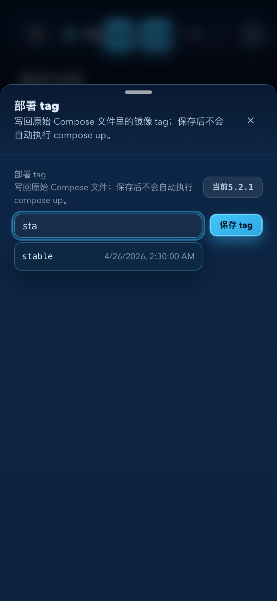

# Dockrev：服务详情可编辑原始 Compose Tag（#r4t8k）

## 状态

- Status: active
- Created: 2026-05-06
- Last: 2026-05-06

## 背景 / 问题陈述

运维用户需要在 Service 详情页直接调整服务长期部署 tag，用于改变后续部署版本范围。该变更必须写回原始 Docker Compose 配置文件，而不是只保存 UI 偏好或只影响下一次 update job。

## 目标

- 在 Service 详情设置抽屉中提供部署 tag 编辑控件。
- 服务端安全改写实际定义该 service `image` 的 compose 文件，并刷新 DB 中 service 的 `image.ref` / `image.tag`。
- 持久记录 tag 使用历史，作为输入框懒加载建议，最多返回 20 条，按最后一次使用时间倒序。

## 非目标

- 不改写 `.env` 变量、YAML anchor/alias、多行 image 或非字符串 image。
- 不在保存 tag 后自动执行 `docker compose up`。
- 不改变现有 update job 的 digest lock、cross-tag guard 与本地 tag 稳定化规则。

## 行为规格

- `GET /api/services/{service_id}/tag-suggestions` 返回 `{ items: [{ tag, lastUsedAt, source, useCount }] }`。
- `PUT /api/services/{service_id}/compose-tag` 接收 `{ tag }`，成功后返回 `{ ok, tag, imageRef, composeFile, updatedAt }`。
- 服务端按 stack `composeFiles` 顺序读取文件，选择最后一个定义该 service 非空 `image` 的文件作为 patch 目标。
- 只支持顶层 `services` 普通 mapping 下的单行 scalar `image:`，改写时保留缩进、引号风格和尾部注释；`image: nginx` 这类隐式 `latest` 可保存为显式 `image: nginx:<tag>`。
- 以下情况必须拒绝并返回明确错误：tag 非 Docker tag、服务/镜像找不到、image 含 `$` 变量插值、digest pin、alias/anchor、非单行 scalar、文件不可写。
- tag 保存成功后 upsert `service_tag_history`，成功 update job 也记录实际使用 target tag。

## 验收标准

- Given 服务 `image: ghcr.io/acme/api:5.2 # prod`，When 保存 tag `5.3`，Then 文件行变为 `image: ghcr.io/acme/api:5.3 # prod`，注释保留。
- Given 多个 compose files 均定义同名 service image，When 保存 tag，Then 只改写最后一个有效定义文件。
- Given 服务 `image: nginx`，When 保存 tag `1.27`，Then 文件行变为 `image: nginx:1.27`。
- Given image 使用 `${TAG}` / `$TAG` 或 digest pin，When 保存 tag，Then API 返回 400 且不写文件。
- Given 用户聚焦 tag 输入框，When suggestions 尚未加载，Then 前端懒加载一次并展示最多 20 条带 lastUsedAt 副标题的建议。
- Given 保存成功，When Service 详情刷新，Then 当前 tag 与 image ref 立即显示新值。

## Visual Evidence

- source_type: storybook_canvas
  target_program: mock-only
  capture_scope: element
  requested_viewport: 1440x900
  viewport_strategy: devtools-emulate
  sensitive_exclusion: N/A
  submission_gate: approved
  story_id_or_title: Pages/ServiceDetailPage/ComposeTagEditorSuggestions
  state: desktop suggestions
  evidence_note: verifies lazy-loaded tag suggestions with last-used subtitles inside the service settings drawer.
  blank_trim: checked; unchanged because the drawer border was not uniformly trimmable.

- source_type: storybook_canvas
  target_program: mock-only
  capture_scope: element
  requested_viewport: 390x900
  viewport_strategy: devtools-emulate
  sensitive_exclusion: N/A
  submission_gate: approved
  story_id_or_title: Pages/ServiceDetailPage/ComposeTagEditorMobileDrawer
  state: mobile bottom drawer suggestions
  evidence_note: verifies the tag editor remains usable in the narrow bottom settings drawer.
  blank_trim: checked; unchanged because the drawer border was not uniformly trimmable.

## References

- `docs/specs/m3tq9-service-update-explicit-target-tag/SPEC.md`
- `docs/specs/upjqw-compose-tag-stability/SPEC.md`
- `docs/specs/xyy72-auto-deploy-policy-configurator/SPEC.md`
