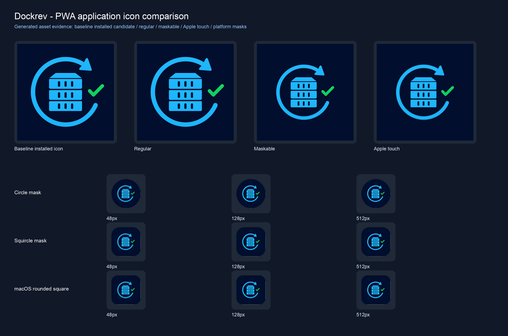
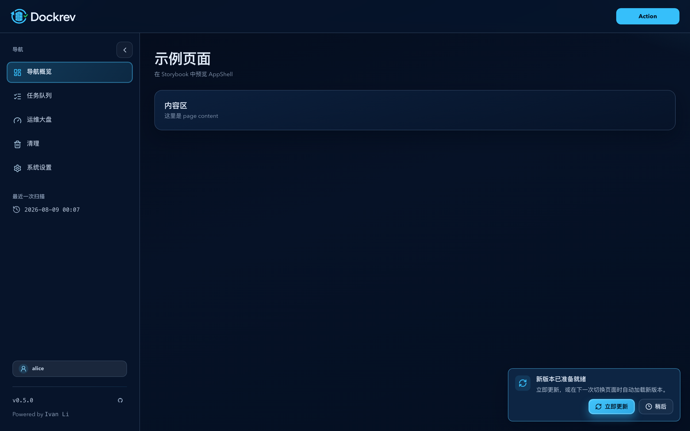
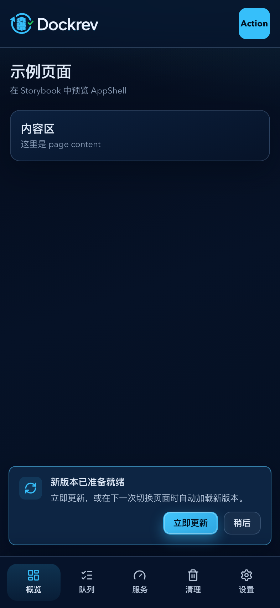
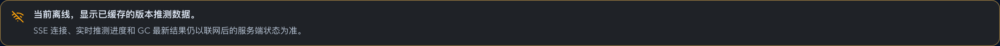
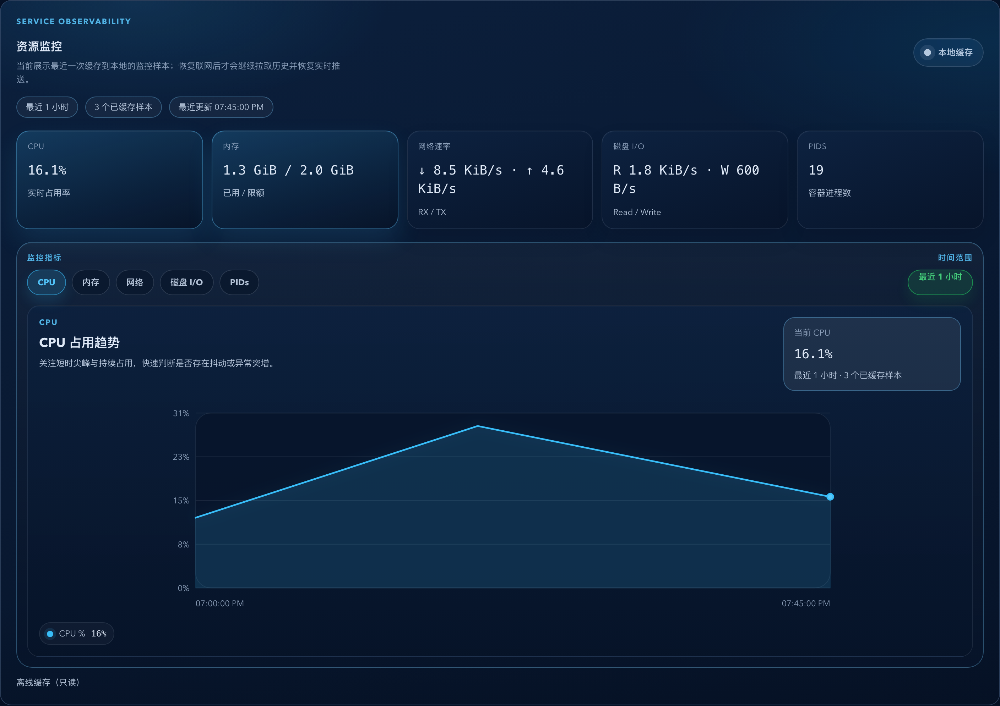
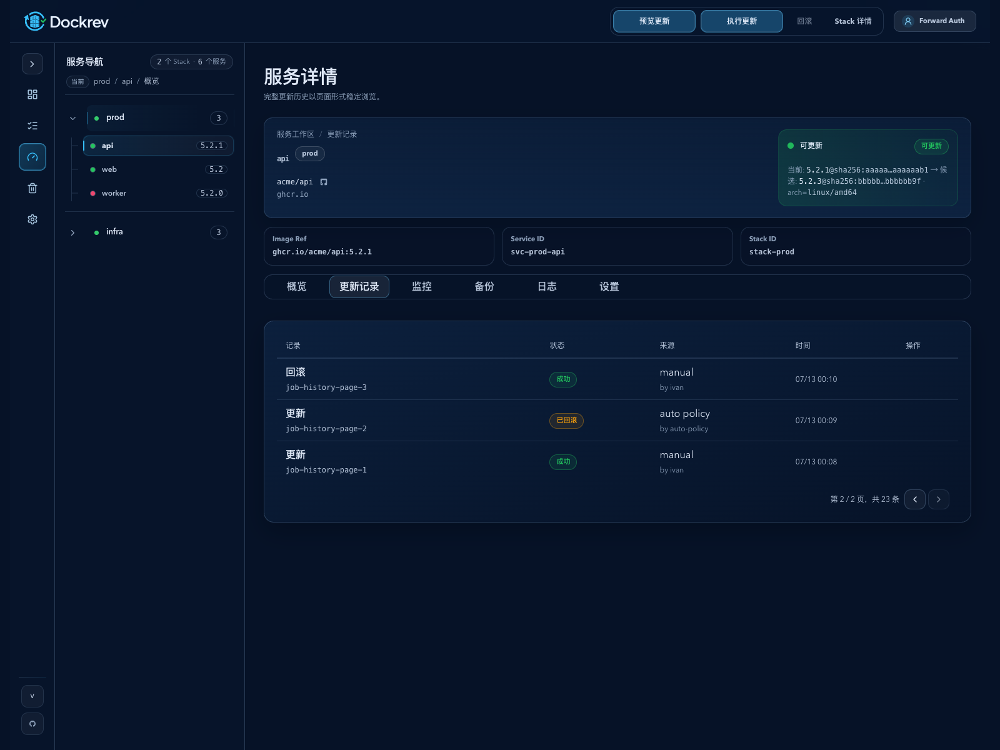
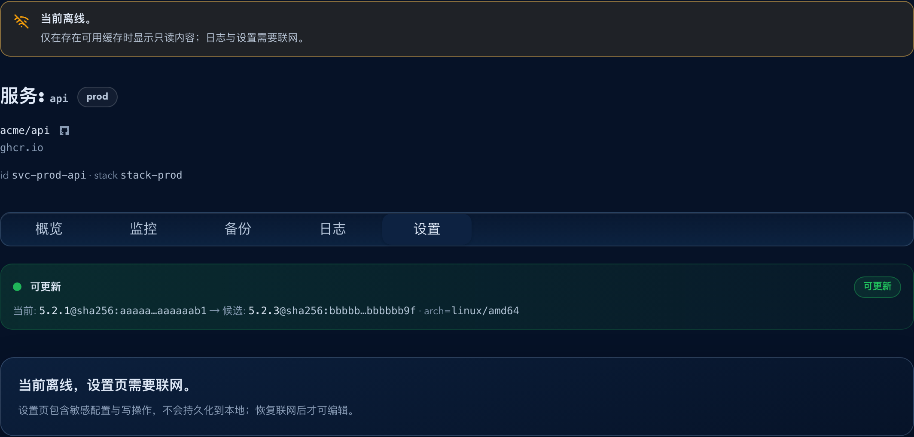

# Dockrev：Web PWA 离线壳、更新提示与分级缓存（#r8kpa）

## 状态

- Status: 实现中
- Last: 2026-08-08

## 背景 / 问题陈述

- 当前前端只在通知设置场景里临时注册 `public/sw.js`，它只承载 Web Push 与通知点击跳转，不具备真正的 PWA app shell、离线启动、安装能力或受控更新体验。
- 首页已有 `localStorage` 级快照，但缓存范围只覆盖 homepage launcher，其他主要只读页刷新后仍完全依赖联网，离线首开与弱网恢复都不稳定。
- 更新检测当前主要依赖页面 resume refresh 逻辑与 `/api/version` 展示，不存在以 service worker 就绪状态为真相源的全局升级提示。

## 目标 / 非目标

### Goals

- 把现有 Web 前端升级为真正可安装的 PWA：提供有效 `manifest.webmanifest`、安装图标、app shell precache、SPA navigation fallback，并保留现有 Web Push 行为。
- 引入统一的客户端只读快照缓存层：静态资源走 precache，持久只读快照落 IndexedDB，易失上下文仅保留内存态。
- 所有正式前端路由在已缓存 app shell 后都可离线重载入口；业务数据和写操作仍按各页面原有联网门控执行。
- 更新检查以 service worker 更新为主：页面激活时检查，页面可见时每 1 小时低频检查；新版本在后台预缓存完成后，用户可立即更新，或在下一次页级导航自动切换。
- 首页旧 `localStorage` 快照在首轮读取时迁移到统一持久缓存层。

### Non-goals

- 不实现离线写操作、离线任务提交、离线设置保存、离线日志 tail、离线 cleanup/ghcr/admin 管理页。
- 不引入页面关闭后的后台周期更新、Periodic Background Sync、离线消息同步或后台唤醒。
- 不修改后端业务 API 语义、鉴权模型或 supervisor 部署方式。

## 范围（Scope）

### In scope

- `docs/specs/r8kpa-web-pwa-offline-shell/**`
- `crates/dockrev-api/src/ui.rs`（内嵌前端静态资源的缓存响应头）
- `web/package.json`
- `web/vite.config.ts`
- `web/index.html`
- `web/public/**`
- `web/src/main.tsx`
- `web/src/sw.ts`
- `web/src/App.tsx`
- `web/src/Shell.tsx`
- `web/src/api.ts`
- `web/src/pages/**`
- `web/src/components/**`
- `web/src/stories/**`
- `web/tests/**`

### Out of scope

- Rust 服务端的业务语义、数据库 schema、API contract 变更；仅允许为内嵌前端静态资源补充本合同要求的缓存响应头。
- 推送通知业务语义与通知事件配置模型。
- Cleanup、Settings、Deploy Welcome、GHCR Registry 维护等联网必需页的业务数据离线化或离线写。

## 需求 / 行为合同

- service worker 使用 `vite-plugin-pwa` `injectManifest` 路线统一生成，并在同一个 worker 中同时承载低优先级 precache、SPA navigation fallback、Push、通知点击跳转与 `skipWaiting`。
- Web App Manifest 的 `id`、`scope`、`start_url` 固定为规范化 base path，三者不得包含内容版本、查询参数或构建时间戳；图标内容更新不得改变该身份。
- install icon 由 `docs/branding/generate_brand_assets.py` 从锁定的 Dockrev mark 导出：既有 `pwa-192.png` / `pwa-512.png` 继续作为 regular `purpose: "any"`；独立 `pwa-maskable-*.png` 使用全不透明 `#010E2D` 底图。maskable 的重要前景最大边为画布 58%-62%，且位于中心半径 40% 的安全圆；不得把平台圆角、阴影或外框烘焙进图源。产品 App 的 Manifest 是安装图标元数据唯一来源，产品 HTML 不声明 `apple-touch-icon`；文档站点的独立 Apple touch 图标不属于本产品入口。
- regular 与 maskable 不得共用资源或写成 `purpose: "any maskable"`。构建为产品 Manifest 图标和 HTML favicon 生成内容哈希文件名；发生字节变化时，当前入口必须同步指向新的内容派生 URL。manifest 由 PWA 插件生成唯一的 manifest link，是 Chromium 安装元数据的权威来源；HTML 只保留带哈希的浏览器 favicon，不得重复注入 manifest 或添加 Apple touch 安装来源。Worker 只预缓存应用壳，不得把 manifest、regular/maskable 图标或 Apple 图标固定进 precache/cache-first 路径。
- 内容哈希 install icon 文件使用 `public, max-age=31536000, immutable`；`index.html`、`manifest.webmanifest` 与 `sw.js` 使用 `no-cache` 重新验证。旧固定文件名可以继续被服务以兼容旧客户端，但不得被新 HTML、manifest 或 Worker precache 选中为安装图标版本。
- 应用启动即注册 service worker；通知设置页改为复用全局注册结果，不再自行注册单独 worker。
- 持久快照统一记录 `fetchedAt`、`staleAt`、`expireAt`、`schemaVersion`、`sourceVersion`；只有仍处于 `fresh` 窗口内的快照允许展示，超过新鲜窗口或超过 7 天都必须回退为需联网态。
- 纳入持久缓存的 read model 固定为：首页 launcher、概览/服务列表、stack detail、service detail 的 overview/history/monitoring/backup 只读摘要、队列列表、版本推测总览。
- service detail 的 history 仅回放现有 60 秒 fresh snapshot 中的 jobs；离线时不得建立 jobs SSE，联网且 history 激活时才允许实时刷新。
- 日志内容、认证态、通知敏感字段、设置表单值、写操作上下文与高时效流式数据不得落持久缓存。
- 离线时页面只允许展示仍处于 `fresh` 窗口内的本地只读数据，并把所有需要联网的写操作显式禁用或隐藏；不可继续展示非新鲜快照，也不得向用户暴露“数据过时”类提示。
- 更新检测触发器固定为：`focus`、`visibilitychange -> visible`、`pageshow(persisted)` 与页面可见期间每 1 小时轮询；同一 waiting worker 期间全局提示去重。
- 更新状态机固定为 `idle / downloading / ready / failed`。`updatefound` 进入 `downloading`；只有 Workbox worker 进入 `waiting` 才进入 `ready`，因此 `ready` 表示全部 precache 资源已完成。任何资源下载失败都保留旧版本并进入可重试状态。
- precache 请求通过 Workbox `requestWillFetch` 以 Fetch Priority `low` 调度；不支持该能力的浏览器使用默认调度。
- `ready` 后，“立即更新”和下一次 pathname 变化均走同一 single-flight `SKIP_WAITING` 激活。目标 URL 必须先由应用导航或浏览器历史提交，再由新 worker 接管重载；相同 pathname、查询参数变化和抽屉等内部状态不触发。
- “稍后”只隐藏更新气泡，不取消 waiting worker；下一次页级导航仍自动切换。激活失败时旧版目标页保留，waiting worker 与重试入口保留。
- 更新提示固定为不占主内容文档流的右下浮动气泡。下载态禁用更新按钮且不显示 tooltip；离线且尚未 ready 时，气泡仅在已有 hover/focus 期间保留，二者离开后隐藏；ready 后即使离线也可激活。
- navigation fallback 覆盖 `routes.ts` 的全部正式前端路由，并继续排除 `/api`、静态资产与 `/supervisor` 控制面。fallback 仅启动 app shell，不缓存管理数据或开放离线写。
- `/api/version` 仅继续用于展示文本，不作为切换真相源。
- Service worker 的 precache 只包含当前应用壳所需资源，并不得包含当前构建生成的 manifest、regular/maskable 图标、favicon 或 Apple 图标，也不得依赖 `?v=` 查询参数匹配来掩盖固定文件名；旧 precache 由 Workbox 清理，manifest、HTML、worker 与安装元数据通过网络重新验证发现新版本。
- Android Chrome 的 WebAPK 与 Chromium desktop 安装均依据稳定 manifest identity 识别应用，并在新 manifest 可用时按平台节流规则更新图标/元数据；现有 iOS/iPadOS Web Clips、浏览器快捷方式及不支持 manifest 迁移的浏览器不能被网站强制更新其已保存的图标或元数据。Dockrev 不把重新安装作为常规更新机制，文档只说明该平台限制与异常恢复边界。

## 验收标准（Acceptance Criteria）

- Given 用户首次联网访问并完成资源缓存，When 随后断网刷新任一正式前端路由，Then app shell 仍可启动；页面业务数据和写操作仍遵循原有联网门控。
- Given 离线进入缓存命中的只读页，When 数据来自本地快照，Then 页面只显示仍处于 `fresh` 窗口内的缓存数据，且所有写操作不会被误导性地保留为可点击。
- Given 本地快照已经离开 `fresh` 窗口或超过 7 天，When 用户离线进入对应页面，Then 页面不再展示该快照，而是直接回到需联网态。
- Given Chromium PWA installability 检查，When 页面具备有效 manifest、icons 与 service worker，Then 用户可安装到桌面/主屏。
- Given Chromium PWA installability 检查，When 页面具备有效 manifest、icons 与 service worker，Then 用户可安装到桌面/主屏，且 `id`、`scope`、`start_url` 与既有安装保持一致。
- Given 任一产品 Manifest 图标或 favicon 字节发生变化，When 构建新的 PWA，Then regular、maskable 与 favicon 的 Manifest/HTML 引用指向当前内容哈希文件，Worker 不预缓存这些安装元数据，缓存策略允许旧客户端重新验证 metadata，且几何、透明度和 hash 契约测试通过。
- Given 任一旧固定名 install icon 请求，When 服务器提供兼容响应，Then 它不带 immutable 缓存承诺，新的安装入口不会继续引用或 Worker precache 它；产品 HTML 不重新引入 `apple-touch-icon`。
- Given Android Chrome/WebAPK 或 Chromium desktop 已有安装，When 稳定 identity 下发布新的 manifest 与内容哈希图标，Then 平台可以按自身更新节流策略重新读取并更新安装元数据；Given iOS/iPadOS Web Clip 或不支持迁移的快捷方式，Then 文档明确其既有图标不能由站点强制替换，且不把重新安装作为正常流程。
- Given 已安装的 Chromium PWA 从 V1 启动并执行正常 update check，When V2 发布新的 Manifest 与内容哈希图标，Then 同一安装在不卸载/重装的情况下取得 V2 的 Manifest 和图标响应，且 `id`、`scope`、`start_url` 保持不变。
- Given 发布了新的前端构建，When `updatefound` 发生，Then 更新状态进入 `downloading` 且“立即更新”不可用；只有 worker 成为 `waiting` 后才进入可更新状态。
- Given worker 已 `ready`，When 用户点击“立即更新”，Then 当前 URL 被新 worker 接管并重载；When 用户选择“稍后”后进行应用内导航或浏览器前进/后退，Then 目标 pathname 先提交并由新 worker 重载。
- Given 更新下载或激活失败，When 用户继续使用当前页面，Then 旧版本不中断并保留重新检查或再次激活的入口。
- Given 离线且 worker 未 ready，When 更新气泡没有 hover/focus，Then 气泡隐藏；Given worker 已 ready，Then 离线状态仍可更新。
- Given 窄屏 `393x852` 或 `320px` 宽度，When 更新气泡显示，Then 它不改变内容区尺寸、不遮挡底部导航，并保持可键盘聚焦、`aria-live="polite"` 和 reduced-motion 兼容。
- Given 现有 Web Push 已启用，When 升级到新的 worker 实现，Then 订阅、通知展示与通知点击跳转行为保持可用。

## Visual Evidence

视觉证据在实现完成后补充到本 spec 的 `assets/` 目录，并绑定到 Storybook mock-only 场景；离线新鲜快照回放更新记录时，记录列仍严格保持操作与补充结果摘要、Job ID 两行，结果摘要单行截断，并省略已由操作类型或状态表达的泛化内容。匹配记录超过 20 条时，fresh snapshot 在本地按页浏览，且仅渲染当前页。失败记录可以弱化非状态信息，但状态 Badge 必须保持完整颜色与对比度。

### Application Icon Contract

- source_type: deterministic generated contact sheet from the locked pre-change asset and the candidate build
- target_program: mock-only platform-mask preview
- capture_scope: Regular/`any`, maskable, legacy Apple touch compatibility reference, 48/128/512px previews, circle/squircle/macOS masks; product favicon bytes are covered by the build contract, and docs-site Apple touch remains an independent reference
- state: owner-confirmed candidate freeze
- 本次交付只改变产品资源命名、manifest/HTML 引用与缓存生命周期；锁定的 regular、maskable、favicon 与 legacy Apple reference 图稿像素必须与当前证据一致，Apple reference 不属于产品 HTML 安装元数据，文档站点 Apple touch 图标不随本产品入口变化。

### PWA Update Bubble Desktop

- source_type: storybook_canvas
- target_program: mock-only
- capture_scope: `browser-viewport`
- requested_viewport: 1440x900
- viewport_strategy: storybook-static
- story_id_or_title: `Layouts/AppShell/UpdateReadyBubble`
- state: ready, fixed outside the app content flow
- PR: include

### PWA Update Bubble Mobile

- source_type: storybook_canvas
- target_program: mock-only
- capture_scope: `browser-viewport`
- requested_viewport: 393x852
- viewport_strategy: storybook-viewport
- story_id_or_title: `Layouts/AppShell/UpdateReadyBubbleMobile`
- state: ready above bottom navigation
- PR: include

### Offline Snapshot Notice

- source_type: storybook_canvas
- target_program: mock-only
- capture_scope: `.readonlySnapshotNotice-warn`
- requested_viewport: 1440x900
- viewport_strategy: storybook-static
- PR: include

### Service Monitoring Offline Snapshot

- source_type: storybook_canvas
- target_program: mock-only
- capture_scope: `.svcResourceCard`
- requested_viewport: 1440x900
- viewport_strategy: storybook-static
- PR: include

### Service Update History Fresh Snapshot

- source_type: storybook_canvas
- target_program: mock-only
- capture_scope: `browser-viewport`
- requested_viewport: 1600x1200
- viewport_strategy: controlled-viewport
- state: page-level history deep link with collapsed primary navigation, persisted fresh jobs read model, client pagination, and strictly two-line record summaries
- PR: include

### Service Settings Offline Gate

- source_type: storybook_canvas
- target_program: mock-only
- capture_scope: `.page`
- requested_viewport: 1440x1080
- viewport_strategy: storybook-static
- PR: include

## Related ADRs

- None

## Related Contract

- `docs/specs/async-data-continuity/SPEC.md`
