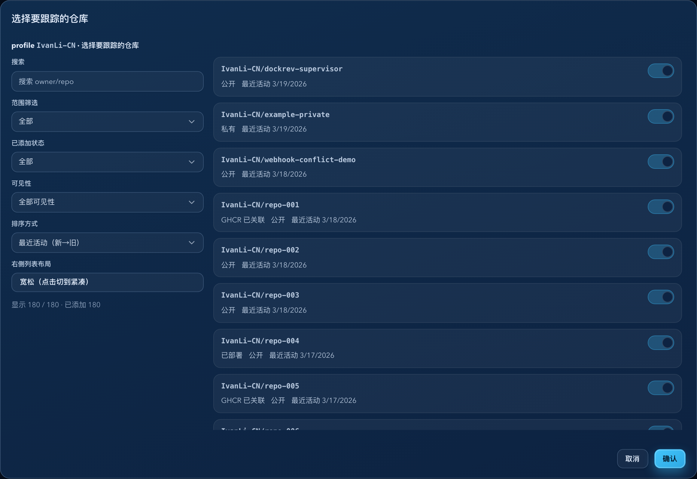

# Dockrev：GHCR 添加 Repo 弹窗加宽 + 镜像/部署筛选（#saqkf）

## 状态

- Status: 已完成
- Created: 2026-03-19
- Last: 2026-03-19

## 背景 / 问题陈述

- Settings 页 GHCR“选择要跟踪的仓库”弹窗在大量仓库场景下宽度偏窄，右侧卡片列表被压缩得过度，长仓库名可读性差。
- 当前仓库选择器只支持“已添加状态 / 可见性 / 搜索 / 排序”，无法快速聚焦“已经有关联 GHCR 镜像”或“当前服务器已部署”的仓库。
- 现有 `POST /api/github-packages/resolve` 仅返回 `visibility / lastActivityAt`，前端缺少支撑新筛选所需的稳定元数据。

## 目标 / 非目标

### Goals

- 放宽 GHCR 仓库选择弹窗宽度，并调整左右列比例与响应式断点，保证右侧仓库卡片在桌面宽屏下有足够阅读空间。
- 为 owner/profile resolve 返回结果新增 `ghcrLinked` 与 `deployed` 元数据。
- 前端新增“范围筛选”下拉，固定支持 `全部 / 有镜像 / 已部署`。
- 保持现有“确认后仅提交变更项”和拖动批量切换的交互语义不变。

### Non-goals

- 不改动 tracked repos 维护页、Queue 页与 webhook job 语义。
- 不新增独立接口；继续复用 `POST /api/github-packages/resolve`。
- 不用 repo/package 同名做模糊映射；“有镜像”只接受可证明的 GHCR 元数据映射。

## 范围（Scope）

### In scope

- `crates/dockrev-api/src/api/github_packages.rs`
- `crates/dockrev-api/src/api/types/github_packages.rs`
- `crates/dockrev-api/src/api/tests.rs`
- `crates/dockrev-api/src/github.rs`
- `crates/dockrev-api/src/registry.rs`
- `web/src/api.ts`
- `web/src/pages/SettingsPage.tsx`
- `web/src/App.css`
- `web/src/stories/mocks/dockrevMockApi.ts`
- `web/src/stories/pages/SettingsPage.stories.tsx`

### Out of scope

- `GET /api/github-packages/repos` / `GHCR 维护页` 契约
- webhook sync / delete / audit worker 行为
- 弹窗外的 GHCR 区域列表交互模型

## 接口契约（Interfaces & Contracts）

| 接口（Name） | 类型（Kind） | 范围（Scope） | 变更（Change） | 备注（Notes） |
| --- | --- | --- | --- | --- |
| `POST /api/github-packages/resolve` | HTTP API | internal | Updated | `repos[]` 新增 `ghcrLinked` 与 `deployed` |
| `GitHubPackagesRepoSelection.ghcrLinked` | Type | internal | New | `boolean | null`；`true` 表示已从 GHCR 元数据精确映射到该仓库，`null` 表示未检查/不适用 |
| `GitHubPackagesRepoSelection.deployed` | Type | internal | New | `boolean`；仅统计当前未归档 stack/service |
| `GitHubPackagesRepoPicker.scopeFilter` | UI state | internal | New | `all / ghcr_linked / deployed` |

## 需求（Requirements）

### MUST

- `POST /api/github-packages/resolve` 响应 `repos[]` 新增：
  - `ghcrLinked?: boolean | null`
  - `deployed: boolean`
- owner/profile resolve 必须为每个仓库返回稳定的 `deployed` 结果，判定规则固定为：当前未归档 stack/service 的 `image_ref` 对应 `ghcr.io/<owner>/<repo>`。
- owner/profile resolve 的 `ghcrLinked=true` 只能来自可证明的 GHCR 元数据映射；不得使用 repo/package 同名推断。
- 前端新增“范围筛选”下拉，固定为：
  - `全部`
  - `有镜像`
  - `已部署`
- 过滤管道顺序固定为：`范围筛选 -> 已添加状态 -> 可见性 -> 搜索 -> 排序`。
- GHCR 选择弹窗桌面宽度提升到宽屏档，左右列改为“更宽控制栏 + 更宽列表区”，并在接近平板宽度时提前切单列。

### SHOULD

- 仓库卡片补充 `GHCR 已关联` / `已部署` 的辅助文案或标签，便于解释筛选结果。
- 当 GHCR 元数据部分不可读时，返回 warning，但不阻断整个 resolve。

## 验收标准（Acceptance Criteria）

- Given 打开 owner/profile 仓库选择弹窗，When 在桌面宽屏下查看，Then 右侧仓库卡片不再被压成窄列，长仓库名可正常换行阅读。
- Given 范围筛选为 `全部`，When 不叠加其他条件，Then 列表行为与当前版本等价，仅多出新元数据展示。
- Given 范围筛选为 `有镜像`，When 某仓库存在可证明的 GHCR 关联元数据，Then 该仓库保留。
- Given 范围筛选为 `已部署`，When 仓库对应 `ghcr.io/<owner>/<repo>` 正被当前未归档服务使用，Then 该仓库保留。
- Given 组合 `已部署 + 未添加 + 搜索词`，When 条件变化，Then 列表按固定管道更新且结果数/汇总文案同步刷新。
- Given 从开关列拖动批量切换，When 列表已经被新筛选收窄，Then 批量切换语义不回归。

## 非功能性验收 / 质量门槛（Quality Gates）

- `cargo test -p dockrev-api github_packages_resolve_`
- `bun run --cwd web lint`
- `bun run --cwd web build`

## Visual Evidence (PR)

- source_type: storybook_canvas
  story_id_or_title: Pages/SettingsPage / Default
  state: GHCR owner resolve dialog open
  evidence_note: 证明 GHCR 添加 Repo 弹窗以独立元素截图展示时，桌面宽屏宽度已放宽，右侧列表不再被压成窄列，并且范围筛选与 GHCR 关联/已部署标签同时可见。
  image:
  

## 实现里程碑（Milestones / Delivery checklist）

- [x] M1: 补齐 spec 与 README 索引，冻结 API 字段与筛选口径。
- [x] M2: 后端 resolve 新增 `ghcrLinked / deployed` 元数据与测试。
- [x] M3: 前端新增范围筛选、元数据展示与宽屏布局调整。
- [x] M4: mock / Storybook / lint / build / review-loop 收敛完成。

## 风险 / 假设

- 风险：部分 GHCR package 可能缺少可用的可证明元数据，此时只能返回 `ghcrLinked=null/false`，不能强行猜测。
- 假设：“已部署”只统计当前未归档 stack/service，符合本次需求口径。
- 假设：GHCR 元数据探测失败时不影响基本 resolve 能力，前端仍可展示全部仓库。

## 变更记录（Change log）

- 2026-03-19：创建规格，冻结“弹窗加宽 + GHCR 关联/部署筛选 + resolve 元数据扩展”的范围与验收口径。
- 2026-03-19：完成后端 GHCR 元数据推导、前端范围筛选与弹窗布局放宽，并通过 cargo/web/storybook 回归与 review-loop 收敛。
