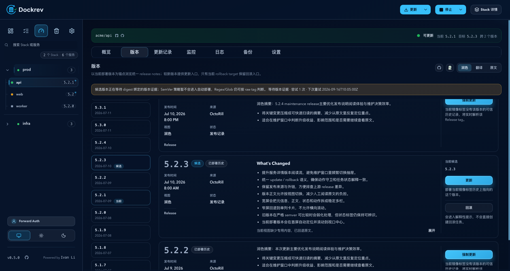
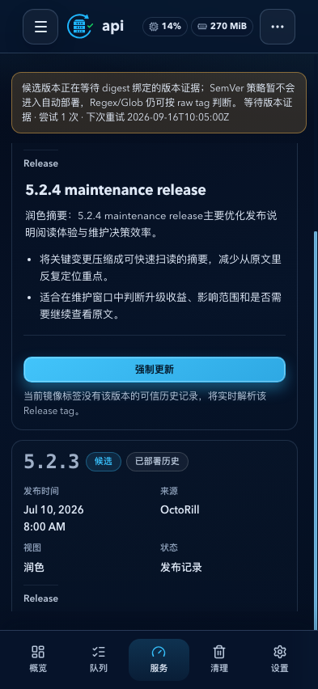
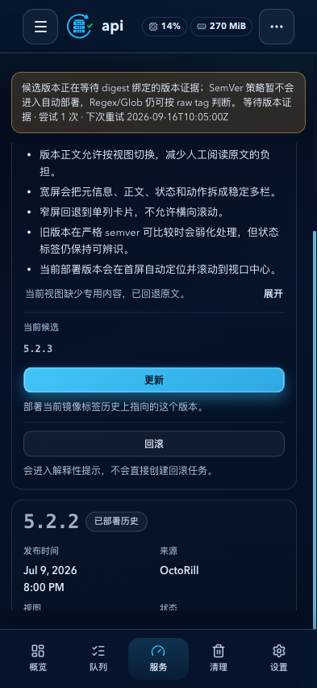
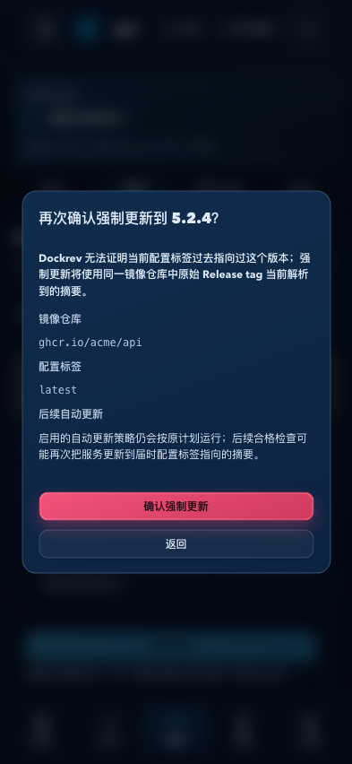

# Dockrev：服务版本列表指定版本更新

## Context and Scope

- Context: 服务版本列表应允许将服务部署到用户选中的较新 release，即使该 release 不再是当前浮动标签指向的 candidate。
- In scope: 普通服务版本列表的历史标签归属证据、指定版本预检与提交、确认交互和精确摘要部署。
- Out of scope: Dockrev supervisor 自我升级、其他更新入口、任意历史版本回滚，以及自动更新策略的改变。

## Terms and Interfaces

- `configured tag`: 当前服务镜像配置中的 tag，例如 `latest`。
- `historical association`: 由成功检查实际观察到的镜像仓库、当时配置 tag、版本和摘要关系；缺少记录表示未知。
- `normal update`: 使用可信历史关联中的精确摘要部署所选版本。
- `forced update`: 对缺少可信关联的版本，实时解析其 release tag 并在二次确认后部署解析出的摘要。
- Interfaces: 服务级 `version-update-observations` 查询、`version-update/preview` 预检和 `version-update` 提交接口；通用 `/api/updates` 契约保持独立。

## Requirements

### REQ-SVSU-001

- The system MUST expose update actions only for release tags that are strictly SemVer-newer than the currently deployed version. A trusted historical association to the service's current image repository and configured tag selects normal update; absent or mismatching evidence selects forced update. Older, equal, or incomparable releases cannot be submitted.
- Inputs: current deployed version, configured image repository and tag, release tag, and recorded observations.
- Outputs: normal, forced, or unavailable action classification.

### REQ-SVSU-002

- The system MUST record prospective observations of the digest returned for the configured tag during successful checks, including service, image repository, configured tag, digest, and observation time; it MUST bind the version when inference completes. It MUST NOT backfill prior observations or inventory unrelated tags.
- Inputs: successful check result and any later digest-bound version inference.
- Outputs: deduplicated historical association evidence that preserves the tag configuration at observation time.

### REQ-SVSU-003

- The system MUST provide authenticated service-scoped observation, preview, and submit interfaces. Preview MUST return the classification, selected target digest, current digest/version, exact image reference, image repository, and configured tag. Submit MUST include those preview baselines and return the created update job identifier.
- Inputs: service ID, release tag, and preview baselines for submission.
- Outputs: observations, a validated preview, or a service update job.

### REQ-SVSU-004

- The system MUST revalidate eligibility, current service baselines, historical association, target digest, operation locks, and architecture at submission. Forced submission MUST explicitly confirm the forced path and resolve the original release tag in the same image repository. Stale state, unresolved tags, or architecture mismatch MUST fail without creating a job.
- Inputs: preview result and explicit forced confirmation when required.
- Outputs: accepted update job or a conflict/validation error with no job.

### REQ-SVSU-005

- The system MUST execute the selected digest through the existing update, backup, health-check, and rollback protections. It MUST preserve the Compose configured tag and synchronize that local tag to the running image without pulling the current configured tag after the selected digest is deployed. Generic update behavior MUST remain unchanged.
- Inputs: validated selected digest and current configured image reference.
- Outputs: normal update job result with the configured local tag pointing at the running image after success.

### REQ-SVSU-006

- The version list MUST use one confirmation for normal update and an additional explicit confirmation for forced update. Confirmation MUST explain that an enabled automatic update policy may later advance the service to the configured tag's then-current digest.
- Inputs: preview classification and existing service automatic-update policy context.
- Outputs: user-confirmed update submission or cancellation.

### REQ-SVSU-007

- The system MUST keep Dockrev supervisor self-upgrade and every update button outside the ordinary service version list on their existing paths.
- Inputs: service identity and update entry point.
- Outputs: existing action behavior for excluded entry points.

## Verification

### VER-SVSU-001

- Method: backend API and frontend interaction tests for newer, older, equal, incomparable, historically associated, and unknown releases.
- covers: `REQ-SVSU-001`, `REQ-SVSU-003`, `REQ-SVSU-006`, `REQ-SVSU-007`
- Pass condition: only newer releases are actionable; association determines the confirmation path; excluded entry points retain their behavior.

### VER-SVSU-002

- Method: SQLite migration, check persistence, and inference settlement tests.
- covers: `REQ-SVSU-002`
- Pass condition: observations retain the tag/repository as seen at check time, inference binds by digest, duplicates are idempotent, and migration creates no historical associations.

### VER-SVSU-003

- Method: API integration tests and registry/operation-lock test doubles.
- covers: `REQ-SVSU-004`
- Pass condition: stale baselines, unresolved release tags, mismatched architecture, and unconfirmed force requests create no job.

### VER-SVSU-004

- Method: updater tests and controlled Docker/Compose execution.
- covers: `REQ-SVSU-005`
- Pass condition: the selected digest runs, the configured Compose tag remains unchanged and locally resolves to the running image, and generic update tag-pull behavior is unchanged.

## Visual Evidence

### Desktop version list

- Source: local demo (`/demo/`)
- Viewport: 1800 x 960
- Scope: ordinary service version list with normal and forced update actions

### Mobile version list actions

- Source: local demo (`/demo/`)
- Viewport: 393 x 852
- Scope: forced-update and normal-update actions within the version cards

### Mobile forced-update confirmation

- Source: local demo (`/demo/`)
- Viewport: 393 x 852
- Scope: second confirmation with the configured tag and subsequent automatic-update notice
- The owner confirmed this screenshot set represents the implemented actions and confirmation flow.

## Related ADRs

None

## References

- `./IMPLEMENTATION.md`
- `./HISTORY.md`
- `../ey4ar-service-detail-subpages/SPEC.md`
- `../99egq-explicit-update-tag-contract/SPEC.md`
- `../upjqw-compose-tag-stability/SPEC.md`
- `../auto-update-candidate-settlement/SPEC.md`
