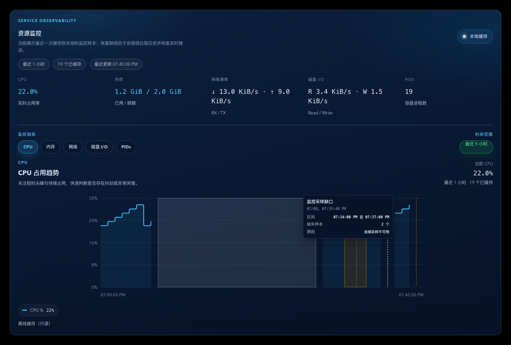
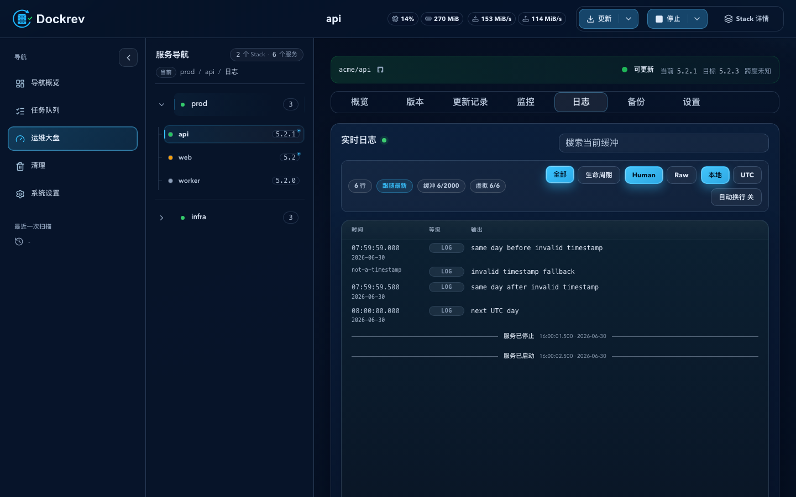

# Dockrev：服务生命周期可观测性

> 当前有效规范以本文为准；实现覆盖与当前状态见 `./IMPLEMENTATION.md`，主题局部演进见 `./HISTORY.md`，持久决策的完整取舍见关联 ADR。

## 背景 / 问题陈述

资源采样只记录容器仍然存在且可采集的数值，无法证明重启发生过；Job 文本也不是服务日志的持久事件源。服务停止、启动的真实边界必须独立落库，才能同时服务图表标注、日志行和历史查询。

## 目标 / 非目标

### Goals

- 为所有 Dockrev 受管的服务生命周期变化记录持久、可重放、可审计的服务级事件。
- 使用 Docker Engine events 观察停止边界，并使用最终容器 inspect 的 `StartedAt` 与 Compose 运行态确认启动和副本状态。
- 从同一事件账本生成资源图表标注、停止区段和带来源的系统日志行。

### Non-goals

- 不回溯发布前的历史事件，不从资源采样缺口或 Job 文本推断转换。
- 不追踪外部 Docker 操作、restart policy 或 Dockrev Supervisor 自升级。
- 不加入容器 health/readiness 语义，不修改既有 Compose 命令或资源采样 cadence。

## 范围（Scope）

### In scope

- 主应用 SQLite 事件账本、30 天清理、窗口查询和游标 SSE。
- 手动服务/Stack 生命周期、update、rollback、backup、managed-override reconcile 的生命周期观察。
- Service Detail 资源图表和日志面板的生命周期投影、筛选、重连和 Storybook 状态。
- docker-socket-proxy 的 `EVENTS=1` 部署说明和缺权诊断。

### Out of scope

- 指标数据库存储生命周期事件或改变资源监控开关的含义。
- 外部程序直接操作容器时的归因和历史补账。

## Related ADRs

- [Record Lifecycle Transitions As Durable Service Events](../../adr/0001-service-lifecycle-event-ledger.md)

## 需求（Requirements）

### MUST

- 事件记录包含服务、Stack、操作组、可空 Job、来源、转换类型、观察时间、边界精度、证据和容器详情。
- 仅精确停止边界与精确启动边界可以配对为 availability interval；窗口查询必须带入窗口前最后一个精确停止事件。
- 事件留存 30 天，且独立于资源监控是否启用。
- Engine events 观察失败或副本状态未知时记录 `observation_incomplete`，不得伪造区段；Compose 命令失败时记录 `operation_failed`。
- Stack 操作为每个服务生成事件，并共享同一个 `operation_group_id`。

### SHOULD

- 事件 SSE 使用持久游标，清理导致游标断档时发送 reset 并由客户端重新获取快照。
- 事件观察使用 `DOCKER_HOST` 的现有端点，但不占用资源采样 client 的限流和熔断预算。
- 生命周期接口在资源监控关闭时仍可读；资源 history 保持既有 `409 resource_monitor_disabled` 合同。

## 功能与行为规格（Functional/Behavior Spec）

### Core flows

1. 为一次受管 Compose 操作创建操作组，快照目标服务和现有容器，先建立操作范围内的 Engine events 流，再执行原有命令。
2. 观察容器 stop/die/destroy 等终止事件；命令结束后检查当前 Compose 服务态和所有容器 `StartedAt`，归并为服务级 `stopped` 或 `started` 事件。
3. 将服务事件按时间顺序配对为 availability interval。未恢复的精确停止事件延伸到查询窗口右端；只有启动而没有精确停止时显示启动单点。
4. 资源图表将事件边界加入时间域。区间投影宽度小于 6px 时显示单线，否则显示低权重区段和两端边界。
5. 日志面板将生命周期记录作为 `system` union record 与 Docker 输出合并。默认使用当前 Docker tail 的最早时间到现在；没有可解析 tail 时间时使用最近 24 小时；Lifecycle 视图使用最近 30 天。

### Edge cases / errors

- 同一容器的多个 Engine 终止动作去重；同一操作组、服务和转换类型幂等写入。
- 事件流无法连接、被权限拒绝、被截断或最终副本为 partial/unknown 时保留已确认单点，并写入 `observation_incomplete`。
- 已观察到停止后 Compose 命令失败时保留停止事件和开放区段，同时写入失败事件。
- 资源样本为空但生命周期事件存在时仍渲染事件时间轴，不生成任何虚假的指标样本。
- 游标对应的事件已因 30 天清理删除时发送 reset；客户端重新拉取快照后继续订阅。

## 接口契约（Interfaces & Contracts）

- `GET /api/services/{service_id}/lifecycle-events?since=&until=`：返回 `serviceId`、`events`、`availabilityIntervals`、`lastEventId` 和留存边界；时间参数为 RFC3339，最大读取 30 天。
- `GET /api/services/{service_id}/lifecycle-events/events?afterId=`：返回可重放的 `lifecycle_event` 和 `lifecycle_event_reset` SSE。
- `GET /api/services/{service_id}/resource-usage/history`：监控开启时在兼容响应中增加同窗口 lifecycle projection；监控关闭继续返回 `409 resource_monitor_disabled`。
- 新增 `ServiceLifecycleEvent`、`LifecycleAvailabilityInterval` 和带 `system` 来源的前端日志记录类型；既有 Docker 日志行和 SSE 事件名称保持兼容。

## 验收标准（Acceptance Criteria）

- Given 一次成功重启，When 观察器和最终 inspect 均成功，Then 服务历史有一条 `stopped` 和一条 `started`，并可配对成精确停机区段。
- Given 停止或启动边界缺失，When 查询生命周期历史，Then 已确认单点和 `observation_incomplete` 可见，且不存在虚构 availability interval。
- Given 资源监控已关闭，When 查询生命周期历史，Then 生命周期快照仍返回数据，资源 history 仍按既有合同返回 `resource_monitor_disabled`。
- Given 图表区间投影小于 6px 或不少于 6px，When 渲染图表，Then 分别显示单线或区段，并能查看精确时间与持续时长。
- Given 日志 tail 有或没有可解析时间，When 打开日志面板，Then 系统行分别按 tail 范围或最近 24 小时合并；Lifecycle 视图始终可查看 30 天。

## 验收清单（Acceptance checklist）

- [x] 核心受管操作路径已接入同一观察器。
- [x] 账本迁移、清理、幂等和跨窗口配对已覆盖。
- [x] REST/SSE、资源 history 和日志 union 合同已覆盖。
- [x] 短区间、长区间、不完整观察和空数据 UI 状态已覆盖。

## 非功能性验收 / 质量门槛（Quality Gates）

### Testing

- Unit tests: ledger reducer, retention, cursor reset, Engine event decoder and replica aggregation.
- Integration tests: lifecycle API/SSE and every managed Compose operation adapter with fake Engine streams.
- E2E tests (if applicable): deterministic Storybook interaction coverage; real Compose validation only through the shared testbox.

### UI / Storybook (if applicable)

- Stories to add/update: short restart, long downtime, open downtime, incomplete observation, and lifecycle log rows.
- `play` / interaction coverage to add/update: filter, SSE replay/reset, line/band geometry and empty-tail fallback.

### Quality checks

- `cargo fmt --all --check`
- `cargo test -p dockrev-api`
- `bun run --cwd web lint`
- `bun run --cwd web build`
- `bun run --cwd web build-storybook`
- `bun run --cwd web test-storybook`

## Visual Evidence

PR: include

- source_type: storybook_canvas
  target_program: mock-only
  capture_scope: element
  requested_viewport: none
  viewport_strategy: storybook-viewport
  margin_policy: require_margin
  evidence_surface: component
  sensitive_exclusion: N/A
  submission_gate: approved
  story_id_or_title: Components/ServiceResourcePanel/LifecycleMarkers
  state: service-stopped downtime, continuous unexplained gap, isolated gap
  evidence_note: verifies that service-stopped downtime uses a neutral gray line/band, continuous unexplained gaps use a warning band, isolated missing samples are unmarked, trend paths break across every gap, and hover details replace point markers.
  image:
  

PR: include

- source_type: storybook_canvas
  target_program: mock-only
  capture_scope: element
  requested_viewport: none
  viewport_strategy: storybook-viewport
  margin_policy: trim_only
  evidence_surface: page
  sensitive_exclusion: N/A
  submission_gate: approved
  story_id_or_title: Pages/ServiceDetailPage/LogsSectionLifecycleUnion
  state: Docker and lifecycle union with lifecycle-only filter
  evidence_note: verifies distinct stopped and started lifecycle events render as neutral separators rather than log rows or INFO severity, while Docker log rows and severity counts remain unchanged.
  image:
  

## Related PRs

- None

## 风险 / 开放问题 / 假设（Risks, Open Questions, Assumptions）

- 风险：socket proxy 未开放 events 时无法取得精确停止边界；系统必须保留不完整诊断而不是猜测。
- 假设：首版不需要跨服务依赖 readiness，Compose 的全部预期副本状态足以确认服务级转换。

## 参考（References）

- `CONTEXT.md`
- `docs/adr/0001-service-lifecycle-event-ledger.md`
