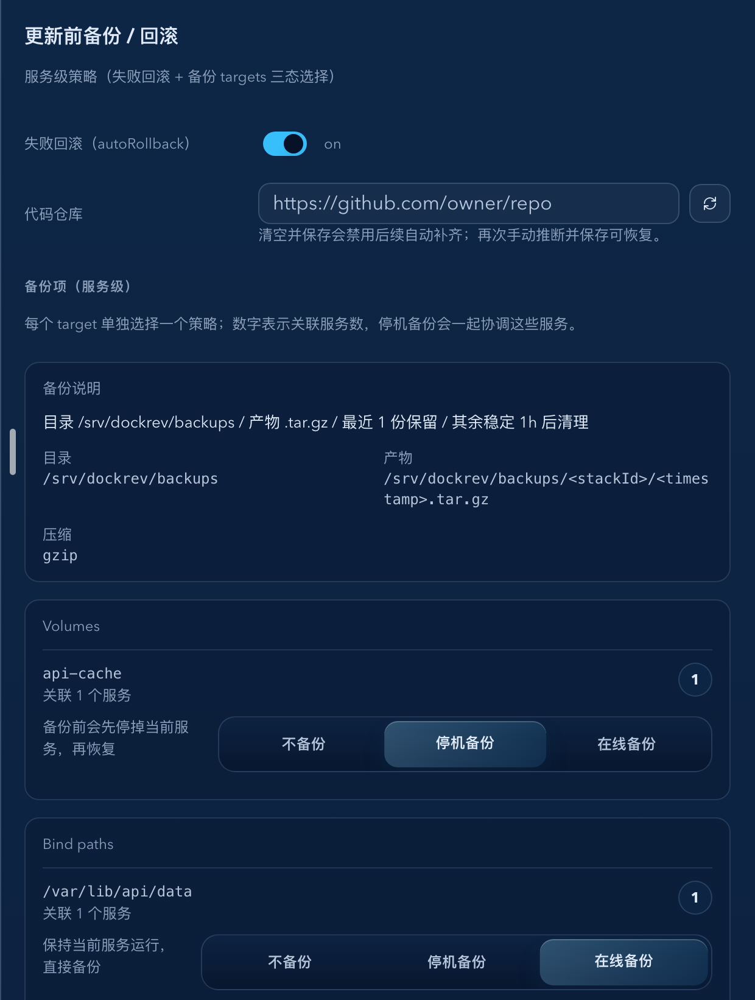
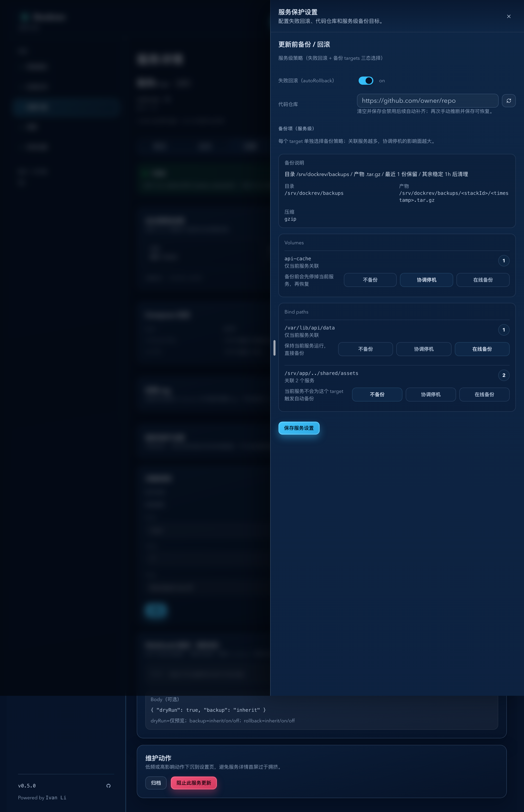
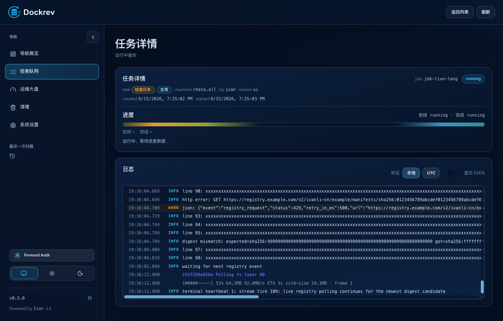
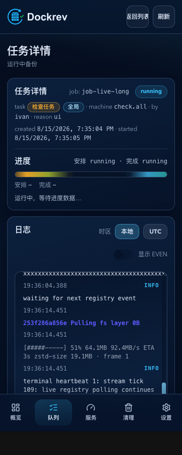
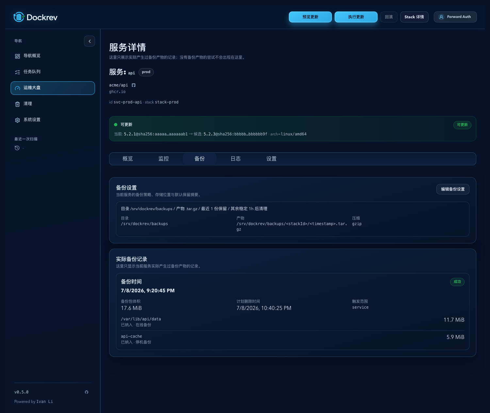
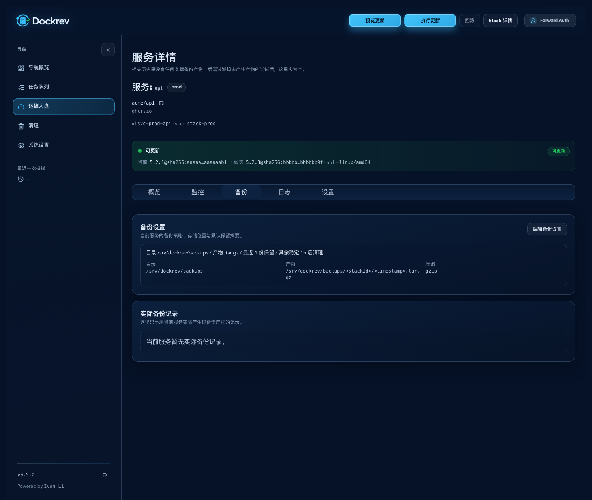
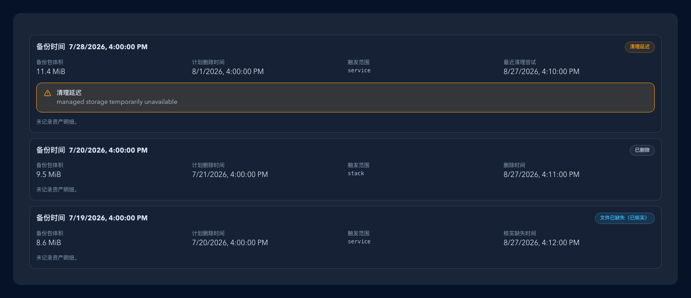

# Dockrev：服务保护设置补全备份目标直选与备份说明（#sxcmc）

> 当前有效规范以本文为准；实现覆盖与当前状态见 `./IMPLEMENTATION.md`，关键演进原因见 `./HISTORY.md`。

## 背景 / 问题陈述

- 现有“服务保护设置”抽屉无法直接表达单个 target 的真实备份策略；`selected + inherit|force|skip` 三态把“是否备份”和“如何备份”揉在了一起，既不直观，也难以承载共享卷的停机协调语义。
- 备份项与普通服务设置此前混在同一条保存链路里，语义边界模糊，前端也缺少“候选发现结果”和“存储说明”的专用接口。
- 用户在服务页内看不到“保存在哪 / 保存多久 / 是否压缩”的当前行为，只能靠代码或系统设置猜测，容易误解备份语义。

## 目标 / 非目标

### Goals

- 在现有服务详情页内补齐独立 `备份` 子页，并通过专用“备份设置”抽屉承载 `Volumes` 与 `Bind paths` 的直接选择能力，不新增新的 stack 级备份编辑页。
- 为服务详情页新增专用 `GET/PUT /api/services/{service_id}/backup-targets`，返回 compose 派生候选、关联服务信息与只读存储说明。
- 为服务详情页新增专用 `GET /api/services/{service_id}/backup-records`，返回“当前服务相关”的备份记录卡片所需只读数据。
- 后端基于 compose 声明解析当前服务可备份 mounts，并在保存时原子更新 `stack.backup.targets` 与当前服务级 backup-target policy 关系。
- 服务页内每个 target 使用三选一策略：`不备份`、`停机备份`、`在线备份`。
- 在摘要卡/抽屉内清楚展示备份目录、产物模式、压缩格式与默认保留摘要，但不扩展 retention 编辑能力。

### Non-goals

- 不把 `PUT /api/services/{id}/settings` 改造成隐式跨层级写 `stack.backup.targets` 或服务级 backup-target policy 的副作用接口。
- 不新增 stack 级或全局级的完整备份目标管理器。
- 不提供任意备份路径、压缩级别、并发度、任务进度权重或默认保留策略配置。
- 不新增备份记录删除、下载、重试等 mutation 能力。
- 不把 Docker 运行时 mounts 当作服务备份目标候选；运行时 inspect 仅用于解析 Dockrev 自身备份产物存储。

## 范围（Scope）

### In scope

- `docs/specs/README.md`
- `docs/specs/sxcmc-service-backup-target-selector/**`
- `crates/dockrev-api/src/api/**`
- `crates/dockrev-api/src/compose.rs`
- `crates/dockrev-api/src/db/**`
- `crates/dockrev-api/src/discovery.rs`
- `crates/dockrev-api/src/backup.rs`
- `crates/dockrev-api/src/backup_helper.rs`
- `crates/dockrev-api/src/backup_storage.rs`
- `crates/dockrev-api/src/updater.rs`
- `web/src/api.ts`
- `web/src/api/types.ts`
- `web/src/pages/ServiceDetailPage.tsx`
- `web/src/pages/useServiceDetailPageState.tsx`
- `web/src/pages/JobDetailPage.tsx`
- `web/src/App.css`
- `web/src/stories/**`

### Out of scope

- 备份下载、手动恢复、删除入口或线上遗留归档自动清理
- 非 compose 来源的 backup target 发现
- 自动部署策略抽屉或 repoUrl 行为改造

## 需求（Requirements）

### MUST

- 备份设置抽屉必须能直接选择 compose 中声明的 Docker named volumes 与 host bind mounts。
- `GET /api/services/{service_id}/backup-targets` 必须返回 `bindPaths[]`、`volumeNames[]` 与 `storage { baseDir, artifactPattern, compression, keepLast, deleteAfterStableSeconds }`。
- `GET /api/services/{service_id}/backup-records` 必须返回按备份创建时间倒序排列的记录列表。
- `GET /api/services/{service_id}/backup-records` 只得返回真正产出过备份产物的记录；凡是没有 `artifactPath` 的 `skipped` / `failed` / 其他尝试记录都不得返回。
- 每个候选项必须统一为 `{ key, policy, relatedServiceCount, relatedServiceIds }`，其中 `policy` 只允许 `disabled | stop_related_services | live_backup`。
- `PUT /api/services/{service_id}/backup-targets` 的输入必须表达“当前服务对候选项的策略选择结果”，而不是要求前端自行拼接 stack 级 diff。
- 共享 target 的信息必须以关联服务计数和 service id 列表形式可见，供更新前停机协调使用。
- compose 相对 bind path 必须按 compose 文件目录解析为绝对路径，即使路径当前不存在。
- 匿名 volume、`tmpfs`、`image` mounts 等非可恢复目标必须忽略，不得出现在候选列表里。
- 抽屉内必须展示只读备份说明，明确 `<baseDir>/<stackId>/<timestamp>.tar.zst`、`zstd`、`keepLast=1` 与 `deleteAfterStableSeconds=3600`。
- `baseDir` 是由 `dirname(DOCKREV_DB_PATH)/backups` 派生的兼容字段，不得由 Web 或 `PUT /api/settings` 修改；提交该字段必须返回 `managed_by_deployment`。
- Docker 部署必须 inspect Dockrev API 容器的有效 mounts，选择覆盖逻辑目录的最长可写 mount，并映射为 bind source 或 named volume加相对路径。身份、覆盖范围、只读状态或同优先级 mount 存在歧义时必须 fail closed。
- 备份记录每项至少必须返回：`backupId`、`jobId`、`scope`、`status`、`createdAt`、`sizeBytes?`、`cleanupAfter?`、`deletedAt?`、`artifactPath?`、`error?`、`assets[]`。
- 备份记录清理状态可选返回：`lastCleanupAttemptAt?`、`lastCleanupError?`、`missingAt?`；这些字段只描述产物清理，不覆盖备份执行的 `error`。
- 备份记录的 `assets[]` 至少必须返回：`target`、`status`、`policy?`、`sizeBytes?`、`reason?`。
- “当前服务相关”必须按该次 job 的实际 `summary.targets[].serviceId` 是否包含当前服务来判定，不得仅依赖 `jobs.service_id`。

### SHOULD

- 候选项应按 `Volumes` 再 `Bind paths` 分组显示，并保留 compose 顺序与稳定 key。
- 共享 target 应在行内明确提示“关联了多少个服务”，并保留 service id 列表供实现和调试使用。
- 没有任何可备份项时，应显示明确空态文案，而不是只显示“暂无”。

## 功能与行为规格（Functional/Behavior Spec）

### Candidate discovery

- 候选来源仅来自当前 stack 的 compose 文件解析结果。
- `named volume` 候选使用 volume 名称作为 `key`。
- `bind mount` 候选使用解析后的绝对主机路径作为 `key`。
- 服务端按 compose 文件顺序收集候选，并按规范化 identity 去重。
- 多 compose 文件 merge 后，服务级候选应与最终 merge 结果保持一致。

### Service backup-target API

- `GET /api/services/{service_id}/backup-targets`
  - 返回当前服务可选 `bindPaths[]` 与 `volumeNames[]`。
  - 每个条目带 `policy`、`relatedServiceCount` 与 `relatedServiceIds`。
  - `policy=disabled` 仍保留候选行，便于当前服务重新开启该 target。
  - 返回当前备份存储说明，用于抽屉只读展示。
- `PUT /api/services/{service_id}/backup-targets`
  - 输入为当前服务对候选项的完整策略选择结果。
  - `policy=disabled` 表示当前服务不为该 target 触发自动备份。
  - `policy=stop_related_services` 表示升级前备份此 target 时，需要协调停掉相关服务后备份，再恢复。
  - `policy=live_backup` 表示保持相关服务运行，直接备份。
  - 停机备份必须在执行 stop 前持久化实际运行服务集合与临时产物 key；进程重启恢复时终止同 job 的 stop-mode helper、删除 `.part`，并仅恢复该集合。
  - 响应仅返回 `ok`；普通服务设置保存链路不再依赖该接口回传旧 `backupTargets`。

### Service backup-records API

- `GET /api/services/{service_id}/backup-records`
  - 仅返回已经落在 `backups` 表中的、真正产生过备份产物的记录。
  - 通过关联 `jobs.summary_json.targets[*].serviceId` 过滤出“当前服务相关”的记录，因此可以命中 `service / stack / all` 三种触发 scope。
  - 返回列表按 `backups.created_at DESC, backups.id DESC` 排序。
  - 若某条记录在 `backups.artifact_path` 与当前 stack 对应的 `summary.backup.artifactPath` 上都没有实际产物路径，则视为“没有形成实际备份产物”，不得进入结果；这同样覆盖 `skipped`、无产物 `failed` 与其他尝试态记录。
  - `cleanupAfter` 直接投影自 `backups.cleanup_after`；若为空，前端显示“未计划删除”。
  - `deletedAt` 非空表示该备份包已被 cleanup worker 删除；前端以“已删除”状态文案呈现。
  - `missingAt` 非空表示清理器已通过受管存储存在性检查核实文件缺失；前端以“文件已缺失（已核实）”呈现，不将其误报为 Dockrev 删除。
  - 当 `cleanupAfter` 已到期且 `deletedAt`、`missingAt` 均为空时，前端以“清理延迟”呈现，并显示最近尝试时间与 `lastCleanupError`；没有错误时显示“等待下一轮清理尝试”。
  - `assets[]` 优先投影自该次任务的 `summary.backup.targets[]` 中实际 `included` 的 target，不再把 skipped target 混入“实际备份记录”页面，也不额外引入独立资产表。
  - 若任务级 `summary.backup.targets[]` 缺失，则返回空数组，不伪造资产项。

### Save semantics

- 保存服务保护设置时，前端先提交专用 backup-targets API，再沿用现有 settings API 保存 `repoUrl`、`autoRollback` 与 `autoUpdatePolicy` 草稿。
- 服务端必须原子更新 `stack.backup.targets` 与当前服务级 backup-target policy 关系，避免前端推断共享引用计数。
- 现有 `PUT /api/services/{service_id}/settings` 仍只负责服务设置本身，不承担 stack 级 backup target 管理职责，也不再覆盖专用 backup-target policy。

### UI behavior

- 服务详情 `备份` 子页顶部先展示备份摘要卡：
  - 当前存储目录
  - 产物模式与压缩格式
  - 默认保留摘要
  - “编辑备份设置”按钮，打开专用抽屉
- 备份设置抽屉中的“备份项”区域改为发现结果驱动：
  - 先显示 `Volumes`
  - 再显示 `Bind paths`
- 每行展示 technical key、关联服务计数、策略说明与三选一 button group。
- 每行的三选一策略为：
  - `不备份`
  - `停机备份`
  - `在线备份`
- 三选一控件采用单轨 segmented button group，选中态通过水平滑动高亮块表达当前策略。
- 即使当前策略为 `不备份`，候选行也必须保留可见。
- 无候选时显示“当前服务在 Compose 中未发现可备份 volume 或 bind path”。
- 只读说明区块展示目录、产物格式、压缩与保留摘要，不提供编辑控件。
- 备份记录列表使用列表卡片而不是表格。
- 备份摘要卡与实际记录卡在局部备份容器内保持 16px 分隔，不改变全局 `.asyncDataRegion` 布局。
- 每张记录卡的“备份时间”和时间值在同一标题行内展示；窄屏仅在空间不足时允许自然换行。
- 每张记录卡优先展示备份时间、总大小、计划删除时间与状态，再展示资产小列表。
- 资产小列表中必须让操作者看见 target 标识、单项状态和体积；缺失体积时明确显示“体积未知”。
- 空记录时展示明确空态，而不是留白。

## 接口契约（Interfaces & Contracts）

### 接口清单（Inventory）

| 接口（Name） | 类型（Kind） | 范围（Scope） | 变更（Change） | 契约文档（Contract Doc） | 负责人（Owner） | 使用方（Consumers） | 备注（Notes） |
| --- | --- | --- | --- | --- | --- | --- | --- |
| `GET /api/services/{service_id}/backup-targets` | HTTP | external | New | 本文 | dockrev-api | Web | 返回 compose 派生候选与存储说明 |
| `PUT /api/services/{service_id}/backup-targets` | HTTP | external | New | 本文 | dockrev-api | Web | 保存当前服务 backup target 选择结果 |
| `GET /api/services/{service_id}/backup-records` | HTTP | external | New | 本文 | dockrev-api | Web | 返回当前服务相关的备份记录卡片数据 |
| `ComposeServiceSpec.backup_*` | backend type | internal | New | 本文 | dockrev-api | discovery / services API | compose 解析产物 |
| `ServiceDetailPage backup section` | frontend UI | internal | Modify | 本文 | web | operators | backup 子页摘要卡、记录卡、备份设置抽屉 |

### `GET /api/services/{service_id}/backup-targets`

```json
{
  "bindPaths": [
    {
      "key": "/srv/app/data",
      "policy": "live_backup",
      "relatedServiceCount": 2,
      "relatedServiceIds": ["svc-prod-api", "svc-prod-web"]
    }
  ],
  "volumeNames": [
    {
      "key": "api-cache",
      "policy": "stop_related_services",
      "relatedServiceCount": 1,
      "relatedServiceIds": ["svc-prod-api"]
    }
  ],
  "storage": {
    "baseDir": "/srv/dockrev/backups",
    "artifactPattern": "/srv/dockrev/backups/<stackId>/<timestamp>.tar.zst",
    "compression": "zstd",
    "keepLast": 1,
    "deleteAfterStableSeconds": 3600
  }
}
```

### `GET /api/services/{service_id}/backup-records`

```json
{
  "records": [
    {
      "backupId": "bkp_01",
      "jobId": "job_01",
      "scope": "stack",
      "status": "success",
      "createdAt": "2026-06-29T01:02:03Z",
      "artifactPath": "/srv/dockrev/backups/stack-prod/20260629-010203.tar.zst",
      "artifactKey": "stack-prod/20260629-010203.tar.zst",
      "archiveFormat": "tar",
      "compression": "zstd",
      "sizeBytes": 1048576,
      "cleanupAfter": "2026-06-29T02:02:03Z",
      "deletedAt": null,
      "error": null,
      "assets": [
        {
          "target": { "kind": "bind-mount", "path": "/srv/app/data" },
          "status": "included",
          "policy": "live_backup",
          "sizeBytes": 524288,
          "reason": null
        }
      ]
    }
  ]
}
```

## 验收标准（Acceptance Criteria）

- Given 服务 compose 中同时存在 named volume、绝对 bind path 与相对 bind path
  When 调用 `GET /api/services/{id}/backup-targets`
  Then 返回稳定候选，且相对 bind path 已解析为绝对路径。

- Given 服务把一个当前独占的 target 设为 `disabled`
  When 调用 `PUT /api/services/{id}/backup-targets`
  Then 该 target 从 `stack.backup.targets` 中移除，且当前服务 policy 记录为 `disabled`。

- Given stack 中存在不再被任何服务策略引用的历史 backup target
  When 当前服务保存新的 backup-target policy
  Then 该孤儿 target 会从 `stack.backup.targets` 清理掉。

- Given 服务把一个仍被其他声明服务共享的 target 设为 `disabled`
  When 调用 `PUT /api/services/{id}/backup-targets`
  Then stack 级 target 继续保留，当前服务 policy 记录为 `disabled`。

- Given 备份设置抽屉存在候选项
  When 用户打开抽屉
  Then 可直接选择 `Volumes` 与 `Bind paths`，并能为每个 target 切换 `不备份 | 停机备份 | 在线备份`。

- Given 服务 compose 中没有任何可备份目标
  When 用户打开抽屉
  Then 显示明确空态文案，而不是模糊的“暂无”。

- Given 用户查看备份说明
  When 抽屉渲染只读说明区块
  Then 能直接看到备份目录、`.tar.zst` 产物模式、`zstd` 压缩与默认保留摘要，无需跳转系统设置页。

- Given 某次 stack/all update 实际 targets 包含当前服务
  When 调用 `GET /api/services/{service_id}/backup-records`
  Then 只要该次记录确实产出了备份产物，它仍会出现在结果中，即使 `jobs.service_id` 为空。

- Given 某条记录没有任何 `artifactPath`
  When 调用 `GET /api/services/{service_id}/backup-records`
  Then 该记录不会返回，因为它没有形成任何实际备份产物。

- Given 某条成功备份的 `summary.backup.targets[]` 同时包含 `included` 与 `skipped` target
  When 调用 `GET /api/services/{service_id}/backup-records`
  Then 返回的 `assets[]` 只保留实际 `included` 的 target，不展示 skipped target。

- Given 某条备份记录的 `cleanup_after` 为空
  When 前端渲染记录卡
  Then 计划删除时间显示为“未计划删除”，而不是空白。

- Given 某条备份已被 cleanup worker 删除
  When 前端渲染记录卡
  Then 状态区显示“已删除”，并保留原备份时间与计划删除时间信息。

## 验收清单（Acceptance checklist）

- [x] 核心路径的长期行为已被明确描述。
- [x] 关键边界/错误场景已被覆盖。
- [x] 涉及的接口/契约已写清楚。
- [x] 相关验收条件已经可以用于实现与 review 对齐。

## 非功能性验收 / 质量门槛（Quality Gates）

### Testing

- `cargo test -p dockrev-api get_service_backup_records -- --nocapture`
- `cargo test -p dockrev-api put_service_backup_targets -- --nocapture`
- `bun run --cwd web lint`
- `bun run --cwd web build`
- `bun run --cwd web build-storybook`
- `bun run --cwd web test-storybook`

### UI / Storybook

- Stories to add/update: `web/src/stories/pages/ServiceDetailPage.stories.tsx`
- Docs pages / state galleries to add/update: `none (reason: repo currently uses page-story canvas coverage for this surface)`
- `play` / interaction coverage to add/update: backup tab 导航、有记录态、空记录态、备份设置入口、以及有 volume + bind path、共享 target 关闭、无候选空态、只读备份说明
- Visual regression baseline changes (if any): 服务详情 backup 子页列表卡与备份设置抽屉 mock-only 视觉证据

## Visual Evidence

- source_type: `storybook_canvas`
  target_program: `mock-only`
  capture_scope: `element`
  requested_viewport: `1440x1600`
  viewport_strategy: `devtools-emulate`
  sensitive_exclusion: `N/A`
  submission_gate: `approved`
  story_id_or_title: `Pages/ServiceDetailPage/Service Protection Backup Targets`
  state: `backup settings drawer with volume + bind path candidates`
  evidence_note: 验证备份子页里的“备份设置”抽屉直接展示 `Volumes` / `Bind paths` 两组候选、技术 key、关联服务计数、带水平滑块的三选一策略按钮组，以及只读备份说明卡片。



- source_type: `storybook_canvas`
  target_program: `mock-only`
  capture_scope: `element`
  requested_viewport: `1440x1600`
  viewport_strategy: `devtools-emulate`
  sensitive_exclusion: `N/A`
  submission_gate: `approved`
  story_id_or_title: `Pages/ServiceDetailPage/Service Protection Shared Target Off`
  state: `shared target deselected`
  evidence_note: 验证共享 bind path 设为“不备份”后仍保留可见行，并明确提示“关联 2 个服务”与禁用态说明。



- source_type: `storybook_canvas`
  target_program: `mock-only`
  capture_scope: `element`
  requested_viewport: `1440x1300`
  viewport_strategy: `devtools-emulate`
  sensitive_exclusion: `N/A`
  submission_gate: `approved`
  story_id_or_title: `Pages/ServiceDetailPage/Service Protection Empty Backup Targets`
  state: `no compose backup candidates`
  evidence_note: 验证当前服务未声明任何可备份 volume 或 bind path 时，备份设置抽屉给出明确空态文案而不是“暂无”。


- source_type: `storybook_canvas`
  target_program: `mock-only`
  capture_scope: `element`
  requested_viewport: `1440x1500`
  viewport_strategy: `devtools-emulate`
  sensitive_exclusion: `N/A`
  submission_gate: `approved`
  story_id_or_title: `Pages/ServiceDetailPage/Service Protection Storage Summary Only`
  state: `read-only backup storage summary`
  evidence_note: 验证备份设置抽屉内的只读备份说明明确展示目录、`.tar.zst` 产物模式、`zstd` 压缩与“最近 1 份保留 / 稳定 1h 后清理”摘要。


- source_type: `storybook_canvas`
  target_program: `mock-only`
  capture_scope: `element`
  requested_viewport: `1440x900`
  viewport_strategy: `browser-resize-fallback`
  margin_policy: `trim_only`
  evidence_surface: `page`
  sensitive_exclusion: `N/A`
  submission_gate: `approved`
  story_id_or_title: `Pages/JobDetailPage/Backup Progress`
  state: `live zstd backup progress`
  evidence_note: 验证任务总进度和终端式备份进度同时可见，终端快照包含 percent、bytes、rate、ETA 与 zstd-size，并在同一 commandSeq 原位刷新。

PR: include



- source_type: `storybook_canvas`
  target_program: `mock-only`
  capture_scope: `element`
  requested_viewport: `393x852`
  viewport_strategy: `browser-resize-fallback`
  margin_policy: `trim_only`
  evidence_surface: `page`
  sensitive_exclusion: `N/A`
  submission_gate: `approved`
  story_id_or_title: `Pages/JobDetailPage/Backup Progress`
  state: `mobile live zstd backup progress with reduced motion`
  evidence_note: 验证 393x852 下标题、控制项、进度条和终端进度均不重叠，长终端行保留在独立滚动区域内。

PR: include



- source_type: `storybook_canvas`
  target_program: `mock-only`
  capture_scope: `browser-viewport`
  requested_viewport: `1500x1250`
  viewport_strategy: `devtools-emulate`
  sensitive_exclusion: `N/A`
  submission_gate: `approved`
  PR: include
  story_id_or_title: `Pages/ServiceDetailPage/Backup Records Actual Only`
  state: `only actual backup artifacts remain visible`
  evidence_note: 验证服务备份页只展示真正产生过备份产物的记录；没有产物的 `skipped` / `failed` 尝试不会再出现在“实际备份记录”列表里。



- source_type: `storybook_canvas`
  target_program: `mock-only`
  capture_scope: `browser-viewport`
  requested_viewport: `1500x1250`
  viewport_strategy: `devtools-emulate`
  sensitive_exclusion: `N/A`
  submission_gate: `approved`
  PR: include
  story_id_or_title: `Pages/ServiceDetailPage/Backup Records Noise Filtered`
  state: `no actual backup artifacts means empty state`
  evidence_note: 验证当相关历史里没有任何实际备份产物时，后端过滤掉未产生产物的尝试记录后，服务备份页落成“当前服务暂无实际备份记录。”空态。



- source_type: `storybook_canvas`
  target_program: `mock-only`
  capture_scope: `component`
  requested_viewport: `1500x900`
  viewport_strategy: `devtools-emulate`
  margin_policy: `require_margin`
  evidence_surface: `component`
  sensitive_exclusion: `N/A`
  submission_gate: `approved`
  story_id_or_title: `Components/ServiceBackupRecords Cleanup States`
  state: `cleanup delayed, deleted, verified missing, and one-line backup timestamp heading`
  evidence_note: 验证清理延迟使用仓库 Alert primitive 与 TriangleAlert 图标，已删除/已核实缺失显示对应时间，备份时间标题和值保持同一行，记录卡之间维持 16px 局部分隔。

PR: include



## Related PRs

- None

## 风险 / 开放问题 / 假设（Risks, Open Questions, Assumptions）

- 风险：compose 短语法 volume/bind 解析若放宽过头，可能把匿名 volume 误当作可恢复目标；实现必须保守忽略不稳定语义。
- 风险：服务设置保存链路分成两个请求后，若第二个 settings 保存失败，需要确保 backup targets 的独立持久化语义是明确且可接受的。
- 假设：首版只要求 compose 声明可推导的 named volumes 与 bind paths，运行时临时挂载不进入候选。

## 参考（References）

- `docs/specs/xyy72-auto-deploy-policy-configurator/SPEC.md`
- `docs/specs/6uwgs-service-image-links-and-repo-url/SPEC.md`
- `crates/dockrev-api/src/backup.rs`
