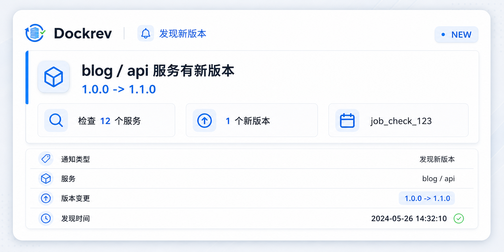
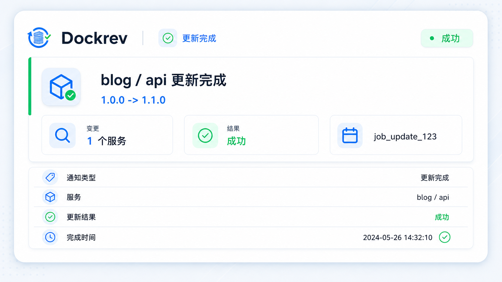
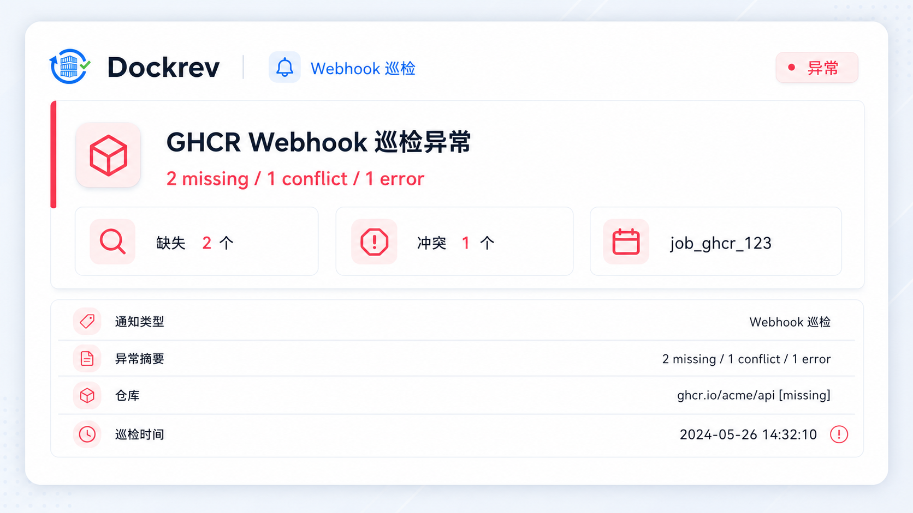
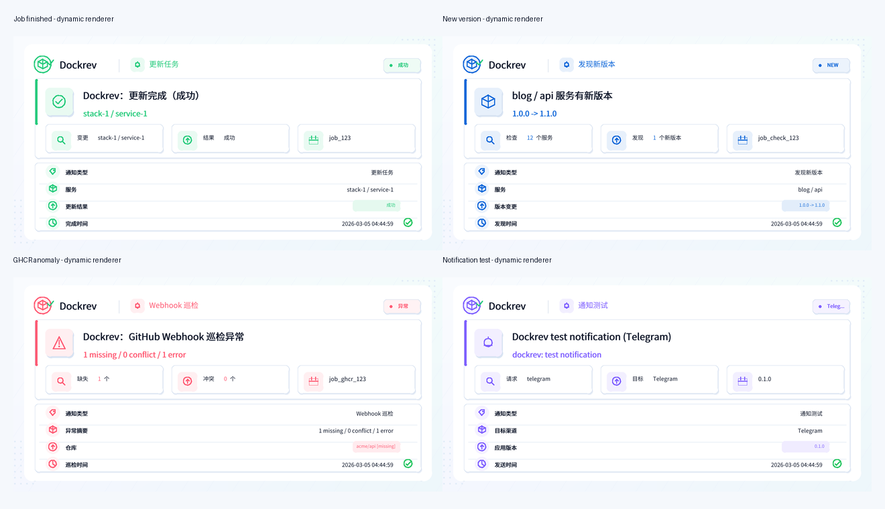
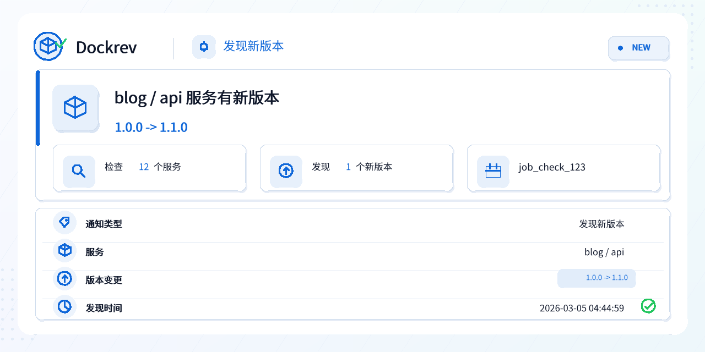
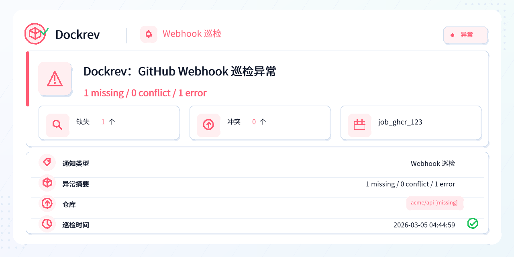
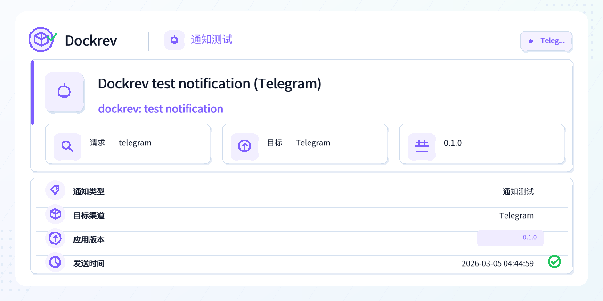

# Dockrev：Telegram 内容相关动态卡片通知

## Context

Telegram 会为消息里的链接自动生成预览图，导致 Dockrev 通知的首屏视觉经常被站点 OG 图或外链预览占据。该行为和具体通知内容弱相关，降低了任务完成、新版本发现、GHCR Webhook 异常和测试通知的辨识度。

本规格将 Telegram 渠道从纯文本/链接预览依赖，调整为 Dockrev 后端主动生成内容相关 PNG 卡片，并在所有文本补充消息中禁用 Telegram 自动链接预览。

相关既有规格：

- `p2n8k-notification-event-switches-and-new-alerts/SPEC.md`
- `qh4zx-new-version-notify-settle-and-copy/SPEC.md`
- `gr3cs-notification-channel-test-bubbles/SPEC.md`
- `rxcb6-telegram-group-token-mask/SPEC.md`

## Goals

- 所有 Telegram 通知优先通过 `sendPhoto` 上传动态 PNG 卡片：`job_finished`、`new_version_discovered`、`ghcr_webhook_anomaly`、`notification_test`。
- 卡片固定为 `1280x640` PNG，采用主题中立的浅色信息卡，不假定 Telegram 客户端或 Dockrev Web UI 使用暗色主题。
- 卡片内容只包含摘要级信息：通知类型、状态、关键对象、任务/检查/异常摘要，最多 5 条关键摘要行和 omitted 计数。
- 后端 Rust 生成图片并嵌入开源中文字体，保证 Alpine 容器内无系统字体依赖也能稳定渲染中文。
- photo caption 保持短摘要和主动作链接；完整 URL、digest、错误栈、debug JSON、服务清单等长详情仍通过文本补充消息承载。
- 所有 Telegram `sendMessage` 路径禁用链接预览，包括 photo 失败 fallback、长详情补充消息和 HTML parse fallback。
- 图片生成或 `sendPhoto` 失败时回退到现有文本发送；若文本 fallback 成功，Telegram 渠道视为可用，并在 job log 中追加 photo fallback 诊断。

## Non-Goals

- 不做用户自定义模板、主题、颜色配置或图片布局编辑。
- 不把完整 digest、完整 URL、长错误栈或 debug JSON 绘制进图片。
- 不改变 Webhook schema、Email、Web Push 的发送格式。
- 不改变通知事件开关、去重、发送时机或 Public Base URL 校验。

## Card Model

通用结构：

- Header：`Dockrev`、通知类型 pill、状态 pill。
- Main：主标题、关键对象或摘要。
- Info tiles：通知类型、当前状态、关键对象，便于在 Telegram 消息流中快速扫读。
- Facts：最多 5 条摘要行，超出时只显示 omitted 计数。

事件映射：

- `job_finished`：状态来自 job status，关键对象来自更新 scope/服务摘要；绘制任务 ID、scope、reason、服务摘要；错误只绘制短节选提示，完整错误仍在文本详情。
- `new_version_discovered`：关键对象来自服务名或聚合数量；版本变化优先使用 display tag；绘制检查数量、任务 ID 与最多 5 条服务摘要。
- `ghcr_webhook_anomaly`：关键对象来自异常仓库数量；摘要绘制 missing/conflict/error 统计、巡检任务 ID 与最多 5 个仓库状态。
- `notification_test`：展示请求渠道、目标渠道、应用版本和设置页目标，用于验证 Telegram 图片链路。

## Telegram Delivery Contract

- Primary path：`sendPhoto`，multipart 字段包含 `chat_id`、`photo`、`caption`、`parse_mode=HTML`。
- Caption 长度控制在 Telegram photo caption 上限内，避免承载长详情。
- Supplemental path：当完整详情明显长于 caption，或包含错误块/服务清单/异常仓库列表时，发送第二条 `sendMessage`。
- Text fallback：当图片生成或 `sendPhoto` 失败时，发送原有详情文本。
- 所有 `sendMessage` payload 均包含 `link_preview_options.is_disabled = true`，避免自动展开服务详情、任务详情或设置链接。
- Telegram Bot API 的 `sendMessage` 支持 `link_preview_options`；`sendPhoto` 支持 multipart 上传、caption 与 `parse_mode`，但不提供 `link_preview_options` 字段，因此链接预览止血只应用到文本消息路径。

## Public Base URL Boundary

Public Base URL 只影响详情文本和 caption 中的链接是否可点击：

- 已配置时，主动作链接使用绝对 URL。
- 未配置时，仍显示站内路径，供操作者复制。
- 图片生成不依赖 Public Base URL，也不会把完整 URL 绘制进卡片。

## Acceptance

- `cargo test -p dockrev-api notify::tests -- --nocapture` 通过。
- 四类卡片均可生成非空 PNG，分辨率为 `1280x640`，中文、长服务名、长版本号不溢出卡片区域。
- Telegram 文本 payload 默认禁用链接预览。
- Telegram photo caption 保持短摘要，长详情进入补充文本或 fallback 文本。
- 文档说明 Telegram 动态卡片、隐私边界、fallback 行为，以及 Public Base URL 对图片与链接的影响。

## Visual Evidence

### Imagegen Design References

The card design references were generated with the built-in `$imagegen` workflow and accepted as the visual baselines before dynamic binding.

### Dynamic Renderer Evidence

The current Rust renderer uses notification payload content for all four Telegram card types and generates the dynamic examples below.

### Job Finished

### New Version Discovered

### GHCR Webhook Anomaly

### Notification Test

