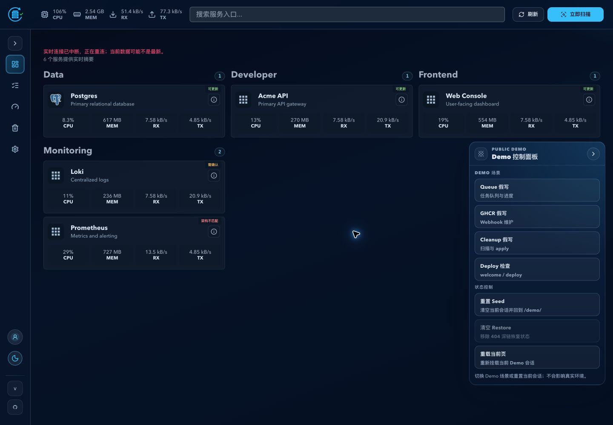
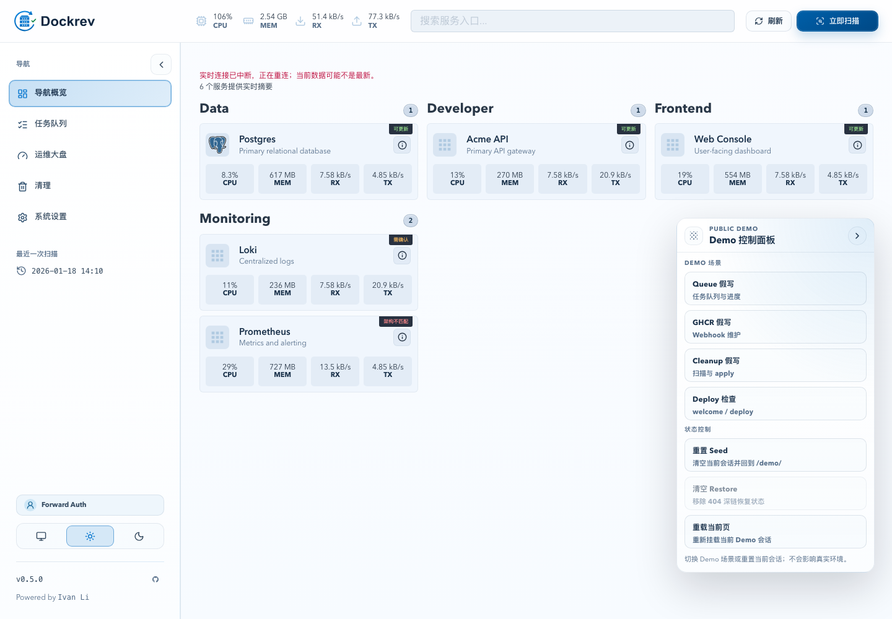
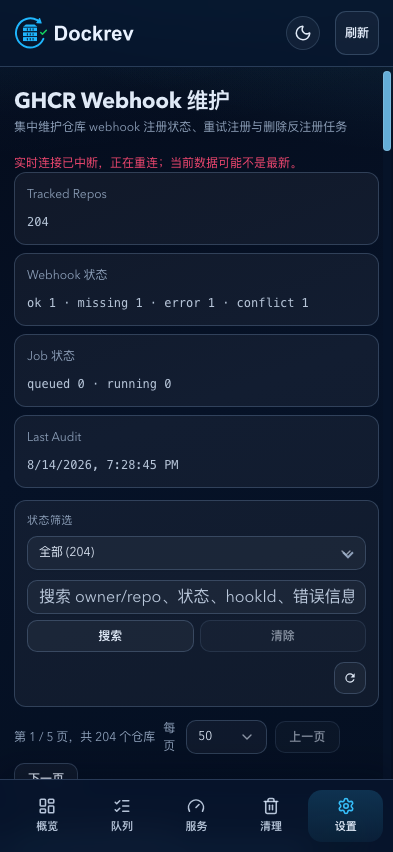
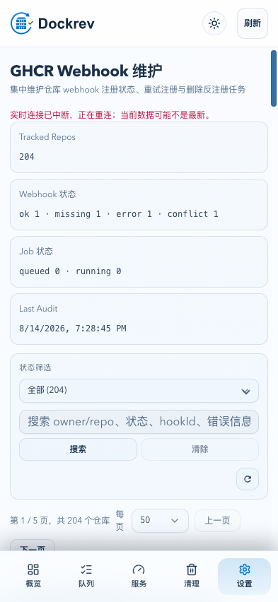
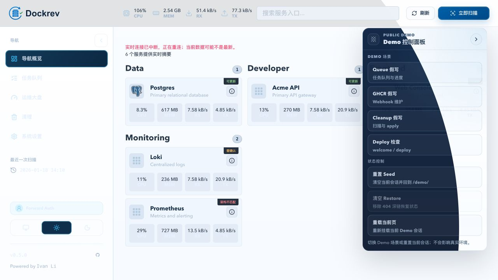
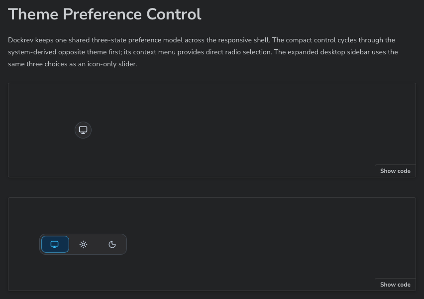

# Dockrev 三态主题偏好与响应式入口

> 当前有效规范以本文为准；实现覆盖与当前状态见 `./IMPLEMENTATION.md`，关键演进原因见 `./HISTORY.md`。

## 背景 / 问题陈述

- Dockrev 已有 light/dark 根节点主题与 `dockrev:theme` 浏览器存储合同，但缺少可选的系统模式与统一入口。
- 桌面侧栏和移动端设置页的可用空间不同，主题入口必须随导航形态变化，避免移动端业务页顶部拥挤。
- 主题偏好需要在系统变化、同源标签页和现有 Supervisor 页面之间保持兼容。

## 目标 / 非目标

### Goals

- 支持 `system`、`light`、`dark` 三种偏好，并在 system 下实时跟随 `prefers-color-scheme`。
- 在桌面折叠侧栏、桌面展开侧栏和移动设置区提供符合各自空间约束的主题入口。
- 保留已有显式 light/dark 偏好，并通过缺失 `dockrev:theme` 表示 system。
- 为主题控制器、控件交互和响应式挂载提供可重复的测试与视觉证据。

### Non-goals

- 不新增账号级、服务端或跨域主题同步。
- 不在移动端设置区之外挂载主题入口。
- 不新增 Supervisor 独立控件，不改变 Supervisor API 或自升级状态机。
- 不重做现有 Dockrev 视觉 token 或导航信息架构。

## 范围（Scope）

### In scope

- `web/src/theme.ts` 的偏好、解析主题、存储和系统/标签同步合同。
- AppShell 侧栏与移动设置路由中的主题控件、上下文菜单和键盘访问。
- 主题控件 Storybook docs/play、主题单元测试和 ui_demo 视觉场景。
- 本主题的实现状态、历史与目录登记。

### Out of scope

- API、数据库、鉴权、PWA 业务状态和 Supervisor 后端接口。
- 非主题的页面布局、文案、品牌资产和业务操作。

## 需求（Requirements）

### MUST

- 偏好值域为 `system | light | dark`；解析主题值域为 `light | dark`。
- 缺失、非法或读取失败的 `dockrev:theme` 必须解析为 system；选择 system 必须删除该 key，选择 light/dark 必须保存对应值。
- system 模式必须响应运行时 `prefers-color-scheme` 变化；同源 `storage` 事件必须同步当前页面的主题和控件状态。
- 桌面折叠侧栏显示当前偏好的图标按钮；桌面展开侧栏显示仅图标的三段选择器与移动拇指。
- 移动端仅在 `/settings/**`（包括设置子页及 `/settings/ghcr-webhooks`）顶部显示图标按钮。
- 普通点击按系统解析色使用 `system -> opposite -> matching -> system` 循环；右键、长按、ContextMenu 键或 `Shift+F10` 打开纵向 radio 菜单。
- 入口和菜单必须提供可见焦点、ARIA 名称/选中态、中文 tooltip，并满足移动端触控命中尺寸。
- 解析主题发生变化时，从触发控件中心以圆形揭示过渡到新主题，半径必须覆盖视口最远角；动画完成前保持旧主题且忽略重复触发，完整覆盖后再提交新主题。

### SHOULD

- 根节点同步 `data-theme`、`color-scheme` 和浏览器 `theme-color`。
- 主题揭示、图标反馈与滑块动画在 `prefers-reduced-motion: reduce` 下停用或降级。
- 主题变更不得重置路由、日志、操作状态或 PWA 状态。

### COULD

- 为上下文菜单使用现有 Radix ContextMenu radio primitive，为展开控件复用现有 ToggleGroup 语义。

## 功能与行为规格（Functional/Behavior Spec）

### Core flows

- 首屏初始化从存储读取显式 light/dark；没有有效值时读取系统偏好并应用解析主题。
- system 为暗色时普通点击顺序为 `system -> light -> dark -> system`；system 为亮色时为 `system -> dark -> light -> system`。
- 选择菜单项或展开滑块选项立即应用主题并更新其他已挂载控件。
- 主题变更通过同源存储事件同步到其他标签页；system 模式通过 MediaQueryList 监听系统变化。

### Edge cases / errors

- localStorage 不可用、读取异常或写入失败不得阻断页面启动；主题回退到 system，控件仍可操作。
- 无效 storage key 不得覆盖已有有效显式偏好。
- 非设置移动路由不应挂载移动主题入口；桌面控件不应复制到移动顶部。
- reduced-motion 环境下不得依赖动画完成来表达选中态。

## 接口契约（Interfaces & Contracts）

### 接口清单（Inventory）

| 接口（Name） | 类型（Kind） | 范围（Scope） | 变更（Change） | 契约文档（Contract Doc） | 负责人（Owner） | 使用方（Consumers） | 备注（Notes） |
| --- | --- | --- | --- | --- | --- | --- | --- |
| `ThemePreference` | TypeScript type | internal | Modify | None | web theme module | AppShell theme controls | `system | light | dark` |
| `dockrev:theme` | browser storage contract | internal | Modify | None | web + existing Supervisor consumer | Dockrev web and Supervisor | 缺失表示 system；显式值保持 `light | dark` |
| `ThemePreferenceControl` | React component | internal | New | None | web UI | AppShell desktop/mobile | icon button, context menu, expanded segmented control |

### 契约文档（按 Kind 拆分）

- `None`

## 验收标准（Acceptance Criteria）

- Given storage 缺失或非法，When Dockrev 启动，Then 偏好为 system，根节点主题等于当前系统解析主题。
- Given 显式 light 或 dark，When Dockrev 启动或系统偏好变化，Then 页面保持显式主题，且既有偏好不丢失。
- Given system 模式，When 系统偏好运行时变化，Then 页面立即切换且不重置业务状态。
- Given 桌面侧栏折叠或展开，When 查看用户入口下方，Then 分别显示图标按钮或仅图标三段移动滑块。
- Given 移动端任意 `/settings/**` 路由，When 查看顶部右侧，Then 显示图标按钮；其他移动业务路由不显示。
- Given 图标按钮被右键、长按或键盘上下文操作，When 菜单打开，Then 纵向 radio 菜单可直接选择三种偏好。

## 验收清单（Acceptance checklist）

- [x] 核心路径的长期行为已被明确描述。
- [x] 关键边界/错误场景已被覆盖。
- [x] 涉及的接口/契约已写清楚或明确为 `None`。
- [x] 相关验收条件已经可以用于实现与 review 对齐。

## 非功能性验收 / 质量门槛（Quality Gates）

### Testing

- Unit tests: `web/tests/theme.test.ts`。
- Storybook interaction: 主题控件、AppShell 折叠/展开和 Settings 移动入口。
- Existing regression: `bun test`, `bun run build`, `bun run lint`, `bun run test-storybook`, `cargo test -p dockrev-supervisor`。

### UI / Storybook (if applicable)

- Stories to add/update: `ThemePreferenceControl`, `AppShell`, `SettingsPage`。
- Docs pages / state galleries to add/update: 主题控件 docs gallery。
- `play` / interaction coverage to add/update: cycle, direct selection, context menu, responsive placement。
- Visual regression baseline changes (if any): ui_demo and Storybook captures for desktop collapsed/expanded and mobile settings.

### Quality checks

- Typecheck/build/lint must pass; Impeccable detector must have no blocking findings.

## Visual Evidence

当前证据绑定实现提交前的同一工作树；提交只会增加本节索引和已审阅截图，不改变渲染输入。PR 不携带图片（`PR: none`）。

- source_type: ui_demo; target_program: mock-only; requested_viewport: 1440x1000; scenario: desktop collapsed, dark; evidence_note: 折叠桌面侧栏在用户入口下方显示图标按钮。
  
- source_type: ui_demo; target_program: mock-only; requested_viewport: 1440x1000; scenario: desktop expanded, light; evidence_note: 展开桌面侧栏显示三段图标滑块与移动拇指。
  
- source_type: ui_demo; target_program: mock-only; requested_viewport: 393x852; scenario: mobile settings, dark; evidence_note: 移动设置页顶栏右侧显示图标入口。
  
- source_type: ui_demo; target_program: mock-only; requested_viewport: 393x852; scenario: mobile settings, light; evidence_note: light 解析主题下移动设置页入口仍保持清晰对比。
  
- source_type: ui_demo; target_program: mock-only; scenario: desktop expanded, theme transition mid-frame; evidence_note: 真实根节点仍为暗色时，亮色只读覆盖层从主题控件中心扩张；最远角尚未覆盖，证明动画不会提前提交主题。
  
- source_type: storybook_docs; target_program: mock-only; docs_entry_or_title: Components/ThemePreferenceControl; requested_viewport: none; scenario: icon button and expanded slider gallery; evidence_note: Storybook docs 展示可复用主题控件的两种形态。
  

## Related PRs

- None

## 风险 / 开放问题 / 假设（Risks, Open Questions, Assumptions）

- 风险：主题状态同时由系统事件、storage 事件和同页控件驱动，订阅清理不完整会产生重复更新或卸载后写入。
- 风险：Radix ContextMenu 的触摸长按与普通点击存在事件顺序差异，需要用 Storybook play 锁定行为。
- 假设：现有 Supervisor 对缺失 key 的 system 回退行为继续作为兼容边界，不需要新增 `system` 存储值。

## 参考（References）

- `web/src/theme.ts`
- `web/src/Shell.tsx`
- `web/src/components/ui/context-menu.tsx`
- `docs/specs/bvxtm-supervisor-dark-theme-same-origin-share/SPEC.md`
