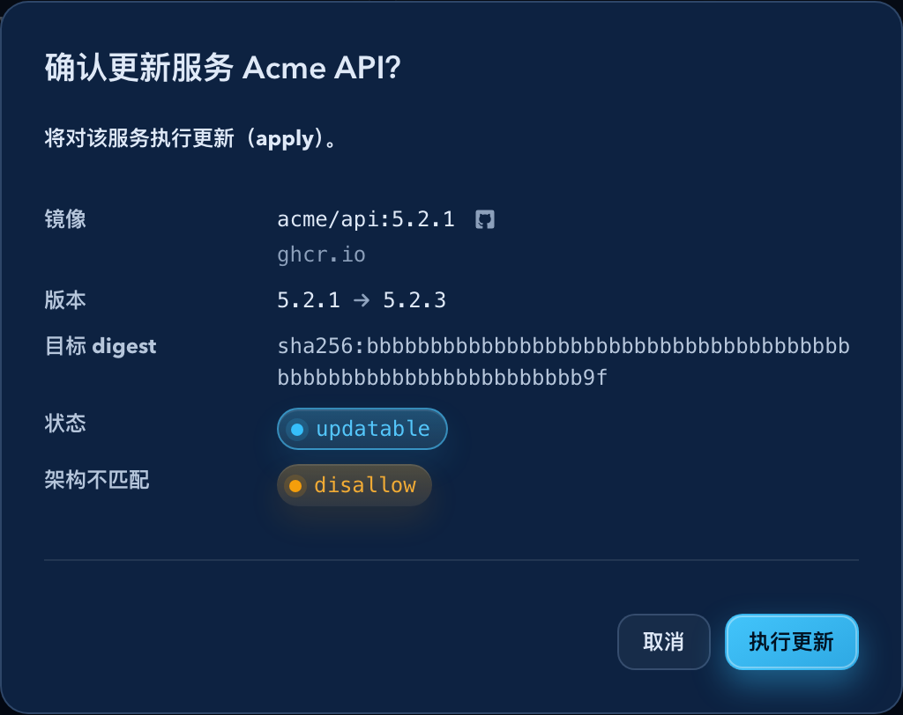
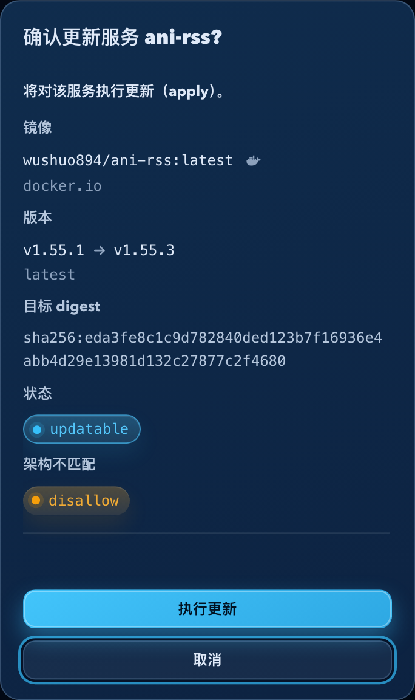
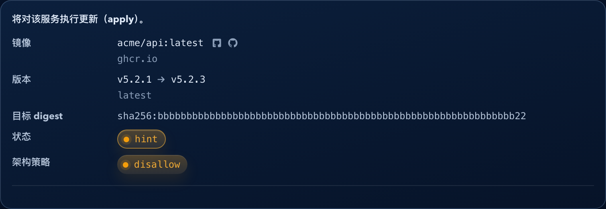
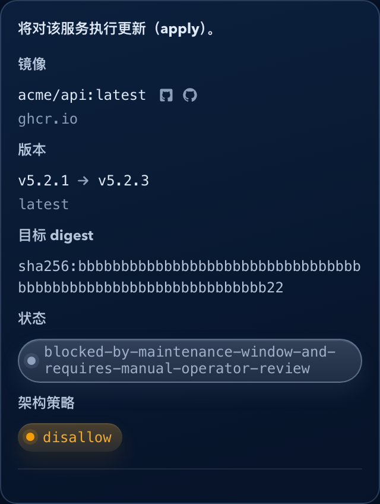
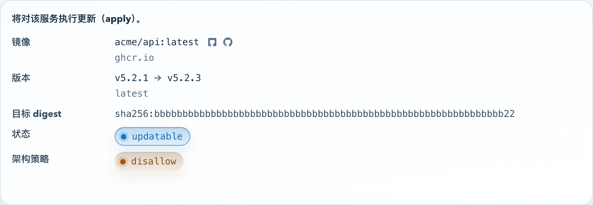

# Dockrev：更新确认弹窗信息收敛（#ttfyf）

## 状态

- Status: 已实现
- Created: 2026-05-05
- Last: 2026-05-05

## 背景 / 问题陈述

- 导航页从服务卡片触发更新时，确认弹窗只展示 raw tag（例如 `latest`）与目标 digest，缺少当前版本与目标版本，操作者无法判断本次更新的真实版本差异。
- 服务详情、Services/Operations 与聚合更新确认已经存在更完整的版本推断展示，但正文由多个入口分别拼装，导致同类确认信息口径漂移。
- 聚合更新确认与单服务更新确认承担不同决策任务：单服务需要完整证据，聚合场景需要批量影响面摘要，不应互相复用业务外壳。

## 目标 / 非目标

### Goals

- 单服务更新确认必须展示镜像、`当前 -> 目标` 版本主结论、目标 digest 与架构策略。
- 导航页服务更新弹窗必须复用单服务确认组件，不能再只展示 `latest` 这类 raw tag。
- 聚合更新预览继续保持列表型摘要，每行只展示服务、状态、镜像与 `当前 -> 目标` 版本变化。
- floating tag 主展示优先使用 resolved semver；raw tag 仅作为辅助信息或 popover 详情入口。
- 单服务确认正文不重复展示标题已表达的服务名、固定 scope，或默认备份策略；更新请求仍按既有契约提交 `scope=service` 与 `backupMode=inherit`。

### Non-goals

- 不改变 `/api/updates` 请求/响应契约与 update job 执行语义。
- 不修改 supervisor 自升级执行链路。
- 不把聚合更新预览改成单服务详情表。
- 不重做 Dialog/AlertDialog 视觉系统。

## 范围

### In scope

- Web 单服务更新确认组件与调用入口。
- 导航页、服务详情页、Services/Operations 服务级确认弹窗。
- 聚合更新预览的轻量信息边界与 Storybook 覆盖。
- Storybook 交互断言与视觉证据。

### Out of scope

- Rust 后端、数据库、update selection、supervisor 自升级 API。
- 全站视觉主题重构。

## 需求

### MUST

- 单服务确认弹窗必须可见展示一行 `当前 -> 目标` 版本主结论与 `目标 digest`。
- `latest` / `stable` 等 floating tag 不得作为目标版本的唯一主信息；有 resolved semver 时必须优先展示 resolved semver。
- 同标签新 digest 场景必须显示 `同标签新 digest` 提示。
- 单服务确认弹窗不得重复展示 `范围 service`、标题已表达的服务名，或默认 `备份 inherit`。
- 单服务确认弹窗中的 `状态` 与 `架构策略` 值必须使用 badge 形态呈现，提升可扫读性；badge 不得替代原始值文本，也不得将 `hint`、`blocked`、`archMismatch` 等非可执行状态渲染为可执行色。
- 状态 badge 必须允许长状态文本在窄屏自然换行，不能溢出确认弹窗。
- 聚合更新预览不得展开目标 digest、resolvedTags 多版本列表或单服务策略详情。
- Dockrev guarded 行在聚合预览中继续保持禁用视觉与 tooltip 说明。

## 验收标准

- Given 导航页服务卡片状态为可更新，When 点击状态 badge 打开确认弹窗，Then 弹窗包含一行 `当前 -> 目标` 版本主结论与 `目标 digest`。
- Given 服务当前 tag 为 `latest` 且 resolved 版本存在，When 打开单服务确认弹窗，Then 主版本字段展示 resolved semver，而不是只展示 `latest`。
- Given 单服务确认弹窗打开，When 标题已展示服务名且请求固定为 service scope，Then 正文不再重复展示 `范围 service`、服务全名或默认备份策略。
- Given 单服务确认弹窗打开，When 操作者扫读状态与架构策略，Then `updatable` 与 `disallow` 使用不同语义 badge 且文本仍完整可见。
- Given 状态为 `hint`、`blocked` 或未知长文本，When 单服务确认弹窗打开，Then badge 使用对应非 action 语义色，并保持在容器内。
- Given 当前显示版本与目标显示版本相同但 digest 不同，When 打开确认弹窗或聚合预览，Then 展示 `同标签新 digest`。
- Given 点击 `更新全部` 或 `更新此 stack`，When 聚合确认弹窗打开，Then 列表仍保持每服务一行摘要，不出现单服务完整详情字段。
- Given 聚合范围包含 Dockrev 自身，When 打开聚合确认弹窗，Then Dockrev 行仍为 guarded 禁用预览。

## Visual Evidence

### 导航页单服务更新确认

- Source: Storybook canvas `Pages/OverviewPage/Default`
- Viewport: 1440 x 900
- Scope: homepage service update confirmation dialog
- Notes: 验证导航页触发的单服务确认弹窗展示 `当前 -> 目标` 版本主结论、`目标 digest`，并将 `updatable` / `disallow` 呈现为可区分 badge。

### 窄屏单服务长 digest 确认

- Source: Storybook canvas `Components/ConfirmDialog/ServiceUpdateLongDigest`
- Viewport: 390 x 760
- Scope: single service update confirmation dialog
- Notes: 验证窄屏下完整版本字段、长目标 digest 与状态/策略 badge 保持可读，不溢出确认弹窗。

### hint 状态 badge 语义确认

- Source: Storybook canvas `Components/ServiceUpdateConfirmDetails/HintStatusBadge`
- Viewport: 900 x 620
- Scope: single service update confirmation details
- Notes: 验证 `hint` 状态使用 warning badge，不复用可执行 action 色；Storybook play 同时断言 badge 文本对比度满足 WCAG AA。

### 长状态窄宽防溢出确认

- Source: Storybook canvas `Components/ServiceUpdateConfirmDetails/LongStatusNarrow`
- Viewport: 390 x 760
- Scope: single service update confirmation details
- Notes: 验证未知长状态文本使用 neutral badge，并在窄宽容器内换行不溢出；Storybook play 同时断言 badge 文本对比度满足 WCAG AA。

### 浅色主题 badge 对比度确认

- Source: Storybook canvas `Components/ServiceUpdateConfirmDetails/BadgeContrastLight`
- Viewport: 900 x 620
- Scope: single service update confirmation details
- Notes: 验证浅色主题下 `updatable` 与 `disallow` badge 保持可读；Storybook play 使用 computed colors 断言文本对比度满足 WCAG AA。

## 参考

- `docs/specs/99egq-explicit-update-tag-contract/SPEC.md`
- `docs/specs/mmffn-dockrev-aggregate-self-upgrade-guard/SPEC.md`
- `docs/plan/updxj:version-popover-polish/PLAN.md`
