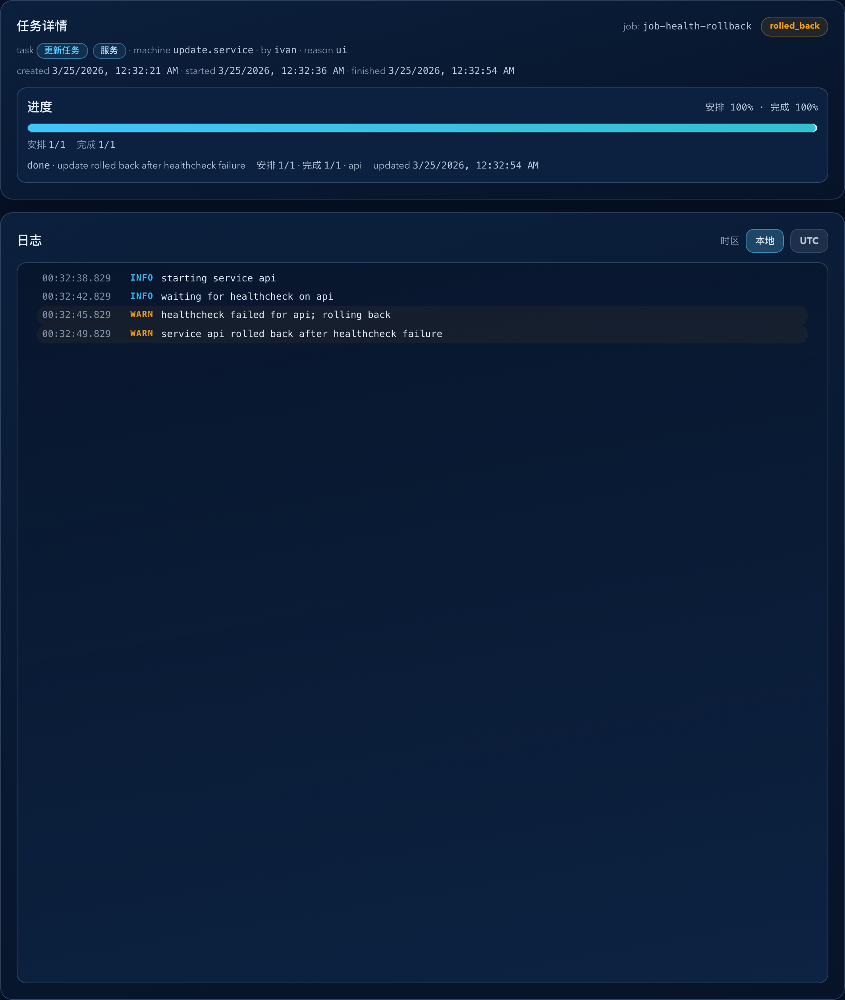

# Dockrev：修复 Update Job 回滚后的 digest 摘要与健康进度误报（#tvat2）

## 状态

- Status: 已完成
- Created: 2026-03-24
- Last: 2026-03-25

## 背景 / 问题陈述

- 当前 update job 在健康检查失败后即使已经完成自动回滚，仍会继续发出 `HealthDone` / `healthcheck passed` 进度事件，导致任务详情页看起来像“健康检查通过了却还是失败”。
- rolled_back summary 会在回滚后重新读取活动容器镜像，把 `newDigests` 覆写成旧 digest，丢失真正尝试更新到的新 digest。
- `/api/jobs/{id}` 目前缺少“任务结束后实际运行 digest”和“回滚目标 digest”的结构化字段，排障时必须倒推日志，不能直接从 summary 读出真相。

## 目标 / 非目标

### Goals

- 修正健康检查失败路径：回滚成功后不再误发 `HealthDone`，并在进度文案里明确表达 `healthcheck failed -> rolled back`。
- 冻结 update summary 契约：`oldDigests` 表示更新前运行 digest，`newDigests` 表示尝试的新 digest，`finalDigests` 表示任务结束时实际运行 digest。
- 为 rolled_back summary 新增 `rollback.trigger` 与 `rollback.toDigests`，并允许 `failureStep=healthcheck`。
- 补齐 Job Detail Storybook rollback 场景和视觉证据，确保主人可见页面不会再被误导。

### Non-goals

- 不修改 Docker 自动回滚策略、健康检查超时参数或 compose override 的执行方式。
- 不新增独立的任务详情摘要面板，也不改动 `/queue` / `/api/jobs` 路由形态。
- 不改变 notification / operations 对 `newDigests` 的消费方式；现有消费者继续只依赖 service-id key。

## 范围（Scope）

### In scope

- `crates/dockrev-api/src/updater.rs` 的 apply/rollback 状态机、summary 组装与对应回归测试。
- `crates/dockrev-api/src/api/operations.rs` 的 update 进度百分比、terminal progress message 与 `/api/jobs` 对外结果。
- `web/src/stories/pages/JobDetailPage.stories.tsx` 与 `web/src/stories/mocks/dockrevMockApi.ts` 的 rollback 场景。
- `docs/specs/README.md` 与本 spec 的验收、变更记录、视觉证据。

### Out of scope

- 对生产 101 服务器做 live deploy 或复跑真实任务。
- 把 `job.summary` 从 `unknown` 强类型化到前端 API 层。
- 追溯修改历史 `docs/plan/**` 契约文档。

## 需求（Requirements）

### MUST

- 健康检查失败触发回滚时，进度事件必须发出 `HealthFailed`，且不得再发出 `HealthDone`。
- rolled_back summary 必须同时保留：
  - `newDigests[serviceId] = 尝试更新到的新 digest`
  - `finalDigests[serviceId] = 任务结束后实际运行 digest`
  - `rollback.trigger = healthcheck|pull_target_tag|sync_configured_tag`
  - `rollback.toDigests[serviceId] = finalDigests[serviceId]`
- 健康检查失败导致的 rolled_back summary 必须包含 `failureStep=healthcheck`。
- update 成功路径必须写出 `finalDigests`，且其值与 `newDigests` 一致。
- Job Detail 的 Storybook rollback 场景必须明确展示“健康检查失败后已回滚”的最终进度文案，并证明不存在误导性的 `healthcheck passed` 文案。

### SHOULD

- 非 health rollback 路径继续保留各自的 `failureStep`，并与 `rollback.trigger` 对齐。
- terminal progress message 在 `rolled_back` 状态下应指向具体失败阶段，而不是泛化的 `update finished with failures`。

## 功能与行为规格（Functional/Behavior Spec）

### Core flows

- Update apply 成功创建新容器后，应先记录“尝试的新 digest”，再进入 health wait / tag sync 等后续步骤。
- 若 `wait_healthy` 返回 `unhealthy`，任务发出 `HealthFailed`，执行 rollback，并将 summary 记为：
  - `newDigests = 新 digest`
  - `finalDigests = 回滚后旧 digest`
  - `failureStep = healthcheck`
  - `rollback.trigger = healthcheck`
- 若 `pull_target_tag` 或 `sync_configured_tag` 失败并回滚，summary 也必须保留同样的 attempted/final digest 拆分，只是 `rollback.trigger` 替换为对应失败步骤。
- Job terminal progress 在 `rolled_back` 时应输出精确文案，例如 `update rolled back after healthcheck failure`。

### Edge cases / errors

- 若 health rollback 自身失败，任务仍返回 `failed`，并保持 `failureStep=healthcheck` 的失败归因。
- 对没有运行容器的 service，仍按现有逻辑跳过，不写入 digest maps。

## 接口契约（Interfaces & Contracts）

### `/api/jobs/{id}` update summary

```json
{
  "changedServices": 1,
  "oldDigests": { "svc_api": "sha256:old" },
  "newDigests": { "svc_api": "sha256:new" },
  "finalDigests": { "svc_api": "sha256:old" },
  "failureStep": "healthcheck",
  "rollback": {
    "trigger": "healthcheck",
    "toDigests": { "svc_api": "sha256:old" }
  },
  "targetTagsPulled": [],
  "pullTagsPulled": [],
  "pullTagWarnings": [],
  "skippedVersionAnomaly": []
}
```

- `rollback` 仅在 `status=rolled_back` 时出现。
- `failureStep` 在 `failed` 与 `rolled_back` 两类结果中都允许出现，但值必须对应真实失败阶段。

## 验收标准（Acceptance Criteria）

- Given update job 因健康检查失败进入自动回滚，When 查询 `/api/jobs/{id}`，Then `job.status=rolled_back`，且 `summary.stacks[*].update` 同时包含 `failureStep=healthcheck`、attempted `newDigests`、`finalDigests` 与 `rollback.toDigests`。
- Given 同一健康失败回滚任务，When 查看 Job Detail，Then 最终进度文案明确为“健康检查失败后已回滚”，且日志/进度中不存在误导性的 `healthcheck passed`。
- Given `pull_target_tag` 或 `sync_configured_tag` 失败后回滚，When 读取 summary，Then `newDigests` 仍表示 attempted digest，`finalDigests` / `rollback.toDigests` 表示回滚后的 digest。
- Given update 成功路径，When 读取 summary，Then `finalDigests == newDigests`。
- Given Storybook `Pages/JobDetailPage/HealthRollback` 场景，When 执行 `test-storybook`，Then 它会验证 rollback 终态文案存在，且 `healthcheck passed` 不存在。

## 非功能性验收 / 质量门槛（Quality Gates）

### Testing

- `cargo test -p dockrev-api`

### UI / Storybook

- `bun run --cwd web build-storybook`
- `bun run --cwd web test-storybook`

## Visual Evidence

- source_type=storybook_canvas
- target_program=mock-only
- capture_scope=element
- sensitive_exclusion=N/A
- submission_gate=owner-approved
- story_id_or_title=Pages/JobDetailPage/HealthRollback
- state=rolled_back after healthcheck failure
- evidence_note=验证 Job Detail 的最终进度与日志明确表达“healthcheck failed -> rolled back”，且不存在误导性的 `healthcheck passed`。


## 实现里程碑（Milestones / Delivery checklist）

- [x] M1: 冻结 rolled_back summary 契约，补齐 `finalDigests` 与 `rollback`。
- [x] M2: 修正 health rollback 进度状态机，不再误发 `HealthDone`。
- [x] M3: 补齐 updater / API 回归测试，覆盖 health rollback 与其他 rollback 路径。
- [x] M4: 补齐 Job Detail Storybook rollback 场景与视觉证据。
- [x] M5: 快车道推进到 latest PR merge-ready。

## 风险 / 假设（Risks / Assumptions）

- 仓库内现有 `newDigests` 消费者仅依赖 key，不依赖 value 语义；仓库外调用方若把 value 当成“最终运行 digest”，需要后续迁移说明。
- Job Detail 当前不直接渲染 summary JSON；主人可见的修复主要通过 progress / logs / Storybook 场景体现。

## 变更记录（Change log）

- 2026-03-24: 创建规格，冻结 health rollback 的 digest 契约、进度口径与 Storybook 验收面。
- 2026-03-24: 已完成后端状态机修复、`newDigests/finalDigests/rollback` 契约落地、updater/API 回归测试，以及 `Pages/JobDetailPage/HealthRollback` Storybook 视觉证据。
- 2026-03-25: 主人已批准提交视觉证据，PR #183 已创建并补齐 `type:patch` / `channel:stable` 标签，等待远端 checks 收敛后进入 merge-ready。
- 2026-03-25: PR #183 已通过 checks 并进入 merge-ready，规格状态收口为已完成。
