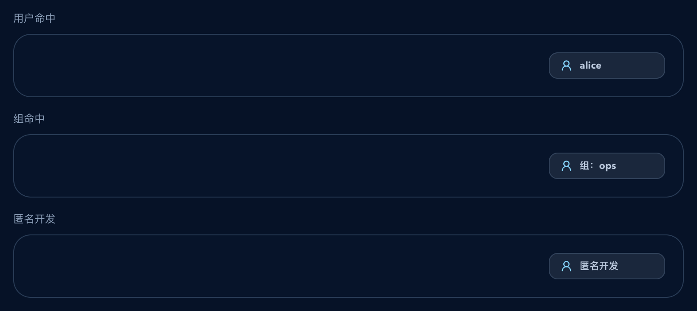
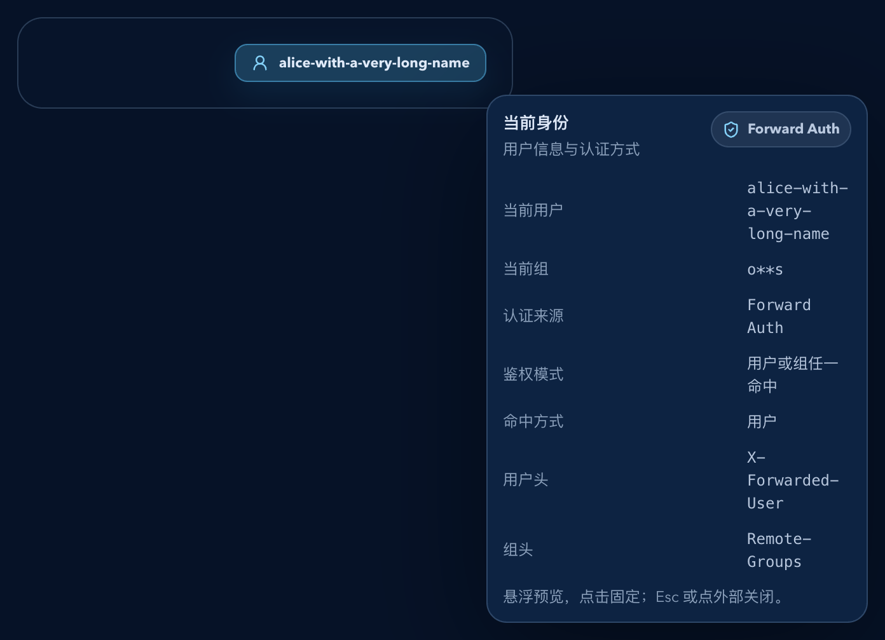
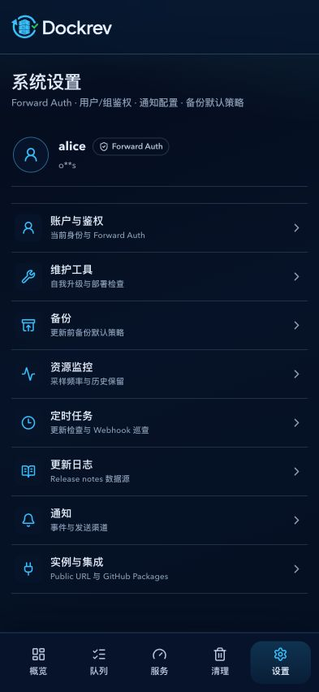
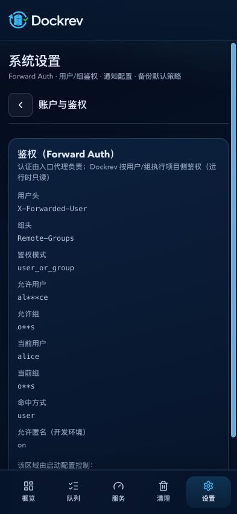
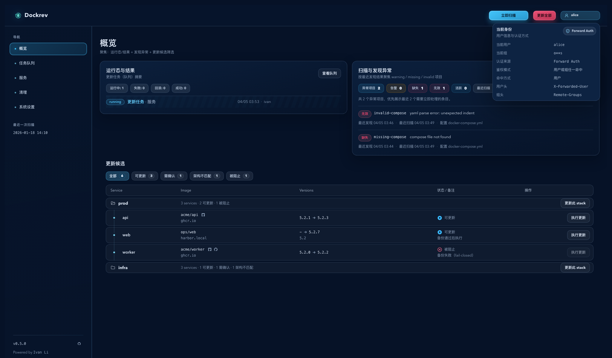
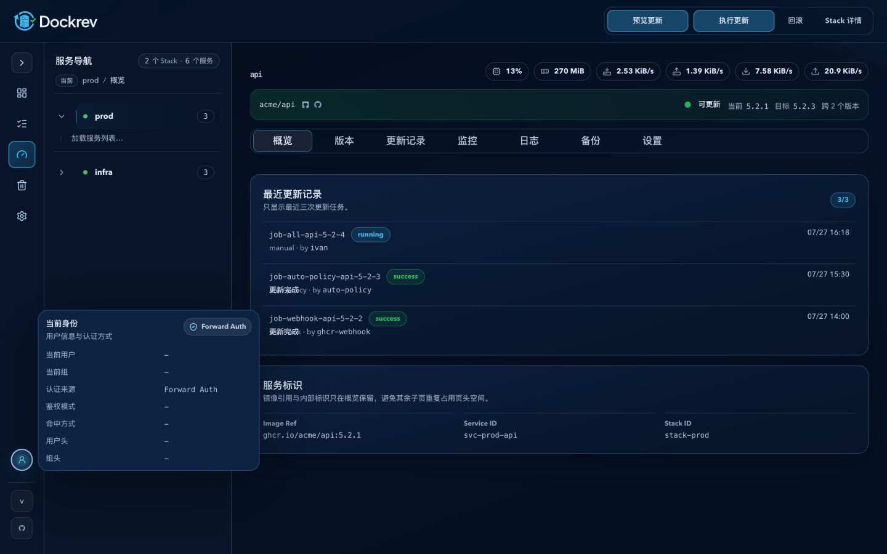

# Dockrev：顶部用户信息入口弹层（#uzn7t）

## 状态

- Status: 已完成
- Created: 2026-04-04
- Last: 2026-04-05
- Notes: fast-track（PR #202；implementation + storybook + visual evidence + review-loop completed）

## 背景 / 问题陈述

- 桌面壳层此前将身份入口放在顶部右侧，既与详情页顶部操作竞争空间，也无法在侧栏折叠时保留稳定入口。
- 现有仓库已经在 `GET /api/settings.auth` 中返回当前用户、当前组、鉴权模式与命中方式，但这些运行态细节只出现在设置页，只读信息离日常入口太远。
- 现有 UI 已具备 hover-open / click-pin 的 popover 基座，因此这次 follow-up 需要复用已有 auth 真相源与交互，而不是重新设计一套新的认证 UI。

## 目标 / 非目标

### Goals

- 桌面身份入口放在主导航底部元信息区首位，默认优先显示当前身份，而不是认证系统名；折叠时保留头像图标入口。
- 桌面端继续使用 hover-open / click-pin；移动端不在页头放身份入口，在设置首页用不超过 `100px` 的账户摘要展示当前身份，不新增后端 API。
- 移动端设置首页只展示设置分类，具体配置通过可路由的二级页面承载；桌面端保留现有双栏设置。
- 在弹层中只读展示当前用户、当前组、认证来源、鉴权模式、命中方式、用户头与组头。
- 让 `AppShell` 桌面侧栏、移动顶栏与 `SupervisorMisroute` 继续使用同一组件与同一文案映射。
- 补齐 Storybook 组件态与壳层集成态，并把最终视觉证据写入本 spec。

### Non-goals

- 不修改设置页鉴权卡片的字段与运行时只读语义。
- 不新增用户管理、RBAC、allowlist 编辑入口或其他配置型交互。
- 不修改 `GET /api/settings`、401 payload、数据库或服务端鉴权逻辑。

## 范围（Scope）

### In scope

- `web/src/App.tsx`
- `web/src/Shell.tsx`
- `web/src/components/HoverPinnedPopover.tsx`
- `web/src/components/TopbarUserIdentity.tsx`
- `web/src/components/SettingsMobileIdentity.tsx`
- `web/src/components/SettingsMobileNavigation.tsx`
- `web/src/components/ui/avatar.tsx`
- `web/src/pages/SettingsPage.tsx`
- `web/src/routes.ts`
- `web/src/topbarAuthIdentity.ts`
- `web/src/App.css`
- `web/src/stories/components/TopbarUserIdentity.stories.tsx`
- `web/src/stories/layouts/AppShell.stories.tsx`
- `web/src/stories/pages/SettingsPage.stories.tsx`
- `docs/specs/README.md`

### Out of scope

- `web/src/pages/UnauthorizedPage.tsx`
- 后端 auth payload / API contract / config schema

## 接口契约（Interfaces & Contracts）

| 接口（Name） | 类型（Kind） | 范围（Scope） | 变更（Change） | 契约文档（Contract Doc） | 负责人（Owner） | 使用方（Consumers） | 备注（Notes） |
| --- | --- | --- | --- | --- | --- | --- | --- |
| `GET /api/settings` auth payload | HTTP API | external | Reuse | None | api | web | 继续复用现有 auth 真相源，不新增字段 |
| `TopbarAuthIdentity` | UI view-model | internal | Add | None | web | `App.tsx` / `AppShell` / Storybook | 统一映射 trigger label 与弹层字段 |
| `TopbarUserIdentity` | UI component | internal | Add | None | web | `AppShell` / `SupervisorMisroute` / Storybook | 共享顶部身份入口 |

## 验收标准（Acceptance Criteria）

- Given 当前请求已识别 `currentUser=alice`，When 桌面 AppShell 渲染侧栏身份入口，Then 展开态触发器默认显示 `alice`，而不是 `鉴权：Forward Auth`。
- Given 当前请求没有用户头但有组命中，When 页面渲染顶部入口，Then 触发器显示 `组：<首个组>`。
- Given 当前请求是开发环境匿名路径，When 页面渲染顶部入口，Then 触发器显示 `匿名开发`。
- Given 用户在桌面端 hover 或 click 侧栏身份入口，When 弹层展开，Then 固定显示当前用户、当前组、认证来源、鉴权模式、命中方式、用户头与组头；缺失字段统一回退 `-`。
- Given 用户再次 click 已 pin 的身份入口，When 弹层仍展开，Then 触发器关闭弹层而不是再次 pin。
- Given 用户点击 `Esc` 或弹层外部区域，When popover 已打开，Then 弹层关闭。
- Given 页面宽度 <= 960px，When AppShell 顶栏渲染，Then 不渲染用户头像或身份入口。
- Given 页面宽度 <= 960px，When 系统设置首页加载完成，Then 当前账户摘要作为设置内容的第一项展示，高度不超过 `100px`，并复用 Radix Avatar 与现有认证数据。
- Given 页面宽度 <= 960px，When 系统设置首页加载完成，Then 只显示设置分类入口，不平铺具体配置卡片，也不显示顶部保存操作。
- Given 用户打开任一设置分类，When 二级路由加载完成，Then 只显示对应配置与返回设置首页的入口。
- Given 页面跨越 `960px` 断点，When AppShell 切换身份入口位置，Then 非当前断点的入口与其 portal 弹层均不保留。
- Given `AppShell` 与 `SupervisorMisroute` 都渲染身份入口，When 展示身份信息，Then 两处使用同一组件与同一文案映射。

## 非功能性验收 / 质量门槛（Quality Gates）

### Testing

- `bun run lint`
- `bun run build`
- `bun run test-storybook`

### Storybook

- `Components/TopbarUserIdentity`
- `Layouts/AppShell`
- `Pages/SettingsPage`

## 实现里程碑（Milestones / Delivery checklist）

- [x] M1: 新增 `TopbarAuthIdentity` 视图模型，统一顶部身份文案映射。
- [x] M2: 替换 `AppShell` 与 `SupervisorMisroute` 头部入口，并打通授权态/未授权态数据源。
- [x] M3: 补齐 Storybook 组件态与壳层集成态，覆盖桌面/移动端展示。
- [x] M4: 产出并落盘 `## Visual Evidence`。
- [x] M5: 完成 lint/build/test-storybook 与 review-loop 收敛。

## Visual Evidence

- Storybook canvas: 触发器文案优先级与三种命中态。
  
- Storybook canvas: 移动端紧凑入口与详情弹层展开态。
  
- Mock-only ui_demo: `393 × 852 CSS px` 移动端设置首页，账户摘要高度为 `76px`，下方只显示设置分类入口。
  - source_type: `ui_demo`
    target_program: `mock-only`
    capture_scope: `browser-viewport`
    requested_viewport: `393x852`
    viewport_strategy: `devtools-emulate`
    margin_policy: `trim_only`
    evidence_surface: `page`
    sensitive_exclusion: `N/A`
    submission_gate: `pending-owner-approval`
    state: `mobile settings index`
PR: none
  
- Mock-only ui_demo: `393 × 852 CSS px` 账户与鉴权二级页面，仅渲染该分类的配置与返回入口。
  - source_type: `ui_demo`
    target_program: `mock-only`
    capture_scope: `browser-viewport`
    requested_viewport: `393x852`
    viewport_strategy: `devtools-emulate`
    margin_policy: `trim_only`
    evidence_surface: `page`
    sensitive_exclusion: `N/A`
    submission_gate: `pending-owner-approval`
    state: `mobile account settings subpage`
PR: none
  
- Storybook canvas: 正常概览页首屏布局中的顶部身份入口展开态。
  
- Mock-only ui_demo: 折叠桌面侧栏的头像入口与 portal 浮层。
  - source_type: `ui_demo`
    target_program: `mock-only`
    capture_scope: `browser-viewport`
    requested_viewport: `1440x900`
    viewport_strategy: `controlled-browser-viewport`
    sensitive_exclusion: `N/A`
    submission_gate: `approved`
    state: `collapsed desktop sidebar with identity popover open`
PR: include
  

## 风险 / 开放问题 / 假设（Risks, Open Questions, Assumptions）

- 假设：现有 `GET /api/settings.auth` 将继续稳定返回 `authorizationMode`、`currentUser`、`currentGroups`、`matchedBy` 与请求头名。
- 风险：401 `AuthRequiredDetails` 当前不携带 `matchedBy`，因此未授权回退态的“命中方式”可能显示为 `-`；这属于既有 API 边界内的预期降级。

## 变更记录（Change log）

- 2026-04-04: 创建 follow-up spec，冻结顶部用户身份入口、交互与视觉证据范围。
- 2026-04-04: 完成前端实现、Storybook 覆盖与 owner-facing 视觉证据。
- 2026-04-05: 根据 review 收敛 `AUTH_REQUIRED_EVENT` 与首轮身份拉取的竞态，避免认证失败后被旧身份结果覆盖。
- 2026-04-05: 根据第二轮 review 收敛中途切换已认证身份时的 stale header 问题，并完成 review-loop 清空。
- 2026-04-05: 移除顶部身份弹层底部操作提示文案，保留原有 hover / click / Esc / 点外部关闭行为。
- 2026-04-05: 主人批准后完成 push/PR 收口，创建 PR #202、补齐 `type:patch` / `channel:stable`，并将分支更新到最新 `origin/main`。
- 2026-04-05: 根据合并前最终 review，收窄顶部身份刷新触发条件为“401 恢复”与“页面恢复可见后的按需同步”，避免每次成功 API 都补拉 `/api/settings`。
- 2026-04-05: 根据最终 merge-proof 修复 click-only 设备二次点击 trigger 无法关闭弹层的问题，保持移动端触发器可开可关。
- 2026-07-31: 移动端身份入口从页头迁入系统设置首页，以 `76px` 摘要展示；具体设置拆分为八类可路由二级页面，桌面侧栏与双栏设置保持不变。
