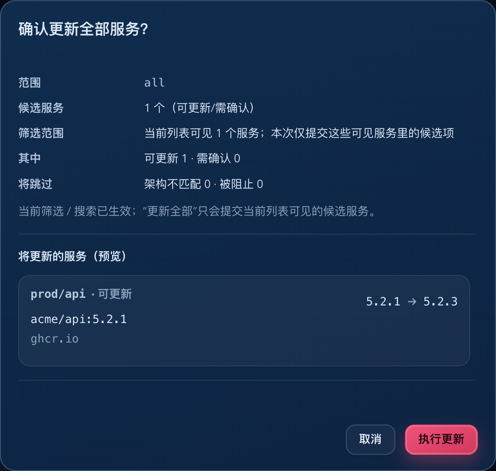
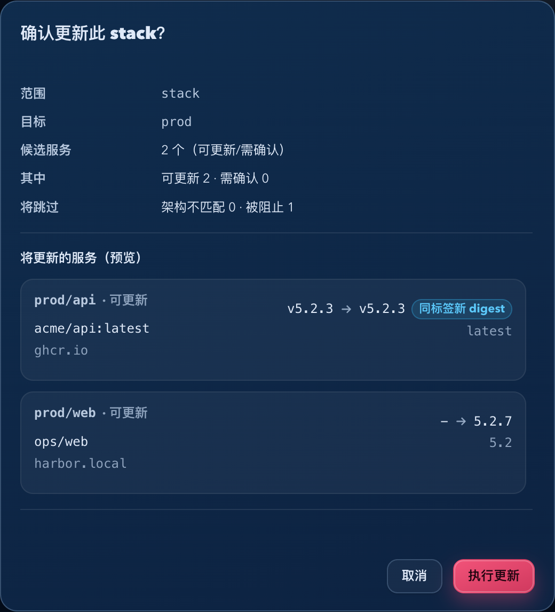

# Dockrev：批量更新仅提交当前筛选结果（#v3g2q）

## 状态

- Status: 已完成
- Created: 2026-04-18
- Last: 2026-04-18

## 背景 / 问题陈述

- 旧实现里，`更新全部 / 更新此 stack` 的实际提交集合来自全量 actionable 服务；页面列表与操作者肉眼看到的内容则来自筛选 / 搜索后的可见集合。
- 结果是操作者可能只看到 2 个“有新版本”的服务，但点下批量更新后，实际 job 却提交了 19 个服务，造成严重误导。
- 另一个叠加误导是 same-tag / digest-only 候选：当前列表版本列在候选 display tag 与当前相同的时候会直接隐藏候选，看起来像“没有新版本”。

## 目标 / 非目标

### Goals

- 将 `更新全部 / 更新此 stack` 改为所见即所得：只提交当前筛选 / 搜索后仍可见的 actionable 服务。
- 让 CTA、确认弹窗、预览列表、最终提交 `targets` 全部对齐到同一份“当前可见 actionable 集合”。
- 当筛选 / 搜索生效时，必须明确提示“仅更新当前筛选结果”。
- same-tag / digest-only 候选必须在列表与聚合预览里显式可见，不再让操作者误读成“无更新”。

### Non-goals

- 不修改 `/api/updates` 契约，也不修改服务端 `select_update_services` 行为。
- 不重做历史任务详情页或其它非本次故障面的页面结构。

## 范围（Scope）

### In scope

- `web/src/pages/useOverviewPageState.tsx`：顶部批量更新 CTA 的可见/提交范围提示、确认弹窗与提交目标对齐。
- `web/src/pages/OperationsDashboardSection.tsx`：stack 级批量更新 CTA、确认弹窗、预览列表与提交目标对齐。
- `web/src/components/AggregateUpdatePreviewList.tsx` 与候选版本展示相关样式 / helper：same-tag / digest-only 候选显式提示。
- Storybook stories / plays、Bun 单测、视觉证据。

### Out of scope

- Rust 后端、更新执行器、rollback 语义。
- service 级单服务更新流程。
- 非更新候选区域（如历史任务页、设置页）的广义重构。

## 功能与行为规格（Functional / Behavior Spec）

### Core flows

- `更新全部` 与 `更新此 stack` 只提交当前筛选 / 搜索后仍然可见的 actionable 服务。
- 当筛选 / 搜索生效时：
  - CTA 邻近区域必须显示 `仅更新当前筛选结果（N 个候选）`；
  - 确认弹窗必须明确说明“本次仅提交当前列表可见服务里的候选项”；
  - 预览列表必须只列出当前可见且会被提交的目标。
- same-tag / digest-only 候选在列表版本列与聚合预览里都要带显式提示 `同标签新 digest`。

### Edge cases / errors

- 如果当前筛选 / 搜索没有生效，则不额外显示“仅更新当前筛选结果”提示。
- guarded `dockrev` 仍保持只读预览语义；它不计入实际提交数量。
- `hint` 仍属于 actionable 集合，显示与提交都必须保留。

## 验收标准（Acceptance Criteria）

- Given 当前页面只可见 2 个 actionable 服务，但全局原本有 19 个 actionable 服务，When 触发 `更新全部`，Then CTA 与确认弹窗都明确展示“仅更新当前筛选结果”，且预览列表与最终 `targets.length` 都只包含这 2 个可见服务。
- Given 某个 stack 在筛选 / 搜索后只可见 1 个 actionable 服务，但完整 stack 原本有 2 个 actionable 服务，When 触发 `更新此 stack`，Then 确认弹窗明确展示“仅提交当前 stack 列表可见的候选项”，且预览列表与最终 `targets.length` 都只包含这个可见服务。
- Given 某服务是 same-tag / digest-only 候选，When 查看列表与聚合预览，Then 都能看到 `同标签新 digest` 提示，而不是表现为“无更新”。
- Given 前端发起批量更新请求，When 请求到达后端，Then 请求结构与服务端校验规则保持不变。

## 非功能性验收 / 质量门槛（Quality Gates）

- `bun test`
- `bun run --cwd web lint`
- `bun run --cwd web build`
- `bun run --cwd web test-storybook`

## Visual Evidence

- source_type: storybook_canvas
  target_program: mock-only
  capture_scope: element
  sensitive_exclusion: N/A
  submission_gate: pending-owner-approval
  story_id_or_title: Pages/ServicesPage/CandidateSearchKeepsArchivedVisible
  state: search-narrowed + aggregate-cta-visible
  evidence_note: 验证 active search 下顶部 CTA 会显式显示 `仅更新当前筛选结果（1 个候选）`。
  image:
  

- source_type: storybook_canvas
  target_program: mock-only
  capture_scope: browser-viewport
  sensitive_exclusion: N/A
  submission_gate: pending-owner-approval
  story_id_or_title: Pages/ServicesPage/CandidateSearchKeepsArchivedVisible
  state: search-narrowed + aggregate-all-confirm-open
  evidence_note: 验证 active search 下顶部 CTA 与确认框同时展示“仅更新当前筛选结果”，且预览列表只列出当前可见提交目标。
  image:
  

- source_type: storybook_canvas
  target_program: mock-only
  capture_scope: element
  sensitive_exclusion: N/A
  submission_gate: pending-owner-approval
  story_id_or_title: Components/AggregateUpdatePreviewList/SameTagDigestUpdate
  state: same-tag-digest-only-visible
  evidence_note: 验证 same-tag / digest-only 候选在聚合预览里显式展示 `同标签新 digest`，不会再被误读为无更新。
  image:
  

## 参考（References）

- `web/src/pages/useOverviewPageState.tsx`
- `web/src/pages/OperationsDashboardSection.tsx`
- `web/src/components/AggregateUpdatePreviewList.tsx`
- `crates/dockrev-api/src/api/operations/transitions/request.rs`
