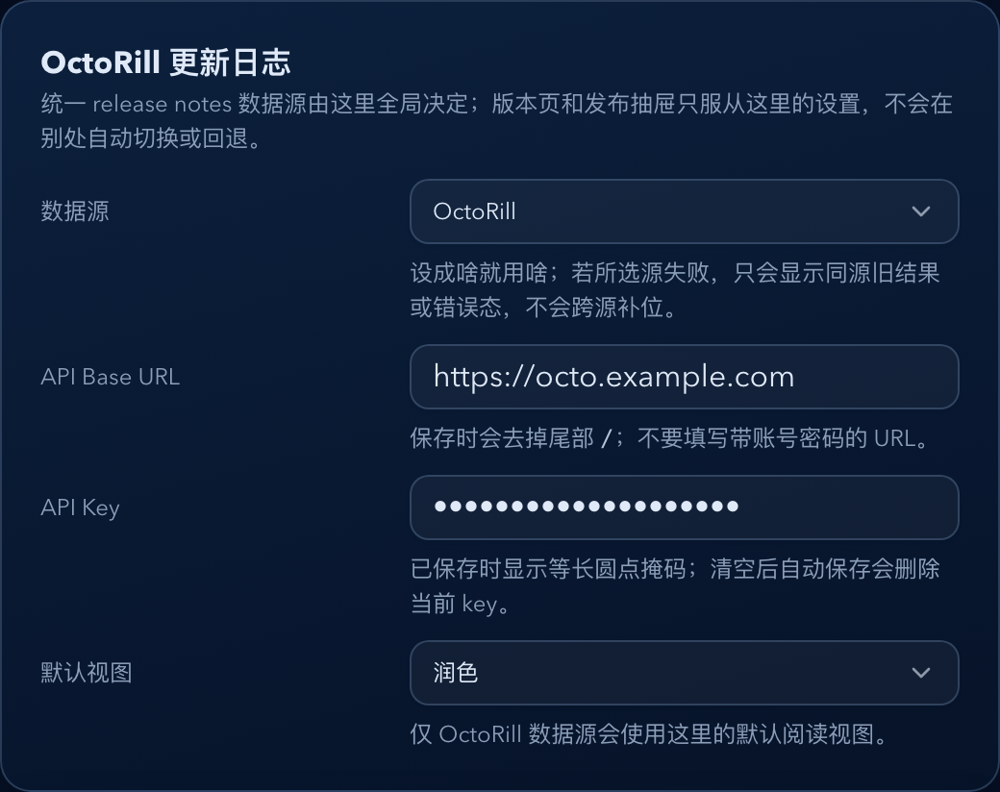
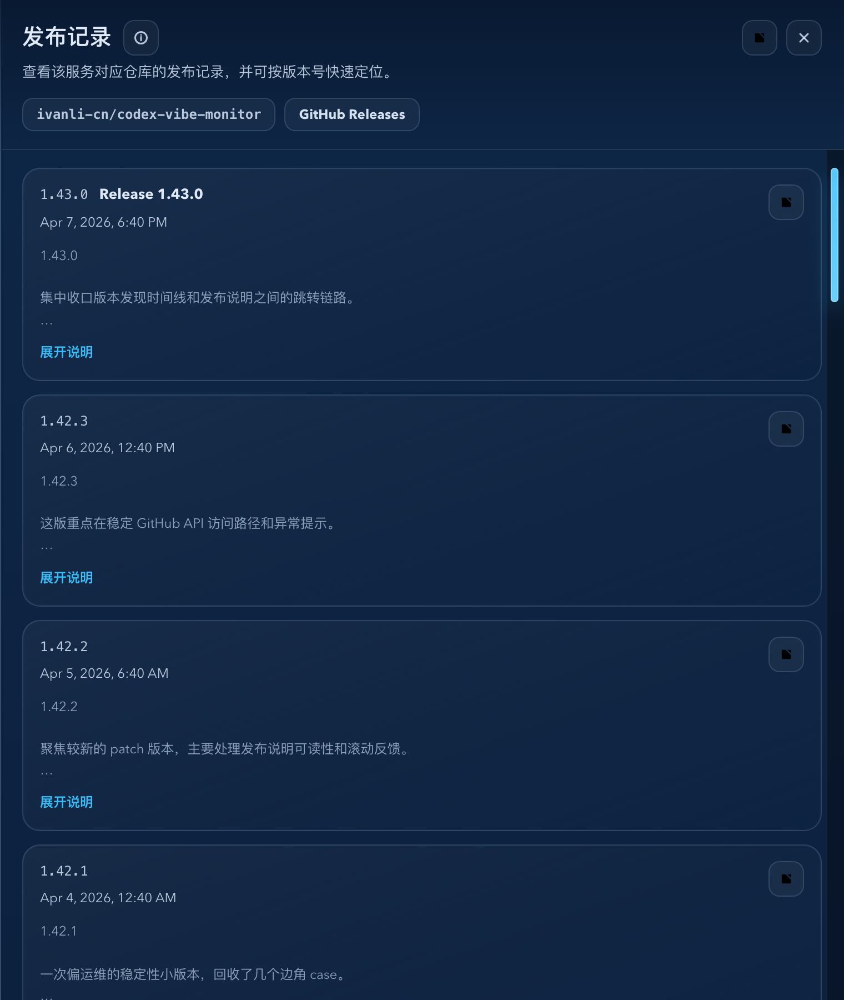
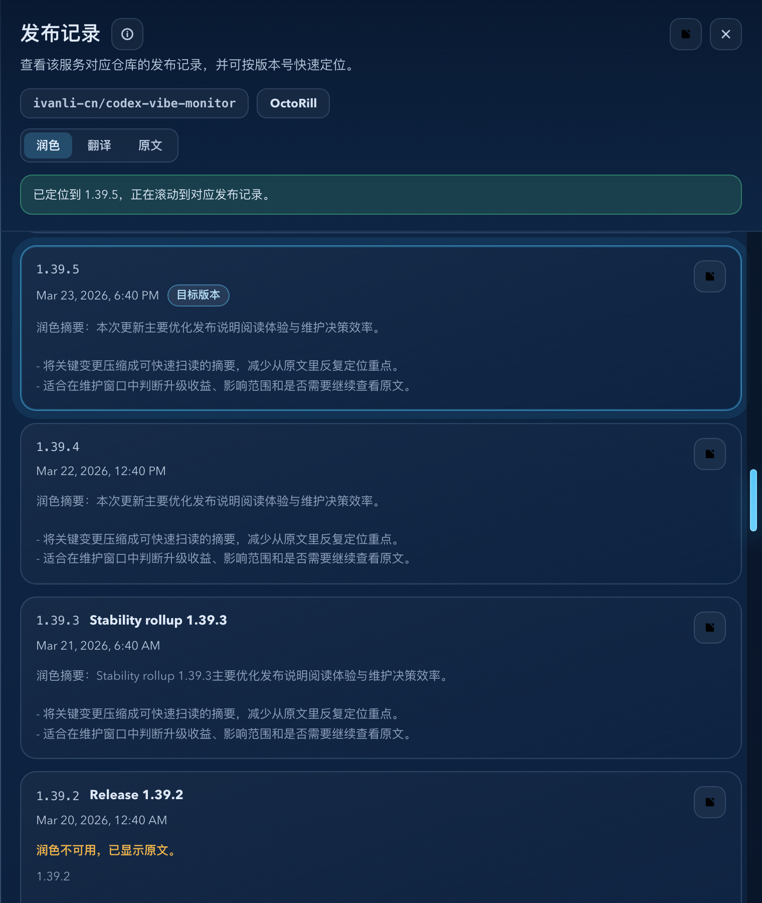

# Dockrev：OctoRill 更新日志来源与发布抽屉视图切换（#x4edr）

> 当前有效规范以本文为准；实现覆盖与当前状态见 `./IMPLEMENTATION.md`，关键演进原因见 `./HISTORY.md`。

## 背景 / 问题陈述

- Dockrev 现有发布抽屉只通过 GitHub Releases 读取原始 release body，无法消费 OctoRill 已聚合的仓库更新、中文翻译与阅读润色结果。
- OctoRill public releases API 允许 Dockrev 后端通过 Bearer `orill_ak_...` 调用 `GET /api/public/repos/<owner>/<repo>/releases` 获取仓库 release 列表，item 直接暴露 `body`、`translated`、`smart` 等阅读态。
- 用户需要在 Dockrev 设置中显式选择统一 release notes provider，并配置 OctoRill API Base URL / API Key / 默认视图；运行时必须严格服从 `releaseNotes.provider`，禁止由抽屉、版本页或临时状态自行切源。

## 目标 / 非目标

### Goals

- Settings 新增统一 `releaseNotes.provider = gitHub | octoRill`，并保留 OctoRill 的 API Base URL、API Key、默认视图 `original | translated | smart`；provider 是所有 release notes 入口唯一的运行时选源真相源。
- API Key 只在 Dockrev 后端保存；设置读取只返回等长圆点脱敏状态，不把明文 key 暴露给浏览器。
- 新增服务级统一 release notes API，只请求 Settings 当前选中的单一 provider，并规范化成发布抽屉与服务详情 `版本` 子页都可消费的数据。
- 统一 release notes API 必须同时提供 locate-first 首屏与双向 cursor 续拉，让发布抽屉和服务详情 `版本` 子页都不再为“定位当前版本”线性扫页。
- 当前 provider 请求失败时，只允许在当前浏览器会话内继续展示 `serviceId + provider` 维度最近一次同源成功结果，并显式标记 `stale`；若不存在同源快照，则直接错误态。
- 发布抽屉支持原文、翻译、润色切换；缺少翻译/润色时可见降级到原文。

### Non-goals

- 不调用 OctoRill 翻译接口生成缺失的 `translated` 或 `smart` 内容。
- 不扩展通知、日报或新增并行 release notes viewer；服务更新记录可复用既有抽屉定位其可靠目标版本。
- 不移除或重命名现有 `/api/services/{service_id}/github-releases`。
- 不支持任意 HTML 注入、脚本执行或仓库自定义富文本组件；发布说明只允许渲染受限、安全的 Markdown 语义。
- 不在浏览器保存或直连发送 OctoRill API Key。

## 范围（Scope）

### In scope

- `crates/dockrev-api` settings schema/API、OctoRill client、服务级 release notes API 与回归测试。
- `web/src/api.ts` / `web/src/api/types.ts` release notes 与 settings 类型。
- `web/src/pages/SettingsPage.tsx`、`web/src/pages/useSettingsPageState.tsx` 与 settings helpers。
- `web/src/components/GitHubReleaseDrawer.tsx` 的数据源、stale banner 与视图切换。
- Storybook mocks/stories 与本 spec 的视觉证据。

### Out of scope

- GitHub Releases 原有 API 的兼容行为变更。
- OctoRill API Key 创建/撤销管理；该能力由 OctoRill 自己提供。
- GitHub PAT / GHCR webhook 配置复用或合并。

## 需求（Requirements）

### MUST

- `GET /api/settings` 必须返回 `releaseNotes.provider`，并继续返回 `releaseNotes.octoRill.enabled`、`apiBaseUrl`、`apiKeyMasked`、`defaultView`；其中 `octoRill.enabled` 仅保留为兼容/迁移字段，不再参与运行时选源。
- `PUT /api/settings` 必须支持局部更新 `releaseNotes.provider` 与 `releaseNotes.octoRill`；`apiKey` 字段省略时保留旧 key，`null` 或空字符串清除旧 key，非空明文覆盖旧 key。
- API Base URL 必须是无 username/password 的 `http(s)` 绝对 URL，并规范化为无尾部 `/` 的 origin/base path。
- API Key 明文必须只在后端持久化；GET 响应只返回脱敏 `apiKeyMasked`，其长度必须与已保存 key 的字符长度一致，并统一使用圆点掩码。
- `PUT /api/settings` 的 `apiKey` 若是非空全星号或全圆点掩码，应视为保留旧 key，避免浏览器把脱敏回显误写回明文字段。
- 统一 release notes API 必须只请求 Settings 当前选中的 provider；`provider=octoRill` 时请求 `GET {apiBaseUrl}/api/public/repos/<owner>/<repo>/releases?limit=<limit>[&cursor=<cursor>][&direction=newer][&highlight=tag:<candidate>...][&highlight_active=tag:<preferred>]`，请求头继续带 `Authorization: Bearer <apiKey>`；`provider=gitHub` 时只请求 GitHub Releases。
- `GET /api/services/{service_id}/release-notes/locate?version=<tag>&limit=<1..30>` 必须复用增强版 `ServiceReleaseNotesResponse`，并返回 `previousCursor` 与结构化 `anchor`；`anchor.status` 固定为 `found | outsideWindow | notFound | unavailable`。
- `GET /api/services/{service_id}/release-notes?cursor=<cursor>&direction=older|newer&limit=<1..30>` 必须支持双向续拉；`nextCursor` 持续表示更旧方向，`previousCursor` 表示更新方向。
- OctoRill public releases item 映射必须宽容解析：优先使用显式 tag 字段，其次从 `html_url` / `htmlUrl` 的 `/releases/tag/<tag>` 解析，最后用 title/id 兜底。
- 统一 release notes API 失败时不得跨源 fallback；返回的 `source` 必须始终等于 Settings 当前选中的 provider，失败原因也必须只描述该 provider 的状态。
- 统一 release notes API 响应必须返回仓库级 `externalLinks.githubReleasesUrl`，并在 `apiBaseUrl` 与 repo full name 都能安全归一化成 `owner/repo` 时返回可选 `externalLinks.octoRillReleasesUrl`，供版本页与抽屉复用同一组 Releases 外链。
- OctoRill locate 必须优先复用 public releases 的 highlight/window 能力生成目标版本附近窗口；若当前实例或仓库无法提供该窗口，则直接返回 OctoRill 失败或 unavailable 锚点，不得回退 GitHub items。
- 发布抽屉与服务详情 `版本` 子页的默认视图都来自 Settings：`provider=gitHub` 时固定为 `original`，`provider=octoRill` 时来自 `releaseNotes.octoRill.defaultView`；单次切换只影响当前阅读会话。
- 发布抽屉与服务详情 `版本` 子页在渲染 GitHub Releases / OctoRill 的 Markdown 正文时，必须保留标题、列表、强调、链接与显式换行语义；不得执行原始 HTML，外链必须继续走安全 URL 归一化。

### SHOULD

- Settings 的 OctoRill 卡片沿用现有自动保存队列与错误浮层，不引入单独“保存”按钮。
- 发布抽屉顶部应明确显示当前数据来源或 stale 状态，避免用户误判。
- Storybook 应覆盖 Settings provider 选择、OctoRill smart 默认、GitHub 单视图、缺失翻译/润色降级，以及同源 stale / 硬错误分支。

## 功能与行为规格（Functional/Behavior Spec）

### Core flows

- 用户在 Settings 选择统一 provider，并在需要时填写 OctoRill Base URL / API Key / 默认视图后，设置自动保存。
- 用户从版本时间线、服务更新记录，或服务详情 `版本` 子页进入版本阅读流时，前端调用服务级 release notes API。
- 当前阅读流若带有目标版本，前端必须先调用 `release-notes/locate`，只渲染后端返回的锚点窗口；后续才通过 `cursor + direction` 双向补页。
- API 返回 OctoRill 数据时，抽屉使用 OctoRill items 展示，并默认选中 `smart`。
- API 返回 OctoRill 数据时，服务详情 `版本` 子页也必须复用同一批 items、视图切换规则与 provider/stale 说明，而不是另起第二套 release 数据源。
- 用户切换 `original | translated | smart` 时，列表内容即时切换，不改变 URL 和全局设置。
- 同源旧快照存在且当前请求失败时，抽屉与版本页展示 stale warning banner，并继续展示最近一次同源成功结果；无同源快照时直接展示失败态。

### Edge cases / errors

- `provider=octoRill` 但 Base URL 缺失或 API Key 缺失时，API 不得切到 GitHub；必须直接返回 OctoRill 配置错误。
- OctoRill 返回 401/403 时，失败原因显示为鉴权失败。
- OctoRill 返回非 JSON、网络失败或 5xx 时，失败原因显示为上游不可用。
- OctoRill public releases 没有可展示 release item 时，失败原因显示为未返回可用发布记录。
- `translated` 或 `smart` 缺失时，相关视图显示不可用提示并回退原文。

## 接口契约（Interfaces & Contracts）

### 接口清单（Inventory）

| 接口（Name） | 类型（Kind） | 范围（Scope） | 变更（Change） | 契约文档（Contract Doc） | 负责人（Owner） | 使用方（Consumers） | 备注（Notes） |
| --- | --- | --- | --- | --- | --- | --- | --- |
| `GET /api/settings` | HTTP API | external | Modify | None | dockrev-api | Web Settings | 新增 `releaseNotes.provider`，并保留 OctoRill 配置 |
| `PUT /api/settings` | HTTP API | external | Modify | None | dockrev-api | Web Settings | 支持 provider 与 OctoRill 配置局部保存 |
| `GET /api/services/{service_id}/release-notes` | HTTP API | external | New | None | dockrev-api | Release drawer / Service versions page | 统一单 provider release notes 数据源，并提供仓库级 Releases 外链 |
| `GET /api/services/{service_id}/release-notes/locate` | HTTP API | external | New | None | dockrev-api | Release drawer / Service versions | 返回目标版本锚点窗口与结构化 anchor 状态 |

### 契约文档（按 Kind 拆分）

- `ServiceReleaseNotesResponse.externalLinks`
  - `githubReleasesUrl`: 必填；可信仓库级 GitHub Releases 列表 URL。
  - `octoRillReleasesUrl`: 可选；仅当 `apiBaseUrl` 与 repo full name 可安全归一化为 `owner/repo` 时返回，对应 `<apiBaseUrl>/<owner>/<repo>/releases`。

## 验收标准（Acceptance Criteria）

- Given Settings 选择 `provider=octoRill` 且默认视图为 `smart`，When 打开发布抽屉，Then 抽屉默认展示 OctoRill 润色内容。
- Given 当前抽屉有 OctoRill items，When 切换为原文或翻译，Then 内容切换且滚动/定位状态保持可用。
- Given 打开发布抽屉或服务详情 `版本` 子页时带有目标版本，When locate 命中，Then 首屏直接落在目标版本附近窗口，而不是由前端逐页扫描直到命中。
- Given OctoRill 请求返回 401 且当前会话无同源快照，When 打开发布抽屉，Then 顶部显示 OctoRill 鉴权失败，且列表直接进入错误态。
- Given OctoRill public-window 无法覆盖目标版本，When 打开发布抽屉，Then API 不得回退 GitHub items，并通过 `anchor.status=unavailable` 或失败态告知定位结果。
- Given `translated` 或 `smart` 缺失，When 用户选择对应视图，Then UI 明确显示该视图不可用并展示原文。
- Given GitHub Releases fallback body 包含 `##` 标题、列表项与 compare 链接，When 在发布抽屉或服务详情 `版本` 子页查看原文，Then UI 必须渲染结构化标题、列表与可点击链接，而不是直接显示原始 Markdown 标记。
- Given `GET /api/settings`，Then 响应不包含 OctoRill API Key 明文，只包含与真实 key 等长的圆点脱敏状态。
- Given `GET /api/services/{service_id}/release-notes` 且仓库信息可信，When 服务详情 `版本` 子页或发布抽屉读取同一响应，Then 响应会包含 `externalLinks.githubReleasesUrl`，并在可安全构造时附带 `externalLinks.octoRillReleasesUrl`。
- Given 服务的 repo full name 不是可信 `owner/repo` 形式，When 读取统一 release notes API，Then `externalLinks.octoRillReleasesUrl` 必须省略，而不是猜测构造错误链接。
- Given `PUT /api/settings` 省略 `apiKey`，Then 已保存 key 保持不变；传 `null` 或空字符串时清除。
- Given `PUT /api/settings` 提交等长全圆点 `apiKey`，Then 已保存 key 保持不变。

## 验收清单（Acceptance checklist）

- [x] 后端 settings roundtrip、等长 key masking、Base URL validation 与 key preserve/clear 行为被测试覆盖。
- [x] OctoRill public releases mapping、tag 解析与“无跨源 fallback”被测试覆盖。
- [x] Settings 与发布抽屉 Storybook 状态覆盖核心 UI 分支。
- [x] 视觉证据写入本 spec 的 `## Visual Evidence`。

## 非功能性验收 / 质量门槛（Quality Gates）

### Testing

- Unit tests: `cargo test -p dockrev-api` 中的 settings 与 release notes 测试。
- Integration tests: Storybook mock API 覆盖 Settings、发布抽屉与版本页的 provider / stale 分支。

### UI / Storybook

- Stories to add/update: `Pages/SettingsPage`、`Components/GitHubReleaseDrawer`。
- `play` / interaction coverage: provider 选择、视图切换、stale banner、Settings 自动保存状态。

### Quality checks

- `cargo test -p dockrev-api`
- `bun run --cwd web lint`
- `bun run --cwd web build`
- `bun run --cwd web test-storybook`
- `bun run --cwd web storybook:screenshots`

## Visual Evidence

- source_type: `storybook_canvas`
  target_program: `mock-only`
  capture_scope: `element`
  requested_viewport: `none`
  viewport_strategy: `storybook-viewport`
  sensitive_exclusion: `N/A`
  submission_gate: `approved`
  story_id_or_title: `Pages/SettingsPage / Octo Rill Release Notes Card`
  state: `configured octoRill provider`
  evidence_note: `验证 Settings 中统一 release notes 卡片包含 provider 选择、API Base URL、等长 API Key 脱敏与默认视图。`

PR: include

- source_type: `storybook_canvas`
  target_program: `mock-only`
  capture_scope: `element`
  requested_viewport: `none`
  viewport_strategy: `storybook-viewport`
  sensitive_exclusion: `N/A`
  submission_gate: `approved`
  story_id_or_title: `Components/GitHubReleaseDrawer / Octo Rill Smart Default`
  state: `OctoRill source with smart default view`
  evidence_note: `验证发布抽屉默认从 OctoRill 来源展示，并默认选中润色视图，同时保留翻译/原文切换入口。`

PR: include

- source_type: `storybook_canvas`
  target_program: `mock-only`
  capture_scope: `element`
  requested_viewport: `none`
  viewport_strategy: `storybook-viewport`
  sensitive_exclusion: `N/A`
  submission_gate: `approved`
  story_id_or_title: `Components/GitHubReleaseDrawer / Git Hub Original Only`
  state: `gitHub provider original-only`
  evidence_note: `验证 provider 固定为 GitHub Releases 时，发布抽屉只保留原文阅读面，不显示翻译/润色切换。`

PR: include

- source_type: `storybook_canvas`
  target_program: `mock-only`
  capture_scope: `element`
  requested_viewport: `none`
  viewport_strategy: `storybook-viewport`
  sensitive_exclusion: `N/A`
  submission_gate: `approved`
  story_id_or_title: `Components/GitHubReleaseDrawer / Anonymous Located`
  state: `unified locate-first anchor window`
  evidence_note: `验证统一 locate 首屏直接拿到锚点窗口，顶部 success banner 明确告知已定位到目标版本，前端不再为了定位当前版本继续连翻多页。`

PR: include

## Related PRs

- None

## 风险 / 开放问题 / 假设（Risks, Open Questions, Assumptions）

- 风险：OctoRill 文档没有稳定展开 `TranslatedItem` / `SmartItem` 内部字段，因此实现必须宽容解析并可降级。
- 假设：OctoRill API Base URL 指向可信实例，Dockrev 仅保存用户主动配置的 API Key。
- 假设：发布抽屉 v1 不触发翻译生成任务，缺失内容只做只读降级。

## 参考（References）

- [OctoRill API Key 与外部 API](https://ivanli-cn.github.io/octo-rill/api-key.html)
- `docs/specs/4fhgd-github-release-drawer/SPEC.md`
- `docs/specs/s9w2h-settings-autosave-ghcr-error-alignment/SPEC.md`
