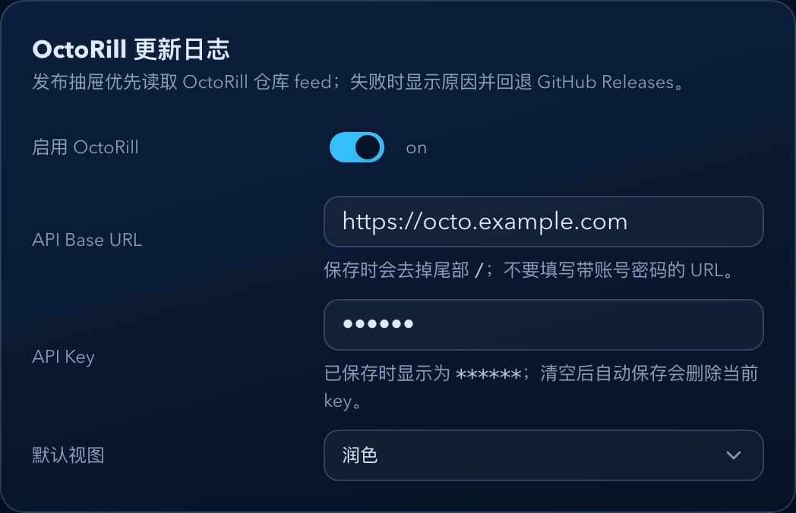
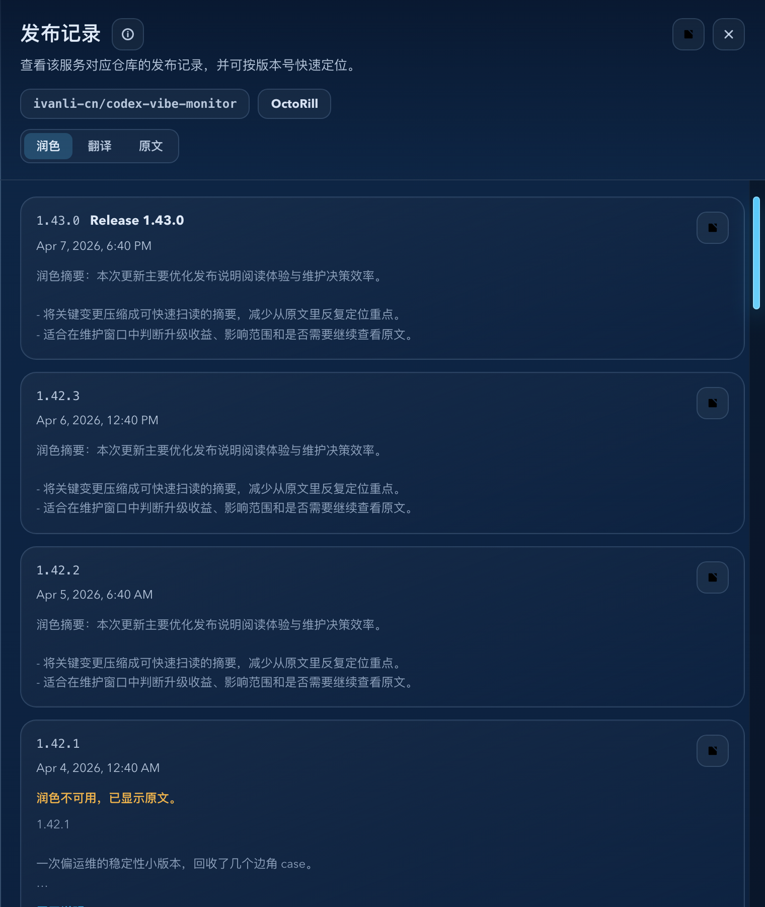

# Dockrev：OctoRill 更新日志来源与发布抽屉视图切换（#x4edr）

> 当前有效规范以本文为准；实现覆盖与当前状态见 `./IMPLEMENTATION.md`，关键演进原因见 `./HISTORY.md`。

## 背景 / 问题陈述

- Dockrev 现有发布抽屉只通过 GitHub Releases 读取原始 release body，无法消费 OctoRill 已聚合的仓库更新、中文翻译与阅读润色结果。
- OctoRill API Key 文档声明外部程序可通过 Bearer `orill_ak_...` 调用 `GET /api/feed?scope=repo&items=owner/repo&types=releases` 获取仓库 release feed，feed item 暴露 `body`、`translated`、`smart` 等阅读态。
- 用户需要在 Dockrev 设置中配置 OctoRill API Base URL 与 API Key，并在发布抽屉中默认优先显示 OctoRill 的润色更新日志；当 OctoRill 不可用时，仍应保留现有 GitHub Releases 可用性。

## 目标 / 非目标

### Goals

- Settings 新增 OctoRill 更新日志配置：启用开关、API Base URL、API Key、默认视图 `original | translated | smart`，默认 `smart`。
- API Key 只在 Dockrev 后端保存；设置读取只返回脱敏状态，不把明文 key 暴露给浏览器。
- 新增服务级统一 release notes API，开启 OctoRill 后优先从 OctoRill repo feed 读取发布记录，并规范化成发布抽屉可消费的数据。
- OctoRill 失败、未配置或无可用 feed 时，发布抽屉显示失败原因并自动回退现有 GitHub Releases 数据。
- 发布抽屉支持原文、翻译、润色切换；缺少翻译/润色时可见降级到原文。

### Non-goals

- 不调用 OctoRill 翻译接口生成缺失的 `translated` 或 `smart` 内容。
- 不扩展通知、日报、版本发现时间线之外的其它 release notes 展示面。
- 不移除或重命名现有 `/api/services/{service_id}/github-releases`。
- 不引入 Markdown 富文本渲染；发布说明仍按安全纯文本保留换行展示。
- 不在浏览器保存或直连发送 OctoRill API Key。

## 范围（Scope）

### In scope

- `crates/dockrev-api` settings schema/API、OctoRill client、服务级 release notes API 与回归测试。
- `web/src/api.ts` / `web/src/api/types.ts` release notes 与 settings 类型。
- `web/src/pages/SettingsPage.tsx`、`web/src/pages/useSettingsPageState.tsx` 与 settings helpers。
- `web/src/components/GitHubReleaseDrawer.tsx` 的数据源、fallback banner 与视图切换。
- Storybook mocks/stories 与本 spec 的视觉证据。

### Out of scope

- GitHub Releases 原有 API 的兼容行为变更。
- OctoRill API Key 创建/撤销管理；该能力由 OctoRill 自己提供。
- GitHub PAT / GHCR webhook 配置复用或合并。

## 需求（Requirements）

### MUST

- `GET /api/settings` 必须返回 `releaseNotes.octoRill.enabled`、`apiBaseUrl`、`apiKeyMasked`、`defaultView`。
- `PUT /api/settings` 必须支持局部更新 `releaseNotes.octoRill`；`apiKey` 字段省略时保留旧 key，`null` 或空字符串清除旧 key，非空明文覆盖旧 key。
- API Base URL 必须是无 username/password 的 `http(s)` 绝对 URL，并规范化为无尾部 `/` 的 origin/base path。
- API Key 明文必须只在后端持久化；GET 响应只返回脱敏 `apiKeyMasked`。
- 统一 release notes API 必须在 OctoRill 开启且配置完整时优先请求 `GET {apiBaseUrl}/api/feed?scope=repo&items=<owner/repo>&types=releases&limit=<limit>[&cursor=<cursor>]`，请求头带 `Authorization: Bearer <apiKey>`。
- OctoRill feed 映射必须宽容解析：优先使用显式 tag 字段，其次从 `html_url` / `htmlUrl` 的 `/releases/tag/<tag>` 解析，最后用 title/id 兜底。
- OctoRill 失败必须返回可展示 fallback 原因，并自动回退现有 GitHub Releases 数据。
- 发布抽屉默认视图来自 Settings 的 `releaseNotes.octoRill.defaultView`，单次切换仅影响当前抽屉会话。

### SHOULD

- Settings 的 OctoRill 卡片沿用现有自动保存队列与错误浮层，不引入单独“保存”按钮。
- 发布抽屉顶部应明确显示当前数据来源或 fallback 状态，避免用户误判。
- Storybook 应覆盖 OctoRill smart 默认、缺失翻译/润色降级、OctoRill 失败回退 GitHub 与 Settings 配置卡片。

## 功能与行为规格（Functional/Behavior Spec）

### Core flows

- 用户在 Settings 开启 OctoRill、填入 Base URL 与 API Key、选择默认视图后，设置自动保存。
- 用户从版本时间线打开发布抽屉时，前端调用服务级 release notes API。
- API 返回 OctoRill 数据时，抽屉使用 OctoRill items 展示，并默认选中 `smart`。
- 用户切换 `original | translated | smart` 时，列表内容即时切换，不改变 URL 和全局设置。
- API 返回 fallback 时，抽屉展示警告 banner，并继续展示 GitHub Releases 数据。

### Edge cases / errors

- OctoRill 未启用、Base URL 缺失或 API Key 缺失时，API 不请求 OctoRill，直接使用 GitHub Releases。
- OctoRill 返回 401/403 时，fallback reason 显示为鉴权失败。
- OctoRill 返回非 JSON、网络失败或 5xx 时，fallback reason 显示为上游不可用。
- OctoRill feed 没有可展示 release item 时，fallback reason 显示为未返回可用发布记录。
- `translated` 或 `smart` 缺失时，相关视图显示不可用提示并回退原文。

## 接口契约（Interfaces & Contracts）

### 接口清单（Inventory）

| 接口（Name） | 类型（Kind） | 范围（Scope） | 变更（Change） | 契约文档（Contract Doc） | 负责人（Owner） | 使用方（Consumers） | 备注（Notes） |
| --- | --- | --- | --- | --- | --- | --- | --- |
| `GET /api/settings` | HTTP API | external | Modify | None | dockrev-api | Web Settings | 新增 `releaseNotes.octoRill` |
| `PUT /api/settings` | HTTP API | external | Modify | None | dockrev-api | Web Settings | 支持 OctoRill 配置局部保存 |
| `GET /api/services/{service_id}/release-notes` | HTTP API | external | New | None | dockrev-api | Release drawer | 统一 OctoRill/GitHub release notes 数据源 |

### 契约文档（按 Kind 拆分）

- None

## 验收标准（Acceptance Criteria）

- Given Settings 已配置 OctoRill 且默认视图为 `smart`，When 打开发布抽屉，Then 抽屉默认展示 OctoRill 润色内容。
- Given 当前抽屉有 OctoRill items，When 切换为原文或翻译，Then 内容切换且滚动/定位状态保持可用。
- Given OctoRill 请求返回 401，When 打开发布抽屉，Then 顶部显示 OctoRill 鉴权失败，同时列表回退为 GitHub Releases。
- Given `translated` 或 `smart` 缺失，When 用户选择对应视图，Then UI 明确显示该视图不可用并展示原文。
- Given `GET /api/settings`，Then 响应不包含 OctoRill API Key 明文，只包含脱敏状态。
- Given `PUT /api/settings` 省略 `apiKey`，Then 已保存 key 保持不变；传 `null` 或空字符串时清除。

## 验收清单（Acceptance checklist）

- [x] 后端 settings roundtrip、key masking、Base URL validation 与 key preserve/clear 行为被测试覆盖。
- [x] OctoRill feed mapping、tag 解析与 fallback 被测试覆盖。
- [x] Settings 与发布抽屉 Storybook 状态覆盖核心 UI 分支。
- [x] 视觉证据写入本 spec 的 `## Visual Evidence`。

## 非功能性验收 / 质量门槛（Quality Gates）

### Testing

- Unit tests: `cargo test -p dockrev-api` 中的 settings 与 release notes 测试。
- Integration tests: Storybook mock API 覆盖 Settings 与发布抽屉。

### UI / Storybook

- Stories to add/update: `Pages/SettingsPage`、`Components/GitHubReleaseDrawer`。
- `play` / interaction coverage: 视图切换、fallback banner、Settings 自动保存状态。

### Quality checks

- `cargo test -p dockrev-api`
- `bun run --cwd web lint`
- `bun run --cwd web build`
- `bun run --cwd web test-storybook`
- `bun run --cwd web storybook:screenshots`

## Visual Evidence

- source_type: `storybook_canvas`
  target_program: `mock-only`
  capture_scope: `element`
  requested_viewport: `none`
  viewport_strategy: `storybook-viewport`
  sensitive_exclusion: `N/A`
  submission_gate: `approved`
  story_id_or_title: `Pages/SettingsPage / Octo Rill Release Notes Card`
  state: `configured OctoRill settings`
  evidence_note: `验证 Settings 中新增 OctoRill 更新日志卡片，包含启用开关、API Base URL、API Key 脱敏与默认视图=润色。`

PR: include

- source_type: `storybook_canvas`
  target_program: `mock-only`
  capture_scope: `element`
  requested_viewport: `none`
  viewport_strategy: `storybook-viewport`
  sensitive_exclusion: `N/A`
  submission_gate: `approved`
  story_id_or_title: `Components/GitHubReleaseDrawer / Octo Rill Smart Default`
  state: `OctoRill source with smart default view`
  evidence_note: `验证发布抽屉默认从 OctoRill 来源展示，并默认选中润色视图，同时保留翻译/原文切换入口。`

PR: include

## Related PRs

- None

## 风险 / 开放问题 / 假设（Risks, Open Questions, Assumptions）

- 风险：OctoRill 文档没有稳定展开 `TranslatedItem` / `SmartItem` 内部字段，因此实现必须宽容解析并可降级。
- 假设：OctoRill API Base URL 指向可信实例，Dockrev 仅保存用户主动配置的 API Key。
- 假设：发布抽屉 v1 不触发翻译生成任务，缺失内容只做只读降级。

## 参考（References）

- [OctoRill API Key 与外部 API](https://ivanli-cn.github.io/octo-rill/api-key.html)
- `docs/specs/4fhgd-github-release-drawer/SPEC.md`
- `docs/specs/s9w2h-settings-autosave-ghcr-error-alignment/SPEC.md`
